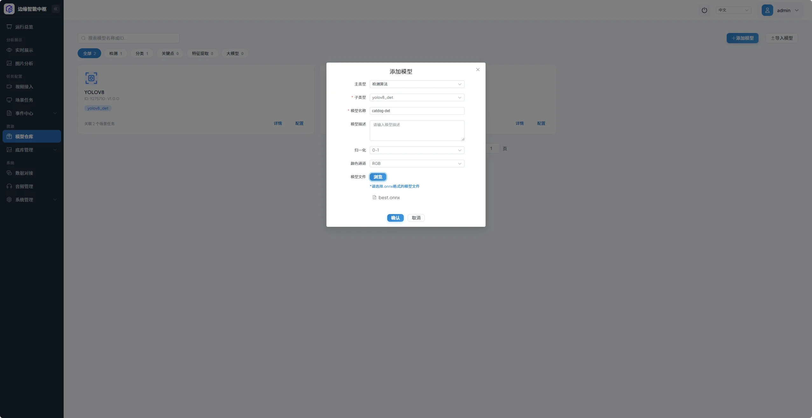
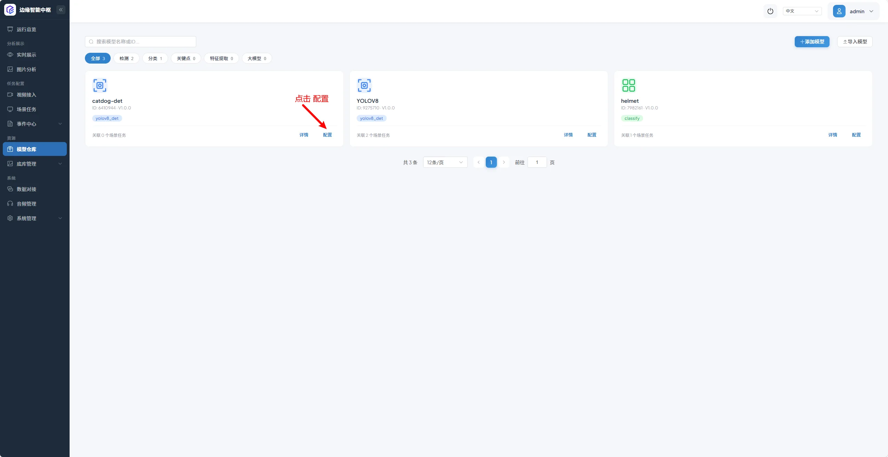
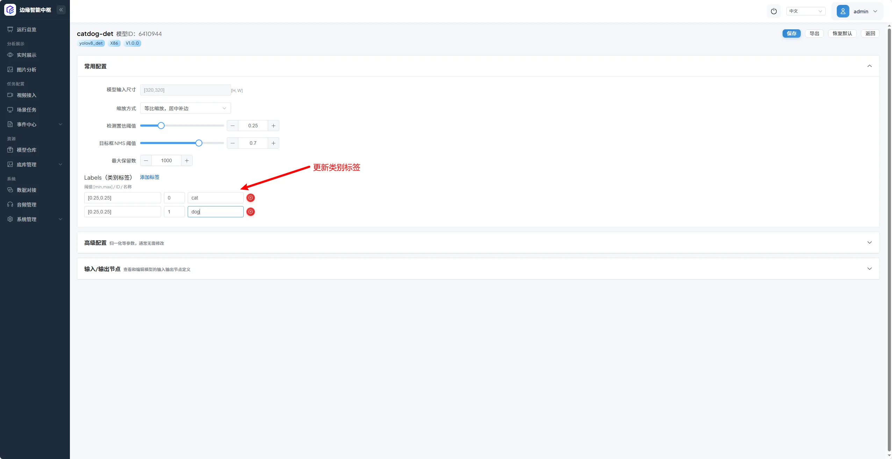
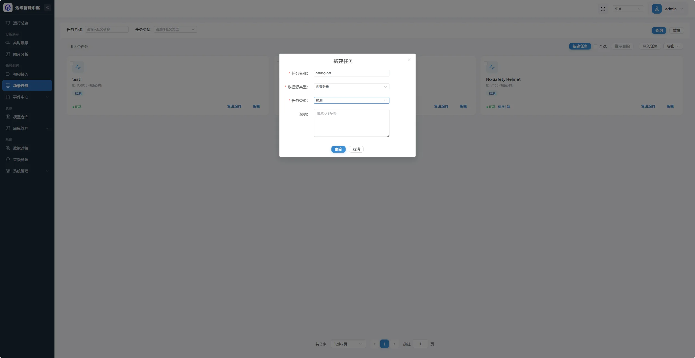
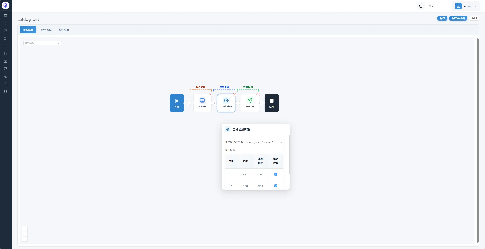
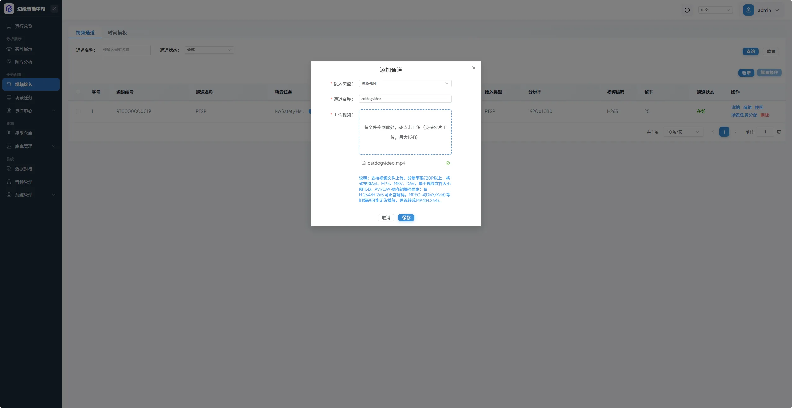
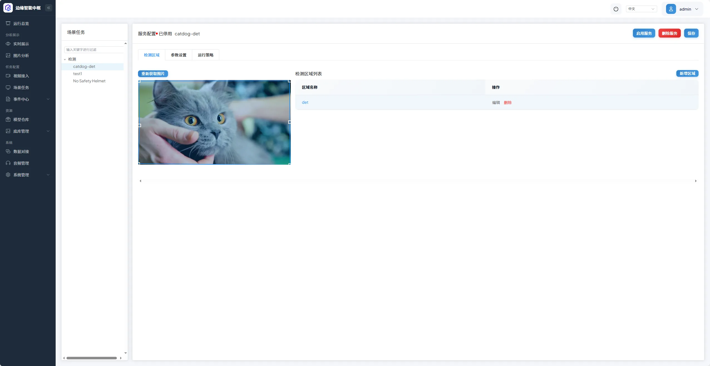
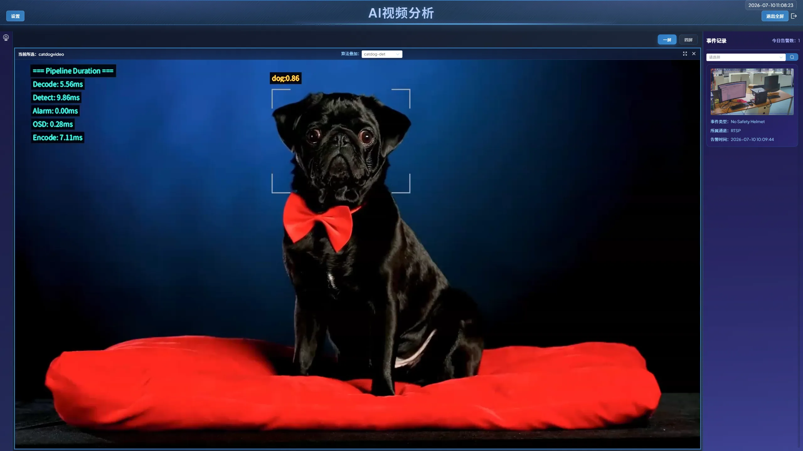

# x86 Docker 环境 YOLOv8 猫狗检测 ONNX 模型部署案例

## 摘要

- 案例名称：x86 环境下导入 YOLOv8 猫狗检测 ONNX 模型并完成推理验证

- 贡献者：luwenxiang

- 目标用户：使用 x86 平台部署 CosmoEdge、需要快速上手 ONNX 模型导入与视觉任务编排的开发者与使用者

- 本案例演示内容：完整演示在 CosmoEdge 的 x86 Docker 环境中，上传 YOLOv8 猫狗检测 ONNX 模型、配置模型参数、创建并编排检测任务、绑定视频源、查看实时推理结果的全流程操作

- 关联 issue 或 discussion：暂无

## 状态

|字段|值|
|---|---|
|审核状态|Proposed|
|CosmoEdge 版本|v1\.0\.0 — First Stable Release|
|平台|x86 Docker|
|运行后端|CosmoEdge|
|最近验证时间|2026/7/10 10:00|

## 素材与许可

|素材|来源|许可或授权|仓库处理方式|
|---|---|---|---|
|模型|YOLOv8 官方预训练模型导出 / 自定义训练导出|AGPL\-3\.0（Ultralytics 原生许可）|[yolov8_for_catdog](https://github.com/luwenxiang/yolov8forcatdog)|
|视频或图片|猫狗检测示例测试视频|自定义 / 公共领域素材|[yolov8_for_catdog](https://github.com/luwenxiang/yolov8forcatdog)|
|截图|贡献者提供|CC BY 4\.0|脱敏后入库|

## 环境

|项目|值|
|---|---|
|操作系统|x86\_64 架构 Linux（ubuntu-22.04.2）|
|Docker 版本|29.1.3|
|Docker Compose 版本|v5.1.4|
|CPU / NPU / GPU|x86\_64 通用 CPU|
|浏览器|推荐 Chrome / Edge 最新稳定版|

## 模型元数据

|项目|值|
|---|---|
|模型文件| best\.onnx                                                   |
|模型类型|YOLOv8 目标检测|
|输入尺寸|320 × 320|
|标签 / 类别|cat、dog（共 2 类）|
|预处理|RGB 色彩空间、像素值归一化至 \[0,1\]|
|输出 / 后处理|输出检测框坐标、置信度、类别 ID，经 NMS 非极大值抑制过滤后输出最终检测结果|

## 操作流程

本案例完整复现步骤如下：

1. 准备模型和标签
提前下载 YOLOv8 猫狗检测 ONNX 模型，确认类别标签为`cat`、`dog`。

2. 在 CosmoEdge 中导入并配置模型

    1. 点击左侧导航栏「模型仓库」功能，点击右上角「添加模型」按钮，按指引上传 ONNX 模型文件并完成基础配置。

       

    2. 在对应模型条目下点击「配置」按钮，修改模型类别为猫狗检测对应的标签，完成后保存配置。

       

       

3. 创建并编排检测任务

    1. 点击左侧导航栏「场景任务」功能，点击右上角「新建任务」按钮，创建猫狗检测任务（命名为`catdog-det`）。

       

    2. 在对应任务条目下点击「算法编排」按钮，完成算法编排后保存配置。

       

4. 上传视频并绑定检测任务

    1. 点击左侧导航栏「视频接入」功能，点击右上角「新增」按钮，上传用于测试的猫狗检测视频。

       

    2. 在对应视频条目下点击「场景任务分配」按钮，左侧选择已创建的`catdog-det`任务，点击右上角「新增区域」添加检测区域，开启对应服务。

       

5. 验证实时推理结果
    点击左侧导航栏「实时展示」按钮，点击左上角摄像头图标，双击选择`catdogvideo`视频通道，在页面上方「算法叠加」下拉框中选择`catdog-det`任务，即可查看实时检测效果。

  

## 验证

|检查项|结果|证据|
|---|---|---|
|模型成功导入|通过|[模型上传截图](../../assets/community/yolov8catdog-x86/zh/upload-model.webp)|
|标签显示正确|通过|[类别配置截图](../../assets/community/yolov8catdog-x86/zh/update-categories.webp)|
|实时 OSD 符合预期|通过|[实时结果截图](../../assets/community/yolov8catdog-x86/zh/live-result.webp)|

## 已知限制

- 本案例仅在 x86 Docker 环境下完成验证，其他硬件平台与部署方式需另行适配

- 仅验证 YOLOv8 系列目标检测 ONNX 模型，其他结构、类型的 ONNX 模型需根据实际情况调整配置

- 本案例未包含事件记录 payload 或事件中心截图；如果工作流依赖告警记录，请单独验证事件输出

## 参考

- Ultralytics YOLOv8 官方文档

- CosmoEdge 官方模型移植通用教程
