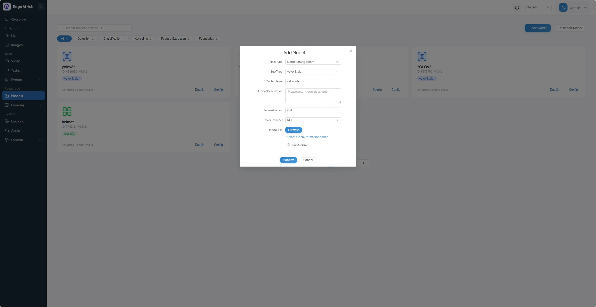
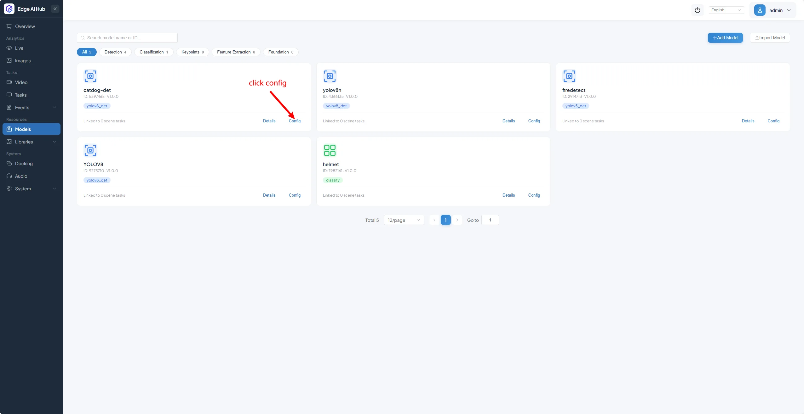
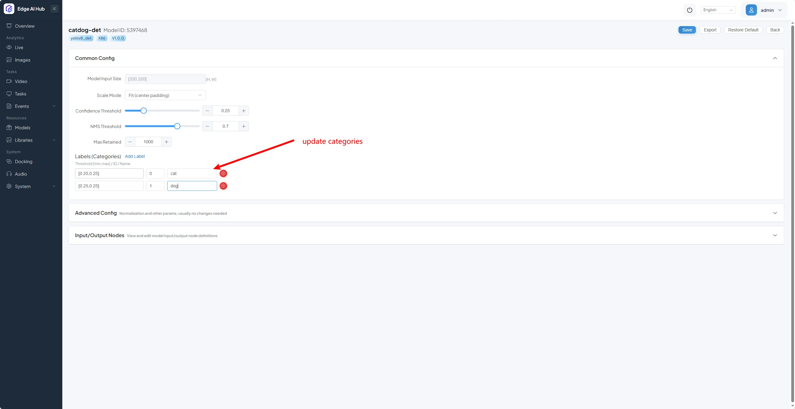
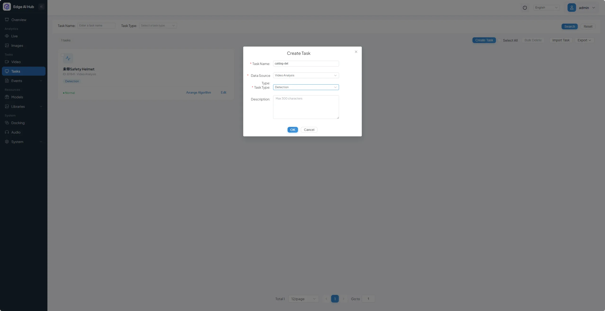
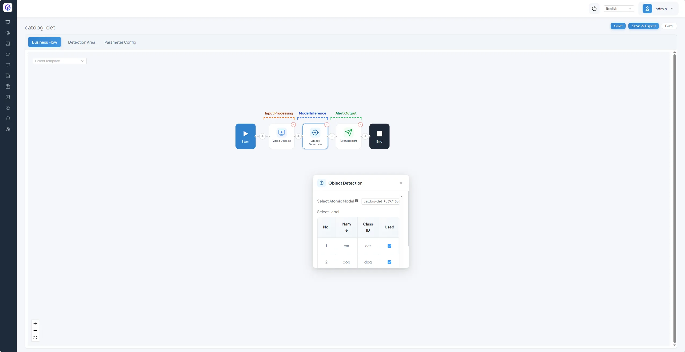
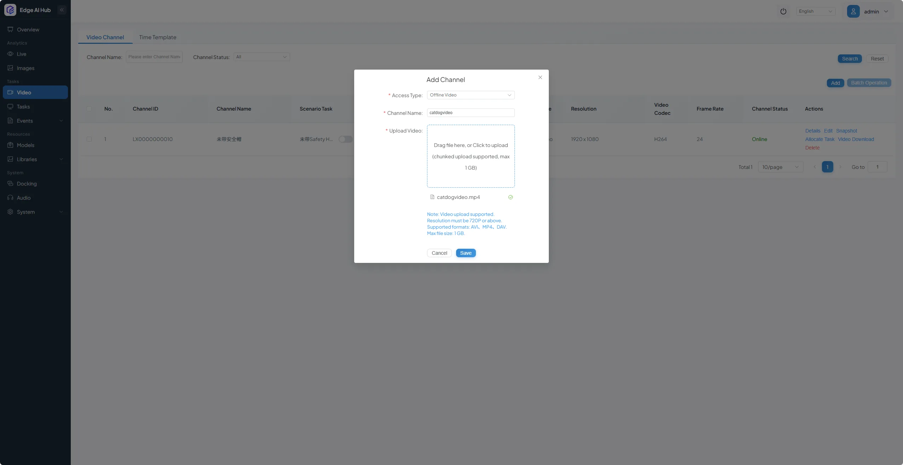
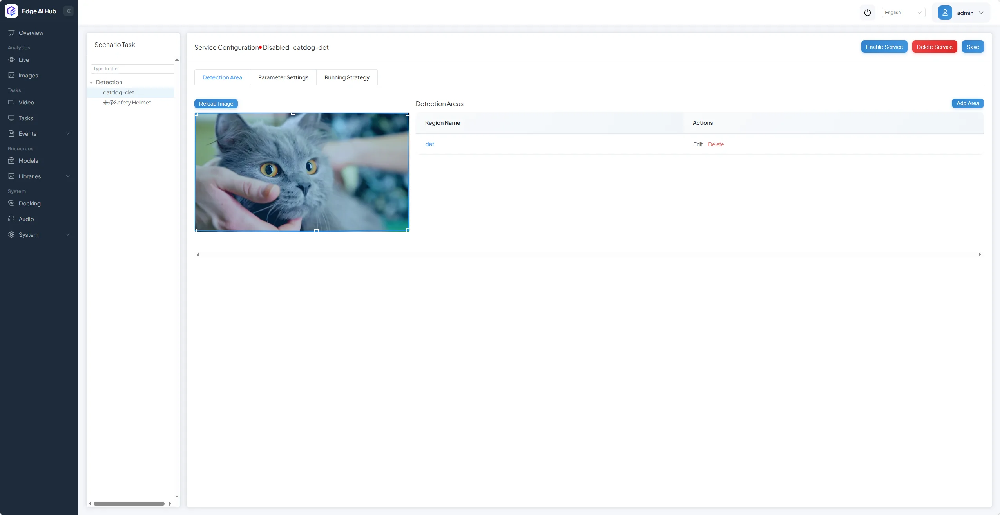
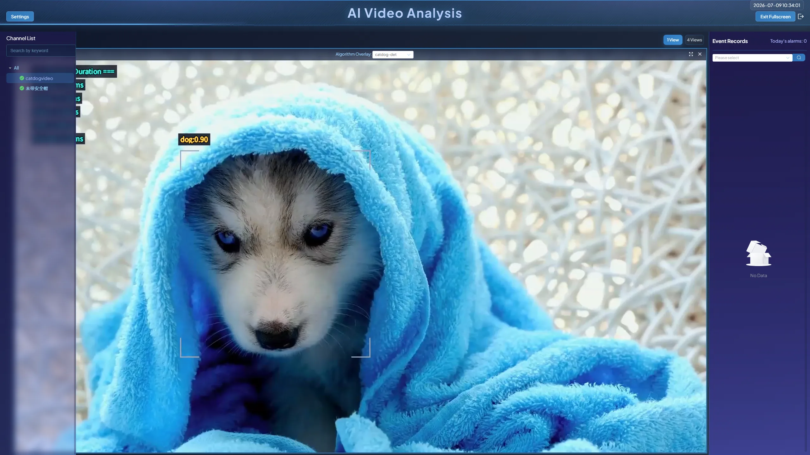

# YOLOv8 Cat \& Dog Detection ONNX Model Deployment Guide for x86 Docker

## Overview

- Case Name: Import and run YOLOv8 cat/dog detection ONNX model for inference on x86 platform

- Contributor: luwenxiang

- Target Audience: Developers and operators deploying CosmoEdge on x86 hardware who want a quick start to ONNX model import and vision task orchestration

- Case Scope: This guide walks through the full workflow on CosmoEdge x86 Docker: uploading YOLOv8 cat/dog ONNX model, modifying model config, creating \& arranging detection tasks, binding video streams, and viewing real\-time inference outputs

- Related issue or discussion: N/A

## Status

|Field|Value|
|---|---|
|Review Status|Proposed|
|CosmoEdge Version|v1\.0\.0 — First Stable Release|
|Platform|x86 Docker|
|Inference Backend|CosmoEdge|
|Last Verified Date|2026/7/10 10:00|

## Assets \& Licenses

|Asset|Source|License Terms|Repository Handling|
|---|---|---|---|
|Model|Exported from official YOLOv8 pre\-trained weights / custom training|AGPL\-3\.0 \(Ultralytics native license\)|[yolov8\_for\_catdog](https://github.com/luwenxiang/yolov8forcatdog)|
|Test Video \& Images|Custom cat/dog test footage / public domain materials|Custom / Public Domain|[yolov8\_for\_catdog](https://github.com/luwenxiang/yolov8forcatdog)|
|Screenshots|Provided by contributor|CC BY 4\.0|Upload after desensitization|

## Environment Specifications

|Item|Details|
|---|---|
|OS|x86\_64 Linux \(Ubuntu 22\.04\.2\)|
|Docker Version|29\.1\.3|
|Docker Compose Version|v5\.1\.4|
|CPU/NPU/GPU|Generic x86\_64 CPU|
|Browser Recommendation|Latest stable Chrome / Edge|

## Model Metadata

|Item|Details|
|---|---|
|Model File|best\.onnx|
|Model Type|YOLOv8 Object Detection|
|Input Resolution|320 × 320|
|Classes / Labels|cat, dog \(2 classes total\)|
|Preprocessing|RGB color space, pixel value normalized to \[0,1\]|
|Output \& Post\-processing|Raw bounding box coordinates, confidence scores, class IDs; final detection results filtered via NMS \(Non\-Maximum Suppression\)|

## Step\-by\-Step Operation Workflow

Follow these steps to reproduce the full case:

1. Prepare Model \& Labels
Download the pre\-exported YOLOv8 cat/dog ONNX model and confirm target labels are `cat` and `dog`\.

2. Import and Configure Model in CosmoEdge

    1. Navigate to **Models** on the left sidebar, click the **Add Model** button at the top\-right, then upload the ONNX model file and complete basic configuration as prompted\.

       

    2. Click the **Config** button under the target model entry, update category labels for cat/dog detection, then save changes\.

       

       

3. Create \& Orchestrate Detection Task

    1. Go to the **Task** menu on the left sidebar, click **Create Task** in the top\-right corner, and create a detection task named `catdog-det`\.

       

    2. Click **Arrange Algorithm** on the new task entry, complete algorithm pipeline arrangement and save the configuration\.

       

4. Upload Test Video \& Bind Detection Task

    1. Open the **Video** tab on the left sidebar, click the top\-right **Add** button to upload your cat/dog test video\.

       

    2. Click **Allocate Task** on the uploaded video entry\. Select the `catdog-det` task from the left panel, hit **Add Area** to draw detection zones, then enable the service\.

       

5. Verify Real\-Time Inference Results
  Click the **Live** tab on the left sidebar, tap the camera icon at top\-left, double\-click to select the `catdogvideo` stream channel\. In the **Algorithm Overlay** dropdown at the top\-middle of the page, pick the `catdog-det` task to view live detection visualization\.

  

## Verification Checklist

|Check Item|Result|Evidence|
|---|---|---|
|Model imported successfully|Passed|[Model upload screenshot](../../../assets/community/yolov8catdog-x86/en/upload-model.webp)|
|Class labels displayed correctly|Passed|[Category configuration screenshot](../../../assets/community/yolov8catdog-x86/en/update-categories.webp)|
|Real\-time OSD overlay works as expected|Passed|[Live result screenshot](../../../assets/community/yolov8catdog-x86/en/live-result.webp)|

## Known Limitations

- This case is only validated under x86 Docker environment; adaptation is required for other hardware platforms and deployment modes\.

- Only YOLOv8 object detection ONNX models are tested\. Configuration adjustments are necessary for ONNX models with other architectures or task types\.

- Event record payloads are not included in this case; verify Event Center output separately if your workflow depends on alarm records\.

## References

- Official Ultralytics YOLOv8 Documentation

- CosmoEdge Official General Model Porting Tutorial
