# Volume 1: Quick Start

> **Estimated time**: 10–15 minutes
> **Goal**: Go from unboxing to seeing live AI detection results in your browser
> **Prerequisites**: You have received a CosmoEdge-preinstalled edge device
> **No extra equipment needed**: Built-in demo videos are provided — no camera required to complete the entire tutorial

## Hardware Overview

CosmoEdge runs on a Sophon-based AI edge computing device powered by the BM1688 processor, delivering 16.0 TOPS of AI compute for intelligent analysis of IP camera video streams.

<!-- This is a product photo showing the device front panel -->

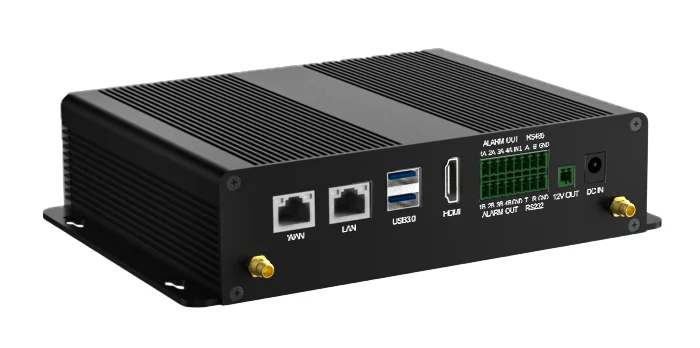

<!-- This is a product photo showing the device rear panel with ports -->

Key specifications:

| Component  | Specification                                      |
| ---------- | -------------------------------------------------- |
| Processor  | BM1688                                             |
| CPU        | Octa-core ARM A53 @ 1.6 GHz                        |
| Memory     | LPDDR4 8 GB                                        |
| Storage    | 64 GB                                              |
| AI Compute | 16.0 TOPS                                          |
| Network    | 2 × 10/100/1000 Mbps auto-negotiation Ethernet     |
| Interfaces | USB 3.0 × 2, Type-C × 1, HDMI × 1, TF × 1, SIM × 1 |

## Step 1: Hardware Connection

Connect the device to your local network and power it on.

1. Use an Ethernet cable to connect the device's **ETH port** to your router or switch.

<!-- Image showing the Ethernet port -->

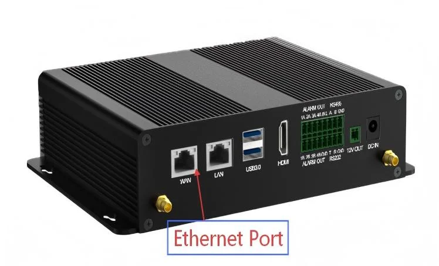

2. **Plug in the power adapter.**

<!-- Image showing the power port -->

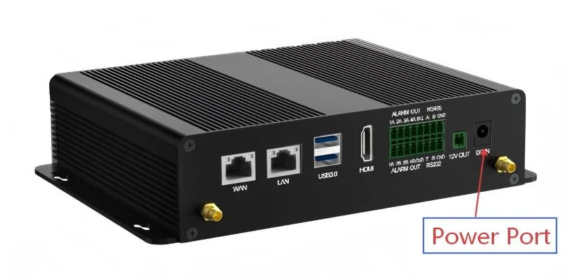

3. Wait approximately **60 seconds** for the device to finish booting.

**Expected status indicators:**

- Power LED (PWR): Solid on (red)

<!-- Image showing the power LED -->

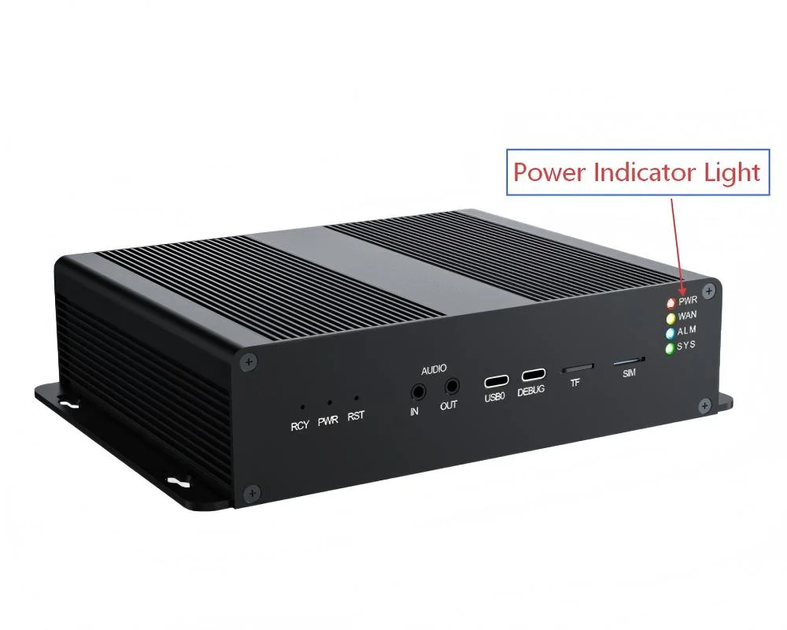

- Network LED (WAN): Blinking (indicates a healthy network connection)

<!-- Image showing the network LED -->

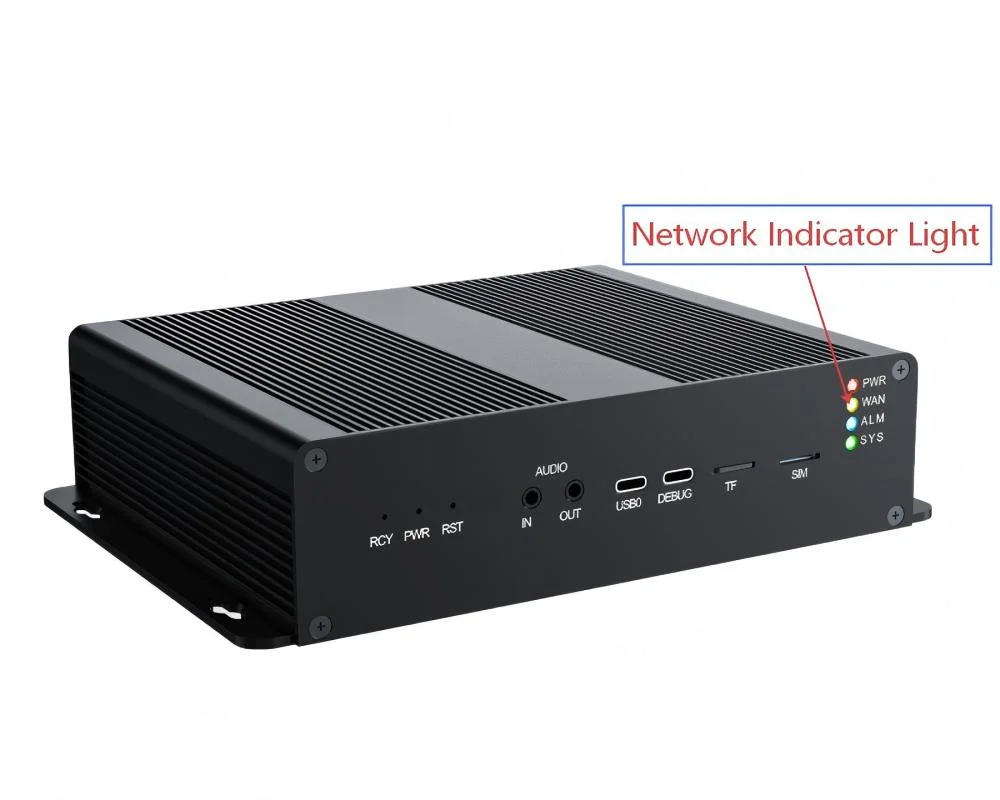

4. **Configure a static IP on your computer**

   On your computer, go to **Start** → **Control Panel** → **Network and Internet** → **Network and Sharing Center** → **Change adapter settings** → **Ethernet**. (A direct connection between the device and your computer is recommended for initial setup.)

<!-- Screenshot of network adapter settings -->

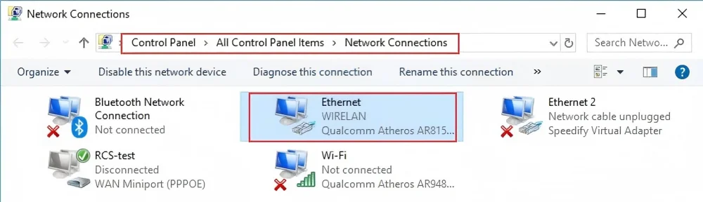

5. Double-click the Ethernet adapter and open **Internet Protocol Version 4 (TCP/IPv4)**.

<!-- Screenshot of TCP/IPv4 properties -->

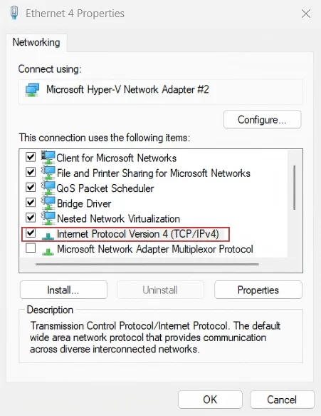

6. Set the IP address and subnet mask to be on the same subnet as the CosmoEdge device, then click **OK**.

<!-- Screenshot of IP address configuration -->

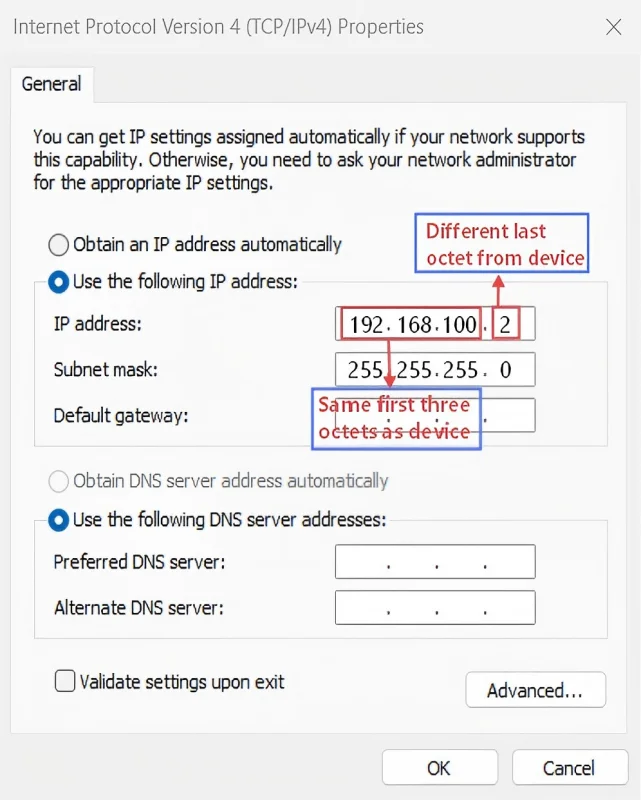

**💡 The default CosmoEdge address is: WAN: 192.168.100.1**

## Step 2: Access the Management Console and Configure System Settings

Open a browser and navigate to the device's IP address.

1. We recommend **Chrome** or **Edge**.
2. In the address bar, enter: `http://<device IP>` (e.g., `http://192.168.100.1`)

<!-- Screenshot of browser navigation -->

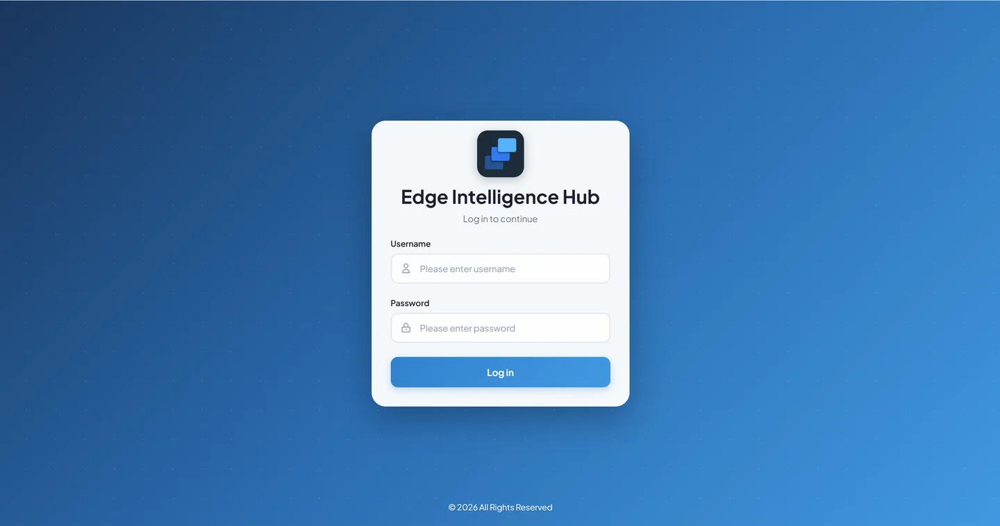

3. Log in with the default credentials:
   - Username: `admin`
   - Password: `admin` (we strongly recommend changing this after first login)

<!-- Screenshot of login page -->

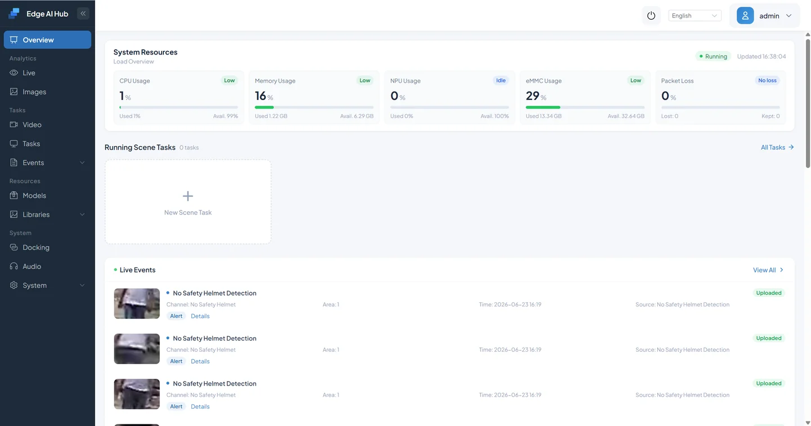

After a successful login, you'll see the **System Dashboard**, which displays the following key metrics:

|   Metric    |                 Description                  |
| :---------: | :------------------------------------------: |
|  CPU Usage  |                Processor load                |
| VRAM Usage  |    Video memory consumed by loaded tasks     |
|  NPU Usage  |         Neural processing unit load          |
| eMMC Usage  |          System storage utilization          |
| Packet Loss | If above 10%, system performance may degrade |

Go to **System Management** → **System Settings** → **Time Settings** → **Manual Sync** → **Sync with Computer**. (Since the device is directly connected, it can't automatically obtain the correct time.)

<!-- Screenshot of time sync settings -->

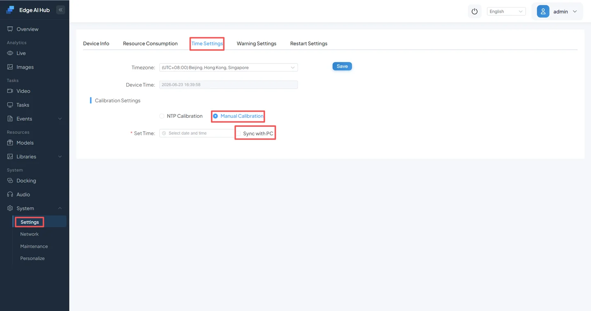

Go to **System Management** → **Network Configuration** to change the device's IP address so it's on the same subnet as your LAN. (This lets your computer access the console while still having internet connectivity.)

<!-- Screenshot of network configuration -->

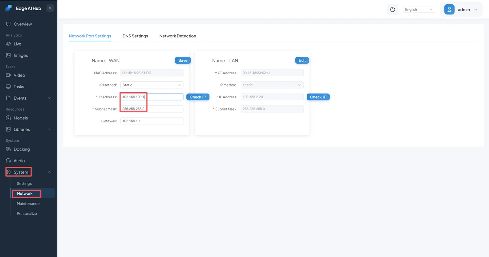

> **⚠️ Can't access the management console?**
>
> - Make sure the device and your computer are on the **same subnet**.
> - Try connecting the device directly to your computer with an Ethernet cable (bypassing the router).
> - Check whether your browser is using a proxy — disable it and try again.

## Step 3: View Live AI Detection Results

The device comes pre-loaded with several demo scenarios using **built-in demo videos** as data sources — no cameras needed to experience the full AI detection workflow. We'll use **Pedestrian Flow Counting** as our example.

1. **Download the pedestrian flow demo video**

   Demo video download link: [github.com/cosmo-wander-ai/cosmo-edge/releases/tag/v1.0-videos](https://github.com/cosmo-wander-ai/cosmo-edge/releases/tag/v1.0-videos)

---

2. **Upload the pedestrian flow demo video**

   In the Task Configuration menu, click **Video Sources**, then click **Add**.

<!-- Screenshot of video source page -->

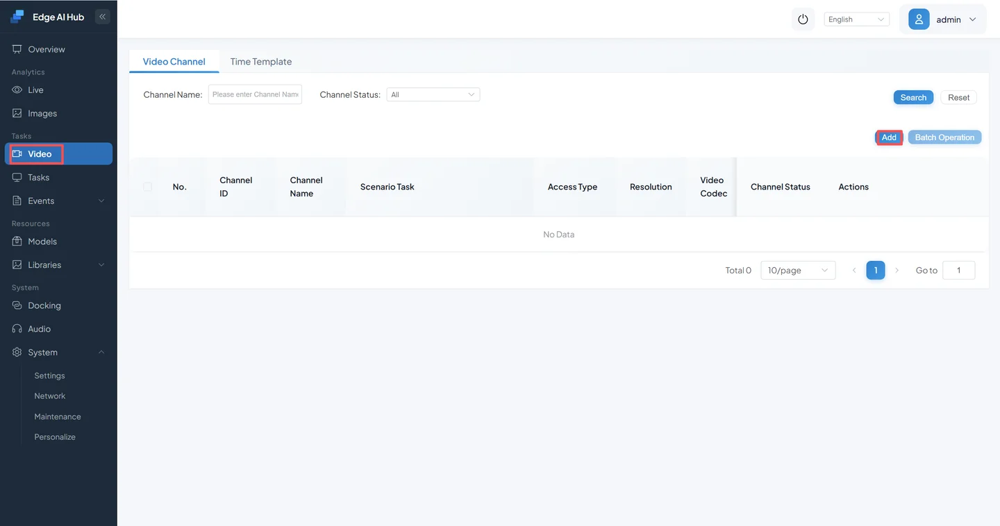

In the dialog that appears:

- Source type: Offline Video
- Channel name: Give it a descriptive name, e.g., **Building 1 East Corridor**
- Upload video: Upload the demo MP4 file, then click **Save**.

<!-- Screenshot of add channel dialog -->

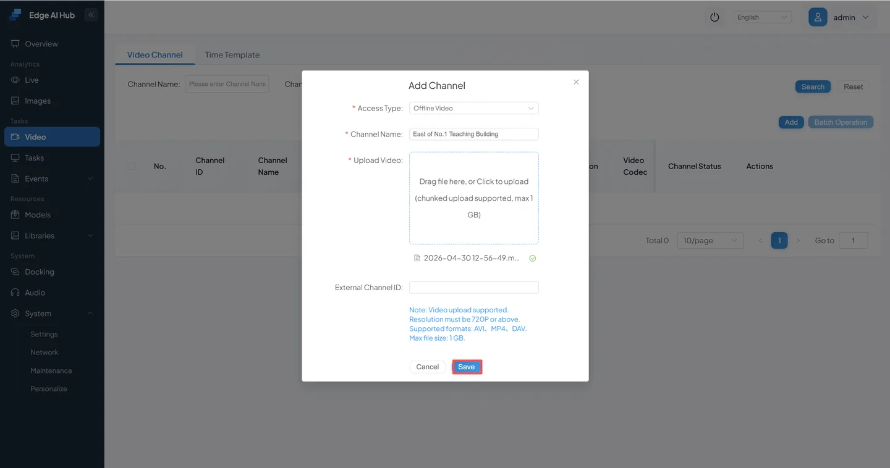

Click **Scenario Task Assignment**.

<!-- Screenshot of task assignment button -->

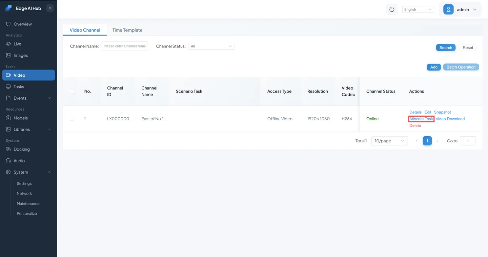

3. **Assign an algorithm to the channel**

   Configure the video analytics algorithm for the channel.

<!-- Screenshot of algorithm assignment -->

Page layout overview:

<!-- Screenshot showing the three functional areas -->

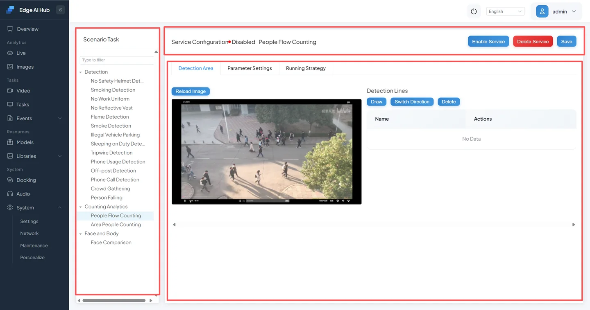

The Service Assignment page has three main areas:

- **Area 1**: All available algorithm types — Detection/Analysis, Face/Body, Counting/Statistics.
- **Area 2**: Controls for starting, stopping, and deleting services on the channel.
- **Area 3**: Service configuration panel — detection region setup, parameter tuning, runtime strategy, etc.

Under **Counting/Statistics**, find **Pedestrian Flow Counting** and select it.

<!-- Screenshot of selecting pedestrian flow counting -->

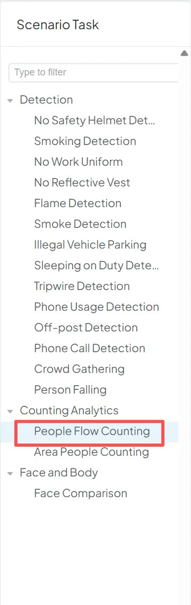

The configuration parameters for the selected algorithm will appear. The pedestrian flow counting algorithm works by detecting pedestrians crossing a detection line. Key controls include:

- **Draw**: Draw a detection line.
- **Direction Toggle**: Switch the crossing direction for one-sided counting.
- **Delete**: Remove the detection line.

<!-- Screenshot of detection line parameters -->

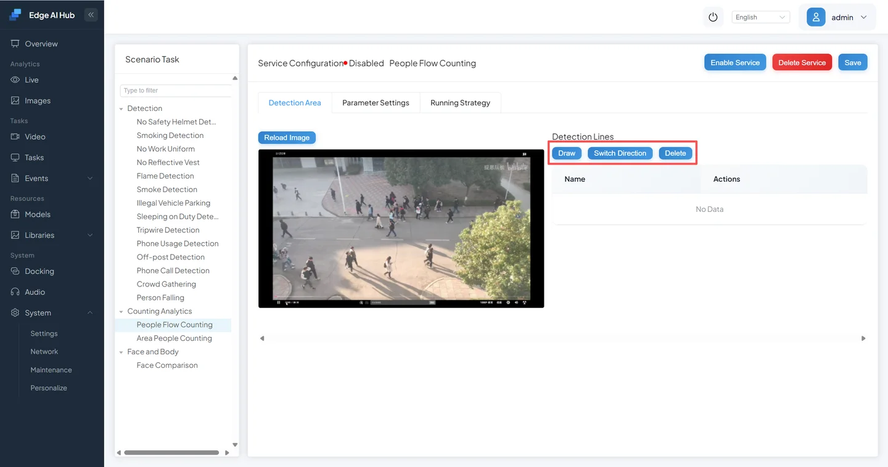

> **💡 Configuration Parameters**
>
> Parameters are determined by the algorithm's pipeline orchestration.

**Draw the detection line**

Click **Draw**, then click once in the video to set the starting point, and click again to set the endpoint. (The line counts pedestrians crossing in the direction of the arrow.)

<!-- Screenshot of drawing process -->

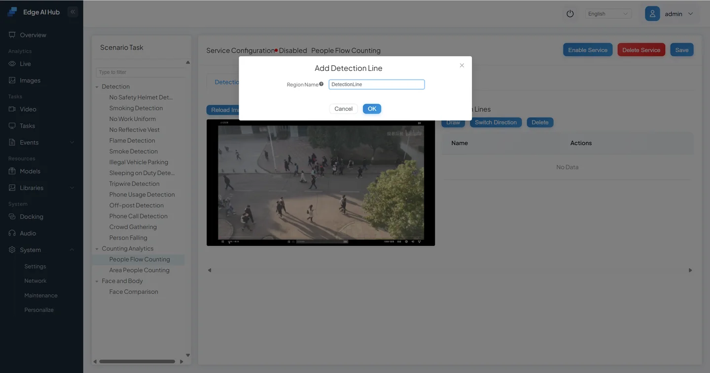

<!-- Screenshot of completed line -->

Click **Finish Drawing** to save. The detection line is now configured.

<!-- Screenshot of saved detection line -->

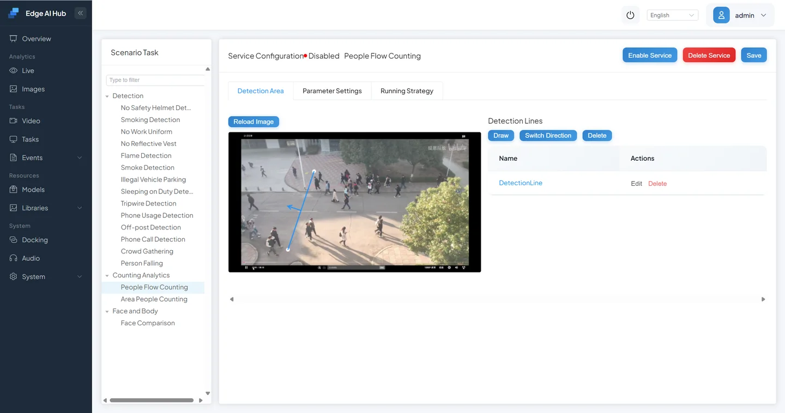

**Set the runtime strategy**

Set the play count to 0 for looping playback.

<!-- Screenshot of runtime strategy -->

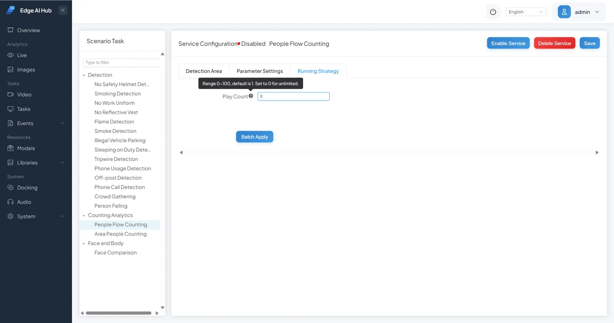

Click **Save**. This assigns the pedestrian flow counting algorithm to the channel and simultaneously starts the analysis service.

<!-- Screenshot of save confirmation -->

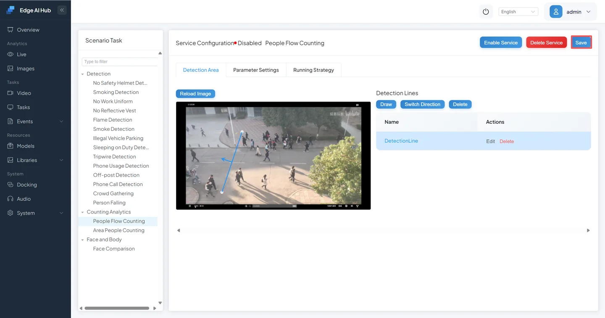

Return to the **Video Sources** menu. The "Running" toggle being on indicates the service is active.

<!-- Screenshot of running status -->

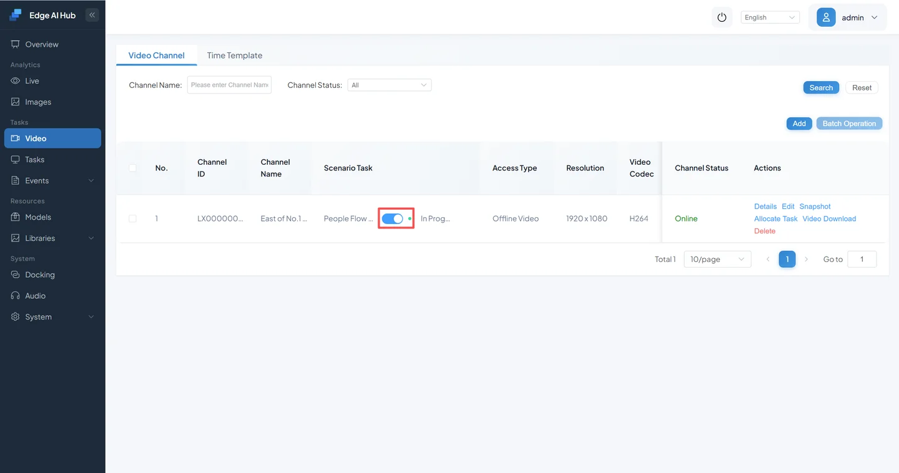

4. **Algorithm Visualization**

Click **Live Preview** to enter the visualization page.

<!-- Screenshot of live preview entry -->

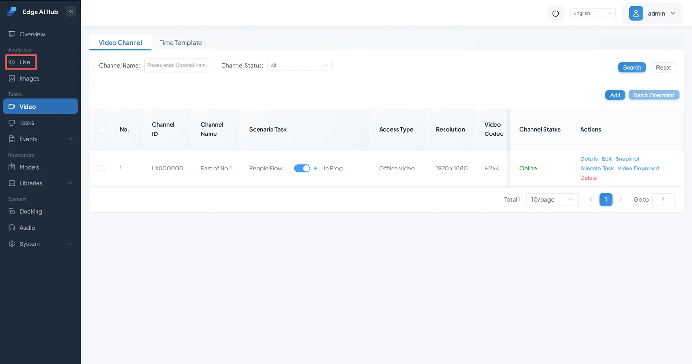

The visualization page has three areas:

- **Left panel**: All service channels in the system.
- **Center area**: Visual algorithm display — select a channel to view.
- **Right panel**: Real-time scrolling alarm feed from all active algorithm tasks.

<!-- Screenshot of visualization page layout -->

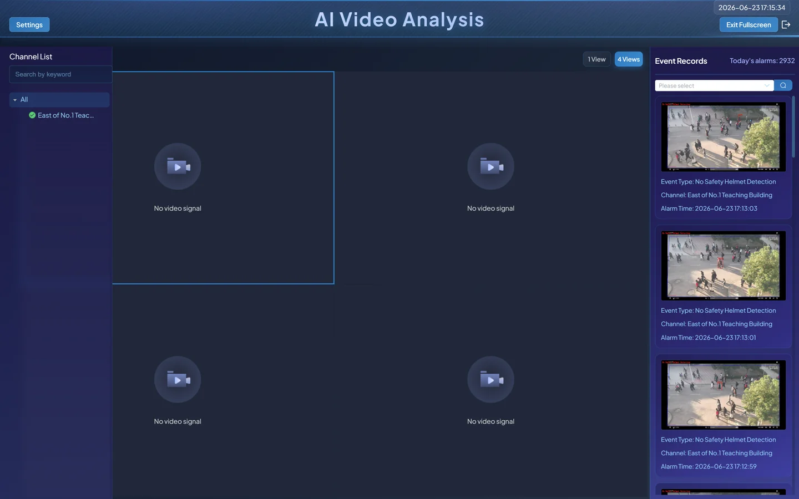

> **💡 Layout Options**
> Use the toggle in the upper-right corner to switch between **single view** and **quad view** layouts.

Select the **Building 1 East Corridor** channel to stream its algorithm-enhanced video.

<!-- Screenshot of channel selection -->

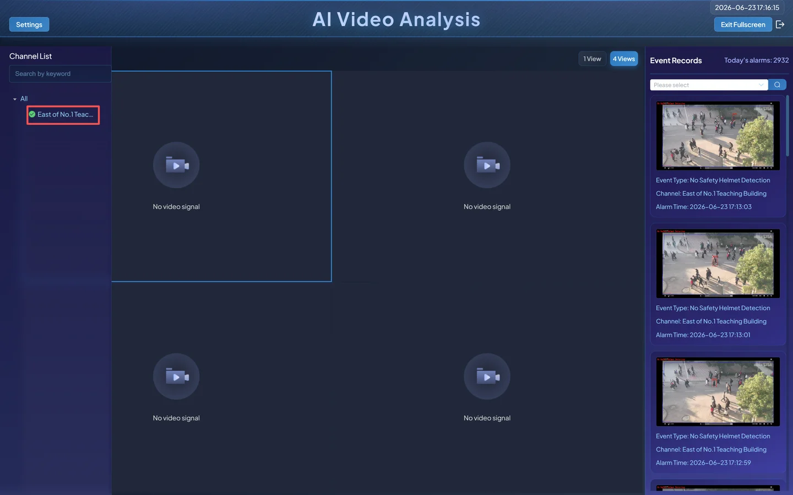

Under algorithm overlay, select **Pedestrian Flow Counting**. Different algorithms have different overlay behaviors.

<!-- Screenshot of overlay selection -->

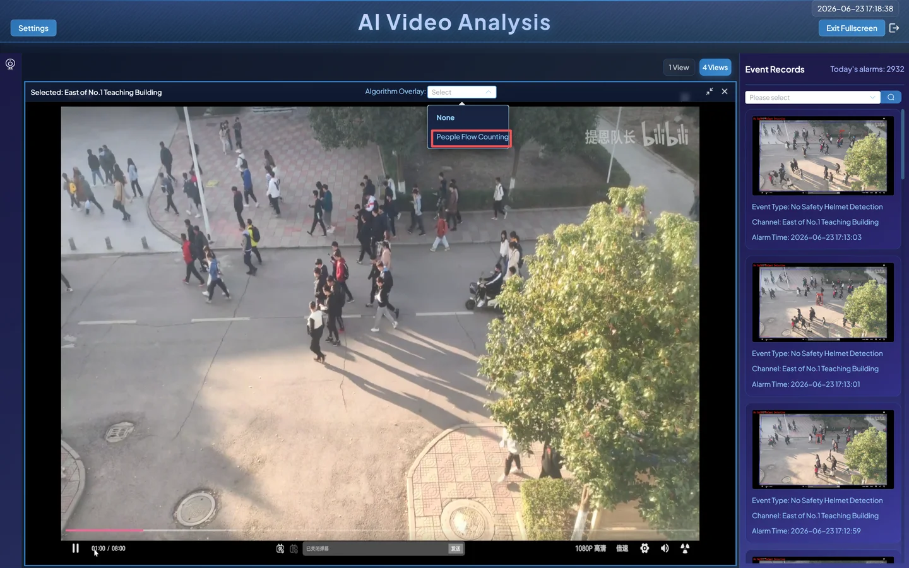

> **💡 Overlay Logic**
>
> Each algorithm's pipeline strategy determines its own overlay behavior.

**Overlay results:**

<!-- Screenshot of overlay results -->

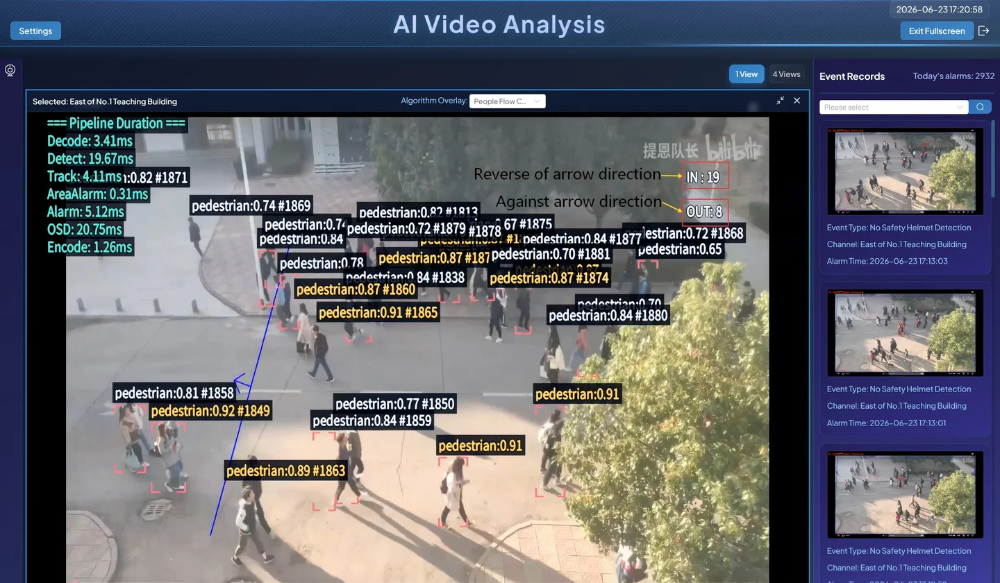

The visualization includes:

1. **Pedestrian detection**: Object class and confidence score, e.g., `Pedestrian: 0.91`
2. **Pedestrian tracking**: Unique track ID for each person, e.g., `#1318`
3. **Pipeline timing**: Upper-left area shows per-component latency breakdown.
4. **Counting results**: Upper-right area shows IN/OUT pedestrian flow totals.

**Demo walkthrough**

> Video demo: Coming soon.

## Step 4: View Statistics

All AI-detected alarms and statistical events are automatically recorded and can be reviewed later.

1. In the left navigation, click **Event Center** → **Counting/Statistics**.

<!-- Screenshot of event center navigation -->

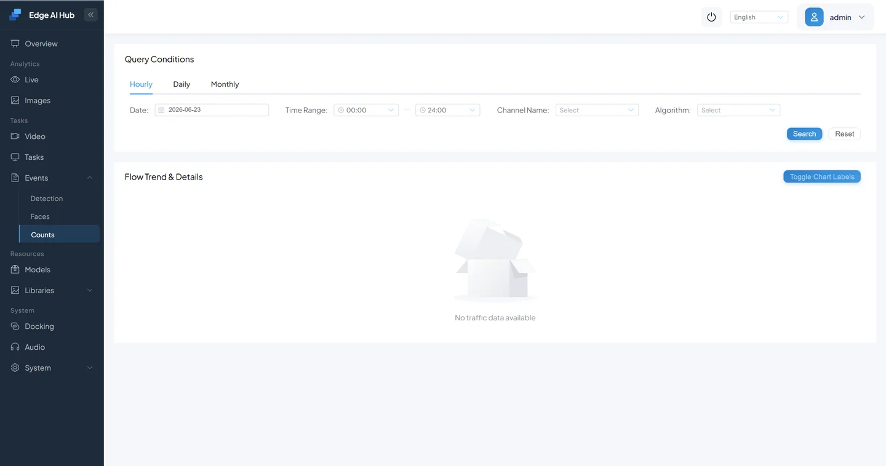

2. Select **Query Events** → **Channel Name** → **Algorithm Service** → click **Query**. (Click Query again to refresh with the latest real-time statistics.)

<!-- Screenshot of query results -->

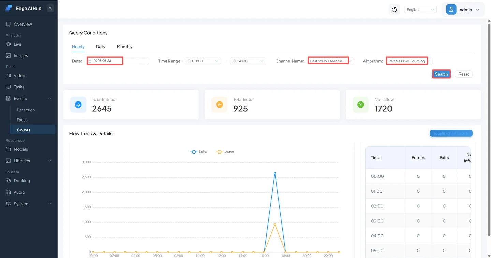

Page note: "Departing visitors" = the OUT count from the visualization; "Net inflow" = the IN count.

## 🎉 Quick Start Complete

You've now successfully:

- [x] Powered on the device and connected it to the network
- [x] Accessed the management console via browser
- [x] Viewed live AI detection results from the pre-installed demo
- [x] Reviewed historical alarm records

**What's next:**

| Goal                                                        | Read                                         |
| ----------------------------------------------------------- | -------------------------------------------- |
| Configure your own AI detection scenarios                   | → Scenario Configuration Guide (Volume 2)    |
| Try the VLM — switch detection rules without model training | → VLM Visual State Judgment Guide (Volume 3) |
| Look up a specific parameter or troubleshoot an issue       | → Reference Manual                           |

---
