# Volume 3: VLM / DINO Guide

> **Estimated time**: 30–40 minutes
> **Goal**: Understand the capabilities and boundaries of VLM and DINO, and learn to define new detection rules just by writing a sentence
> **Prerequisites**: Completed the Scenario Configuration Guide (Volume 2); familiar with basic algorithm configuration workflows
> **No extra equipment needed**: This volume uses built-in demo videos and the image testing feature — no camera required

## Why This Chapter Matters

### A Problem You've Definitely Encountered

When working through the 18 built-in algorithms in Volume 2, you've probably noticed they cover the **most common detection scenarios** — hard hats, fire, falls, pedestrian flow, and so on. But your customers will inevitably ask for things those models don't cover:

<!-- Image showing examples: fire cabinet closed, barricade intact, garbage bin not full, etc. -->
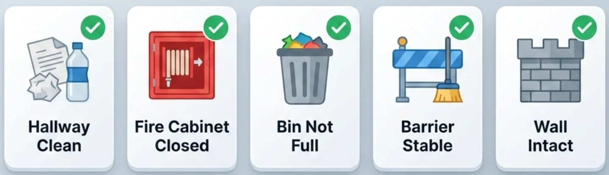

+ "Is there garbage in the hallway?"
+ "Is the fire cabinet door closed?"
+ "Is the garbage bin full?"
+ "Has the construction barricade fallen over?"
+ "Has the city wall been vandalized?"

With a **traditional custom model** approach, each of these requests typically means:

| Step | Effort | Timeline |
| --- | --- | :---: |
| Collect on-site images | 500–2,000 photos | 1–2 weeks |
| Data labeling | Manual bounding box / class annotation | 1–2 weeks |
| Model training + tuning | Requires GPU servers + ML engineers | 1–2 weeks |
| Edge deployment + adaptation | Model conversion + performance tuning | 3–5 days |
| On-site validation + iteration | Re-collect and retrain if accuracy is insufficient | Uncertain |

**A single custom scenario takes at least a month from requirement to deployment, sometimes longer.** And your customer might have 5 or 10 such requests at the same time.

### Two Large Model Tools at Your Disposal

CosmoEdge includes two built-in large model capabilities, each designed for different types of long-tail requirements:

|  | VLM (Visual State Judgment) | DINO (Open-Vocabulary Detection) |
| --- | --- | --- |
| **In a nutshell** | Judges the **state** of a scene (yes/no, open/closed) | Finds **where targets are** in the frame (draws bounding boxes) |
| **Input** | Write a prompt (a question) | Write a **target name** |
| **Output** | YES / NO | Bounding boxes + confidence scores (just like CV models) |
| **Typical use case** | "Is there garbage in the hallway?" → YES | "garbage" → marks garbage locations on screen |
| **On-screen behavior** | No bounding boxes — results appear in the alarm panel | Bounding boxes overlaid directly on video |
| **Analysis speed** | ~2–3 sec per frame | ~1–2 sec per frame |

**Quick rule of thumb:**

+ Want to know **"is it or isn't it?"** → Use **VLM**
+ Want to know **"where is it?"** → Use **DINO**

Neither requires model training or data labeling. Write a sentence and you're up and running.

### Capability Boundaries (Please Read This)

Before getting started, understand what these tools **can** and **cannot** do.

#### ✅ Good Fit for Large Models

| Scenario Type | Tool | Example |
| --- | :---: | --- |
| **State judgment** (yes/no, present/absent, open/closed) | VLM | "Is the fire cabinet door closed?" → YES/NO |
| **Simple classification** (pick one of a few states) | VLM | "Is the indicator light red, green, or yellow?" |
| **Open-vocabulary detection** (find a specific object) | DINO | "fire extinguisher" → marks its position on screen |
| **Rare / long-tail scenarios** (no training data available) | VLM / DINO | "Wall vandalism marks" — impossible to build a training dataset |
| **Low-frequency inspection** (a few seconds between checks is fine) | VLM / DINO | Analyzing one frame every 2.5 seconds is sufficient for patrol use |
| **Quick feasibility check** | VLM image test | Upload sample event photos, get batch judgment results |

#### ❌ Poor Fit for Large Models

| Scenario Type | Reason | Recommended Alternative |
| --- | --- | --- |
| **Real-time detection** (< 100 ms response) | Large models need 1–3 sec/frame | Use the CV models from Volume 2 |
| **Precise counting** (how many people/vehicles — VLM not suitable) | Large models aren't good at spatial quantification | Use detection + tracking scenario tasks |
| **Multi-channel concurrency** | Large models are resource-intensive | CV models support 16 concurrent channels |
| **Action recognition** (continuous motion / state transitions) | Single-frame judgment has limited capability | Use specialized behavior analysis models |

> **Bottom line**: Large models are best for **"low-frequency, broad-coverage, long-tail"** scenarios. They don't replace the CV models from Volume 2 — they **fill the gaps** those models can't cover. The three approaches complement each other; they don't compete.

## Part 1: VLM Visual State Judgment

VLM's core capability: **Look at an image and answer a yes-or-no question.**

#### How VLM Works

```plain
Video frame
   ↓
Extract one frame every few seconds ← Frame rate (configurable)
   ↓
Crop to your region of interest ← ROI selection (you draw a box on screen)
   ↓
Send the cropped image + your question to VLM ← Prompt (the sentence you write)
   ↓
VLM answers: YES or NO (or your custom options)
   ↓
If the answer triggers an alarm condition → Event record + alarm notification
```

### Scenario 1: River Floating Debris Detection (Full Walkthrough)

> **Requirement**: River management staff need to know if there's floating debris, and if so, automatically alert the cleanup crew.
> **Why traditional approaches struggle**: Floating debris takes countless forms (leaves, plastic bags, bottles, miscellaneous junk). Training a single detection model to cover all debris types is prohibitively expensive.
> **VLM's advantage**: No need to enumerate every possible shape — if a human can tell "there's debris here," VLM can too.

#### 1.1 Configure the Prompt (Core Step)

1. Navigate to the **River Floating Debris Detection** algorithm.

   Click **Scenario Tasks** → **River Floating Debris Detection** → **Pipeline Orchestration** to enter the orchestration page.

<!-- Screenshot of pipeline orchestration -->
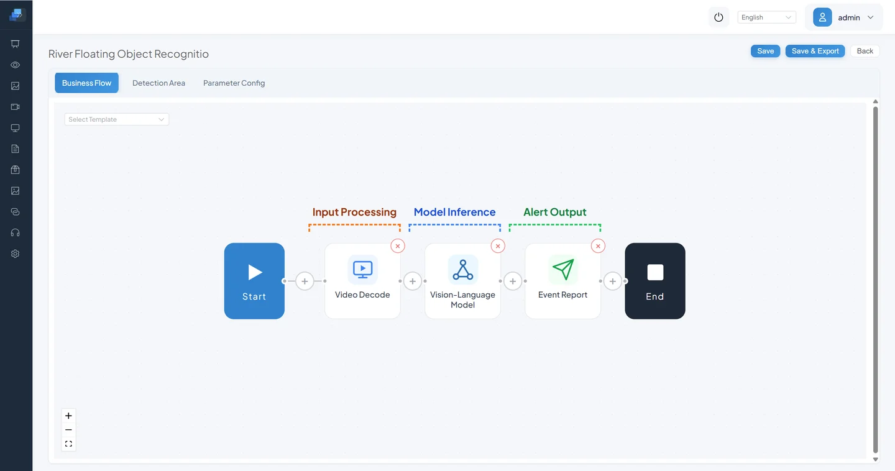

A VLM pipeline typically involves four stages:

+ **Video Decode**: Decode the RTSP stream (**make sure the target event is visually discernible in the frame**).
+ **Data Preprocessing**: Frame sampling, ROI cropping, and other preprocessing for the large model input.
+ **Vision Language Model**: Feed the preprocessed image and prompt to the VLM for inference.
+ **Event Reporting**: When the VLM output triggers the reporting logic, the result is sent to the system.

2. Edit the prompt

   Click the **Vision Language Model** node to expand its configuration panel. Edit the prompt, then click **Save**.

<!-- Screenshot of VLM node configuration -->
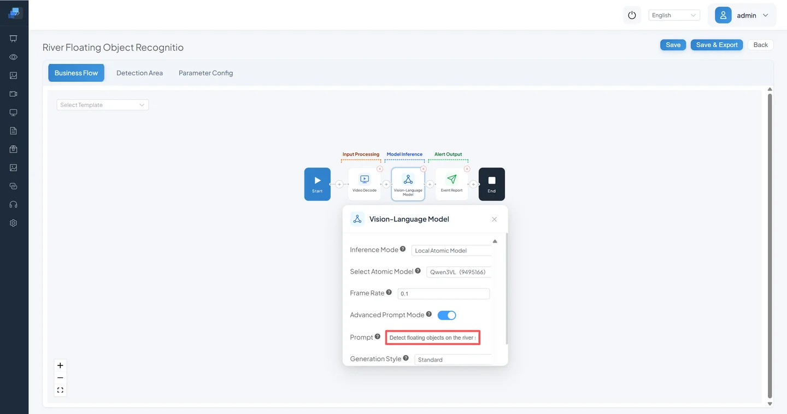

Parameter reference:

| Parameter | Purpose | Notes |
| --- | --- | --- |
| Select Base Model | Choose the multimodal model type |  |
| Frame Rate | How many frames per second to sample for analysis (fps; the lower the value, the longer the interval between analyses) | Large models are compute-intensive — use a smaller value to lengthen the interval |
| Advanced Prompt Mode | Enable full prompt configuration | When on, you write a complete prompt sentence; when off, just enter the detection target |
| Prompt | Enter your prompt text |  |
| Generation Style | Controls output randomness | Strict = low randomness; Standard = normal; Creative = high randomness; Custom = manual control |

**Recommended settings:**

<!-- Screenshot of recommended parameter values -->
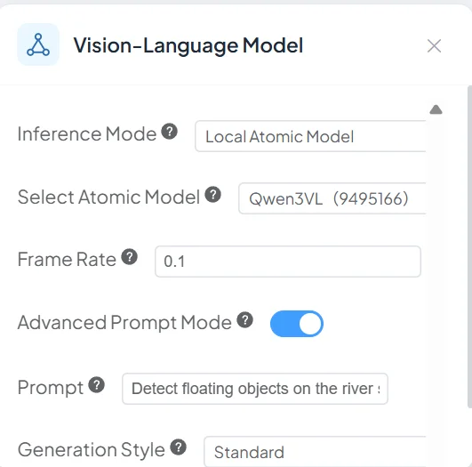

#### 1.2 Select the VLM Algorithm and Bind a Channel

1. Download the demo video. Video URL: xxx.

2. **Upload the demo video**

   Click **Video Sources** → **Add** → Upload an offline video → Enter **Scenario Task Assignment**.

<!-- Screenshot of video upload -->
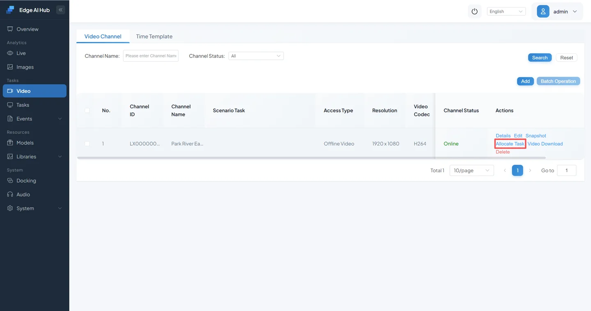

Under **All Services**, select **River Floating Debris Detection** and click **Add Region**.

<!-- Screenshot of service selection -->
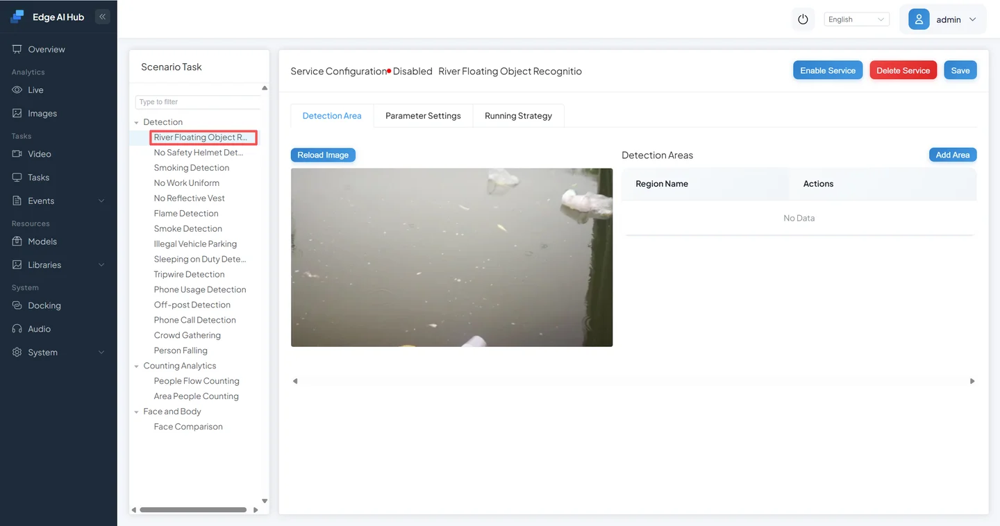

> **💡** The large model's default detection region is the full frame.

3. **Draw a Region of Interest (ROI)**

   Just like in Volume 2, you can draw a region to focus VLM on a **specific area**. **The more precise the region, the less background noise, and the more accurate the judgment.**

<!-- Screenshot of ROI drawing -->


4. Configure detection parameters

   Switch to the **Parameter Settings** tab, set the alarm interval, and click **Save** to save the configuration and start the service.

<!-- Screenshot of parameter settings -->
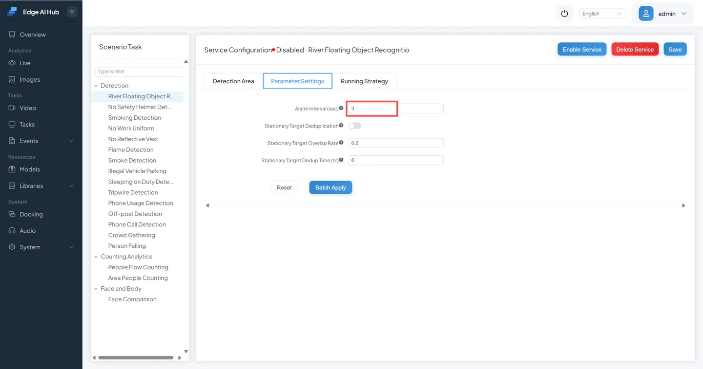

#### 1.3 View Detection Results

1. Click **Live Preview** → **Select Channel** → **Algorithm Overlay**.

   Select **River Floating Debris Detection** as the overlay algorithm.

<!-- Screenshot of algorithm overlay -->
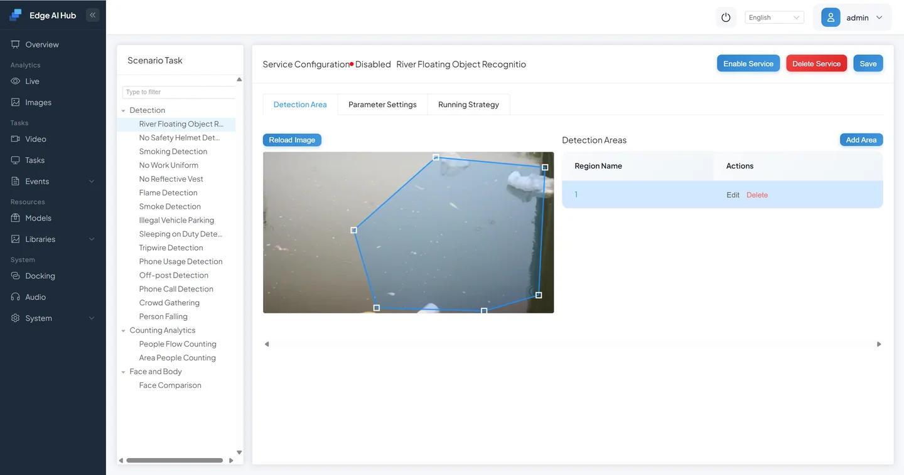

Alarm notification (the large model takes about 30 seconds to initialize on first load — subsequent inference is unaffected):

<!-- Screenshot of alarm notification -->


Results analysis:

+ The video feed plays normally (VLM does **not** overlay bounding boxes on the video — this is expected behavior).
+ The **alarm panel** on the right shows detection events:
    - When floating debris is present → alarm triggers, with a captured snapshot
    - When no debris is present → no alarm

> **⚠️ Visual difference from Volume 2**
> Volume 2's CV models draw **real-time bounding boxes** on the video. VLM **does not draw boxes** — its results appear in the alarm panel and event records. This is not a bug; it's how the two technologies differ in output:
>
> + CV models tell you **"what is where"** (bounding boxes)
> + VLM tells you **"what's the state of the scene"** (YES/NO)

#### 1.4 Event Query

Click **Event Center** → **Detection/Analysis** and filter by your criteria to review alarm records.

<!-- Screenshot of event query -->
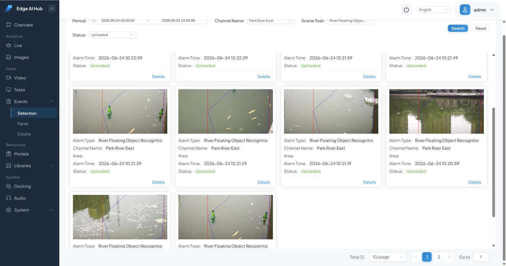

Each VLM alarm includes:

+ **Captured snapshot**: The exact frame the VLM analyzed
+ **Judgment result**: YES (debris present) or NO (no debris)
+ **Timestamp**: When the judgment was made

Click an alarm image to view details. The alarm information appears in the upper right.

<!-- Screenshot of alarm detail -->
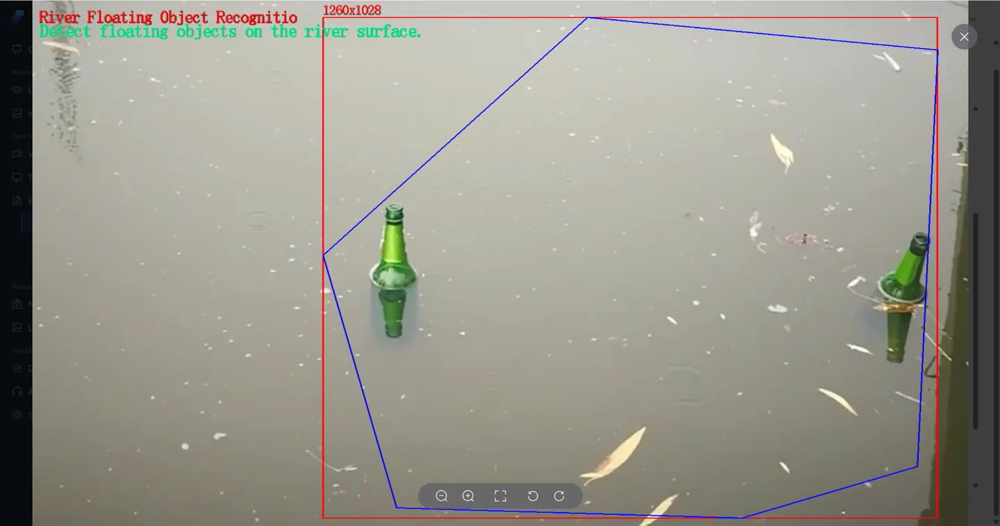

> **💡 Difference from Volume 2**
> In Volume 2, you selected fixed-purpose algorithms like "No Hard Hat." Here, you're selecting a **general-purpose VLM engine** — what it can do depends entirely on the prompt you write next.

**You've now completed your first VLM scenario configuration.**

### Scenario 2: City Wall Vandalism Detection (Validating a Brand-New Requirement)

> **Requirement**: A cultural heritage organization needs to monitor an ancient city wall and detect signs of human vandalism.
> **What makes this unique**: No AI vendor offers an off-the-shelf "city wall vandalism detection" model. With a traditional custom approach, just defining "what counts as vandalism" would take weeks of back-and-forth.
> **Learning focus**: Not the operational steps (same as Scenario 1), but **how to use image testing to quickly validate feasibility and how to iterate on prompts**.

#### 2.1 First: Can VLM Even Do This?

For a brand-new custom requirement, **don't jump straight to connecting a video feed and creating a scenario task** — events may occur infrequently in video, making it hard to verify results quickly. Start with the **Image Test** feature for rapid prompt validation.

1. Create a **City Wall Vandalism Detection** VLM Image Analysis task.

   Click **Scenario Tasks** → **New Task**.

<!-- Screenshot of new task -->


Set data source type to **Image Analysis**.

<!-- Screenshot of data source type -->


Click **OK** to save.

<!-- Screenshot of saved task -->
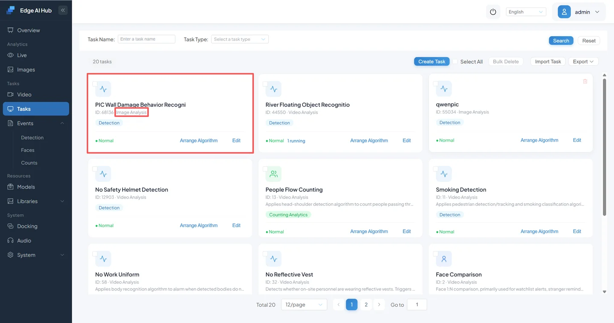

Click **Pipeline Orchestration** → **Operations** → **Add Component** → **Vision Language Model** to add the VLM node.

<!-- Screenshot of adding VLM component -->
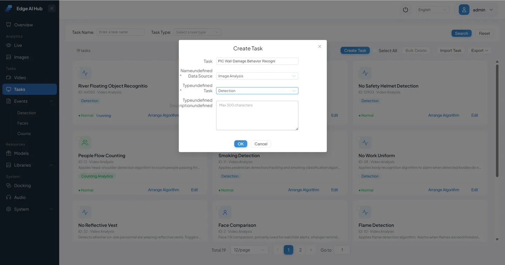

The entire pipeline only needs one Vision Language Model node.

<!-- Screenshot of single-node pipeline -->


Click the **Vision Language Model** node, configure the prompt, and click **Save**.

<!-- Screenshot of prompt configuration -->
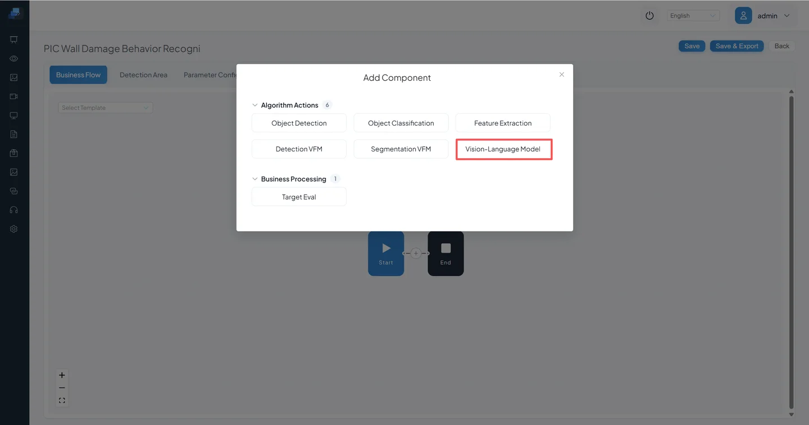

Prompt: *Determine whether the person in the image appears to be vandalizing the wall.*

> The above covers all the steps needed to orchestrate a VLM pipeline.

2. Upload images for quick validation

   Click **Image Analysis** to open the image inference page. Select the **PIC City Wall Vandalism Detection** algorithm.

<!-- Screenshot of algorithm selection -->


Upload the images to analyze.

<!-- Screenshot of image upload -->
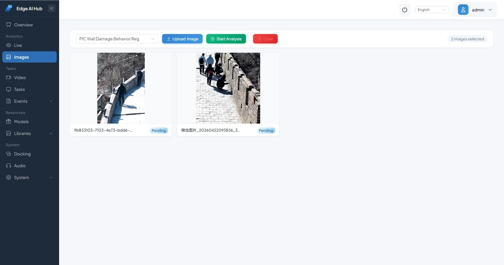

Click **Start Analysis**. (Note: the image testing service is created at this point and needs a few seconds to load the model.)

<!-- Screenshot of analysis in progress -->
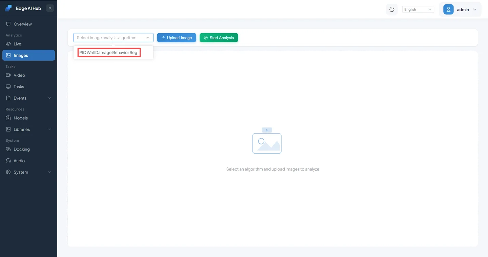

Analysis complete:

<!-- Screenshot of analysis results -->
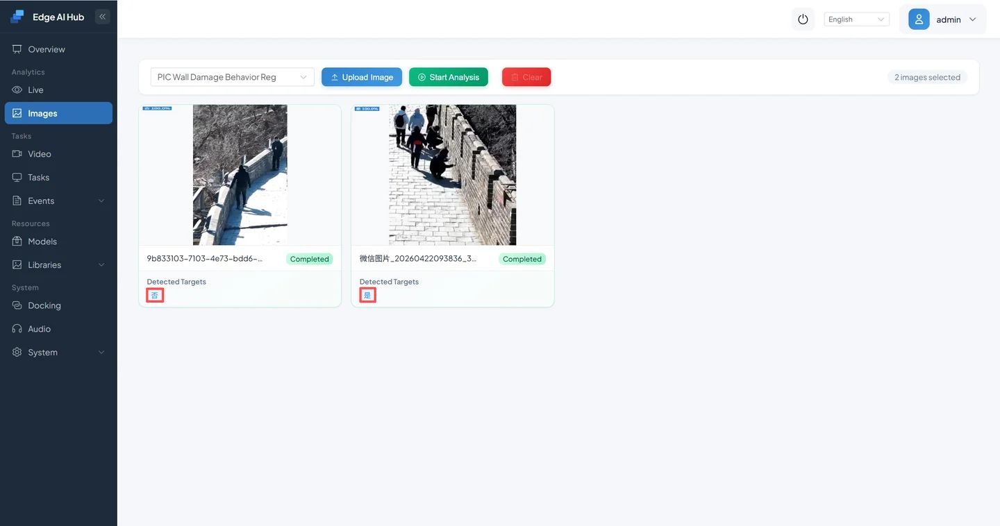

Results include both "detected" and "not detected" outcomes. Click through for detailed information.

Click an image marked as **Target Detected** to view confidence scores and logical results.

<!-- Screenshot of detection details -->
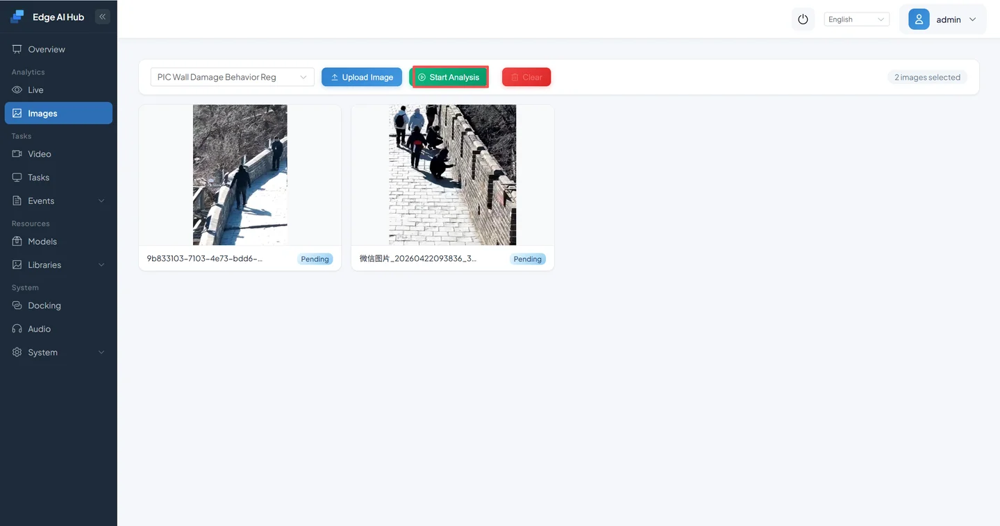

Result interpretation:

+ If the result matches expectations → Judgment is correct; the prompt works.
+ If the result is unexpected or inconsistent → Adjust the prompt (see next section).

> **💡 The Value of Image Testing**
> No video feed needed. No scenario task to configure. No waiting around for events to happen in a video stream. Just upload real-world event photos and get instant results. **This is the lowest-cost way to validate whether VLM can handle a given scenario.** We recommend image testing before every new scenario goes live. For complex or high-stakes scenarios, prepare a meaningful set of positive and negative sample images and measure precision and recall.

#### 2.2 Prompt Iteration: When the First Version Isn't Good Enough

In practice, the first version of your prompt may not be accurate enough. Here are common adjustment strategies:

**Case 1: Missed detections (vandalism present but not caught)**

Make the question more specific by describing visual characteristics:

```plain
❌ "Is there a problem with the city wall?"         ← Too vague
✅ "Does the wall surface show cracks, missing sections, or graffiti?"  ← Specific visual features
```

**Case 2: False positives (no vandalism but alarm triggered)**

Narrow the scope or adjust the ROI to exclude interference:

```plain
❌ "Has the wall been damaged?"                ← "Damaged" is too broad — natural weathering might trigger it
✅ "Are there visible signs of deliberate carving or chiseling on the wall surface?"  ← Focus on "deliberate" + "specific form"
```

**Case 3: Unstable results**

+ Check if the ROI is too large, capturing excessive irrelevant background.
+ Simplify the prompt — avoid overly complex descriptions.
+ Test with multiple images to confirm consistency.

> **General prompt iteration workflow:**

```plain
Write a prompt → Validate with image testing (positive + negative samples)
    ↓ Not good enough
Analyze the cause (missed detections / false positives / instability) → Adjust prompt → Re-validate
    ↓ Results look good
Connect to a video feed and configure as a persistent scenario task
```

**Keys to Writing a Good VLM Prompt**

| # | Rule | Explanation |
| :---: | --- | --- |
| 1 | **Ask closed-ended questions** | Only ask questions that can be answered with "yes/no" or "A/B/C" — not open-ended questions |
| 2 | **Ask about visible things** | VLM can only analyze image content — make sure your question refers to something visible in the frame |

**VLM — Good Prompts vs. Bad Prompts**

| ✅ Good Prompt | ❌ Bad Prompt | What's Wrong |
| --- | --- | --- |
| "Is there garbage in the hallway?" | "Describe the hallway situation" | Open-ended; uncontrollable output |
| "Is there standing water on the ground?" | "Is the ground wet?" | "Wet" isn't a visual feature; hard to judge |
| "Is the fire cabinet door closed?" | "Is there a problem with the fire cabinet?" | Too vague — what counts as "a problem"? |
| "Is the indicator light red or green?" | "How many indicator lights does the device have?" | VLM isn't good at counting |
| "Are there visible signs of deliberate carving on the wall?" | "Is the wall broken?" | "Broken" is too broad |

#### 2.3 After Validation: Configure as a Live Video Scenario Task

Once the prompt passes image testing, set it up on a live video channel following the same steps as Scenario 1:

1. **Bind the VLM algorithm** to the city wall monitoring channel.
2. **Enter the validated prompt.**
3. **Draw an ROI** around the main wall area.
4. **Set the frame rate** (for heritage patrol, `0.1` = one analysis every 10 seconds is typically sufficient).
5. Go to **Live Preview** to verify results.

> These steps were covered in detail in Scenario 1 and are not repeated here.

## Part 2: DINO Open-Vocabulary Detection

In the first two scenarios, VLM answered "is it or isn't it" questions — it tells you the scene's **state** but doesn't tell you **where** targets are in the frame.

Some scenarios require a different approach:

+ "I want to **find** all fire extinguishers in the frame and see where they are."
+ "I want to **mark** all cats, dogs, or unusual objects on screen."
+ "I want the system to **draw boxes** around every tool in the construction zone."

These use cases don't need YES/NO — they need **bounding boxes**, just like the CV models from Volume 2, but without training.

That's what DINO does: you write a **target name**, and the system automatically finds and boxes all matching objects in the frame.

#### How DINO Works

```plain
Video frame
   ↓
Extract one frame every few seconds ← Frame rate (configurable)
   ↓
Send the frame + your target name to DINO ← Prompt (e.g., "garbage")
   ↓
DINO finds all matching targets and outputs bounding boxes + confidence scores
   ↓
Bounding boxes are overlaid on the video ← Same OSD display as CV models
   ↓
If targets are detected → Event record + alarm notification
```

### Scenario 3: Open-Vocabulary Object Detection (Streamlined)

> **Requirement**: Detect and mark "person" and "garbage" in a hallway camera feed.
> **Compared to VLM hallway garbage**: VLM only tells you "is there garbage or not"; DINO tells you "where exactly the garbage is in the frame."

DINO's configuration flow is very similar to VLM. Below covers only the **key differences**.

#### 3.1 Configure the Prompt

VLM prompts are **questions**; DINO prompts are **target names** (or multiple names separated by periods).

1. Go to **Algorithm Management** → **DINO Hallway Garbage Detection** → **Pipeline Orchestration** → **Detection Vision Language Model** → Configure the prompt → **Save and exit.**

   Enter the targets you want to detect:

```plain
person.garbage
```

Note: Separate targets with **periods** (English dots).

<!-- Screenshot of DINO prompt configuration -->


> **⚠️ Use English for DINO prompts**

#### 3.2 Bind the DINO Algorithm

1. Go to **Video Sources** → **Scenario Task Assignment**.

<!-- Screenshot of video sources -->


2. Under **Service Assignment**, select a **DINO-type algorithm** and click **Add Region**.

<!-- Screenshot of DINO selection -->
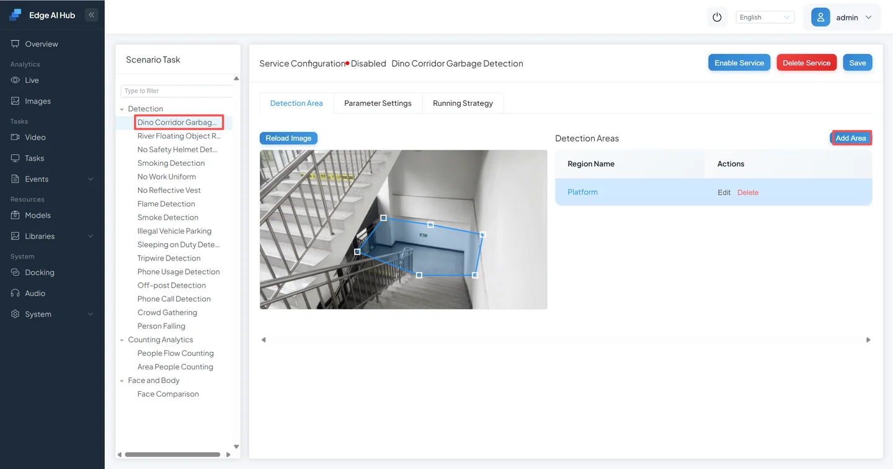

3. Adjust the region

   Position the detection region appropriately. In this scenario, ensure it covers the platform area.

<!-- Screenshot of region adjustment -->
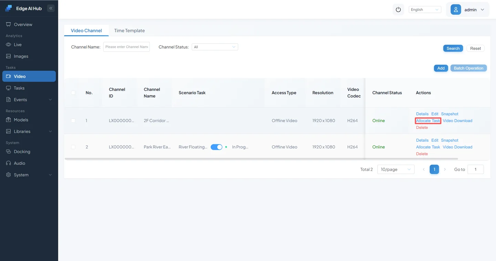

4. Configure parameters, then **Save** and start the service.

<!-- Screenshot of parameter config -->


#### 3.3 View Results

Go to **Live Preview** and enable the algorithm overlay.

<!-- Screenshot of live preview -->
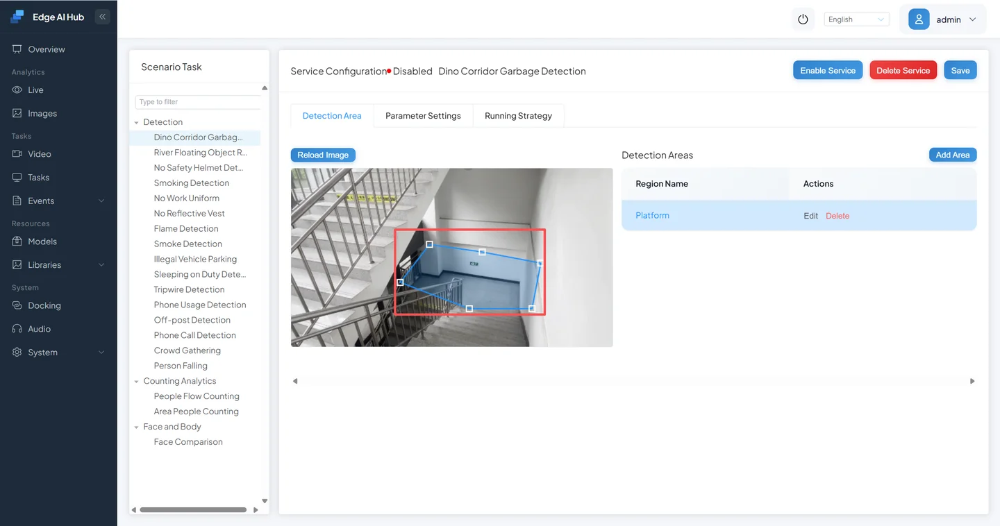

DINO bounding boxes may appear with a slight delay — this is normal.

Detection alarm results:

<!-- Screenshot of detection alarms -->
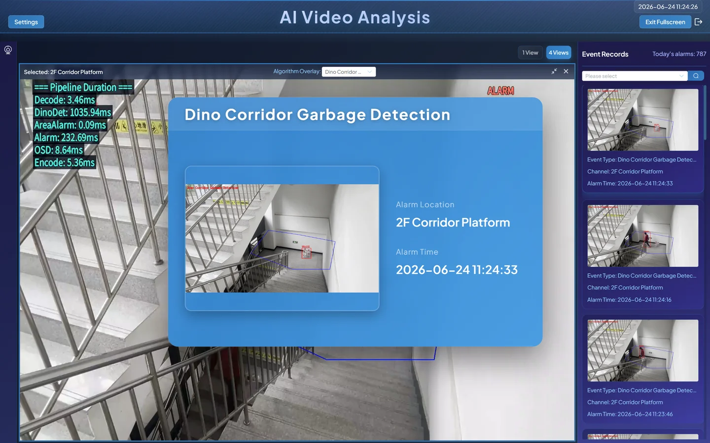

### 3.4 View Event Reports

Go to **Event Center** to review alarms.

<!-- Screenshot of event center -->
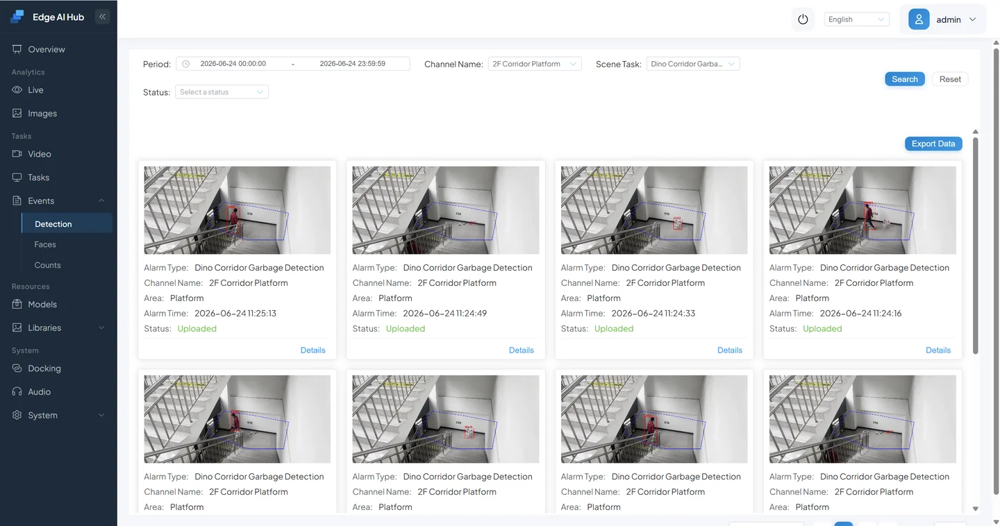

This concludes the DINO open-vocabulary detection workflow.

#### 3.5 Common DINO Prompts Quick Reference

| Chinese | English Prompt | Notes |
| --- | --- | --- |
| 人 | person |  |
| 车 | car / vehicle | "vehicle" has broader coverage |
| 垃圾 | garbage / trash |  |
| 灭火器 | fire extinguisher |  |
| 猫 | cat |  |
| 狗 | dog |  |
| 箱子 | box / package |  |
| 椅子 | chair |  |
| 烟雾 | smoke |  |
| 火焰 | fire / flame |  |

> When in doubt, **try common English nouns**. DINO supports an extremely wide range of categories — most everyday objects can be detected.

## Choosing the Right Tool: CV Model / VLM / DINO

Now that you've completed this volume, you've mastered all three AI analysis capabilities the system provides. When facing a new detection requirement, follow this decision tree:

```plain
What do you need?
│
├─ Is it covered by one of the 18 built-in algorithms from Volume 2?
│   └─ ✅ Yes → Use the CV model (most mature, fastest, supports multi-channel concurrency)
│
├─ Not covered by built-in algorithms. I need to —
│   │
│   ├─ Judge a state (present/absent, yes/no, open/closed)
│   │   └─ → Use VLM — write a question
│   │
│   ├─ Find where a target is (need bounding boxes)
│   │   └─ → Use DINO — write a target name
│   │
│   └─ Need real-time + precise + high concurrency
│       └─ → Requires a custom-trained model (contact us)
```

<!-- Decision tree diagram -->
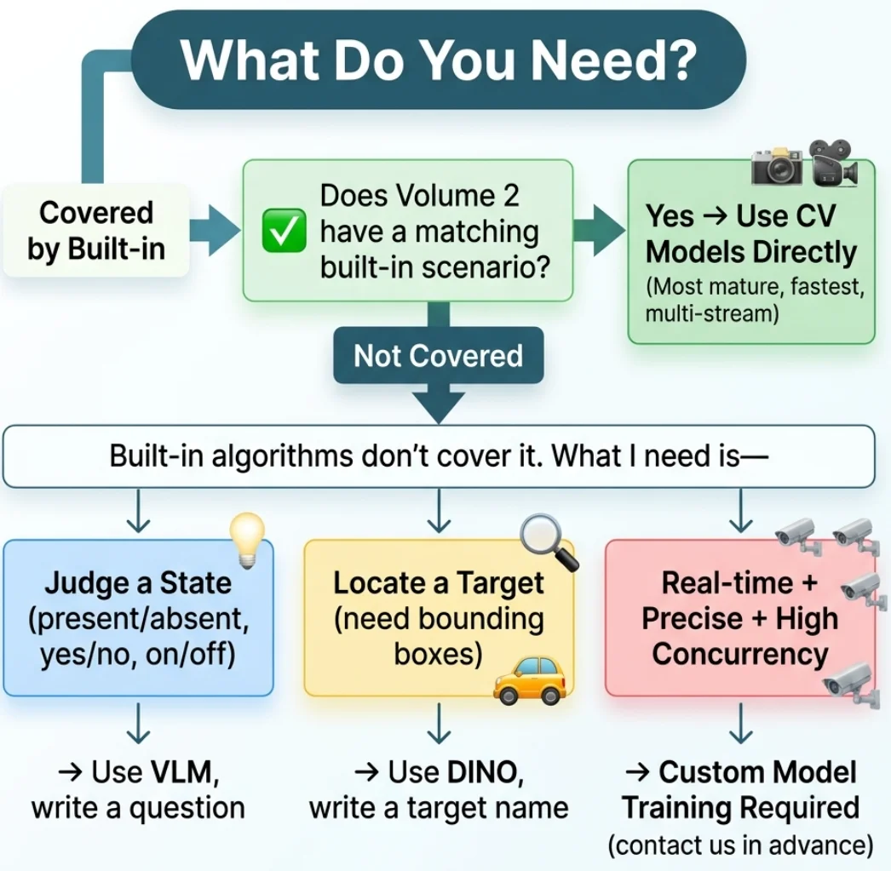

Full comparison:

|  | CV Models (Volume 2) | VLM (This Volume) | DINO (This Volume) |
| --- | --- | --- | --- |
| **Rule source** | Pre-trained fixed model | A question you write | A target name you write |
| **Output** | Bounding boxes | YES / NO | Bounding boxes |
| **Speed** | Real-time (25 fps) | ~2–3 sec/frame | ~1–2 sec/frame |
| **Concurrency** | 16 channels | Single-channel serial | Single-channel serial |
| **Switching scenarios** | Swap models | Change one sentence | Change one word |
| **Best for** | High-frequency mainstream scenarios | Long-tail state judgment | Long-tail object detection |
| **On-screen display** | Real-time bounding boxes | Alarm panel only | Bounding boxes (slower) |
| **Alarm panel** | Detected target + confidence | YES/NO judgment result | Detected target + confidence |
| **Pipeline performance stats** | Overlaid on video (Decode/OSD/Encoder — low latency) | Not on video | Overlaid on video (Decode/OSD/Encoder — high latency) |

> **💡 Think of VLM and DINO as the "universal backup" for CV models.** Your system first covers mainstream scenarios with the 18 mature scenario tasks. For anything those can't handle, VLM and DINO step in on demand — no waiting for model training, ready to go the same day.

## Appendix

### DINO Prompt Rules

| # | Rule | Notes |
| :---: | --- | --- |
| 1 | **Use English nouns** | The current version is more stable with English |
| 2 | **Separate multiple targets with periods** | e.g., `person.garbage.fire extinguisher` |
| 3 | **Be specific** | `fire extinguisher` works better than `red thing` |

### VLM Reference Scenario Templates

| Scenario | Reference Prompt | Output | ROI Suggestion |
| --- | --- | --- | --- |
| Overflowing trash bin | "Is the garbage bin full or overflowing?" | YES / NO | Frame the trash bin area |
| Fire cabinet door status | "Is the fire equipment cabinet door closed?" | YES / NO | Frame the cabinet door area |
| Door status | "Is the door currently open?" | YES / NO | Frame the door area |
| Equipment indicator light | "What color is the equipment indicator light?" | RED / GREEN / YELLOW | Frame the indicator light |
| Hallway obstruction | "Is the fire escape hallway blocked by objects?" | YES / NO | Frame the hallway floor |
| Workstation status | "Is there someone working at this workstation?" | YES / NO | Frame the workstation area |

### New Scenario Validation Checklist

Whether using VLM or DINO, confirm the following before any new scenario goes live:

- [ ] Validated with **Image Testing** using at least 3 positive samples (images that should trigger alarms)
- [ ] Validated with **Image Testing** using at least 3 negative samples (images that should NOT trigger alarms)
- [ ] Tested the same image 3 consecutive times with consistent results (stability check)
- [ ] ROI has been drawn to focus on the specific area of interest, excluding irrelevant background
- [ ] Frame rate has been set to a reasonable value for the scenario

### What's Next

| Goal | Read |
| --- | --- |
| Look up parameter details or get troubleshooting help | → Reference Manual |
| Learn about model porting (deploy your own models to the device) | → Reference Manual — Model Porting Overview |
