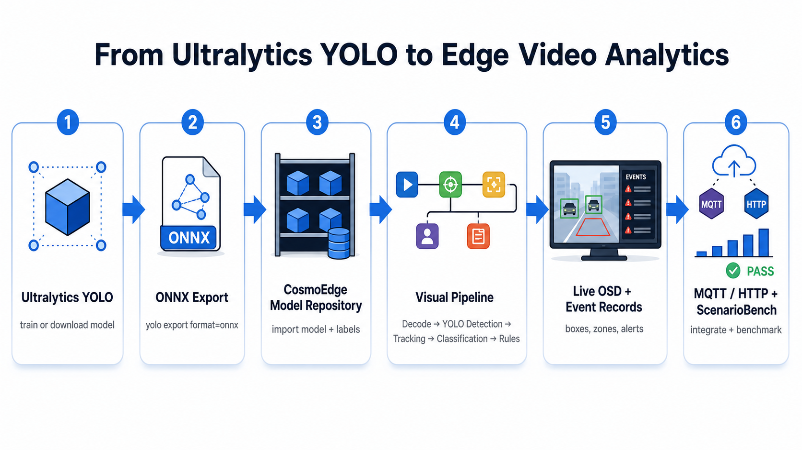
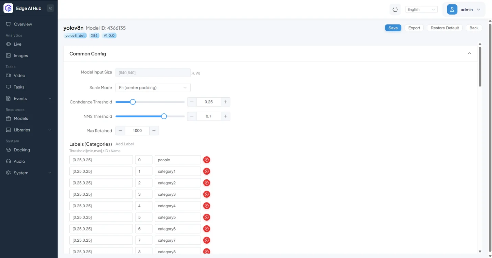
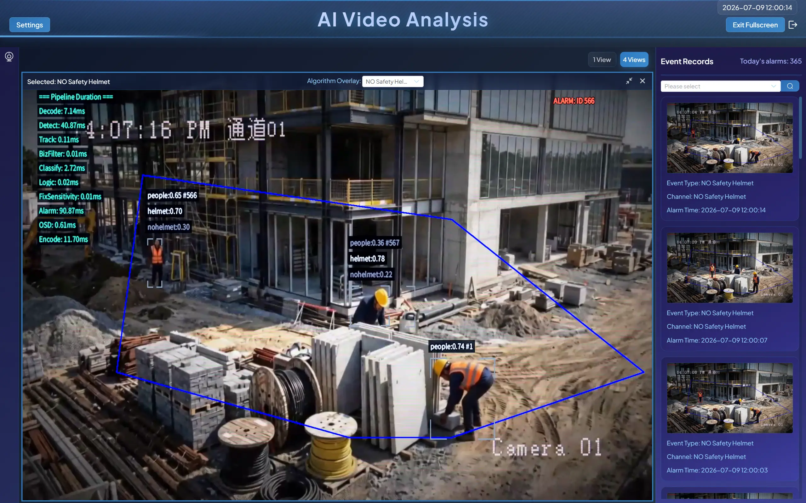
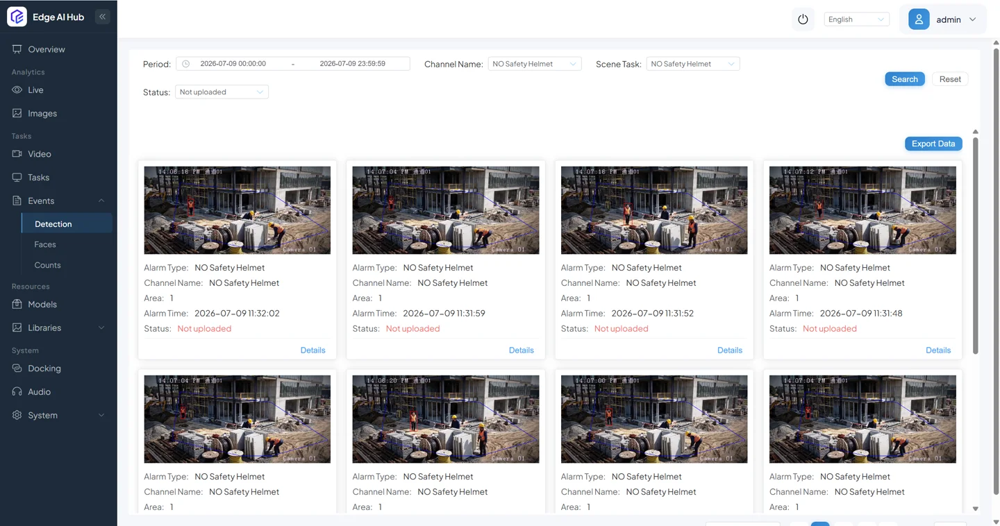
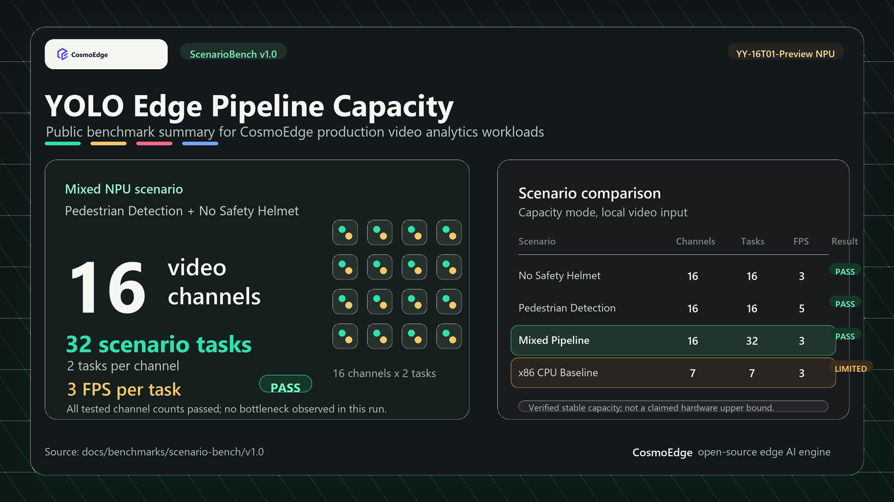

# Deploy Ultralytics YOLO with CosmoEdge

> **Status**: Draft for review. Demo assets and validation evidence are attached; final benchmark artifact links still need to be published.
> **Audience**: Ultralytics YOLO users who already have a trained model and want to turn it into an edge video analytics application.
> **Goal**: Export a YOLO model, import it into CosmoEdge, compose a visual pipeline, bind it to a video source, and verify live OSD plus event output.

This guide focuses on the deployment side of the workflow:

```plain
Ultralytics YOLO model
  -> ONNX export
  -> CosmoEdge Model Repository
  -> Visual pipeline orchestration
  -> Video channel binding
  -> Live OSD and event records
  -> MQTT / HTTP integration
```

CosmoEdge does not replace Ultralytics training or export. It provides the runtime and application layer after a model is ready: model lifecycle management, visual pipeline composition, video source binding, OSD rendering, alarm/event records, and integration with downstream systems.

## Demo

<div align="center">
  <video controls width="960" src="https://github.com/user-attachments/assets/1d65ec39-c3d2-4fb8-8712-8a8d6bad8936" title="Ultralytics YOLO edge deployment demo">
    <a href="https://github.com/user-attachments/assets/1d65ec39-c3d2-4fb8-8712-8a8d6bad8936">Download the demo video</a>
  </video>
</div>

The demo video shows the end-to-end flow in this order:

1. Live OSD result, so readers first see what the deployment produces.
2. Ultralytics YOLO model download or selection.
3. ONNX export.
4. ONNX import into the CosmoEdge Model Repository.
5. Visual pipeline composition.
6. Video channel binding and rule configuration.
7. Final live OSD and event records.

## Workflow Overview



At a high level, the workflow has two parts:

- **Model preparation**: export a trained Ultralytics model to ONNX, then prepare labels and model metadata.
- **Application deployment**: import the model, compose the pipeline, bind video sources, configure regions/rules, and verify OSD/events.

For a full model conversion walkthrough, see [Volume 5: Model Porting](../05-model-porting/model-porting.md). For pipeline internals, see [Volume 4: Pipeline Orchestration](../04-pipeline-orchestration/pipeline-orchestration.md).

## Reproducible Reference Configuration

Use this section as the public reproduction record for the guide. It should be complete enough for another developer to compare their own Ultralytics export, ONNX runtime path, hardware backend, and validation output against this example.

### Model Preparation Environment

| Field | Value |
| --- | --- |
| Python version | `Python 3.13.11` |
| Ultralytics package | `ultralytics==8.2.84` |
| ONNX package | `onnx==1.20.1` |
| ONNX Runtime package | `onnxruntime==1.26.0` |
| Export host OS | Microsoft Windows 11 Home Insider Preview, 64-bit, build `26220` |
| Export command log | `yolo export model=yolov8n.pt format=onnx` |

### Models

| Role | Model | Source | Export input size | Export status |
| --- | --- | --- | --- | --- |
| Detection | `YOLOv8n.pt` | Ultralytics documentation | `640 x 640` | Used by ScenarioBench v1.0 |
| Classification | `YOLOv8n-cls.pt` | Ultralytics documentation | `224 x 224` | Used by ScenarioBench v1.0 no-helmet pipeline |
| Demo detection model | `YOLOv8n.pt` | Ultralytics assets release `v8.2.0` | `640 x 640` | Exported with `yolo export model=yolov8n.pt format=onnx` and used by the public demo video |

### Runtime And Hardware

| Target | Hardware profile | CosmoEdge software version | Runtime backend | Purpose |
| --- | --- | --- | --- | --- |
| NPU benchmark | `npu-yy-16t01-preview` (`YY-16T01-Preview`) | `V1.0.0.0` | Sophon BMRT / BM1688 NPU runtime | High-concurrency edge CV validation |
| x86 baseline | `x86-cpu-baseline` (`X86-TRIAL`) | `V0.1.0.0` | ONNX Runtime CPU (`onnxruntime==1.26.0`) | CPU-only comparison and ONNX-path validation |
| Demo device | `x86-cpu-baseline` (`X86-TRIAL`) | `V0.1.0.0` | ONNX Runtime CPU (`onnxruntime==1.26.0`) | Device used to run the public demo video |

The benchmark hardware identifiers are anonymized. Keep that policy for public docs, but preserve enough version information for reproduction.

### Validation Artifact Index

| Artifact | Link | What it verifies |
| --- | --- | --- |
| Input video | `data/test-video/Safety Helmet.mp4` | Reproducible source video used by the pipeline validation and ScenarioBench benchmark. |
| Demo recording | [`ultralytics-yolo-edge-demo.mp4`](https://github.com/user-attachments/assets/1d65ec39-c3d2-4fb8-8712-8a8d6bad8936) | Screen recording of the CosmoEdge workflow and OSD result, 1920 x 1080, 24 FPS, 100.97 seconds, H.264/AAC. |
| Pipeline package | [`ultralytics-yolo-no-safety-helmet-pipeline.tar.gz`](../../../assets/community/ultralytics-yolo-no-safety-helmet-pipeline.tar.gz) | Exported `NO Safety Helmet` scenario package containing `87841_NO Safety Helmet.json`. |
| Benchmark reports | ScenarioBench v1.0 report paths | Published capacity and stability evidence for each benchmark row. |

### Validation Evidence

Model import output:



Live OSD output:



Event output:



## Prerequisites

Prepare the following before starting:

| Item | Notes |
| --- | --- |
| CosmoEdge runtime | Use a released CosmoEdge package or a validated development build. |
| Target hardware | x86 mode can validate the UI and ONNX path. NPU hardware is required for production-level edge throughput. |
| Ultralytics model | A `.pt` detection model such as `yolov8n.pt`, or a custom trained model. |
| Test video | Use a video that contains objects from your model label set. |
| Label file | A class-name mapping that matches the exported model output. |
| Optional classifier | Required only for multi-stage pipelines such as detection plus safety-helmet classification. |

## Step 1: Export YOLO to ONNX

Install the exact packages used for the reproduced export. Pinning versions keeps export behavior, ONNX graph structure, and runtime compatibility easier to compare:

```bash
python -m pip install "ultralytics==8.2.84" "onnx==1.20.1" "onnxruntime==1.26.0"
```

Export a YOLO detection model to ONNX:

```bash
yolo export model=yolov8n.pt format=onnx
```

For a custom trained model:

```bash
yolo export \
  model=path/to/best.pt \
  format=onnx \
  imgsz=640
```

If your pipeline also uses a classifier, export that model separately and keep the export command with the model package:

```bash
yolo export \
  model=path/to/classifier.pt \
  format=onnx \
  imgsz=224
```

The public demo detection model was exported with Ultralytics defaults for unspecified options such as opset, simplification, dynamic shape, half precision, and NMS.

Expected output:

```plain
yolov8n.onnx
```

Before importing the model, keep the model metadata together:

```plain
model/
  yolov8n.onnx
  labels.txt
  README.md
```

Example `labels.txt`:

```plain
person
bicycle
car
...
```

The public demo screenshot shows a generated `people` label for class `0`; replace the remaining generic class names with your exact model labels before publishing a custom model package.

Step 1 should leave enough evidence for troubleshooting:

- The exact `yolo export` command.
- The generated `.onnx` file name.
- ONNX input shape and output tensor names.
- `ultralytics`, `onnx`, and `onnxruntime` package versions.
- A quick ONNX Runtime smoke test result if available.

## Step 2: Import the Model into CosmoEdge

Open the CosmoEdge web console and go to **Model Repository**.

For an x86 validation path, import the ONNX model directly if the model type is supported by the current runtime. For an NPU deployment path, convert the ONNX model to the target runtime format first, then import the converted model package.

Recommended metadata:

| Field | Example | Notes |
| --- | --- | --- |
| Main type | Detection | Use Classification for classifier models. |
| Subtype | YOLO detection | Select the template that matches the model family. |
| Input size | `640 x 640` | Must match the export shape. |
| Normalization | `0-1` | Confirm against the model preprocessing path. |
| Color channel | `RGB` | Confirm whether the exported model expects RGB or BGR. |
| Labels | `labels.txt` | Must match model output order. |
| Runtime backend | `ONNX Runtime CPU` or `NPU runtime package` | Record the exact runtime and conversion version. |

Reference screenshot: see the model import output in the Validation Evidence section above.

Post-import checklist:

- The model appears in the Model Repository.
- The model type and input size are correct.
- Labels render as names, not only numeric class IDs.
- A small image test returns expected boxes before the model is used in a video pipeline.

## Step 3: Build the Visual Pipeline

Create or open a scenario task, then enter the visual pipeline editor.

A minimal detection pipeline usually looks like this:

```plain
Video Decode
  -> Object Detection
  -> Object Tracking
  -> Region / Rule Logic
  -> Event Reporting
  -> OSD Rendering
```

A two-stage detection plus classification pipeline usually looks like this:

```plain
Video Decode
  -> Object Detection
  -> Object Tracking
  -> Crop / Target Mapping
  -> Attribute Classification
  -> Region / Rule Logic
  -> Event Reporting
  -> OSD Rendering
```

Reference pipeline package: [NO Safety Helmet scenario export](../../../assets/community/ultralytics-yolo-no-safety-helmet-pipeline.tar.gz).

Key configuration points:

| Node | What to verify |
| --- | --- |
| Detection | Model selection, confidence threshold, NMS / IOU threshold, class labels. |
| Tracking | Track ID stability, target handoff to downstream nodes. |
| Classification | Crop source, classifier model, class mapping, threshold. |
| Region / Rule Logic | Region name, direction, min size, alarm sensitivity, dwell time if applicable. |
| Event Reporting | Event type, snapshot setting, metadata fields. |
| OSD Rendering | Boxes, labels, regions, debug latency overlay, event popups. |

## Step 4: Bind a Video Source

Create or select a video source, then bind the scenario task to that channel.

Typical steps:

1. Add a local video, RTSP stream, or camera channel.
2. Assign the scenario task to the channel.
3. Draw the required region or line on the preview.
4. Configure the runtime strategy, such as target FPS and alarm interval.
5. Save and start analysis.

The exported scenario package linked above is the canonical pipeline artifact for this demo.

## Step 5: Verify Live OSD and Events

Open the live analysis page and enable the relevant OSD overlay.

The expected OSD result is:

- Bounding boxes are drawn on detected targets.
- Class labels and confidence values are visible.
- Regions or lines are rendered on the video.
- Event records appear when rule conditions are met.
- Optional debug overlays show decode, inference, OSD, and encode latency.

The expected event output is:

- Scenario task ID or algorithm code is present.
- Channel ID or video source name is present.
- Detected class names match the imported labels.
- Snapshot or frame reference is available when event snapshots are enabled.
- Event timestamps line up with the visible OSD result.

Reference screenshots: see the live OSD and event output examples in the Validation Evidence section above.

For downstream integration, use the MQTT or HTTP webhook references:

- [MQTT Reference](../../reference/mqtt.md)
- [HTTP Webhook Reference](../../reference/webhook.md)

## Benchmark Snapshot



The ScenarioBench v1.0 public benchmark includes CV workloads using Ultralytics YOLO model sources.

Benchmark environment summary:

- Detection model: `YOLOv8n.pt`
- Classification model: `YOLOv8n-cls.pt`
- Model source: Ultralytics documentation
- Test video: `data/test-video/Safety Helmet.mp4`
- NPU hardware profile: `npu-yy-16t01-preview`
- NPU CosmoEdge software version: `V1.0.0.0`
- x86 baseline CosmoEdge software version: `V0.1.0.0`

Published results:

| Scenario | Max verified video channels | Concurrent scenario tasks | Target FPS | Result |
| --- | ---: | ---: | ---: | --- |
| No Safety Helmet | 16 | 16 | 3 | PASS |
| Pedestrian Detection | 16 | 16 | 5 | PASS |
| Pedestrian + No Safety Helmet | 16 | 32 | 3 | PASS |
| x86 CPU baseline | 7 | 7 | 3 | LIMITED |

These numbers report verified stable capacity within the published benchmark range. They are not a claimed hardware upper bound.

Evidence paths to publish with the final benchmark artifact:

- `benchmarks/scenario-bench/v1.0/README.md`
- `benchmarks/scenario-bench/v1.0/environment.md`
- `benchmarks/scenario-bench/v1.0/pedestrian-helmet-mixed-npu/report.html`
- `benchmarks/scenario-bench/v1.0/pedestrian-45626-npu/report.html`
- `benchmarks/scenario-bench/v1.0/helmet-7463-npu/report.html`
- `benchmarks/scenario-bench/v1.0/helmet-7463-x86/report.html`

Publish these paths as clickable links once the benchmark artifact is moved into the documentation site or a release asset.

## Common Issues

| Symptom | Likely cause | What to check |
| --- | --- | --- |
| Class names show as numbers | Label mapping is missing or in the wrong order. | Recheck `labels.txt` and Model Repository class config. |
| No boxes in live video | Model input shape or preprocessing differs from export settings. | Confirm image size, normalization, color channel, and resize mode. |
| Boxes appear in image test but not in video | Pipeline node wiring or OSD node is incomplete. | Reopen the scenario task and verify node order. |
| Detection works but events do not appear | Rule or region logic is not configured. | Check region drawing, sensitivity, alarm interval, and event reporting node. |
| Throughput is lower than expected | Running on CPU path or target FPS is too high. | Confirm hardware backend, runtime target FPS, and concurrent channel count. |
| ONNX import fails | Unsupported operator or mismatched export settings. | Re-export with the recommended Ultralytics command and validate with ONNX Runtime. |

## What to Share When Asking for Help

When asking for help in the Ultralytics or CosmoEdge community, include:

- `ultralytics`, `onnx`, and `onnxruntime` versions.
- Model family, model file name, and model source.
- Exact `yolo export` command, including `imgsz`, `opset`, `simplify`, `dynamic`, `half`, and `nms`.
- ONNX input shape and output tensor names.
- Label mapping.
- Target hardware, runtime backend, and CosmoEdge version.
- Pipeline structure or exported pipeline layout.
- Validation input, such as video file, resolution, source FPS, and target FPS.
- Validation output, such as Model Repository config, live OSD screenshot, event payload, and benchmark report.

This makes it much easier to distinguish model export issues from runtime, preprocessing, pipeline, or rule-logic issues.

## Next Steps

- Read [Volume 5: Model Porting](../05-model-porting/model-porting.md) for the full model import and conversion workflow.
- Read [Volume 4: Pipeline Orchestration](../04-pipeline-orchestration/pipeline-orchestration.md) for custom pipeline composition.
- Read [Models and Resources](../../reference/models.md) to understand available templates.
- Read [Deployment Guide](../../guide/deployment.md) before moving from a trial environment to a production device.
