# 卷一：快速上手

> **阅读时长**：10-15 分钟
> **目标**：从开箱通电到在浏览器中看到 AI 实时检测效果
> **前提**：您已收到预装 CosmoEdge 的边缘计算设备
> **无需额外设备**：使用提供的演示视频，无需摄像头即可完成全部教程操作

## 硬件产品介绍

CosmoEdge基于算能的AI边缘计算设备，采用算能BM1688性能强劲处理器，具备16.0T的强大运算能力，用于IP摄像机视频流的智能化分析。

<!-- 这是一张图片，ocr 内容为：18.98 4RAPTRON 12VCUT DCN ALAFM OUT  RS22 LSE30 LY -->

<!-- 这是一张图片，ocr 内容为：PWR WAN ALM SYS AUDIO SIM TF OUT Z RCY PUR RST -->

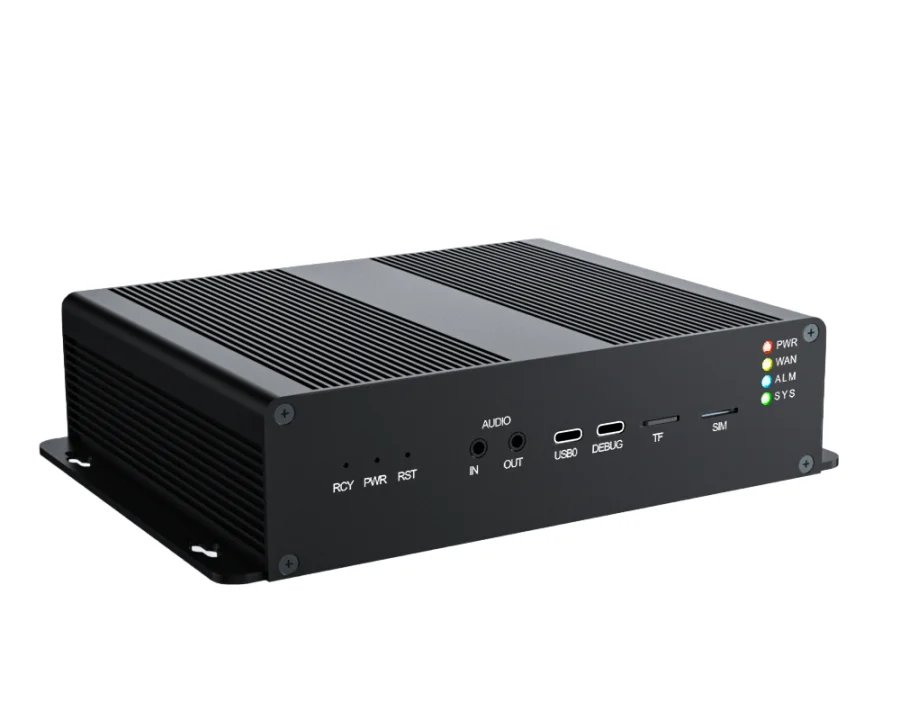

核心参数如下：

| 硬件       | 型号规格                                         |
| ---------- | ------------------------------------------------ |
| 处理器     | BM1688                                           |
| 处理器主控 | 8核 ARM A53 @1.6GHz                              |
| 内存       | LPDDR4 8G                                        |
| 存储器     | 64GB                                             |
| AI算力     | 16.0 TOPS                                        |
| 网口       | 10/100/1000Mbps自适应网口 * 2个                  |
| 接口       | USB3.0*2、 TypeC*1 、HDMI*1 、 TF*1 、 SIM*1 |

## 第一步：硬件连接

将设备接入您的局域网并通电。

1. 用网线连接设备的 **ETH 网口** 与您的路由器或交换机

<!-- 这是一张图片，ocr 内容为：HRU USE30 LAN MW 网口 -->

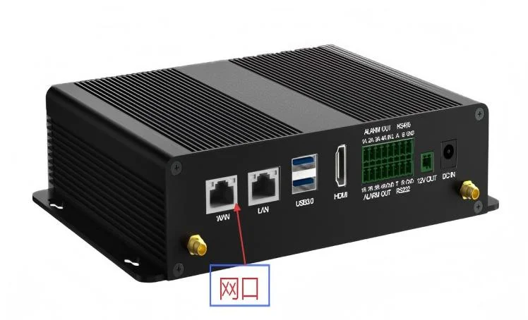

2. **接入电源适配器**

<!-- 这是一张图片，ocr 内容为：HCLID USEBIO LAN WW 电源接口 -->

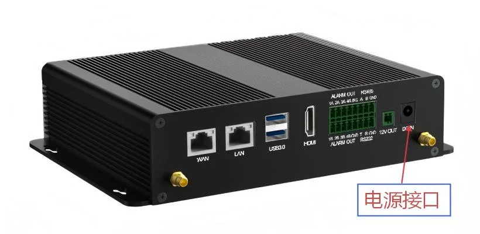

3. 等待约 **60 秒**，设备启动完成

**预期结果**：

+ 电源指示灯（PWR）：常亮（红色）

<!-- 这是一张图片，ocr 内容为：电源指示灯 PWR WAN ALM SYS XT -->

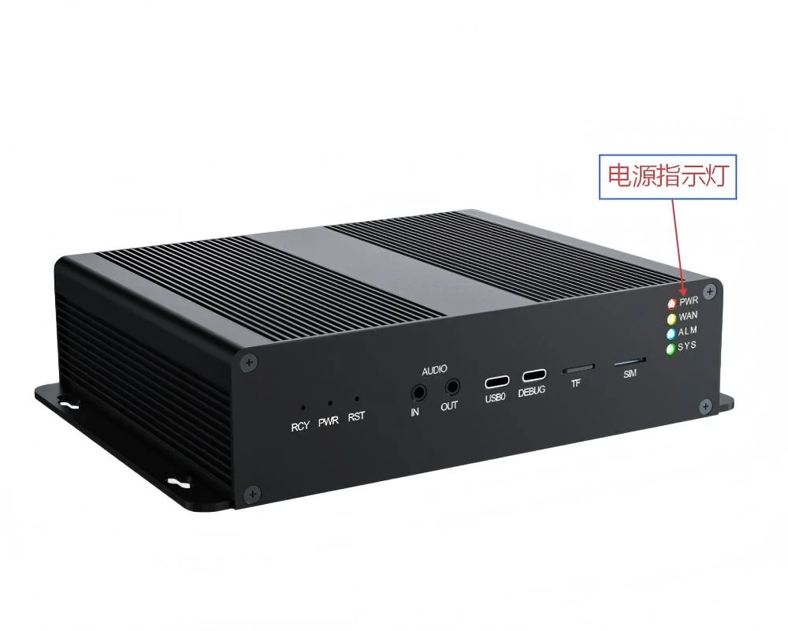

+ 网络指示灯（WAN）：闪烁（表示网络连接正常）

<!-- 这是一张图片，ocr 内容为：PWR 网络指示灯 WAN ALM SYS US80  DEBUG QUT -->

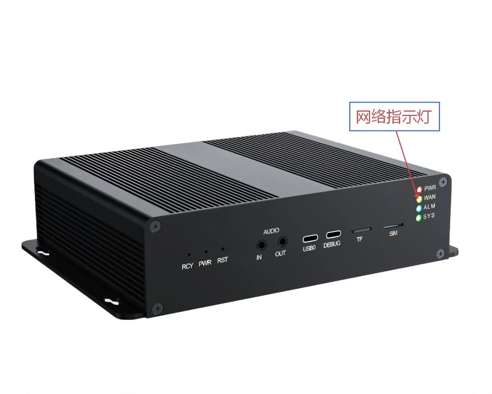

4. **CosmoEdge静态IP配置**
5. 电脑桌面点击 **开始 **-> **控制面板** ->**网络和Internet **->**网络和共享中心** ->**更改适配器设置** -> **网络连接** -> **以太网** 。（推荐刚开始设备和计算机直连）

<!-- 这是一张图片，ocr 内容为： -->

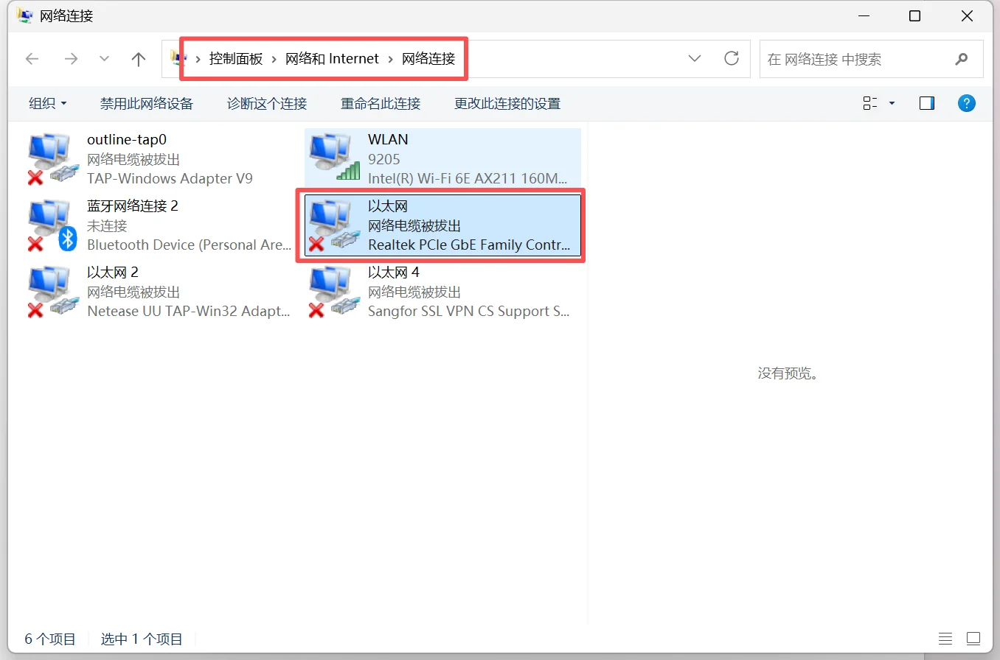

2. 双击打开以太网配置，找到**Internet 协议版本4（TCP/IPv4）**选项打开。

<!-- 这是一张图片，ocr 内容为： -->

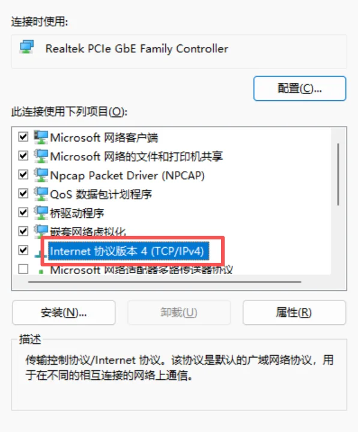

3. 将 IP 地址和子网掩码修改成与CosmoEdge同网段的 IP ，并点击确定。

<!-- 这是一张图片，ocr 内容为： -->

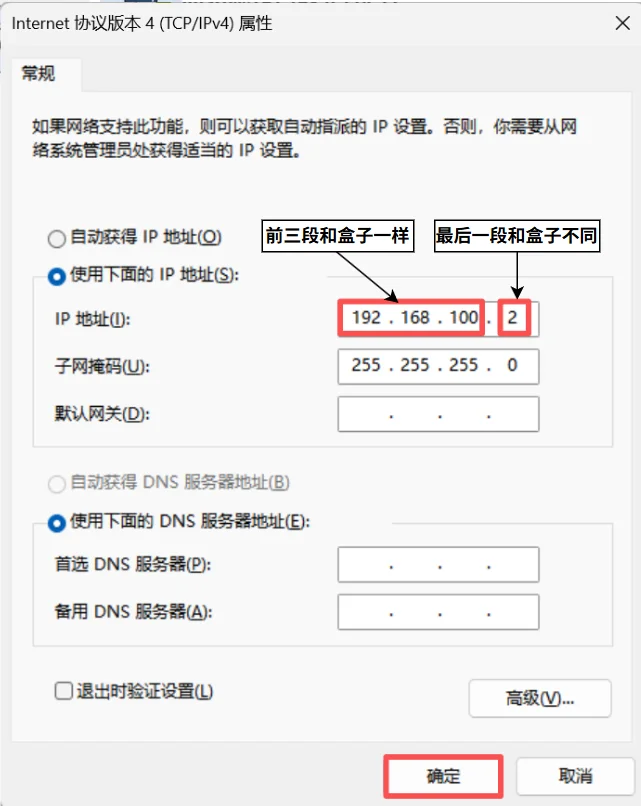

**💡 CosmoEdge默认的网址：WAN：192.168.100.1 **

## 第二步：访问管理平台并修改系统配置

打开浏览器，输入设备的 IP 地址。

1. 推荐使用 **Chrome** 或 **Edge** 浏览器
2. 在地址栏输入：`http://<设备IP地址>`（例如 `http://192.168.100.1`）

<!-- 这是一张图片，ocr 内容为： -->

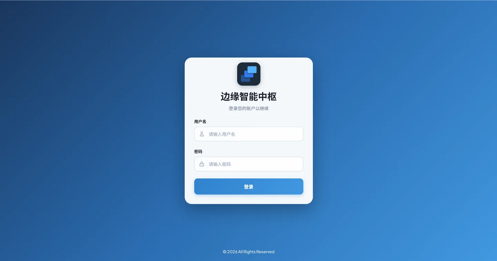

3. 使用默认账号登录：
   - 用户名：`admin`
   - 密码：`admin`（首次登录后建议修改）

<!-- 这是一张图片，ocr 内容为： -->

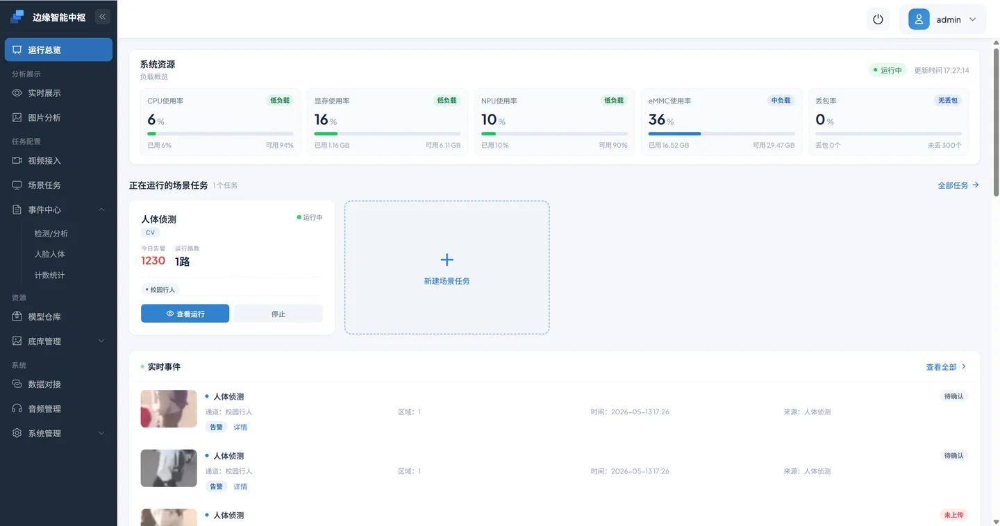

成功登录后，您将看到**系统首页（Dashboard）**，显示以下关键信息：

|    指标    |                   说明                   |
| :--------: | :--------------------------------------: |
| CPU 使用率 |                处理器负载                |
| 显存使用率 |          加载任务会占用系统显存          |
| NPU 使用率 |                 NPU负载                 |
| eMMC使用率 |              系统硬盘使用率              |
|   丢包率   | 大于百分之十可能导致系统异常，性能会下降 |

点击**系统管理**->**系统设置**->**时间设置**->**手动校时**->**与计算同步**。（因为和设备直连系统时间不能自动获取）

<!-- 这是一张图片，ocr 内容为： -->

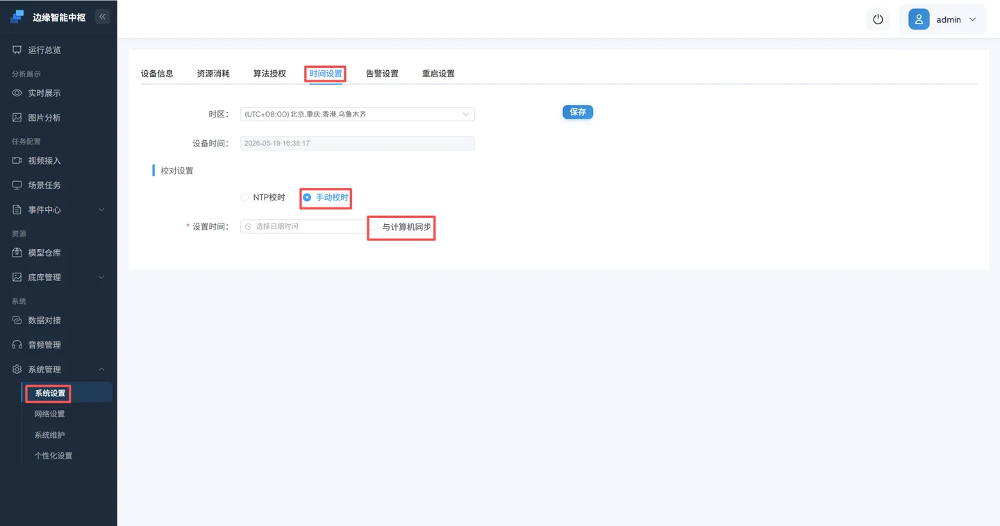

点击**系统管理**->**网络配置**，修改设备的ip地址，设置成和你局域网同一段的。（满足电脑可以访问平台的同时还可以连网）

<!-- 这是一张图片，ocr 内容为： -->

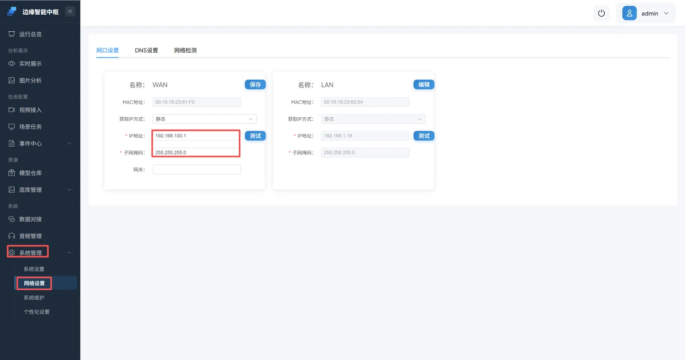

> **⚠️ 如果无法访问管理页面**
>
> + 确认设备与您的电脑在**同一网段**
> + 尝试直接用网线连接设备与电脑（跳过路由器）
> + 检查浏览器是否使用了代理，关闭代理后重试

## 第三步：查看实时 AI 检测效果

设备已预装多个演示场景，使用**演示视频素材**作为数据源，无需摄像头即可体验完整的 AI 检测效果。下面我们以人流量统计为例演示整体流程

1. **下载人流量统计演示视频素材**

下载视频素材链接

---

2. **上传人流量统计演示视频**

 在任务配置菜单点击**视频接入**，然后点击**添加**。

<!-- 这是一张图片，ocr 内容为： -->

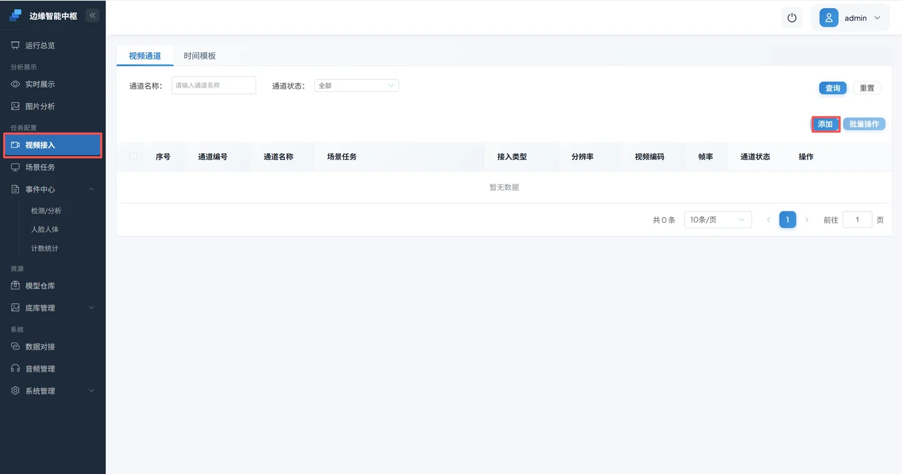

弹出添加通道页面

接入类型：离线视频

通道名称：自定义接入通道名称，如**1号教学楼东侧通道**。

上传视频：上传演示视频mp4文件，并保存。

<!-- 这是一张图片，ocr 内容为： -->

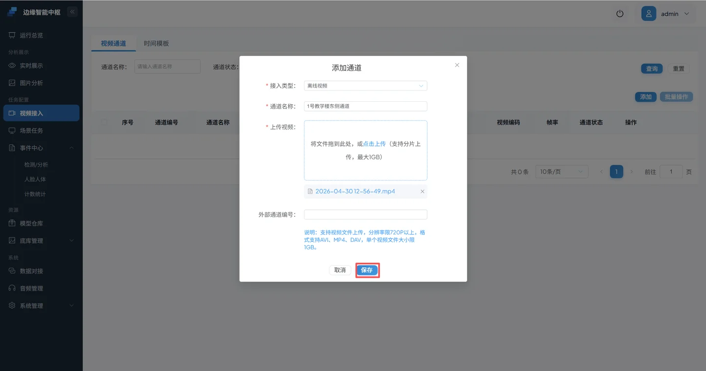

点击场景任务分配

<!-- 这是一张图片，ocr 内容为： -->

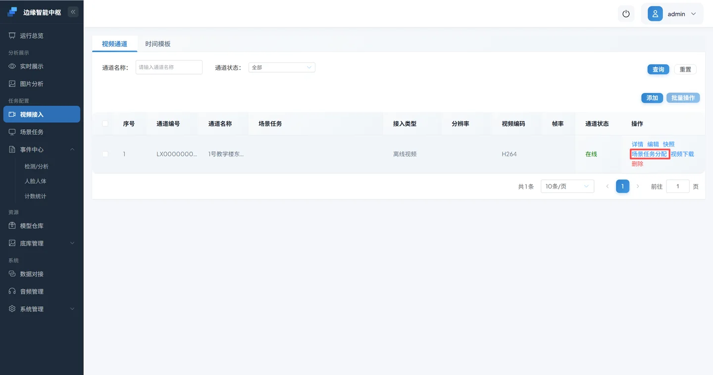

3. **通道分配算法**

给通道配置视频分析算法

<!-- 这是一张图片，ocr 内容为： -->

页面说明：

<!-- 这是一张图片，ocr 内容为： -->

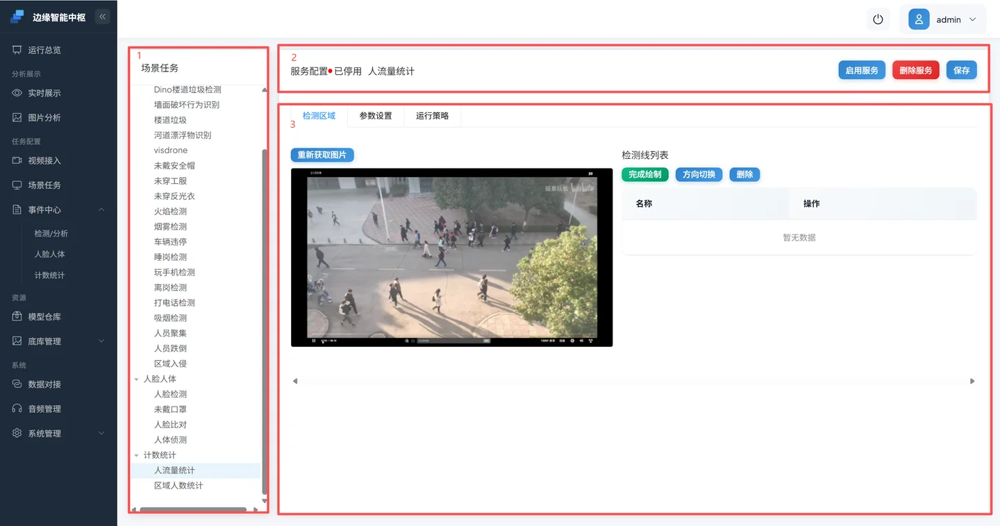

服务分配页面主要分为3个功能区：

+ 功能区1：平台配置的所有算法类型，包括检测/分析、人脸人体、计数统计。
+ 功能区2：在该通道上启停服务、删除服务等操作
+ 功能区3：通道的服务配置页面，包括检测区域配置、参数配置、运行策略配置等

在** 计数统计**中找到 **人流量统计，**点击选中该算法

<!-- 这是一张图片，ocr 内容为： -->

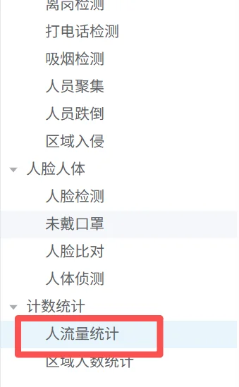

根据选中的算法会出现对应的配置参数。人流量统计算法主要逻辑是行人穿过检测线，相关参数包括：

+ 绘制：绘制一条检测线
+ 方向切换：单侧过线时切换过线判断方向
+ 删除：删除检测线

<!-- 这是一张图片，ocr 内容为： -->

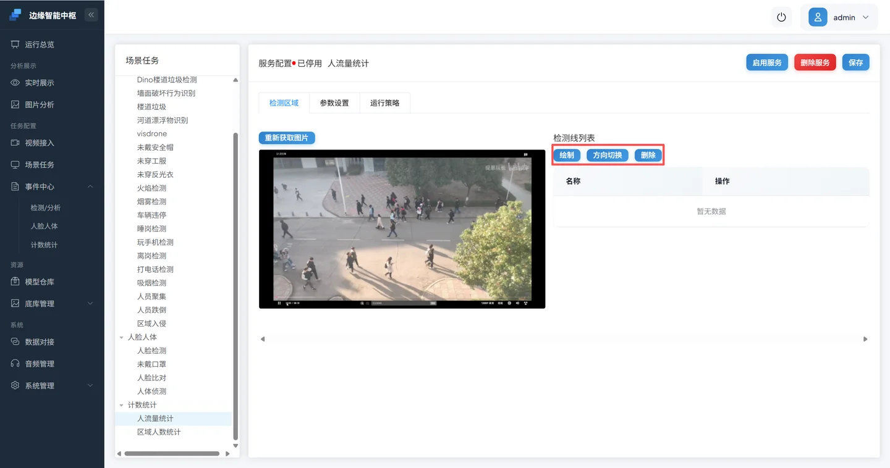

> **💡 配置参数**
>
> 配置参数由该算法编排时的策略所决定。

绘制检测线

点击 **绘制** 在视频中业务逻辑区域中绘制一条检测线

<!-- 这是一张图片，ocr 内容为： -->

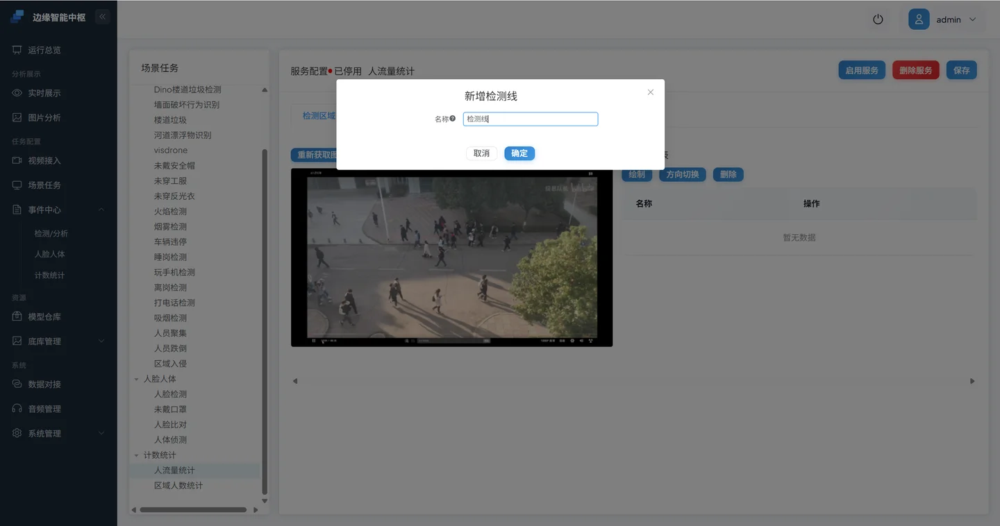

在页面点击一次确定检测线起点，再点击一次确定检测线终点。（该检测线表示能够统计沿着箭头方向的跨线的行人数量）

<!-- 这是一张图片，ocr 内容为： -->

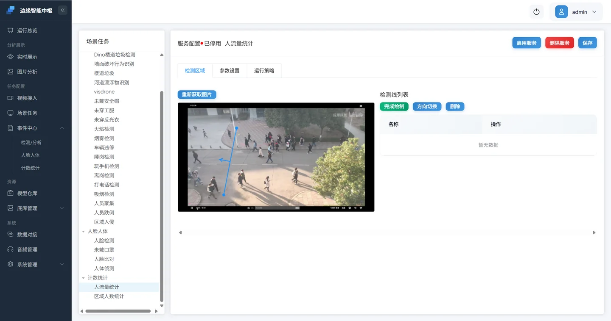

点击** 完成绘制** 保存绘制结果。此时检测线绘制完成。

<!-- 这是一张图片，ocr 内容为： -->

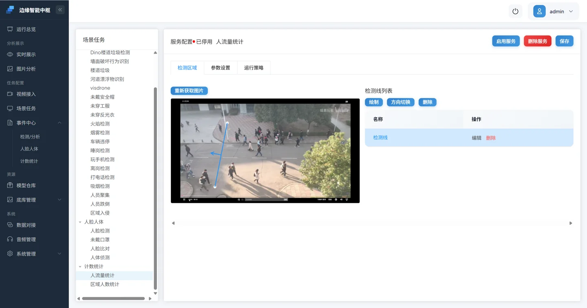

设置运行策略

将播放次数设置0表示循环播放

<!-- 这是一张图片，ocr 内容为： -->

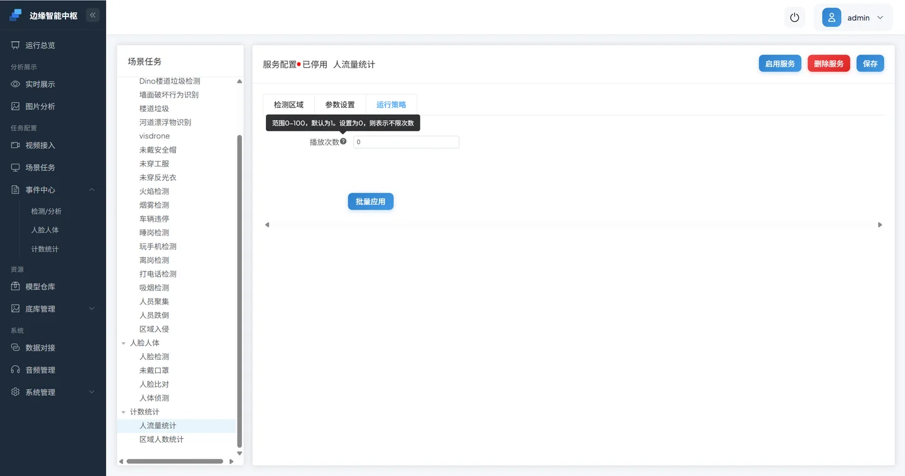

点击 **保存** 按钮，该通道分配人流量统计算法，保存的同时会启动算法服务开始视频分析。

<!-- 这是一张图片，ocr 内容为： -->

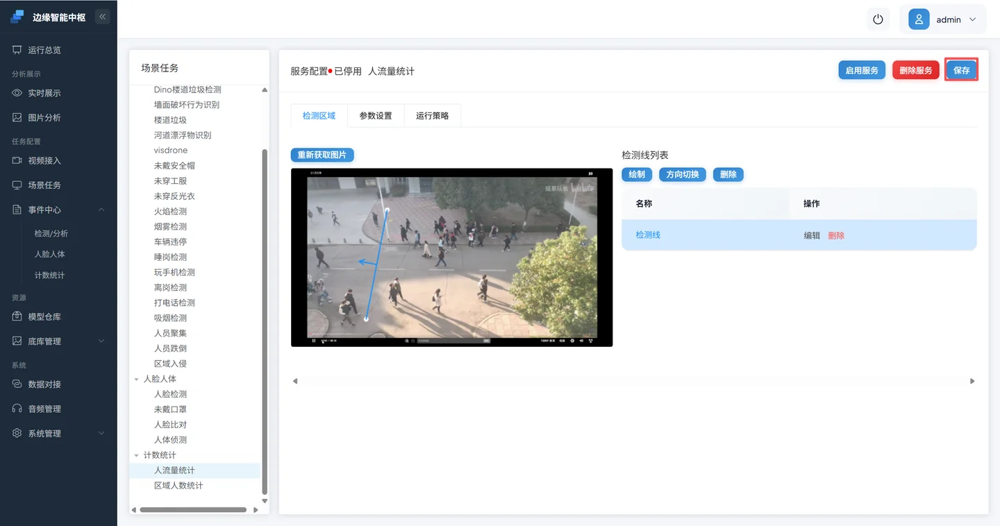

返回 **视频接入**  菜单，进行中开关开启表示该服务正在运行中

<!-- 这是一张图片，ocr 内容为： -->

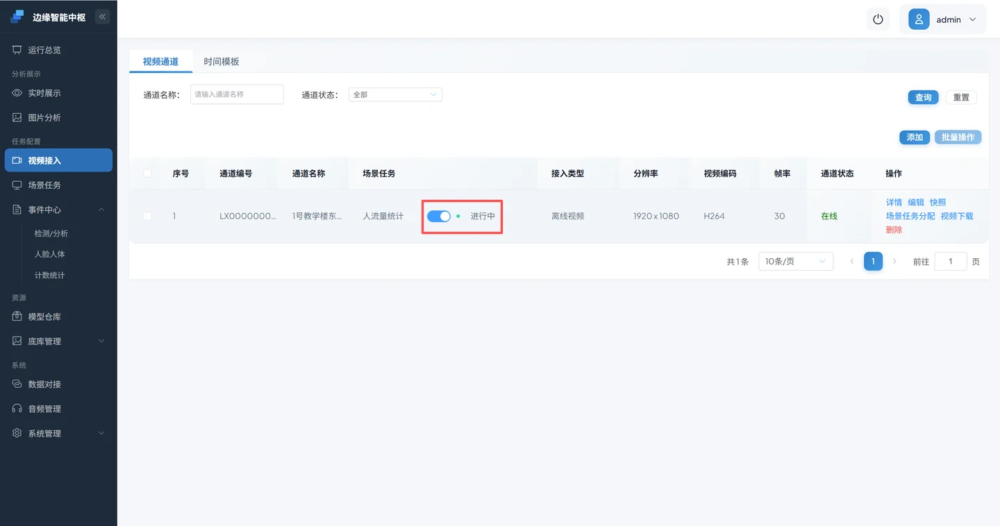

4. **算法可视化展示**

点击 **实时展示 **进入算法可视化展示页面

<!-- 这是一张图片，ocr 内容为： -->

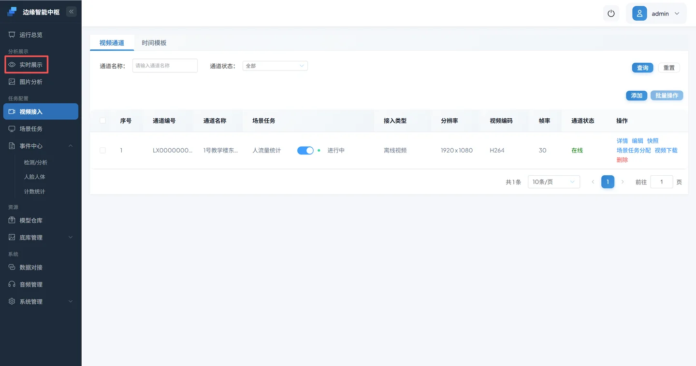

算法可视化页面主要分为三区域：

+ 左侧区域：系统所有服务通道
+ 中间区域：可视化算法展示区域，选择对应的通道可查看
+ 右侧区域：系统所有算法任务的实时滚动的最新告警记录

<!-- 这是一张图片，ocr 内容为： -->

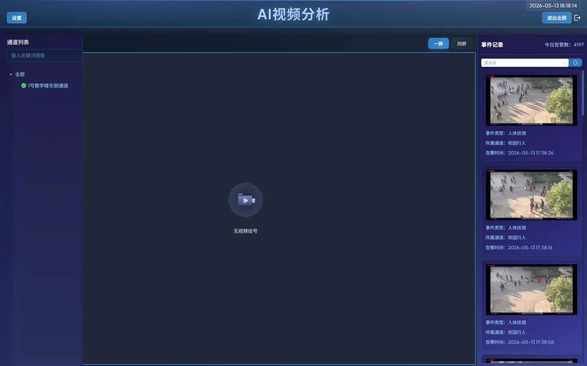

> **💡 画面布局**
> 页面右上角可切换 **单画面 / 四画面 **两种布局模式。

选择 **1号教学楼东侧** 通道, 播放该通道和算法的可视化视频流

<!-- 这是一张图片，ocr 内容为： -->

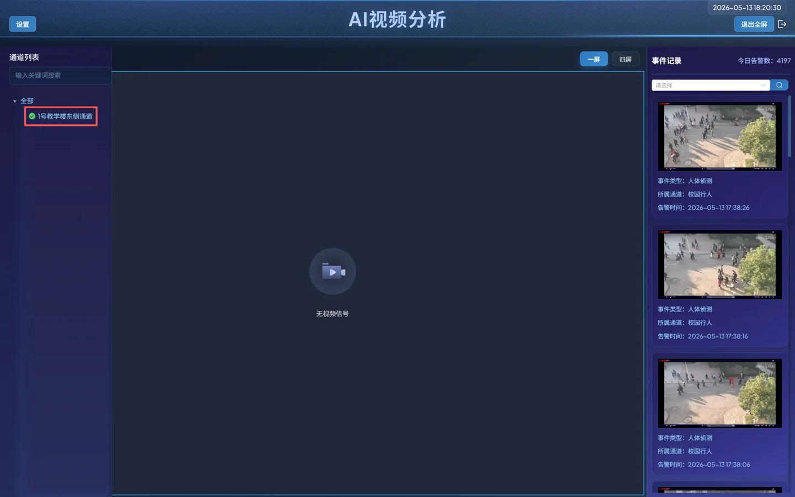

进入页面选择算法叠加 **人流量统计 **， 不同的算法有不同的叠加逻辑

<!-- 这是一张图片，ocr 内容为： -->

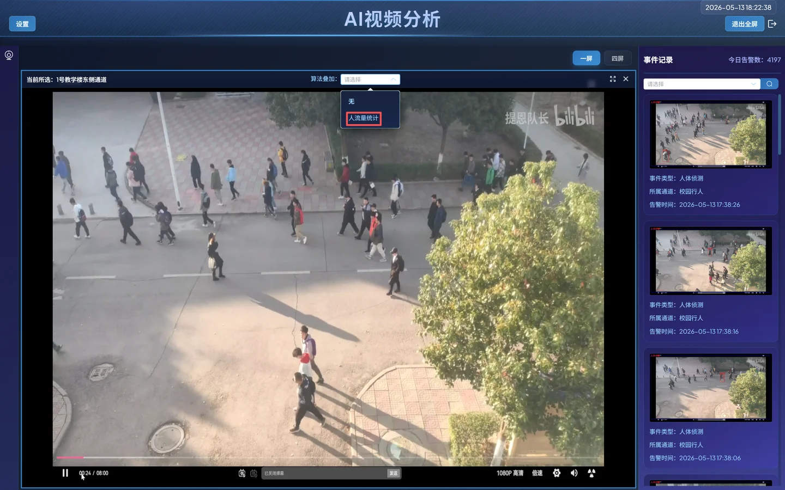

> **💡 叠加逻辑**
>
> 不同的算法策略决定了不同的叠加逻辑

叠加结果展示

<!-- 这是一张图片，ocr 内容为： -->

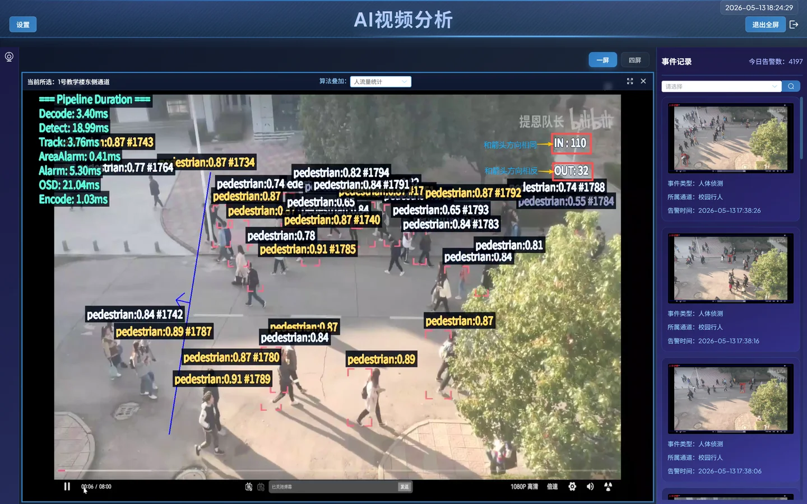

可视化内容包括：

1. 行人检测：行人检测的类别和置信度，如 Pedestrian:0.91
2. 行人追踪：行人目标追踪的身份ID，如 #1318
3. 算法运行耗时：左上角区域展示各个算法组件的耗时
4. 统计结果：右上角区域IN/OUT 展示人流量统计结果

**效果展示**

> 视频演示：待补充。

## 第四步：查看统计结果

AI 检测到的所有告警/统计事件都会自动记录，支持回溯查看。

1. 点击左侧导航栏 **「事件中心」** → **「计数统计」**

<!-- 这是一张图片，ocr 内容为： -->

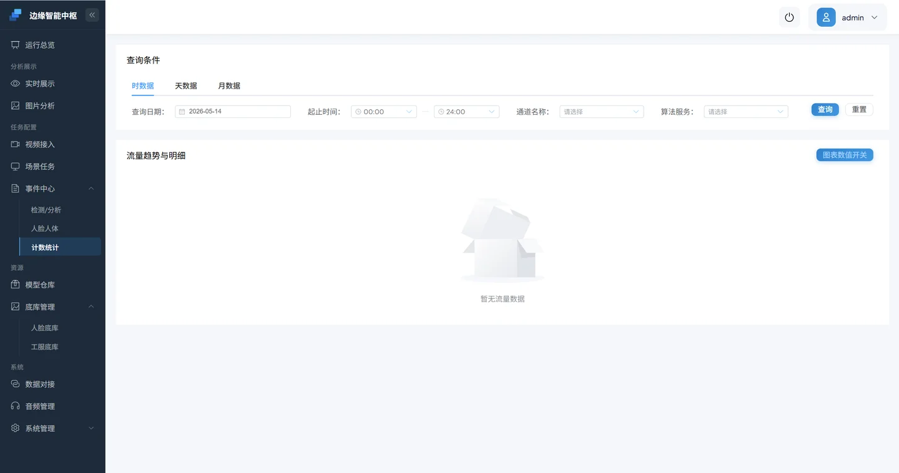

2. 选择 **查询事件->通道名称->算法服务->点击查询（重复点查询会刷新实时统计结果）**

<!-- 这是一张图片，ocr 内容为： -->

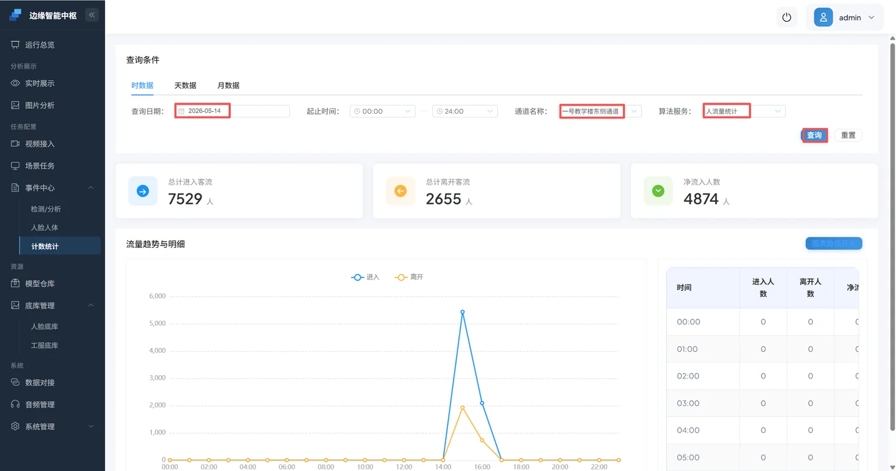

页面说明：离开客流=可视化展示OUT；净流入人数=可视化展示IN。

## 🎉 快速上手完成

到这里，您已经完成了：

- [X] 设备通电联网
- [X] 浏览器访问管理平台
- [X] 查看预装演示的 AI 实时检测效果
- [X] 查看历史告警记录

**下一步**：

| 目标                                      | 阅读                              |
| ----------------------------------------- | --------------------------------- |
| 配置您自己的 AI 检测场景                  | → 场景配置指南（第二册）         |
| 体验不用训练就能切换规则的 VLM 大模型功能 | → VLM 视觉状态判断指南（第三册） |
| 查询某个参数的含义或解决遇到的问题        | → 参考手册                       |

---
