# 卷二：场景配置

> **阅读时长**：30-45 分钟
> **目标**：学会用系统内置的 AI 算法，配置您自己的检测场景
> **前提**：已完成 快速上手指南（第一册），系统已正常运行
> **无需额外设备：本册全程使用内置演示视频**，无需摄像头

## 本册学习路径

我们将通过 **一个完整场景的手把手配置** + **一个扩展场景的自主练习**，帮您掌握场景配置的通用能力。

+ 第一章 → 安全帽检测（完整手把手，学会多模型 + 区域规则的基础套路）
+ 第二章 → 离岗检测（自主练习，学会多模型组合 + 时序判定的进阶套路）
+ 第三章 → 其他场景速查（18个场景任务和关键差异）

学完前两章后，您将具备为**任意内置算法**独立配置场景的能力。

## 第一章：安全帽检测场景

**背景**：工地高空作业多、上方物料掉落风险高，安全帽是一线工人最基础、最关键的个体防护装备。智能实时检测能第一时间发现未佩戴人员，从源头规避坠物撞击、磕碰、高空坠落导致的重伤、死亡安全事故，降低工地高危伤亡隐患。

**场景**：监控工地入口，检测未佩戴安全帽的人员并自动告警

**涉及功能**：视频接入 → 算法分配 → 绘制检测区域 → 参数调节 → 实时展示 → 告警记录

<!-- 这是一张图片，ocr 内容为：3.绘制检测区域 2.算法分配 4.参数调节 5.实时展示 6.告警记录 1.视频接入 -->


**完成最终效果展示：**

> 视频演示：待补充。

### 1.1 准备视频通道

1. 下载视频

项目提供了演示的视频，视频地址：xxx

2. **上传演示视频**

点击 **视频接入** 菜单 下 **视频接入，**进入视频接入页面

点击 **添加** 按钮弹出添加通道页面

接入类型：离线视频

通道名称：自定义接入通道名称，如工地北入口

上传视频：上传演示视频mp4文件

点击 **保存** 按钮，创建一个新的视频通道

<!-- 这是一张图片，ocr 内容为： -->

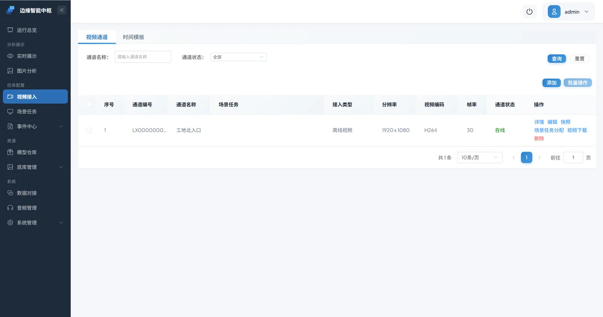

### 1.2 为通道分配算法

将 **安全帽检测** 算法绑定到视频通道，系统开始对该路视频进行 AI 分析。

1. 给视频通道分配算法

点击 **场景任务分配** 进入算法配置页面，给通道配置视频分析算法

<!-- 这是一张图片，ocr 内容为： -->


2. 选择 **未戴安全帽 **算法

在** 所有服务 **中找到 **未戴安全帽，**点击选中该算法

<!-- 这是一张图片，ocr 内容为： -->

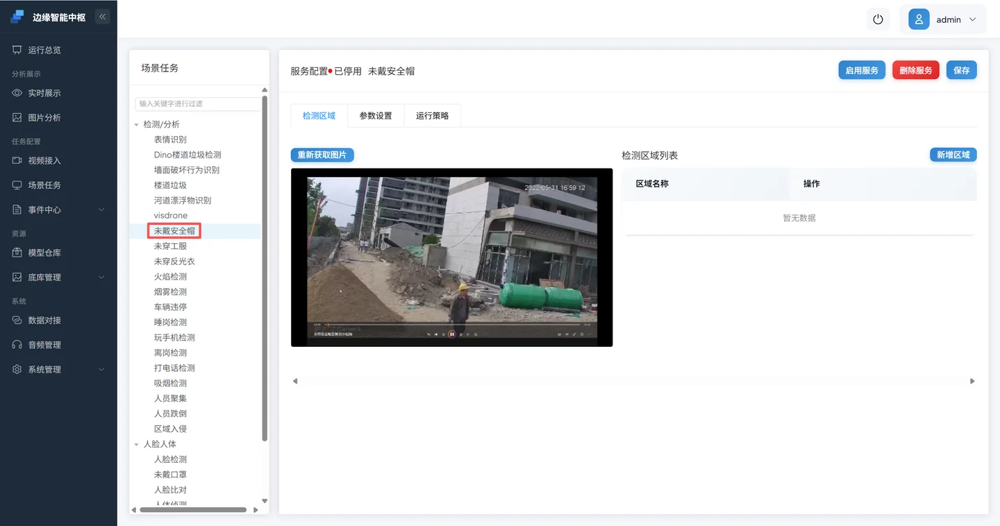

:::info
**补充说明**

:::

未戴安全帽的算法业务逻辑可以在 **任务配置 **下的** 场景任务 **页面中找到

<!-- 这是一张图片，ocr 内容为： -->

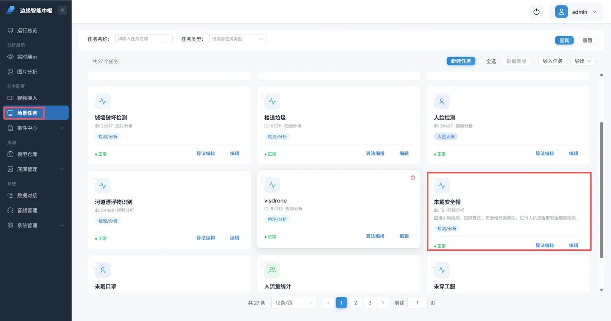

点击 **算法编排 **查看具体的编排业务逻辑

<!-- 这是一张图片，ocr 内容为： -->

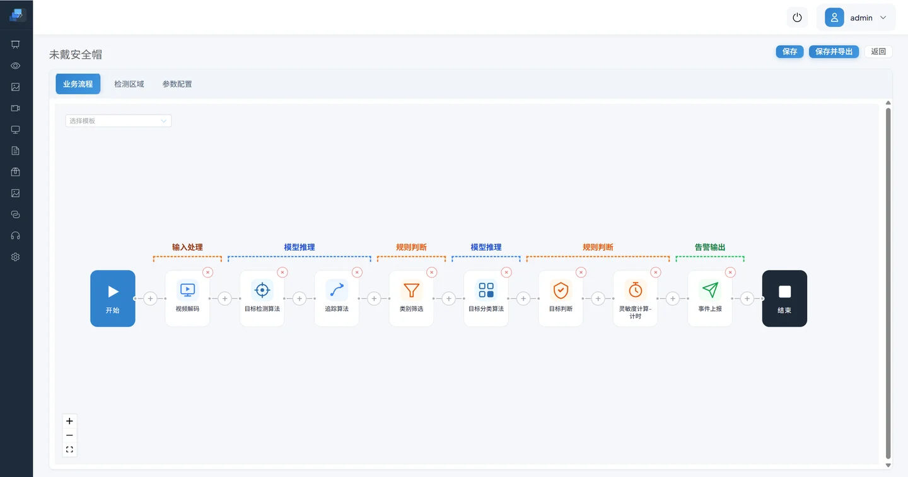

业务逻辑大致的流程是：

1. 视频解码：对接入的视频流解码
2. 目标检测：使用行人检测算法获取行人的定位信息
3. 追踪算法：追踪行人让一个人在视频的前后帧中保持身份不变
4. 类别筛选：筛选行人的其他类别（如果检测算法存在多种类别）
5. 目标分类算法：使用未戴安全帽分类算法对检测到行人进行安全帽分类
6. 灵敏度计算：告警容错，避免一次检测即告警而是多次检测根据命中率来告警
7. 事件上报：告警事件上报

不同的业务有不同的特点，有些注重准确性，误报尽可能少；有些注重实时性，告警尽可能迅速。针对不同的业务特性，通过配置业务逻辑中的相关参数，在不用修改代码的前提下就可以实现灵活的逻辑调整。这也是本项目的特点之一。

### 1.3 配置检测区域

默认情况下，算法会分析**整个画面**。通过配置检测区域（ROI），您可以让算法**只关注特定位置**，减少无关区域的干扰。

1. 新增检测区域

点击 **新增区域 **创建一个监测区域

<!-- 这是一张图片，ocr 内容为： -->

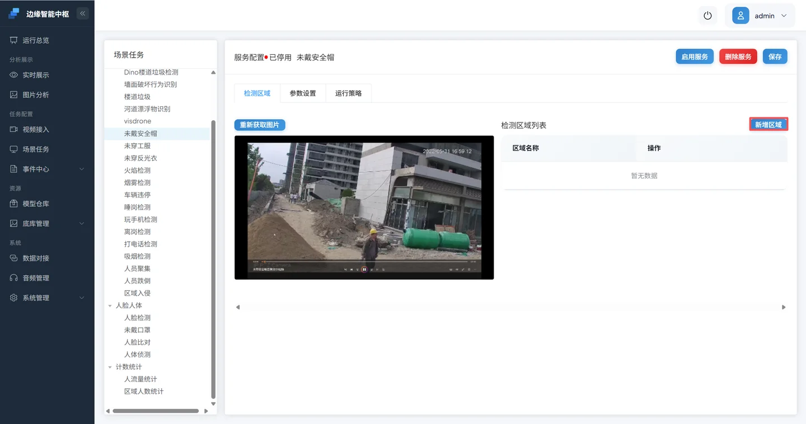

设置区域的名称

<!-- 这是一张图片，ocr 内容为： -->

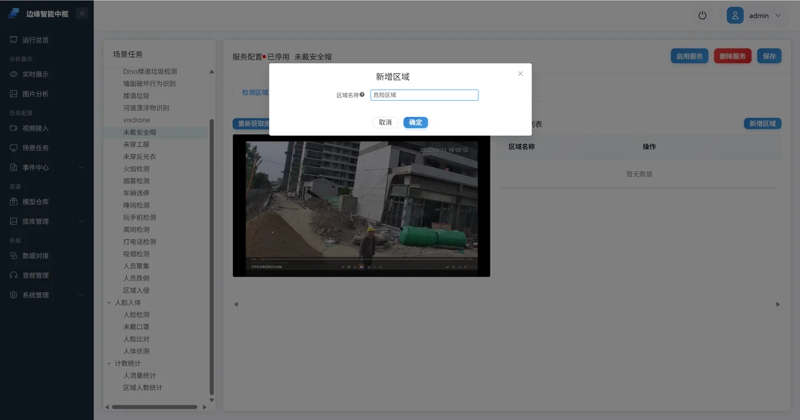

监控画面范围内会出现一个可调节的6边形检测区域

<!-- 这是一张图片，ocr 内容为： -->

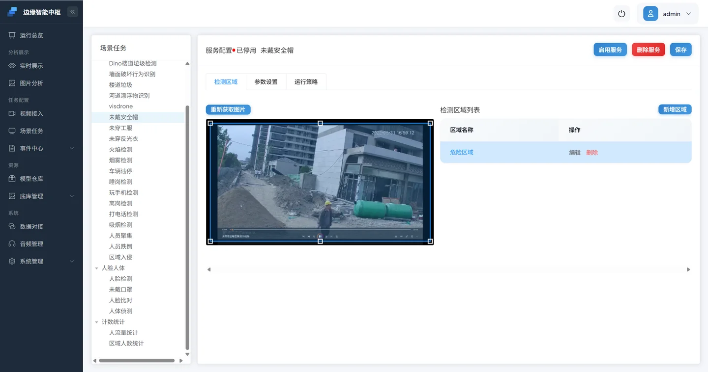

2. 调整区域位置

调整区域到合适的位置，拖拽区域中的矩形实现灵活的排列

<!-- 这是一张图片，ocr 内容为： -->

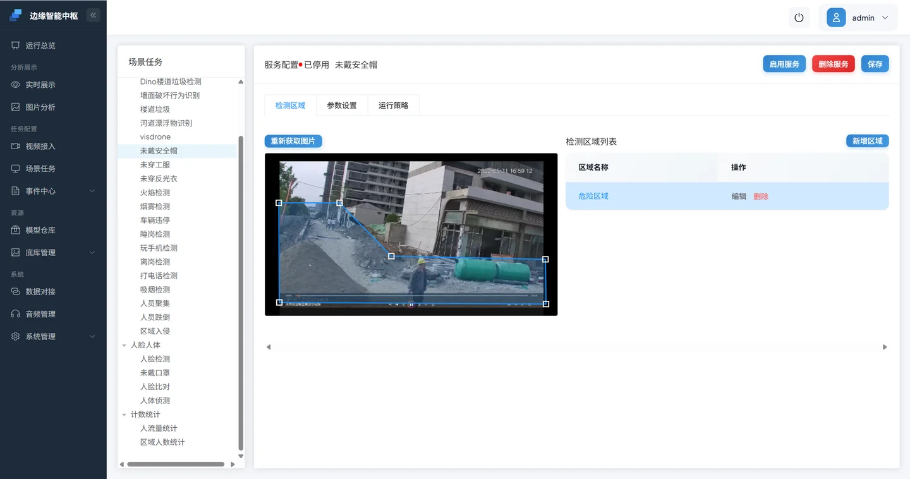

---

> **💡 检测区域使用建议**
>
> + **最多支持 4 个独立区域**
> + **区域不要画太小，确保目标人员在区域内有足够的像素面积  **
> + **如果场景中有固定的干扰物（如安全帽海报），用区域把它排除在外**

只有**区域内**的人员会进行未戴安全帽检测，区域外的人员不再被检测，让告警数量明显减少，算力消耗同时也减少。

### 1.4 调节关键参数

进入算法的参数配置，根据实际场景调节检测行为。

1. 切换到 **参数配置** Tab 页

<!-- 这是一张图片，ocr 内容为： -->

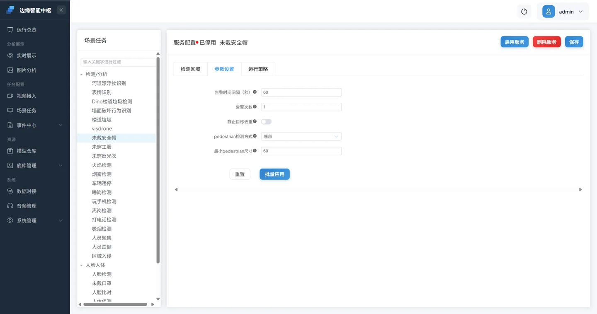

以下是最常调节的参数：

| 参数                   | 解释                                 | 作用                                     | 默认值 | 调节建议                                                            |
| ---------------------- | ------------------------------------ | ---------------------------------------- | :----: | ------------------------------------------------------------------- |
| **告警时间间隔** | 连续两次告警之间的最短间隔，单位：秒 | 同一目标持续违规时，间隔多长时间告警一次 | 60 秒 | 演示时设小（如 10 秒）看效果，生产环境设大（60-120 秒）避免告警轰炸 |
| **告警次数**     | 同一种告警类型的允许最大告警次数     | 精确控制告警次数                         |   1   |                                                                     |
| **静止目标去重** | 是否过滤长时间静止不动的目标``       | 避免对固定物体反复告警                   |  关闭  | 如果有固定干扰物（如海报中的人），开启                              |
| **行人检测方式** | 代表行人检测在检测区域中的位置       | 定义行人检测框进入区域的位置，可灵活选择 |        |                                                                     |

2. 运行策略设置

<!-- 这是一张图片，ocr 内容为： -->

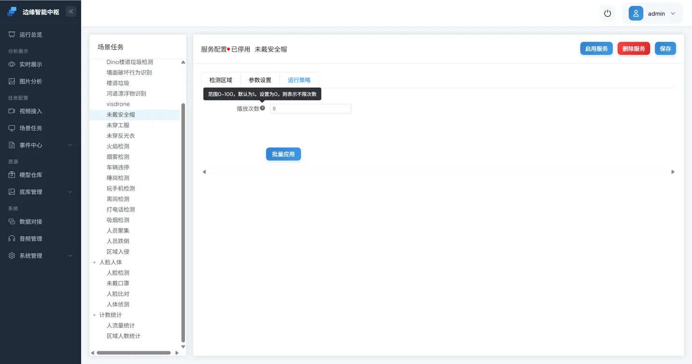

3. 保存

<!-- 这是一张图片，ocr 内容为： -->

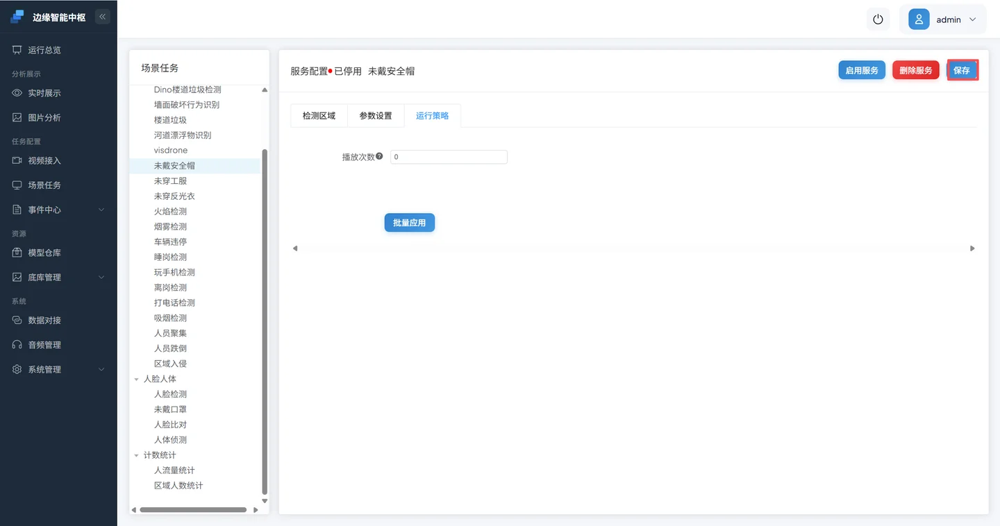

参数设置的内容包括：

1. 告警次数设置为0，表示可以报警无数次
2. 静止目标去重设置为开启，表示静止的目标不会重复告警
3. 灵敏度设置为3，表示10次检测中3次命中未戴安全帽才会产生告警
4. 最小pedestrain尺寸设置为60，表示行人小于60*60的尺寸丢弃，不做未戴安全帽告警

> **参数验证方法**：
>
> + **将告警时间间隔从 60 秒改为 10 秒**
> + **回到「实时展示」，观察同一个未戴安全帽的人员是否每 10 秒触发一次告警**
> + **确认后改回生产环境的推荐值**

保存的同时会启动服务。

<!-- 这是一张图片，ocr 内容为： -->

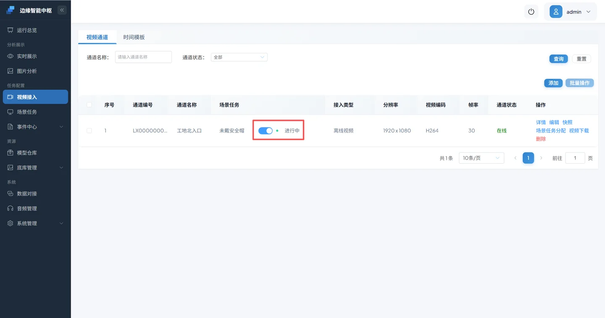

### 1.5 算法可视化

通过实时的算法可视化，让整个业务流程更清晰的呈现

1. 点击 **实时展示，**进入可视化页面

<!-- 这是一张图片，ocr 内容为： -->

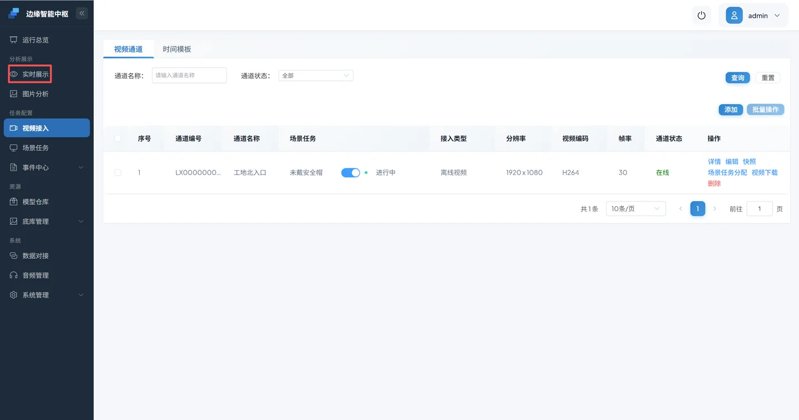

点击 **通道选择 **选择配置的按钮

<!-- 这是一张图片，ocr 内容为： -->

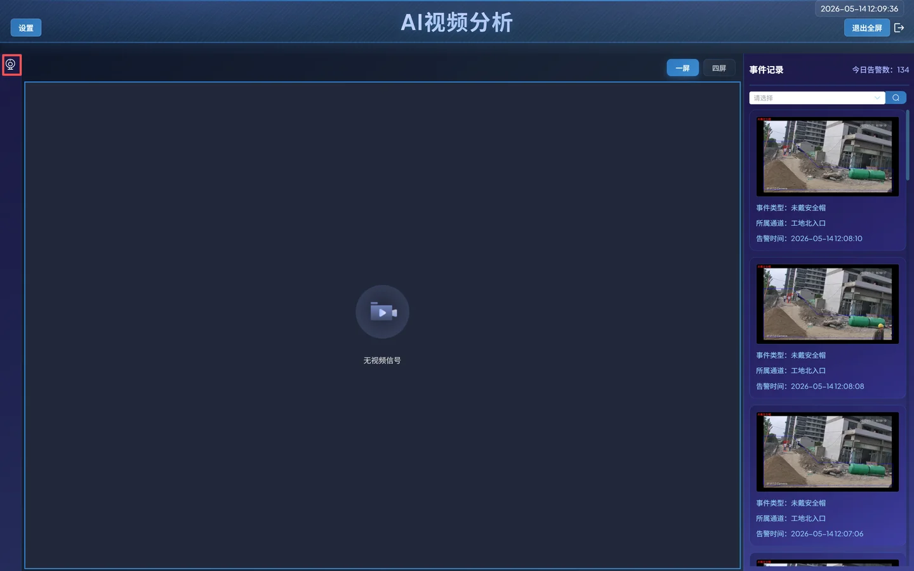

<!-- 这是一张图片，ocr 内容为： -->

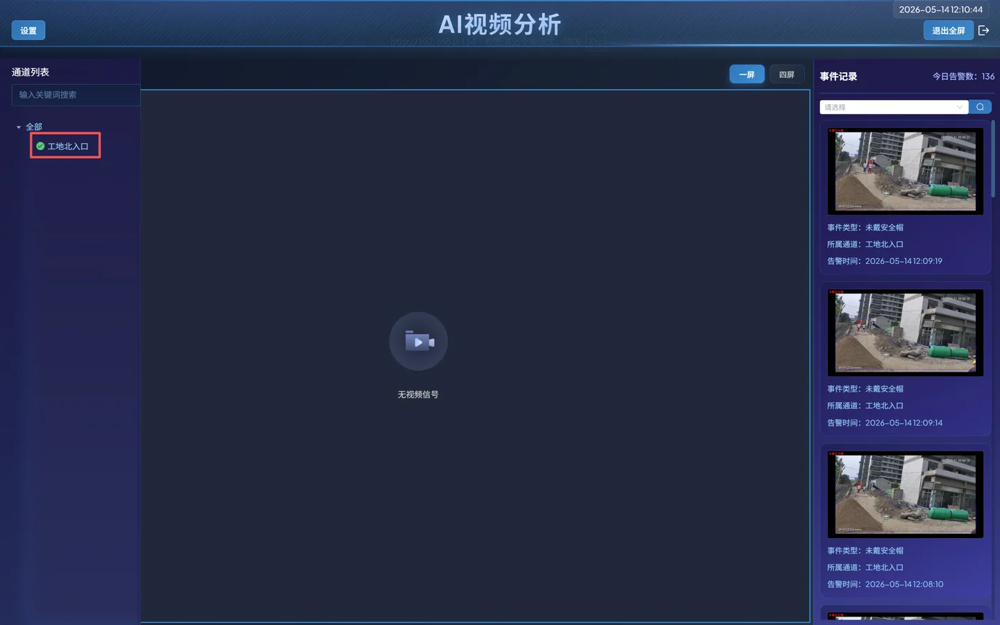

默认没有算法叠加，可以手动开启不同算法的可视化叠加

<!-- 这是一张图片，ocr 内容为： -->

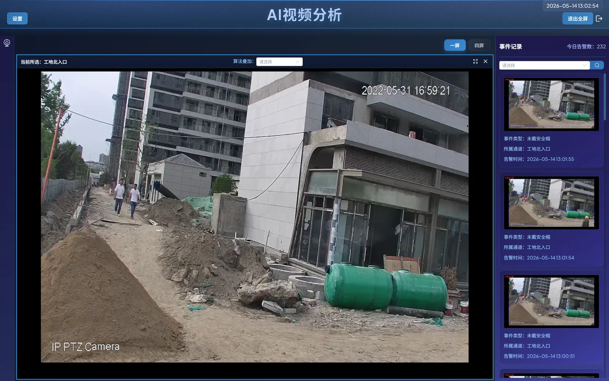

选择 **未戴安全帽** 算法

<!-- 这是一张图片，ocr 内容为： -->

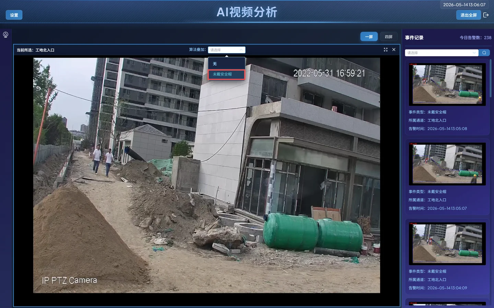

查看算法可视化

<!-- 这是一张图片，ocr 内容为： -->


可视化信息包括：

1. 目标预测框：检测算法的预测框可视化
2. 检测范围：可视化检测范围
3. 左上角编排流程耗时统计：统计在编排组件的各个阶段的耗时统计，用于性能展示
4. 右上角告警信息：告警信息会出现在右上角

未戴安全帽进入

<!-- 这是一张图片，ocr 内容为： -->

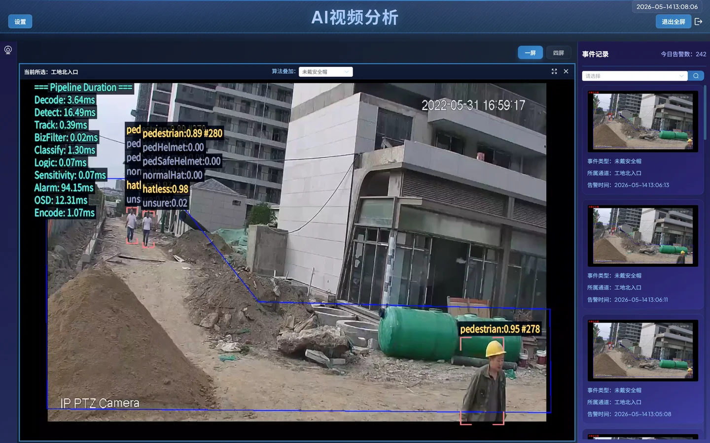

进入检测区域时才会进行分类算法的推理，对检测到每一个行人进行安全帽分类，并叠加类别置信度，可视化结果包括：

1. pedHelmet：头盔
2. pedSafeHelmet: 安全帽
3. normalHat: 普通帽
4. hatless: 无帽
5. unsure: 不确定

可以看到 hatless 的置信度为1.0 同时右上角有 ALARM ID 178 的告警信息

告警弹窗弹出

<!-- 这是一张图片，ocr 内容为： -->

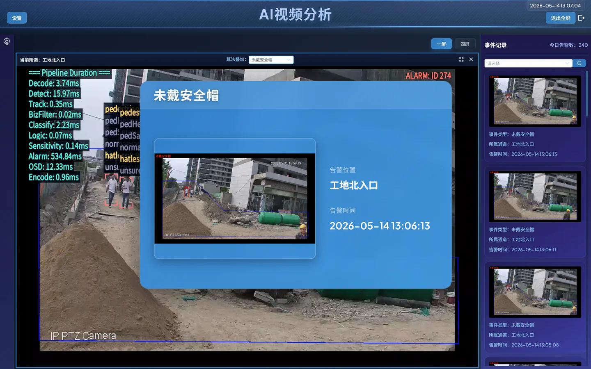

此弹窗可根据自己的需求，点击左上角的设置控制开关

<!-- 这是一张图片，ocr 内容为： -->

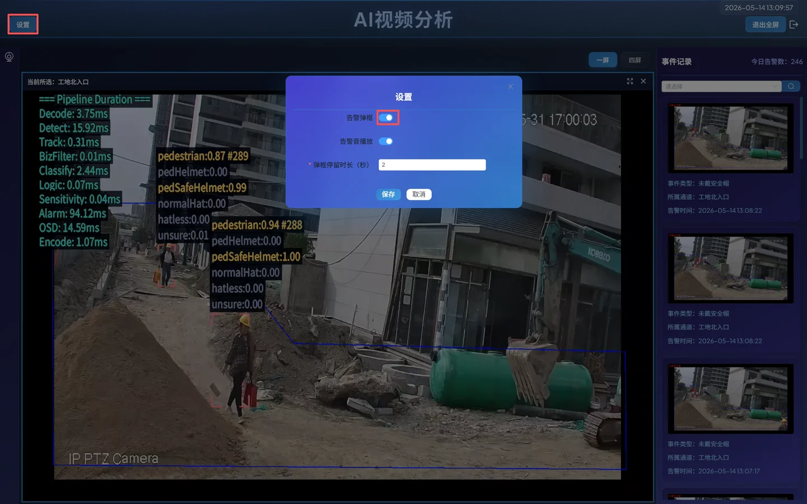

戴安全帽进入

<!-- 这是一张图片，ocr 内容为： -->

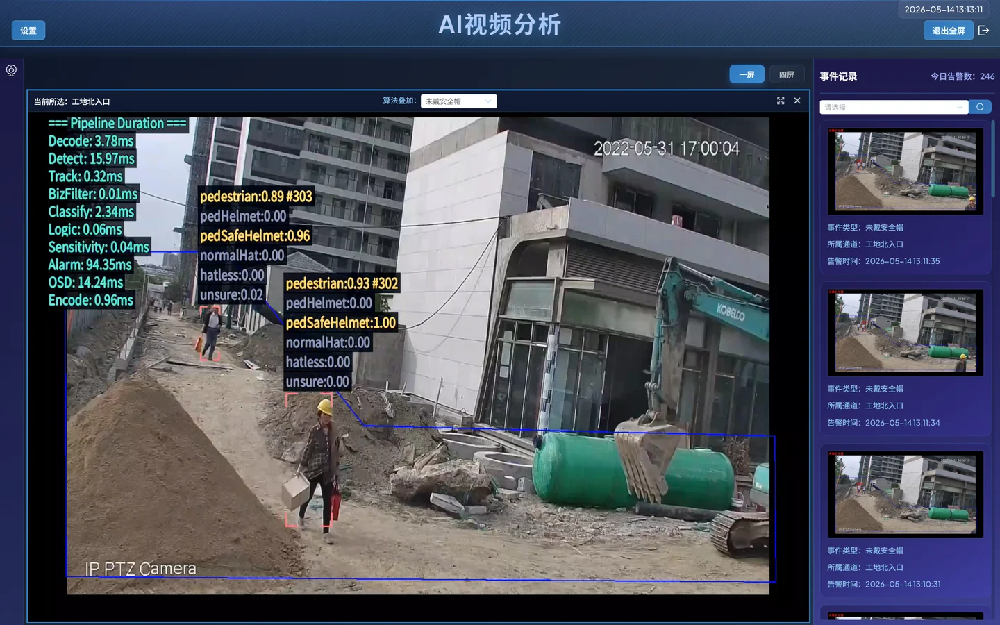

戴安全帽进入时 pedSafeHelment 的置信度高于设定阈值，不会产生告警信息。

### 1.6 查看与导出告警

告警信息不仅可以实时展示，更重要的是作为告警事件记录下来。

1. 点击 **事间中心** → **检测/分析**

进入告警记录页面，查看所有产生的告警记录

<!-- 这是一张图片，ocr 内容为： -->

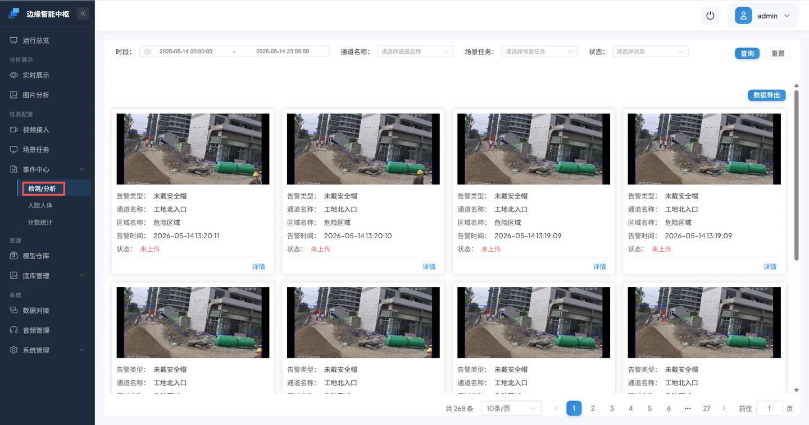

2. 使用筛选条件定位目标告警：
   - **通道名称**：选择刚配置的通道
   - **告警类型**：选择"未戴安全帽"
   - **时间范围**：选择今天
   - **状态**：未上传

<!-- 这是一张图片，ocr 内容为： -->

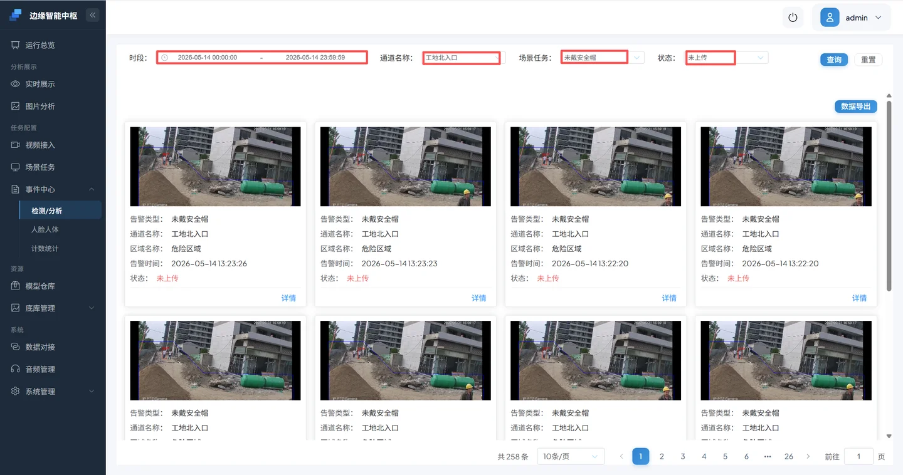

3. 点击某条告警的**抓拍图片**，可查看触发告警时的完整画面

<!-- 这是一张图片，ocr 内容为： -->

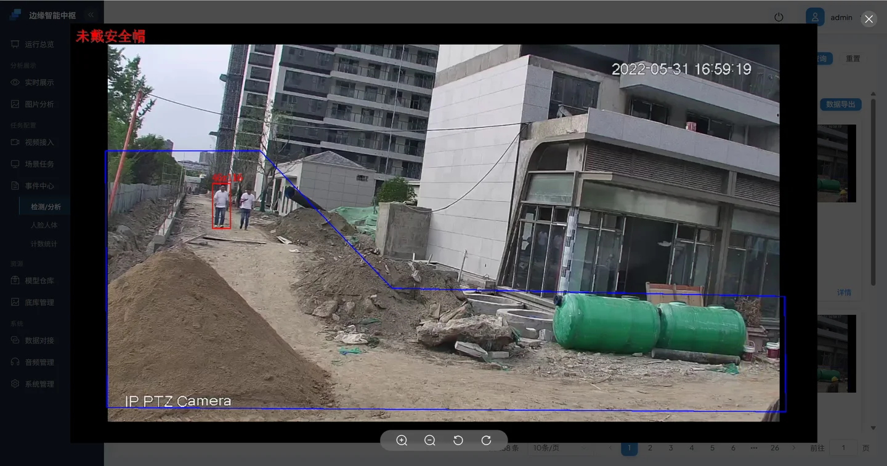

4. 需要导出数据时，点击右上角 **「数据导出」** 按钮

<!-- 这是一张图片，ocr 内容为： -->

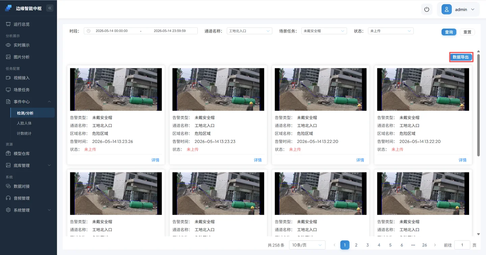

导出的csv文件

<!-- 这是一张图片，ocr 内容为： -->

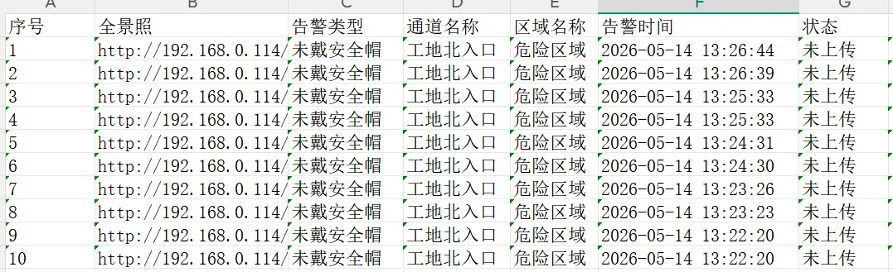

**到这里，一个完整的安全帽检测场景就配置完成了。** 完整操作回顾：

```plain
视频接入（准备视频源）
    ↓
服务分配（绑定"安全帽检测"算法）
    ↓
绘制检测区域（框选关注位置）
    ↓
参数调节（告警间隔/灵敏度）
    ↓
实时展示（验证检测效果）
    ↓
事件查询（查看历史告警）
```

## 第二章：离岗检测场景（自主练习）

> **背景：传统管理人员巡检无法全天候盯守各个岗位，存在巡查空档、监管滞后问题。AI 离岗监测不间断识别在岗状态，实时预警空岗、脱岗行为，做到隐患早发现、早提醒。**
>
> **场景**：监控值班岗位，当人员离开指定区域超过设定时间后自动告警
> **与安全帽的区别**：不只是"检测到了就告警"，而是"持续离开一段时间才告警"——涉及**时序判定逻辑**

本章不再逐步截图。请参照第一章的操作流程，自主完成以下配置：

### 2.1 配置流程

按照第一章相同的路径操作：

1. **准备视频通道** — 下载演示视频
2. **分配算法** — 选择 **「离岗检测」** 算法
3. **配置检测区域** — 框选需要有人值守的区域（如前台、值班室）

> **💡 与安全帽场景的关键差异**检测区域的含义变了：
>
> + 安全帽场景：区域 = **只在这里检测安全帽**
> + 离岗场景：区域 = **这里必须有人**，人不在就告警

### 2.2 关键参数差异

离岗检测的核心参数和安全帽不同，以下是本场景的调节重点：

| 参数                                                                           | 含义                   |  推荐值  | 说明                                         |
| ------------------------------------------------------------------------------ | ---------------------- | :-------: | -------------------------------------------- |
| **[待填写：离岗时间阈值参数名]**（人员离开区域多久后触发告警，单位：秒） | 避免人员短暂离开就误报 | 60-180 秒 | 根据岗位性质调整，严格岗位设短，灵活岗位设长 |
| **告警时间间隔**                                                         | 同安全帽场景           |  300 秒  | 离岗是持续状态，不需要频繁重复告警           |
| **[待填写：人数阈值参数名]**                                             | 区域内最少需要几个人   |     1     | 多人值班岗位可设为 2                         |

> **⚠️ 如果参数名称与上表不完全一致**
> 当前系统部分参数使用了技术名称，请根据参数的数值类型和位置对照理解。
> 我们将在后续版本中统一优化所有参数的显示名称。

### 2.3 验证方法

配置完成后，进行以下验证：

- [ ] 有人在岗位区域内时：**无告警**
- [ ] 人员走出区域，**等待设定的时间后**：触发离岗告警
- [ ] 人员回到区域：告警停止，事件记录中状态更新
- [ ] 进入 **「事件查询」** 查看离岗告警记录

**如果以上验证全部通过，恭喜！您已经掌握了两种不同的场景任务配置套路。**

## 第三章：其他场景速查

以下是系统内置的全部 18 个AI 算法的场景任务。它们的配置流程**与前两章完全相同**（视频接入 → 服务分配 → 检测区域 → 参数调节），差异仅在于**适用场景和关键参数**。

### 工地安全类

| 算法名称   | 检测目标     | 告警条件           | 关键参数           |
| ---------- | ------------ | ------------------ | ------------------ |
| 未戴安全帽 | 人员头部     | 检测到未佩戴安全帽 | 告警间隔、告警次数 |
| 未穿反光衣 | 人员上身     | 检测到未穿反光衣   | 同上               |
| 未穿工服   | 人员上身     | 检测到未穿工服     | 同上               |
| 区域入侵   | 人员         | 人员进入禁止区域   | 区域配置（必须）   |

### 智慧办公类

| 算法名称   | 检测目标   | 告警条件                 | 关键参数           |
| ---------- | ---------- | ------------------------ | ------------------ |
| 睡岗检测   | 人员姿态   | 检测到趴桌/低头睡觉      | 持续时间阈值       |
| 离岗检测   | 人员存在性 | 指定区域无人超过设定时间 | 离岗时间、人数阈值 |
| 玩手机检测 | 手部动作   | 检测到使用手机           | 告警间隔           |
| 打电话检测 | 手部动作   | 检测到接打电话           | 告警间隔           |
| 吸烟检测   | 人员/烟火  | 检测到吸烟行为           | 灵敏度、告警间隔   |

### 消防安全类

| 算法名称 | 检测目标 | 告警条件       | 关键参数 |
| -------- | -------- | -------------- | -------- |
| 烟雾检测 | 烟雾     | 检测到异常烟雾 | 灵敏度   |
| 火焰检测 | 明火     | 检测到火焰     | 灵敏度   |

### 社区/园区安防类

| 算法名称     | 检测目标     | 告警条件                | 关键参数             |
| ------------ | ------------ | ----------------------- | -------------------- |
| 人员跌倒     | 人员姿态     | 检测到跌倒动作          | 持续时间（排除蹲下） |
| 人员聚集     | 区域人员密度 | 区域内人数超过阈值      | 人数阈值、持续时间   |
| 车辆违停     | 车辆         | 车辆在禁停区域停留超时  | 区域配置、停留时间   |
| 绊线检测     | 人员/车辆    | 跨越设定的绊线          | 绊线配置、方向       |
| 区域人数统计 | 区域内人数   | 区域人数统计/超阈值告警 | 区域配置、人数阈值   |

### 客流统计类

| 算法名称   | 检测目标 | 输出         | 关键参数       |
| ---------- | -------- | ------------ | -------------- |
| 人流量统计 | 人员     | 进出人数统计 | 越线位置、方向 |

### 人脸识别类

| 算法名称 | 检测目标 | 输出         | 关键参数             |
| -------- | -------- | ------------ | -------------------- |
| 人脸识别 | 人脸     | 身份比对结果 | 底库配置、相似度阈值 |

> **💡 选择算法的建议**
>
> + 不需要一次配置所有算法，**先用 1-2 个与您业务最相关的场景跑通全流程**
> + 每条算法的具体参数说明见 参考手册 - 参数说明
> + 如果以上 18 条算法都不能覆盖您的场景，请查看 VLM 视觉状态判断指南（第三册） —— VLM 可以通过写一句话定义新的检测规则，无需训练模型

---

### 下一步

| 目标                                        | 阅读                              |
| ------------------------------------------- | --------------------------------- |
| 使用 VLM 大模型，用一句话定义全新的检测规则 | → VLM 视觉状态判断指南（第三册） |
| 查询参数含义或解决问题                      | → 参考手册                       |
