---
title: "卷三：VLM / DINO 指南"
description: 理解 VLM 和 DINO 两种大模型工具的能力与边界，学会用"写一句话"定义全新的检测规则。
prev:
  text: "卷二：场景配置"
  link: /tutorials/02-scenario-config/scenario-config
next:
  text: "卷四：Pipeline 编排"
  link: /tutorials/04-pipeline-orchestration/pipeline-orchestration
---
# 卷三：VLM / DINO 指南

> **阅读时长**：30-40 分钟
> **目标**：理解 VLM 和 DINO 两种大模型工具的能力与边界，学会用"写一句话"的方式定义全新的检测规则
> **前提**：已完成 场景配置指南（第二册），熟悉基本的算法配置流程
> **无需额外设备：本册全程使用内置演示视频 + 图片测试功能**，无需摄像头

## 为什么需要这一章？

#### 一个你一定遇到过的问题

在使用第二册中的 18 条内置算法时，您可能已经发现：这些算法覆盖了**最主流的检测场景**——安全帽、火焰、跌倒、客流……但您的客户总会提出它们覆盖不到的需求：

<!-- 这是一张图片，ocr 内容为：消防柜已关 施工围挡稳 城墙完好 垃圾桶未满 楼道无垃圾 -->

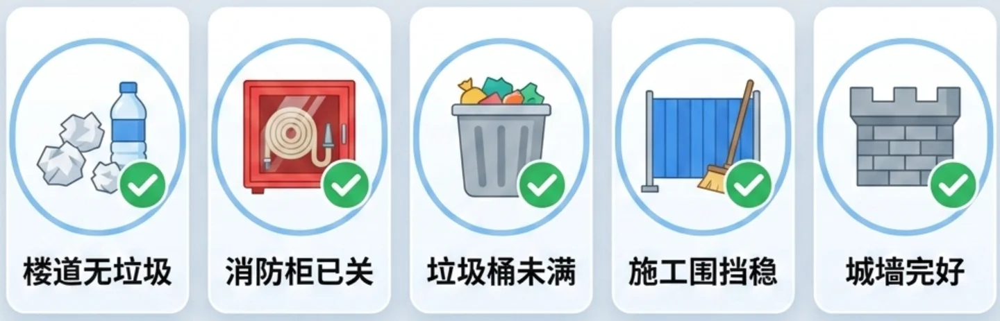

+ "楼道里有没有垃圾？"
+ "消防柜的门关了没有？"
+ "垃圾桶是不是满了？"
+ "施工围挡有没有倒？"
+ "城墙有没有被人为破坏？"

每一个这样的需求，如果走**传统定制模型**的路径，通常意味着：

| 步骤              | 工作量                       |  时间  |
| ----------------- | ---------------------------- | :----: |
| 采集现场图片      | 500-2000 张                  | 1-2 周 |
| 数据标注          | 人工逐张标框/标类别          | 1-2 周 |
| 模型训练 + 调优   | 需要 GPU 服务器 + 算法工程师 | 1-2 周 |
| 边缘端部署 + 适配 | 模型转换 + 性能调优          | 3-5 天 |
| 现场验证 + 迭代   | 精度不达标需重新采集和训练   | 不确定 |

**一个定制场景，从需求到上线少则一个月，多则反复迭代。** 而您的客户可能同时提出 5 个、10 个这样的需求。

#### 系统为您提供了两个大模型工具

CosmoEdge 内置了两种大模型能力，分别解决不同类型的长尾需求：

|                          | VLM（视觉状态判断）                        | DINO（开放目标检测）                         |
| ------------------------ | ------------------------------------------ | -------------------------------------------- |
| **一句话定位**     | 判断画面中的**状态**（是/否、开/关） | 找到画面中的**目标在哪里**（画检测框） |
| **输入方式**       | 写一段提示词                               | 写一个**目标名称**                     |
| **输出方式**       | YES / NO                                   | 检测框 + 置信度（和 CV 小模型一样）          |
| **典型场景**       | "楼道里有垃圾吗？" → YES                  | "垃圾" → 画面上标出垃圾位置                 |
| **在画面上的表现** | 无检测框，结果在告警面板显示               | 有检测框，直接叠加在视频画面上               |
| **分析速度**       | 每帧 ~2-3 秒                               | 每帧 ~1-2 秒                                 |

**简单记忆**：

+ 想知道 **"是不是"** → 用 VLM
+ 想知道 **"在哪里"** → 用 DINO

两者都不需要训练模型、不需要标注数据，写一句话就能启用。接下来我们依次学习它们的用法。

### 大模型的能力边界（请务必阅读）

在开始使用之前，请先了解这两种工具**能做什么**和**不能做什么**，建立正确的预期。

#### ✅ 适合大模型的场景

| 场景特点                                     |   适用工具   | 示例                                 |
| -------------------------------------------- | :----------: | ------------------------------------ |
| **状态判断**（是/否、有/没有、开/关）  |     VLM     | "消防柜门关了吗？" → YES/NO         |
| **简单分类**（几种状态选一个）         |     VLM     | "指示灯是红色、绿色还是黄色？"       |
| **开放类别检测**（找到某种目标的位置） |     DINO     | "灭火器" → 画面上标出位置           |
| **罕见/长尾场景**（无法获取训练数据）  |  VLM / DINO  | "城墙破坏痕迹" — 不可能做训练数据集 |
| **低频巡检**（每几秒判断一次即可）     |  VLM / DINO  | 每 2.5 秒分析一帧，足以满足巡检需求  |
| **快速验证可行性**                     | VLM 图片测试 | 上传事件案例素材，批量得到判断结果   |

#### ❌ 不适合大模型的场景

| 场景特点                                           | 原因                     | 建议方案                  |
| -------------------------------------------------- | ------------------------ | ------------------------- |
| **需要实时检测**（< 100ms 响应）             | 大模型推理需要 1-3 秒/帧 | 使用第二册的 CV 小模型    |
| **需要精确计数**（有几个人/几辆车VLM不适用） | 大模型不擅长空间定量     | 使用检测 + 追踪的场景任务 |
| **超出设备性能**（多路同时分析）             | 大模型资源占用高         | CV 小模型支持 16 路并发   |
| **动作识别**（连续性动作/状态）              | 单帧判断能力有限         | 使用专用行为分析模型      |

> **一句话总结**：大模型适合 **"低频率、大范围、长尾需求"** 的场景。它们不是要替代第二册中的 CV 小模型，而是**覆盖 CV 小模型覆盖不到的那些定制化需求**。三者互补，不是互替。

## 第一部分：VLM 视觉状态判断

VLM 的核心能力是：**看一张图片，回答一个是或非的问题。**

#### VLM 的工作流程

```plain
视频画面
   ↓
每隔几秒抽取一帧 ← 取帧频率（可配置）
   ↓
裁剪出您关注的区域 ← ROI 框选（您在画面上画框）
   ↓
将裁剪后的图片 + 您写的问题交给 VLM ← Prompt（您输入的一句话）
   ↓
VLM 回答：YES 或 N（或您设定的选项）
   ↓
如果回答触发告警条件 → 事件记录 + 告警通知
```

### 场景一：河道漂浮物识别（手把手）

> **需求**：河道管理人员需要知道是否有漂浮物，有则自动告警通知河道清理人员
> **为什么传统方案难做**：漂浮物形态千变万化（叶子、塑料袋、瓶子、杂物……），训练一个覆盖所有垃圾形态的检测模型成本极高
> **VLM 的优势**：不需要穷举漂浮物的样子——人能看出"这里有漂浮物"，VLM 也能

#### 1.1 配置 Prompt（核心步骤）

1. 进入 **河道漂浮物识别** 算法

**点击 场景任务 -> 河道漂浮物识别 -> 算法编排，进入算法编排界面。**

<!-- 这是一张图片，ocr 内容为： -->

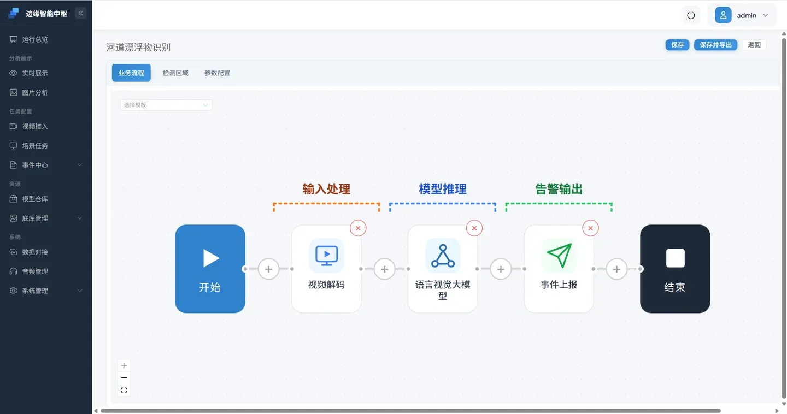

VLM 大模型的编排通常分为4个步骤：

+ 视频解码：解码RTSP流（**确保分析事件在画面中肉眼可辨识**）。
+ 数据预处理：基于解码数据流、抽帧策略、ROI区域截取等完成大模型输入数据的预处理工作。
+ 语言视觉大模型：将大模型输入的数据及提示词输入大模型，完成结果生成。
+ 事件上报：大模型输出触发上报逻辑，结果上报系统。

2. 修改提示词

点击 **语言视觉大模型** 节点，展开配置面板，进行修改提示词，修改完成后点击**保存**

<!-- 这是一张图片，ocr 内容为： -->

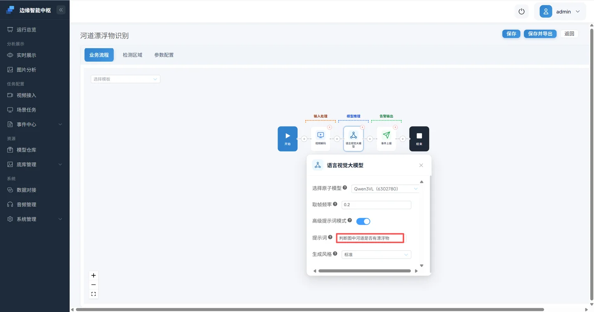

参数说明：

| 参数             | 作用                                                      | 备注                                                                                           |
| ---------------- | --------------------------------------------------------- | ---------------------------------------------------------------------------------------------- |
| 选择原子模型     | 选择多模态大模型的类型                                    |                                                                                                |
| 取帧频率         | 每秒截取多少帧进行分析（fps；值越小，两次分析的间隔越长） | 由于大模型的算力要求较高，建议设置较小值以拉长分析间隔                                         |
| 高级提示词模模式 | 开启完整提示词配置                                        | 开启之后提示词需要一段完整的表达；不开启提示词只需要输入检测对象                               |
| 提示词           | 输入提示词                                                |                                                                                                |
| 生成风格         | 大模型输出随机性控制                                      | 严谨代表输出随机性低；标准代表输出随机性正常；发散代表输出随机性高；自定义代表自定义随机性控制 |

**参数**选择如下：

<!-- 这是一张图片，ocr 内容为： -->

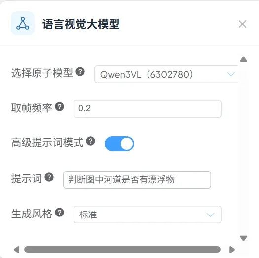

**补充功能**

OpenAI三方模型接入

1.选择OpenAI接口

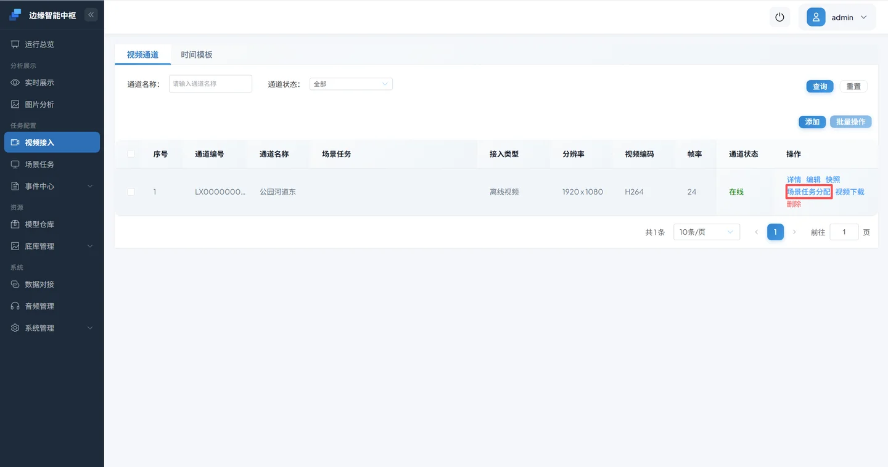

2.配置三方模型

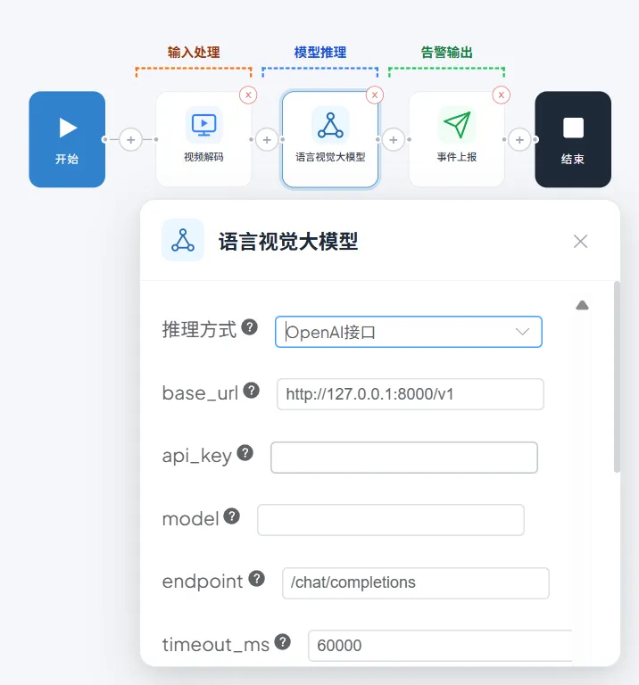

#### 1.2 选择 VLM 算法并绑定通道

1. 下载视频

项目提供了演示的视频，视频地址：[github.com/cosmo-wander-ai/cosmo-edge/releases/tag/v1.0-videos](https://github.com/cosmo-wander-ai/cosmo-edge/releases/tag/v1.0-videos)。

2. **上传演示视频**

点击 **视频接入 ->添加 ->接入离线视频 ->进入场景任务分配。**

<!-- 这是一张图片，ocr 内容为： -->


在** 所有服务 **中选中** 河道漂浮物识别，新增区域。**

<!-- 这是一张图片，ocr 内容为： -->

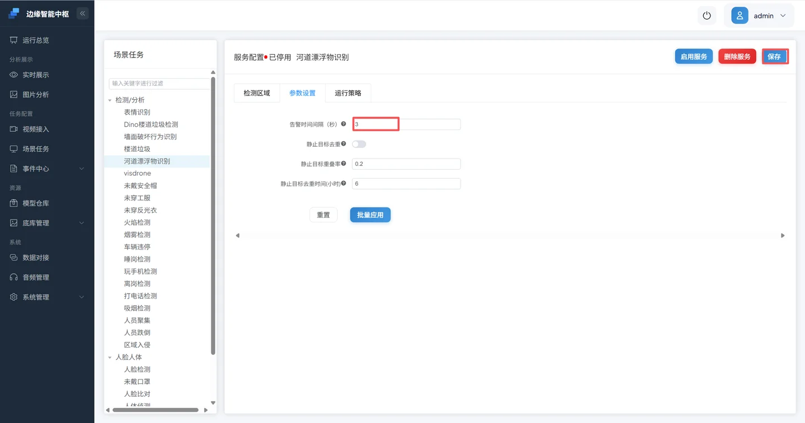

> **💡**大模型默认检测区域是全屏

3. **框选关注区域（ROI）**

和第二册一样，您可以画一个区域让 VLM **只关注特定位置**。**框选的区域越精确，背景干扰越少，判断越准确。**

<!-- 这是一张图片，ocr 内容为： -->

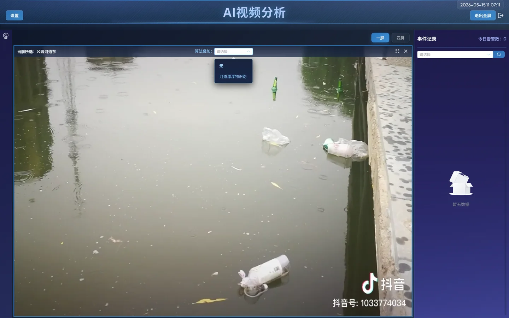

4. 配置检测参数

切换到 **参数设置页面 **设置告警间隔，**保存 **按钮保存该配置，并启动服务。

<!-- 这是一张图片，ocr 内容为： -->

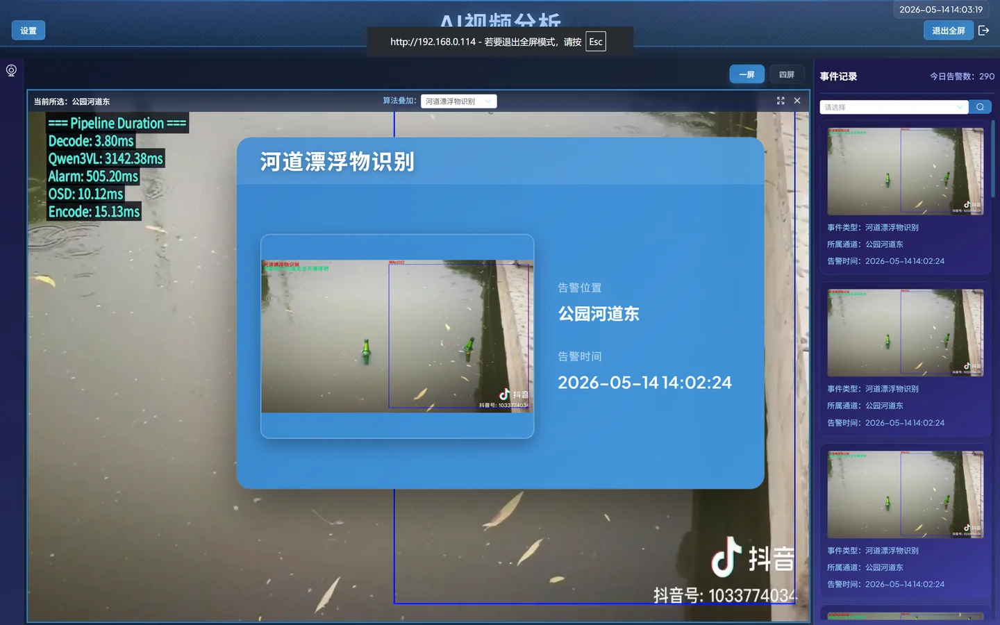

#### 1.3 查看检测效果

1. 点击 **实时展示 ->选择通道 ->算法叠加**

算法叠加选择 **河道漂浮物识别**

<!-- 这是一张图片，ocr 内容为： -->

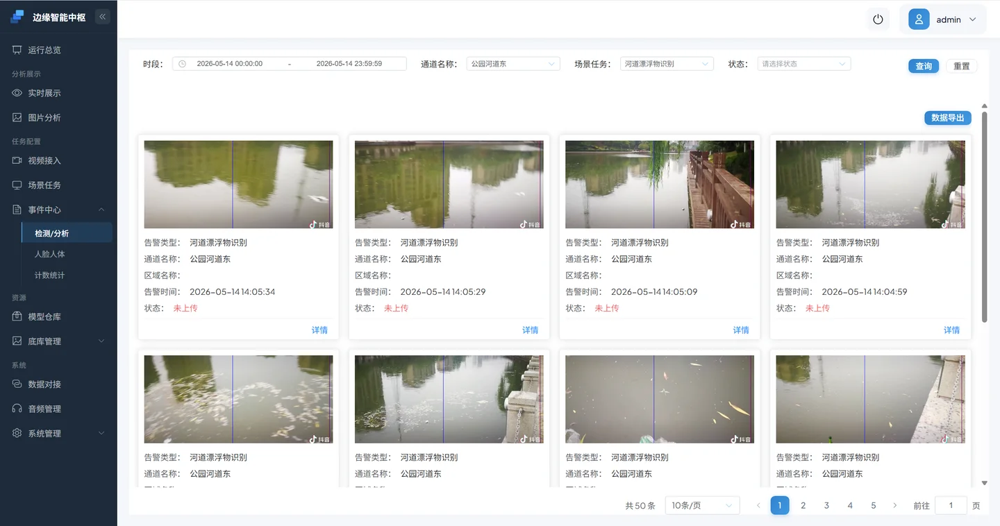

告警弹出信息（大模型启动加载大约要半分钟，体积比较大，后续推理不受影响）

<!-- 这是一张图片，ocr 内容为： -->

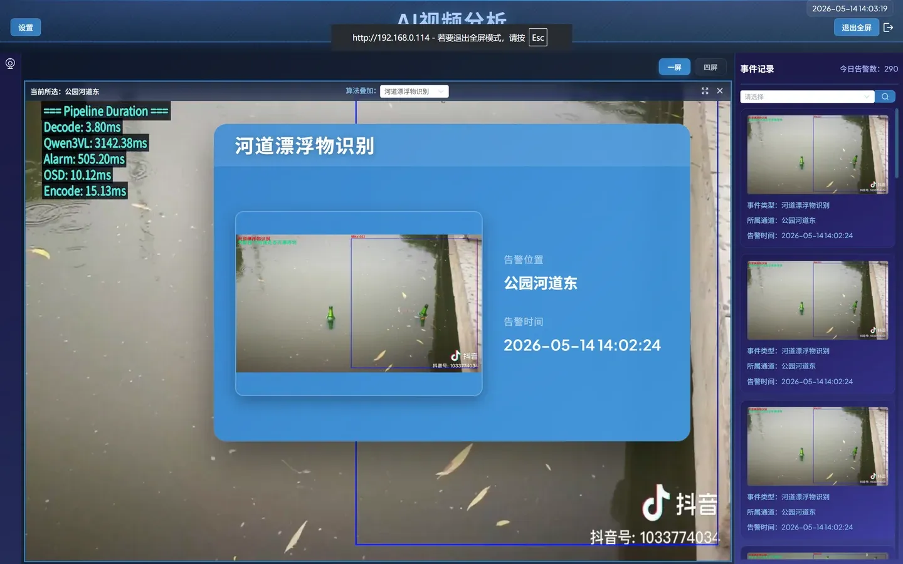

告警页面分析：

+ 视频画面正常播放（VLM 不会在画面上叠加检测框，这是正常的）
+ 右侧 **告警面板** 出现检测事件：
  - 当河道有漂浮物时 → 触发告警，显示抓拍图片
  - 当河道无漂浮物时 → 无告警

> **⚠️ 和第二册的视觉差异**
> 第二册的 CV 小模型会在视频画面上**实时画检测框**。VLM **不会画框**——它的结果显示在告警面板和事件记录中。这不是系统故障，是两种技术的输出方式不同：
>
> + CV 小模型：告诉你"**哪里有什么**"（检测框）
> + VLM：告诉你"**画面中的状态是什么**"（YES/NO）

#### 1.4 事件查询

点击 **事件中心 **进入**检测/分析**，根据条件查询告警记录。

<!-- 这是一张图片，ocr 内容为： -->

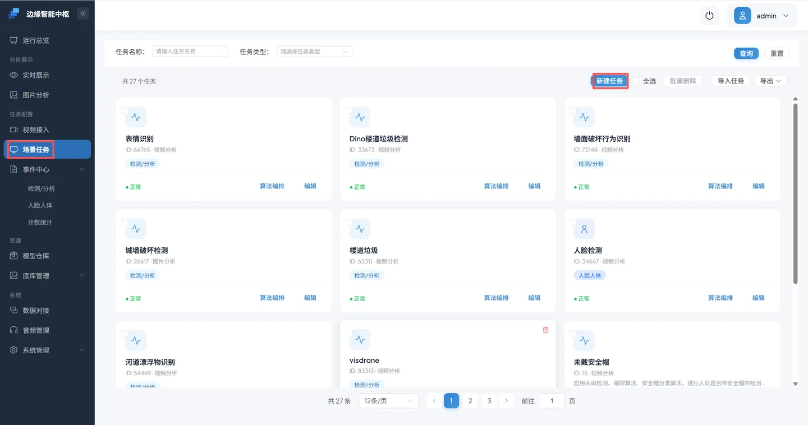

每条 VLM 告警包含：

+ **抓拍图片**：VLM 分析的那一帧画面
+ **判断结果**：YES（有漂浮物）或 NO（无漂浮物）
+ **时间戳**：判断发生的时间

点击告警图片，进入详情。右上角显示该告警信息

<!-- 这是一张图片，ocr 内容为： -->

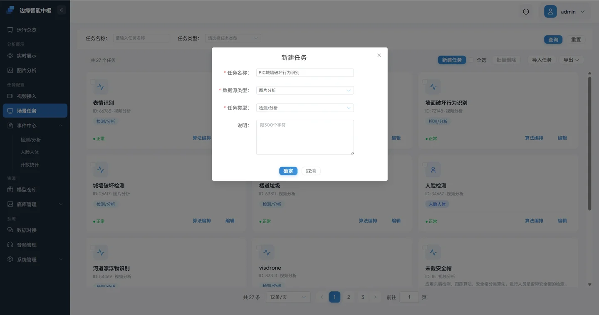

> **💡 与第二册的区别**
> 第二册中您选择的是"未戴安全帽"等**固定用途**的算法。这里选择的是一个**通用 VLM 引擎**——它能做什么，取决于您接下来写的 Prompt。

**到这里，您已经完成了第一个 VLM 场景的完整配置。**

### 场景二：城墙破坏检测（从零验证一个全新需求）

> **需求**：文保单位需要监控古城墙，检测是否有人为破坏痕迹
> **这个场景的特殊性**：市面上没有AI 公司提供"城墙破坏检测"的现成模型。如果走传统定制路径，需求本身判定模式相对模糊，光"什么算破坏"的定义就够来回沟通相当长的时间。
> **本节的学习重点**：不是操作步骤（和场景一基本相同），而是**面对一个全新需求时，如何用图片测试快速验证可行性，以及如何迭代 Prompt**。

#### 2.1 先验证：这个需求 VLM 能不能做？

面对一个全新的定制需求，**不建议直接接视频配 场景任务，因为视频中事件发生的频次可能很低，不容易快速验证结果**。建议先用 **图片测试** 功能快速验证 Prompt 是否有效。

1. 创建 **城墙破坏检测** 的 **VLM图片分析 **算法

点击 **场景任务**进入场景管理页面，点击**新建任务**。

<!-- 这是一张图片，ocr 内容为： -->

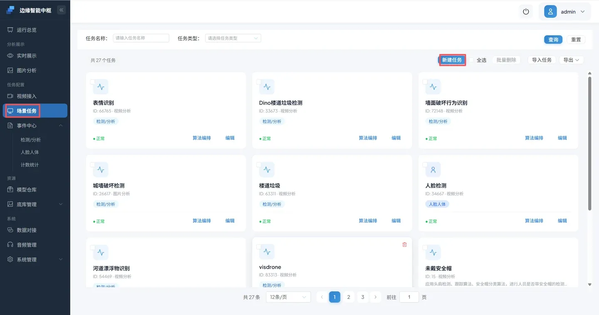

数据源类型选择** 图片分析**

<!-- 这是一张图片，ocr 内容为： -->

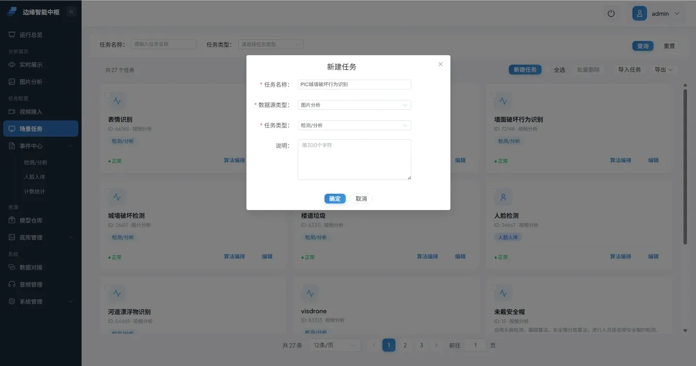

点击 **确定 **保存算法

<!-- 这是一张图片，ocr 内容为： -->

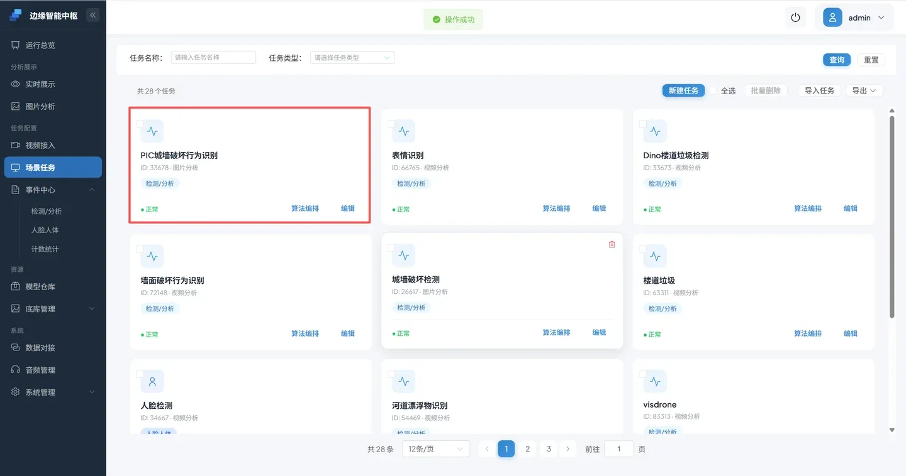

点击 **算法编排** 创建编排流程，点击 **操作** -> **添加组件** -> **语言视觉大模型** 添加VLM组件。

<!-- 这是一张图片，ocr 内容为： -->

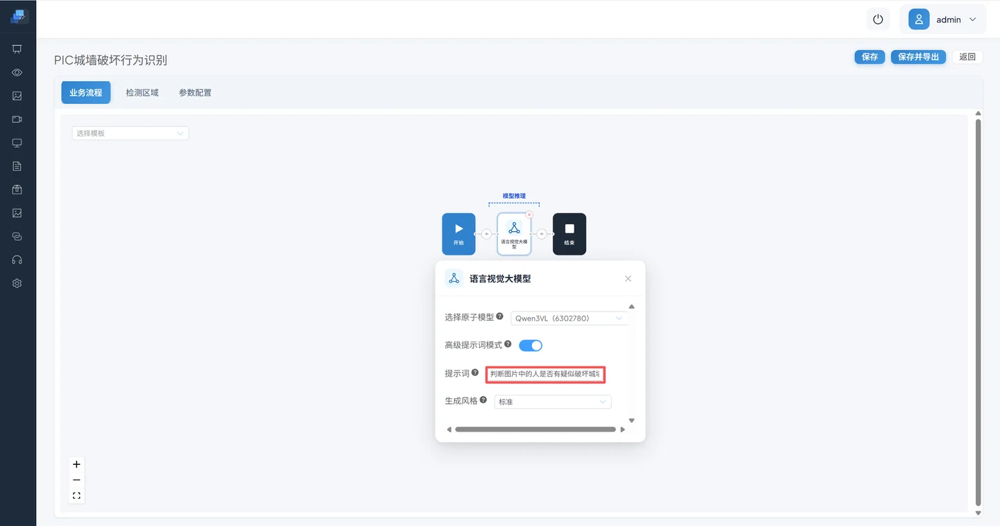

整个流程只需要添加一个语言视觉大模型即可完成编排。

<!-- 这是一张图片，ocr 内容为： -->

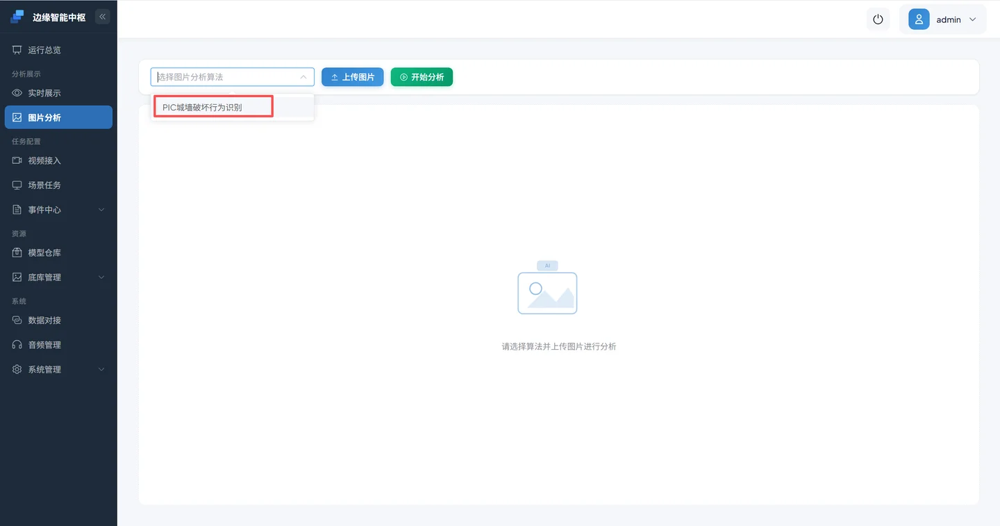

点击 **语言视觉大模型** 配置提示词，并**保存**。

<!-- 这是一张图片，ocr 内容为： -->


提示词： 判断图中的人是否有疑似破坏墙面的行为

> 以上就是一个VLM大模型编排的全部操作步骤

2. 上传图片快速验证可行性

点击 **图片分析 **进入图片推理页面，选择算法**PIC城墙破坏检测**。

<!-- 这是一张图片，ocr 内容为： -->

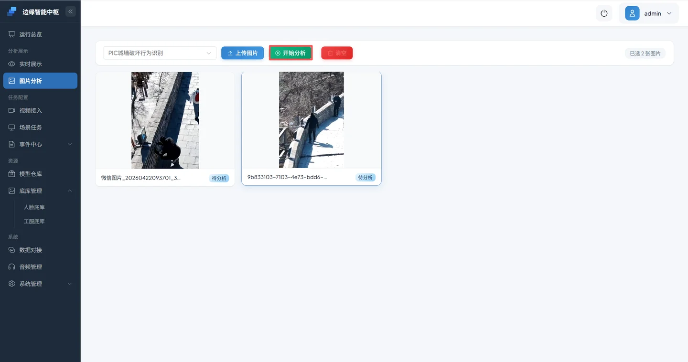

上传待分析的图片

<!-- 这是一张图片，ocr 内容为： -->

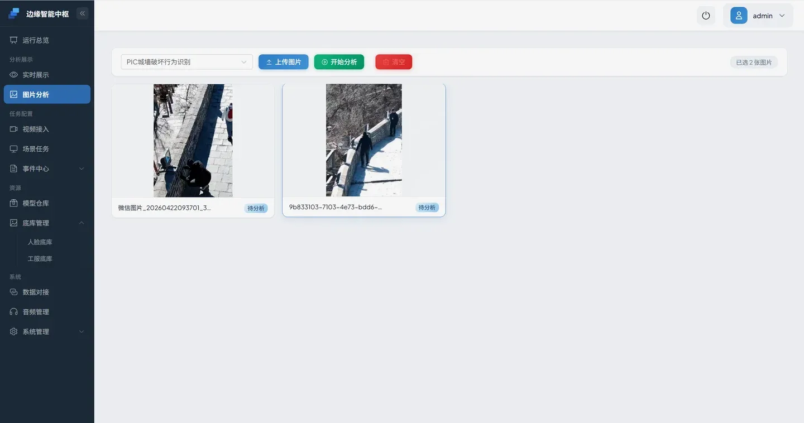

点击 **开始分析**，开始大模型分析图片（注：当前图片测试服务在此时开始创建，需要数秒钟大模型加载的时间）

<!-- 这是一张图片，ocr 内容为： -->


分析完成

<!-- 这是一张图片，ocr 内容为： -->

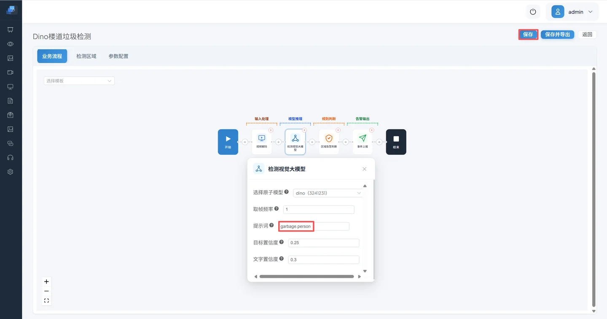

分析的结果包括存在和不存在两种结果，可以更进一步查看详细信息。

点击 **检测目标是** 的图片，查看置信度、逻辑结果等信息。

<!-- 这是一张图片，ocr 内容为： -->

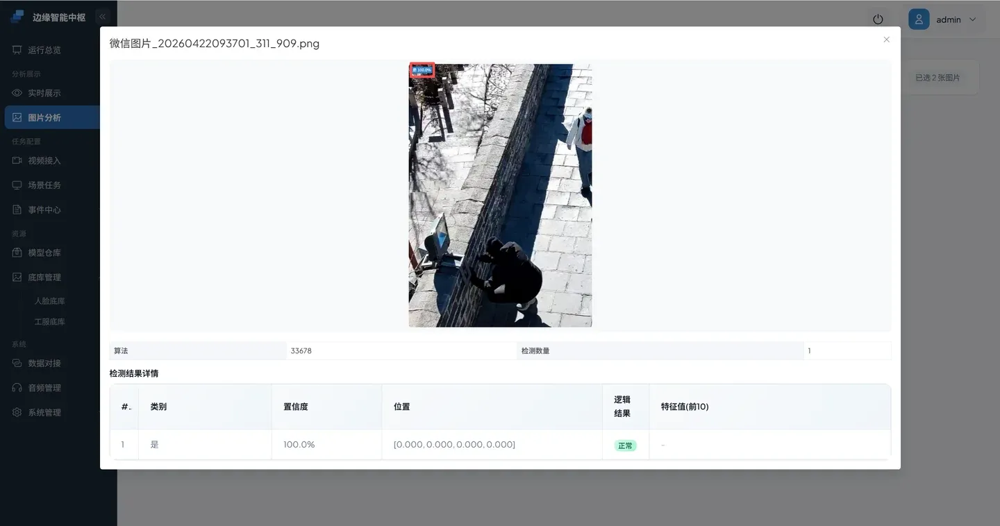

结果分析：

+ 如果返回符合预期 → 判断正确，Prompt 可用
+ 如果返回不符合与其或结果不稳定 → 需要调整 Prompt（见下节）

> **💡 图片测试的价值**
> 不需要接视频、不需要配 场景任务、不需要在视频中等待事件发生的时段。筛选出实景事件图片，上传分析后即可拿到结果。**这是验证"VLM 能不能做某个场景"成本最低的方式。** 建议在每个新场景正式上线之前，都先用图片测试验证 Prompt，对于场景较为复杂，稳定性要求较高的场景，建议准备一定量级的正负样本图片，统计算法的误报及召回率等指标。

#### 2.2 Prompt 迭代：如果第一版效果不理想

在实际使用中，第一版 Prompt 可能不够准确。以下是常见的调整方向：

**情况一：漏报（有破坏但没检测到）**

尝试让问题更具体，描述破坏的视觉特征：

```plain
❌ "城墙有没有问题？"          ← 太模糊
✅ "城墙表面是否有裂缝、缺损或涂鸦？"  ← 具体到视觉特征
```

**情况二：误报（没破坏但误报了）**

尝试缩小判断范围，或调整 ROI 排除干扰区域：

```plain
❌ "城墙有没有被破坏？"             ← "破坏"含义太广，自然风化也可能被判为破坏
✅ "城墙表面是否有明显的人为刻画或凿击痕迹？"  ← 聚焦到"人为"+"具体形式"
```

**情况三：结果不稳定**

+ 检查 ROI 是否画得太大，包含了过多无关背景
+ 尝试简化 Prompt，避免过于复杂的描述
+ 筛选多张图片进行多次测试，确认稳定性

> **Prompt 迭代的一般思路**：

```plain
写一版 Prompt → 用图片测试验证（正样本 + 负样本）
    ↓ 效果不好
分析原因（漏报 or 误报 or 不稳定）→ 调整 Prompt → 再验证
    ↓ 效果满意
正式接视频，配置为持续运行的场景任务
```

**配置好VLM Prompt 的关键**

| # | 规则                     | 说明                                                 |
| :-: | ------------------------ | ---------------------------------------------------- |
| 1 | **问封闭式问题**   | 只问能回答"是/否"或"A/B/C"的问题，不要问开放式问题   |
| 2 | **问看得见的事物** | VLM 只能分析图像内容，确保问题涉及的内容在画面中可见 |

**VLM — 好 Prompt vs 坏 Prompt**

| ✅ 好的 Prompt                 | ❌ 坏的 Prompt       | 问题出在哪                 |
| ------------------------------ | -------------------- | -------------------------- |
| "楼道中是否有垃圾？"           | "描述一下楼道的情况" | 开放式，输出不可控         |
| "地面是否有积水？"             | "地面湿不湿？"       | "湿"不是视觉特征，难以判断 |
| "消防柜门是否关闭？"           | "消防柜有没有问题？" | 太模糊，什么算"有问题"？   |
| "指示灯是红色还是绿色？"       | "设备有几个指示灯？" | VLM 不擅长计数             |
| "城墙表面是否有人为刻画痕迹？" | "城墙坏了吗？"       | "坏"含义太广               |

#### 2.3 验证通过后，配置成正式 视频分析场景任务

Prompt 在图片测试中验证通过后，按照场景一相同的步骤配置到实际视频通道：

1. **绑定 VLM 算法**到城墙监控视频通道
2. **填写验证通过的 Prompt**
3. **画 ROI** 框选城墙主体区域
4. **设置取帧频率**（文保巡检场景建议设为 `0.1`，即每 10 秒分析一次，已足够）
5. 进入 **「实时展示」** 验证效果

> 这些步骤的详细操作已在场景一中讲解，此处不再重复截图。

## 第二部分：DINO 开放目标检测

前面两个场景中，VLM 回答的是"是不是"的问题——它告诉您画面的**状态**，但不会告诉您目标**在画面的哪个位置**。

有些场景的需求不同。比如：

+ "我想在画面中**找到**所有的灭火器，看它们放在哪里"
+ "我想**标出**画面中所有出现的猫/狗/异常物品"
+ "我想让系统**框出**施工区域里的所有工具"

这类需求要的不是 YES/NO，而是**检测框**——和第二册的 CV 小模型一样的输出形式，但不需要训练。

这就是 DINO 做的事：您写一个**目标名称**，系统自动在画面中找到所有匹配的目标并画框。

#### DINO 的工作流程

```plain
视频画面
   ↓
每隔几秒抽取一帧 ← 取帧频率（可配置）
   ↓
将画面 + 您输入的目标名称交给 DINO ← 提示词（如"垃圾"）
   ↓
DINO 在画面中找到所有匹配目标，输出检测框 + 置信度
   ↓
检测框叠加到视频画面上 ← 和 CV 小模型一样的 OSD 显示
   ↓
如果检测到目标 → 事件记录 + 告警通知
```

### 场景三：开放场景目标检测（精简操作）

> **需求**：在楼道画面中检测并标出 "person"（人员）和 "garbage"（垃圾）的具体位置
> **与 VLM 楼道垃圾的对比**：VLM 只告诉您"有没有垃圾"，DINO 会告诉您"垃圾在画面的哪个位置"

DINO 的配置流程和 VLM 高度相似，以下只说明**关键差异**。

#### 3.1 配置提示词

VLM 的提示词是一个**问题**，DINO 的提示词是一个**目标名称**（或多个名称用英文句号 `.` 分隔）。在使用DINO之前先配置提示词。

1. 点击 **算法管理 ->Dino楼道垃圾检测算法 ->算法编排->检测视觉大模型 ->配置提示词 ->保存退出。**

在提示词中输入您想检测的目标，本算法中输入提示词：

```plain
person.garbage
```

注意：提示词之间使用**英文句号**间隔

<!-- 这是一张图片，ocr 内容为： -->

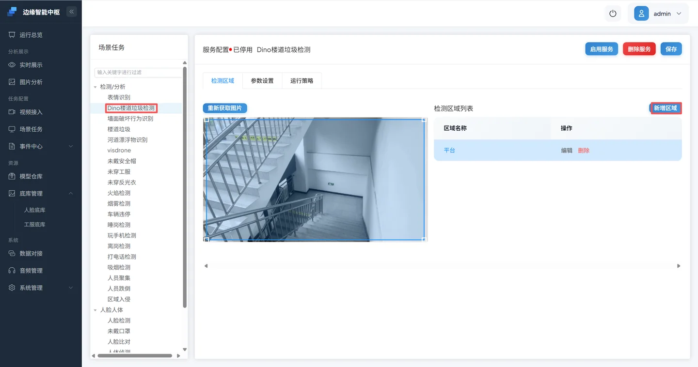

> **⚠️ DINO 提示词使用英文**

#### 3.2 绑定 DINO 算法

1. 进入 **视频接入**，场景任务分配。

<!-- 这是一张图片，ocr 内容为： -->

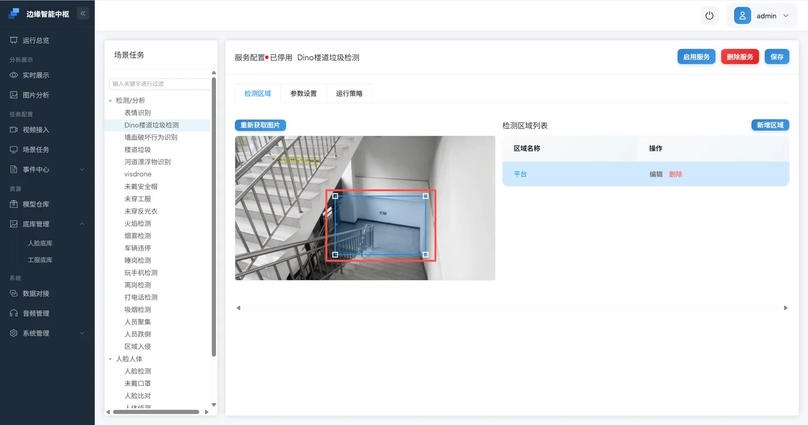

2. **服务分配** 中选择 **DINO 类型的算法**，**新增区域。**

<!-- 这是一张图片，ocr 内容为： -->

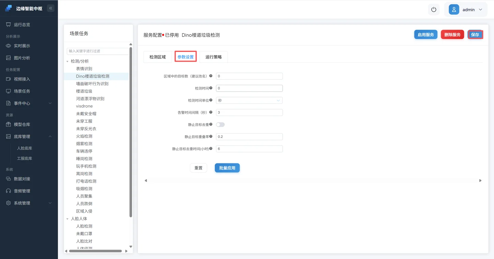

3. 调整区域位置

调整检测区域到合适的位置，本场景中调整检测区能够覆盖平台

<!-- 这是一张图片，ocr 内容为： -->

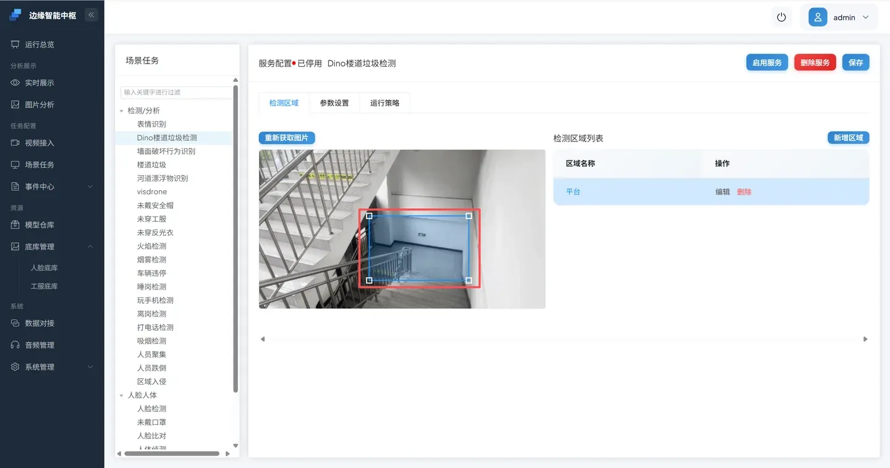

4. 参数设置，**保存**并启动服务。

<!-- 这是一张图片，ocr 内容为： -->


#### 3.3 查看效果

进入 **实时展示**，算法叠加效果，

<!-- 这是一张图片，ocr 内容为： -->

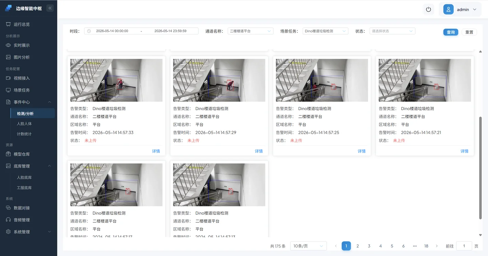

dino的目标框会有延迟，是正常现象。

检测告警效果

<!-- 这是一张图片，ocr 内容为： -->

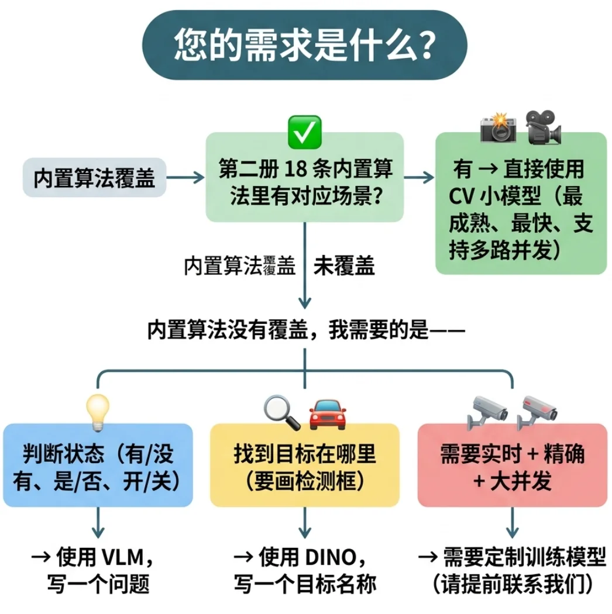

### 3.4 查看事件上报

进入 **事件中心**，查看告警。

<!-- 这是一张图片，ocr 内容为： -->

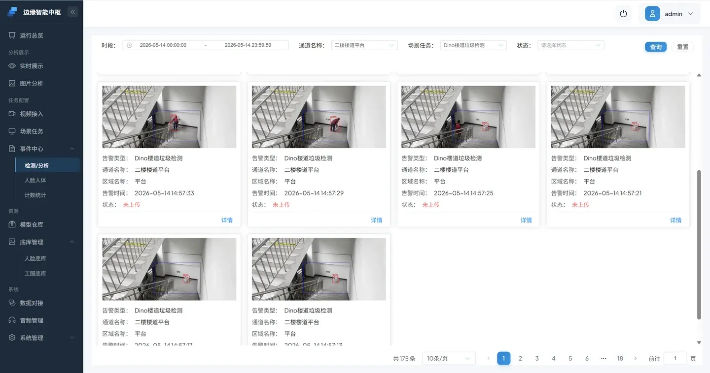

到此 DINO开发目标检测 的使用流程结束。

#### 3.5 DINO 常用提示词速查

| 中文   | 英文提示词        | 备注             |
| ------ | ----------------- | ---------------- |
| 人     | person            |                  |
| 车     | car / vehicle     | vehicle 范围更广 |
| 垃圾   | garbage / trash   |                  |
| 灭火器 | fire extinguisher |                  |
| 猫     | cat               |                  |
| 狗     | dog               |                  |
| 箱子   | box / package     |                  |
| 椅子   | chair             |                  |
| 烟雾   | smoke             |                  |
| 火焰   | fire / flame      |                  |

> 不确定怎么写时，**用通用的英文名词尝试**。DINO 支持的类别非常广泛，大多数日常物体都能识别。

## 选对工具：CV 小模型 / VLM / DINO 怎么选？

学完本册后，您已经掌握了系统提供的全部三种 AI 分析能力。面对一个新的检测需求时，按以下路径判断该使用哪一种：

```plain
您的需求是什么？
│
├─ 第二册的 18 条内置算法里有对应场景吗？
│   └─ ✅ 有 → 直接使用 CV 小模型（最成熟、最快、支持多路并发）
│
├─ 内置算法没有覆盖，我需要的是——
│   │
│   ├─ 判断状态（有/没有、是/否、开/关）
│   │   └─ → 使用 VLM，写一个问题
│   │
│   ├─ 找到目标在哪里（要画检测框）
│   │   └─ → 使用 DINO，写一个目标名称
│   │
│   └─ 需要实时 + 精确 + 大并发
│       └─ → 需要定制训练模型（请提前联系我们）
```

<!-- 这是一张图片，ocr 内容为：您的需求是什么? 内置算法覆盖 有->直接使用CV小模型 第二册18条内置算法里有对应场景? (最成熟,最快,支持多路并发) 内置算法未覆盖 内置算法没有覆盖,我需要的是 找到目标在哪里 判断状态 需要实时+精确+大并发 (要画检测框) (有/没有,是/否,开/关) ? 需要定制训练模型 使用VLM,写一个问题 使用DINO,写一个目标名称 (请提前联系我们) -->


完整对比：

|                            | CV 小模型（第二册）                           | VLM（本册）     | DINO（本册）                                  |
| -------------------------- | --------------------------------------------- | --------------- | --------------------------------------------- |
| **规则来源**         | 训练好的固定模型                              | 您写的一个问题  | 您写的一个目标名称                            |
| **输出**             | 检测框                                        | YES / NO        | 检测框                                        |
| **速度**             | 实时（25fps）                                 | ~2-3 秒/帧      | ~1-2 秒/帧                                    |
| **并发**             | 16 路                                         | 单路串行        | 单路串行                                      |
| **切换场景**         | 换模型                                        | 改一句话        | 改一个词                                      |
| **适合场景**         | 主流高频场景                                  | 长尾状态判断    | 长尾目标检测                                  |
| **画面显示**         | 实时检测框                                    | 告警面板        | 检测框（较慢）                                |
| **告警面板**         | 检测目标 + 置信度                             | YES/NO 判定结果 | 检测目标 + 置信度                             |
| **场景任务性能统计** | 叠加在画面上（Decode / OSD / Encoder 低延迟） | 不在画面上      | 叠加在画面上（Decode / OSD / Encoder 高延迟） |

> **💡 VLM 和 DINO 可以看作 CV 小模型的"万能补充"**。您的系统首先用 18 个成熟场景任务 覆盖主流场景，对于覆盖不到的长尾需求，用 VLM 和 DINO 即时补位——无需等待模型训练，当天就能上线。

## 附录：

### DINO 提示词规则

| # | 规则                             | 说明                                  |
| :-: | -------------------------------- | ------------------------------------- |
| 1 | **使用英文名词**           | 当前版本对英文支持更稳定              |
| 2 | **用英文句号分隔多个目标** | 如 "person.garbage.fire extinguisher" |
| 3 | **词语尽量具体**           | "fire extinguisher" 优于 "red thing"  |

### VLM 参考场景模板

| 场景         | 参考 Prompt                | 输出                 | ROI 建议       |
| ------------ | -------------------------- | -------------------- | -------------- |
| 垃圾桶满溢   | "垃圾桶是否已满或溢出？"   | YES / NO             | 框选垃圾桶位置 |
| 消防柜门状态 | "消防器材柜的门是否关闭？" | YES / NO             | 框选柜门区域   |
| 门禁状态     | "门是否处于开启状态？"     | YES / NO             | 框选门所在区域 |
| 设备指示灯   | "设备指示灯是什么颜色？"   | RED / GREEN / YELLOW | 框选指示灯位置 |
| 通道堵塞     | "消防通道是否被杂物堵塞？" | YES / NO             | 框选通道地面   |
| 工位状态     | "该工位上是否有人在工作？" | YES / NO             | 框选工位区域   |

### 新场景验证 Checklist

无论使用 VLM 还是 DINO，每个新场景上线前请确认：

- [ ] 用 **图片测试** 验证过至少 3 张正样本（应该触发告警的图）
- [ ] 用 **图片测试** 验证过至少 3 张负样本（不应该触发告警的图）
- [ ] 同一张图连续测试 3 次，结果一致（稳定性）
- [ ] ROI 已框选到具体关注区域，排除了无关背景
- [ ] 取帧频率已根据场景需求设置合理值

### 下一步

| 目标                                     | 阅读                       |
| ---------------------------------------- | -------------------------- |
| 查询参数含义、获取排障帮助               | → 参考手册                |
| 了解模型植入能力（将自研模型部署到设备） | → 参考手册 - 模型植入概述 |
