# 卷四：Pipeline 编排

> **阅读时长**：35-50 分钟
**目标**：理解场景任务结构，学会修改现有场景任务，并基于内置能力创建新的场景任务
**前提**：已完成 [卷二：场景配置](../02-scenario-config/scenario-config.md) 和 [卷三：VLM / DINO 指南](../03-vlm-guide/vlm-guide.md)，熟悉视频接入、服务分配、实时展示和告警记录
**无需额外环境**：本篇教程只使用系统内置能力，不涉及 Docker 和模型转换
>


前三篇中，您已经学会了两件事：

1. 使用系统内置的 CV 算法配置常见检测场景
2. 使用 VLM / DINO 定义新的检测规则

但到这一步，您仍然主要是在“使用现成能力”。

本篇教程的目标，是让您进入下一层：**理解这些能力是如何被组织起来的，并学会自己编排它们。**

本篇教程分三步推进：

+ 第一章：看懂现有场景任务的内部结构
+ 第二章：修改现有场景任务
+ 第三章：从零创建新的业务场景任务

> **说明**
>
> 本篇教程先讲“怎么组织能力”。
下一篇教程 CosmoEdge 第三方模型移植 教程再讲怎么引入新的第三方模型能力”。
>


## 本篇教程学习路径

```plain
看懂现有场景任务
  ↓
在现有的场景任务上做小修改
  ↓
参照现有结构，从零搭建新的场景任务
```

学完本篇教程后，您将具备：

+ 看懂场景任务在做什么
+ 判断一个节点应该放在什么位置
+ 独立完成常见的节点增删、连线和参数调整
+ 基于系统内置能力搭建新的业务逻辑

## 第一章：理解 场景任务的算法编排
在 **CosmoEdge 场景配置指南** 教程中，您主要是在“服务分配”页面选择算法、画区域、调参数。这些操作背后，其实都是**场景任务下的算法任务**在工作。

每个场景任务可以理解为一条“处理链”：

```plain
输入 → 推理 → 逻辑处理 → 输出
```

本章不做修改，只看结构。

### 1.1 打开“未戴安全帽” 场景任务
1. 进入**场景任务**

<!-- 这是一张图片，ocr 内容为：边缘智能中枢 个个Q 日 人不安全 192.168.0.18/#/HOME 边缘智能中枢 8 ADMIN 运行总览 系统资源 更新时间11:14:11 运行中 分析展示 负载概览 实时展示 CPU使用率 无丢包 显存使用率 高占用 低负载 丢包率 NPU使用率 低负载 空闲 EMMC使用率 图片分析 81% 9% 0% 1% 0% 任务配置 已用1% 可用6.63GB 可用99% 丢包0个 已用651.79MB 已用13.53GB 已用0% 未丢0个 可用3.14GB 可用100% 视频接入 正在运行的场景任务0个任务 场景任务 全部任务 事件中心 资源 模型仓库 中 新建场景任务 底库管理 系统 数据对接 实时事件 查看全部 音频管理 系统管理 京 暂无实时事件 -->
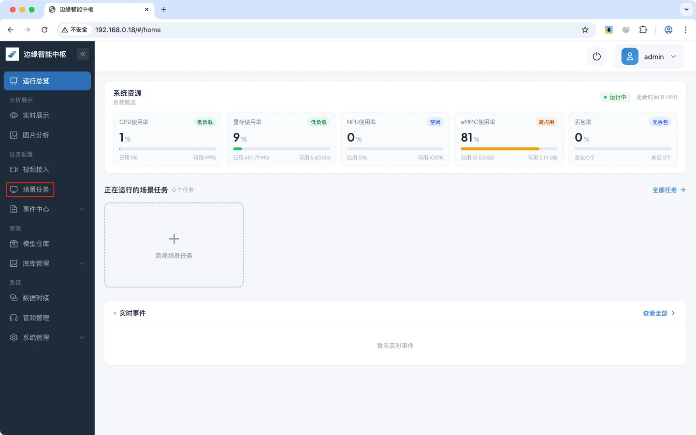

2. 找到 **未戴安全帽**

<!-- 这是一张图片，ocr 内容为：边缘智能中枢 小个Q 日 不安全 192.168.0.18#/GAMJCOUNTMANAGEMENT 边缘智能中枢 8 ADMIN 运行总览 任务名称: 未藏安全帽 任务类型: 请选择任务类型 重置 查询 分析展示 实时展示 新建任务 批量删除 导出 导入任务 共1个任务 图片分析 O 任务配置 视频接入 未戴安全帽 ID:15-视频分析 场景任务 应用头肩检测,跟踪算法,安全相分类算法,进行人员是否带... 事件中心 人脸人体 资源 算法编排 编辑 正常 模型仓库 世 底库管理 系统 数据对接 音频管理 系统管理 京 前往 页 共1条 12条/页 -->
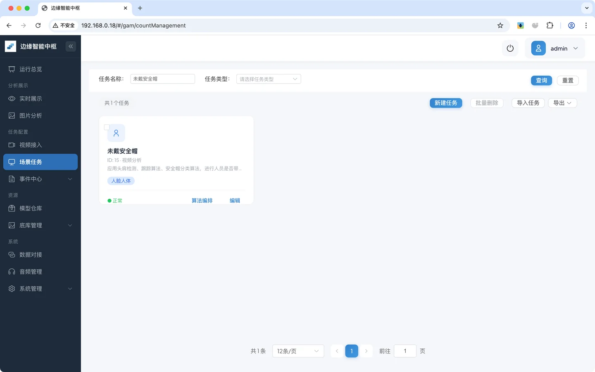

3. 点击 **算法编排**

<!-- 这是一张图片，ocr 内容为：边缘智能中枢 众 不安全 192.168.0.18/#/GAM/COUNTMANAGEMENT 边缘智能中枢 8 ADMIN 运行总览 任务名称: 未藏安全帽 任务类型: 请选择任务类型 重置 查询 分析展示 实时展示 新建任务 批量删除 导出 导入任务 共1个任务 图片分析 O 任务配置 视频接入 未戴安全帽 ID:15-视频分析 场景任务 应用头肩检测,跟踪算法,安全相分类算法,进行人员是否带 事件中心 人脸人体 资源 算法编排 编辑 正常 模型仓库 世 底库管理 系统 数据对接 音频管理 系统管理 京 前往 页 共1条 12条/页 -->
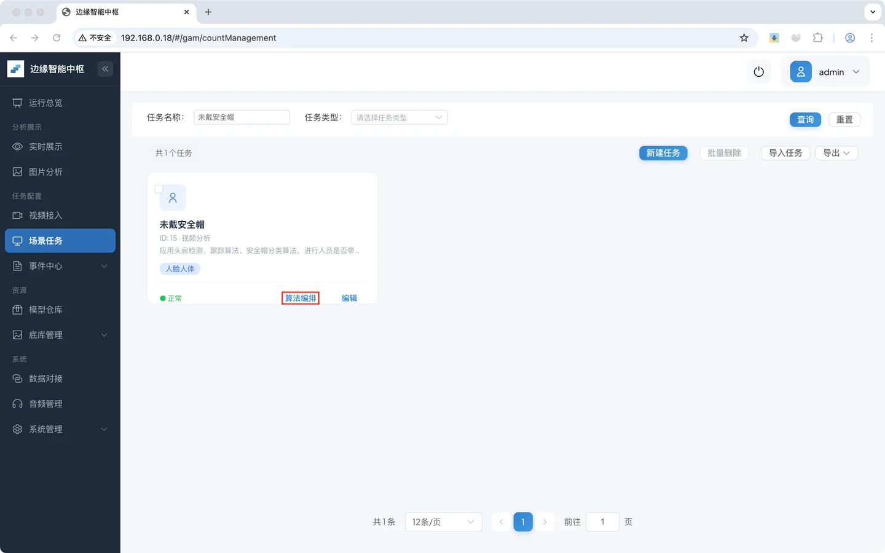

进入后，您会看到一条完整的节点链。

<!-- 这是一张图片，ocr 内容为：边缘智能中枢 合 个TQ 日 8 ADMIN 保存 返回 保存并导出 未戴安全帽 检测区域 参数配置 业务流程 园 选择模板 目 告警输出 规则判断 模型推理 输入处理 规则判断 模型推理 OO 事件上探 开始 灵敏服计算 目标判质 目标检测算法 类别拜选 结束 迪欧算法 BI+ -->
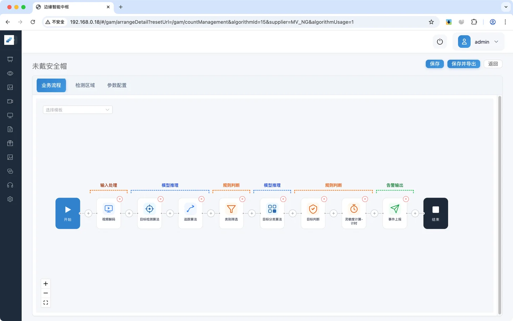

这就是 **CosmoEdge 场景配置指南** 教程中“未戴安全帽”的内部结构，其业务流程就是根据这里的节点顺序执行。

### 1.2 认识常见节点类型
**输入类节点**

| 节点 | 作用 | 备注 |
| --- | --- | --- |
| 视频解码 | 将视频流解码为逐帧图像 | 几乎所有 场景任务的起点 |


**推理类节点**

| 节点 | 作用 | 备注 |
| --- | --- | --- |
| 目标检测 | 在画面中定位目标 | 例如行人检测、安全帽检测 |
| 目标分类 | 对已检测目标做二次分类 | 例如判断是否戴安全帽 |
| 追踪算法 | 给目标分配稳定 ID | 让同一对象跨帧保持身份 |
| 语言视觉大模型 | 对图像进行状态判断 | 例如“门是开着还是关着” |
| 检测视觉大模型 | 根据文本提示检测目标 | 例如“垃圾桶”“消防柜”等 |


**逻辑类节点**

| 节点 | 作用 | 备注 |
| --- | --- | --- |
| 类别筛选 | 只保留指定类别 | 去掉不关心的结果 |
| 目标尺寸过滤 | 过滤过小或过大的目标 | 排除远处小目标等干扰 |
| 区域判定 | 判断目标是否进入指定区域 | 对应第二篇教程画的检测区 |
| 越线判定 | 判断目标是否穿过指定线段 | 常用于客流统计 |
| 灵敏度计算 | 多帧累积后再触发告警 | 降低单帧误报 |


**输出类节点**

| 节点 | 作用 | 备注 |
| --- | --- | --- |
| 事件上报 | 生成告警事件 | 在告警记录中可看到 |


> **建议**
>
> 不需要死记所有节点。
更高效的方式是：先找一条最接近的内置 场景任务，再在它的基础上改。
>

### 1.3 数据如何在节点之间流转
观察“未戴安全帽” 场景任务，数据大致按下面的顺序流动：

```plain
视频解码
  ↓ 输出：逐帧图像
目标检测（行人检测）
  ↓ 输出：检测框 + 类别 + 置信度
目标追踪
  ↓ 输出：检测框 + 类别 + 置信度 + 跟踪序列
类别过滤
  ↓ 输出：只保留目标类别
目标分类（安全帽分类）
  ↓ 输出：每个行人的安全帽状态
灵敏度计算
  ↓ 输出：连续命中后才触发告警
事件上报
  ↓ 输出：结构化告警事件
视频可视化叠加
  ↓ 输出：实时画面上的框、标签和提示
```

理解这个流转逻辑后，您就能理解大多数场景任务：

+ 每个节点都消费上一个节点的输出
+ 每个节点都只做一件事
+ 节点顺序会直接影响最终结果

### 1.4 判断节点顺序的基本原则
在编排时，优先遵守这几个原则：

1. 尽早过滤无用结果。
例如太小的目标，应尽量在进入分类或复杂逻辑前就过滤掉。
2. 先产生目标，再谈规则。
区域、越线、灵敏度这些逻辑，前提都是上游已经有检测结果。
3. 想要在实时画面里“看见效果”，通常需要 视频可视化 叠加节点。
只做事件上报而不做 视频可视化，系统可能会有告警记录，但画面上看不到框。

## 第二章：修改现有场景任务

在我们已经分享过的“未戴安全帽” 场景任务上做一个实用改动。

### 场景说明
在 **CosmoEdge 场景配置指南 **的未戴安全帽检测里，远处很小的行人有时也会被检测到。但这些目标像素太少，后面的分类结果往往不够稳定，容易产生误报。解决方法是：在 场景任务中增加一个 **目标尺寸过滤** 能力，让系统自动忽略过小目标。

### 2.1 添加类别筛选节点
在 **1.1小节 **的步骤继续操作，在 **目标检测** 和 **目标追踪** 之间添加一个尺寸过滤

1. 点击 **目标检测** 和 **目标追踪** 之间的添加按钮

<!-- 这是一张图片，ocr 内容为：边缘智能中枢 合 个TQ 日 8 ADMIN 保存 返回 保存并导出 未戴安全帽 检测区域 参数配置 业务流程 园 选择模板 目 模型推理 告警输出 规则判断 输入处理 规则判断 模型推理 事件上探 开始 灵敏服计算 目标判质 目标检动算法 类别师选 结束 BI+ -->
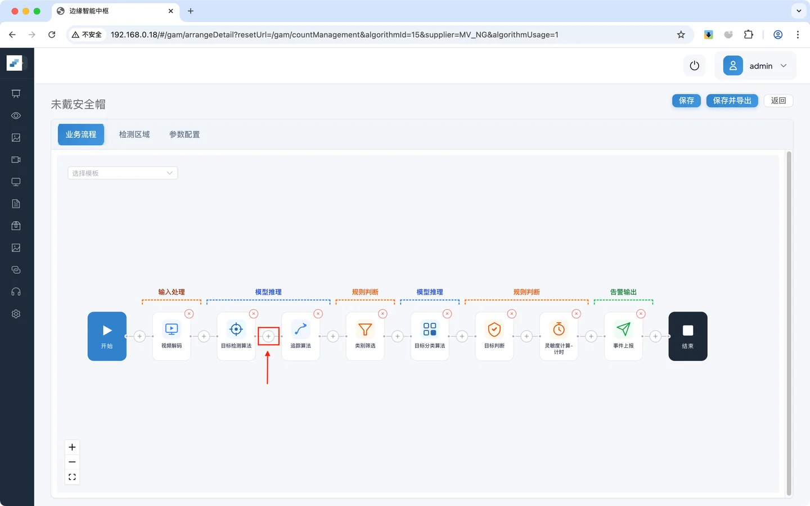

2. 点击 **添加组件**

<!-- 这是一张图片，ocr 内容为：边缘智能中枢 合 个TQ 日 8 ADMIN 保存 返回 保存并导出 未戴安全帽 检测区域 参数配置 业务流程 园 选择模板 目 告警输出 规则判断 模型推理 输入处理 模型推理 规则判断 事件上探 开始 类别筛选 灵敏服计算 目标判质 目标检动算法 结束 目标分类算法 添加组件 用除以下流程 添加分支 BI+ -->
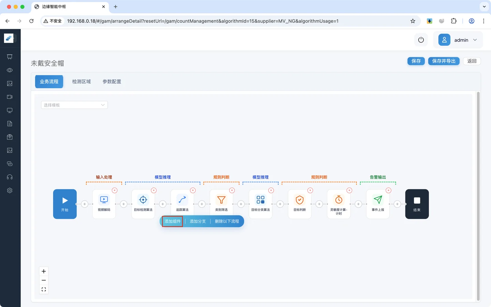

<!-- 这是一张图片，ocr 内容为：边缘智能中枢 众 个个Q B ADMIN 保存 返回 保存并导出 未戴安全帽 添加组件 参数配置 检测区域 业务流程 园 日 算法动作8 选择模板 目标检测算法 目标分类算法 追踪算法 目 检测视觉大模型 关键点算法 特征提取算法 语言视觉大模型 分割视觉大模型 输入处理 告警输出 业务处理 R 灵敏度计算-计时 视频解码 类别筛选 事件上报 灵敏度计算-计数 区域告警判断 结束 事件上报 视频解码 开始 目标判断 + B -->
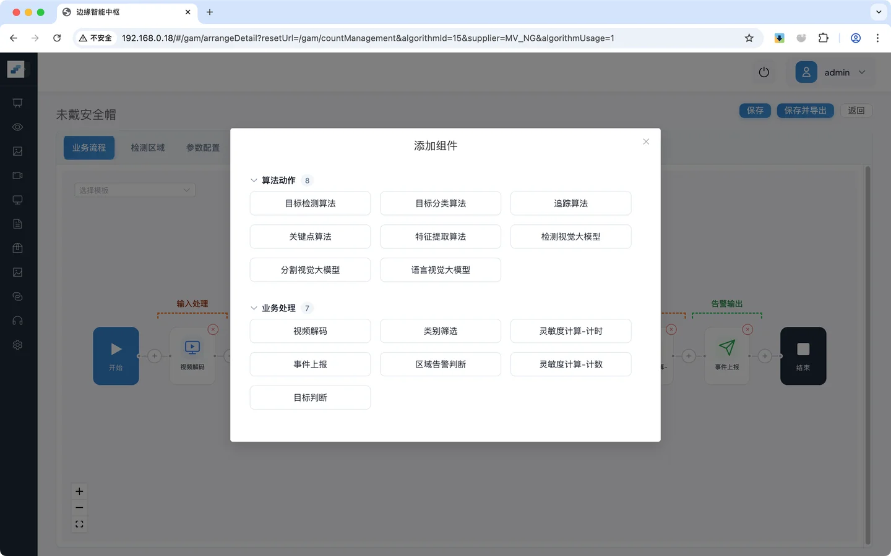

组件包括 **算法动作** 和 **业务处理** 两大类：

+ 算法动作：模型能力相关的组件，如目标检测、特征提取
+ 业务处理：编排流程相关的组件，如视频解码、事件上报


3. 选择 **类别筛选 **组件

<!-- 这是一张图片，ocr 内容为：边缘智能中枢 A,本安金 192:188, 众 B ADMIN 保存 返回 保存并导出 未戴安全帽 添加组件 参数配置 检测区域 业务流程 园 日 算法动作8 选择模板 目标检测算法 目标分类算法 追踪算法 目 检测视觉大模型 关键点算法 特征提取算法 语言视觉大模型 分割视觉大模型 输入处理 告警输出 业务处理 R 灵敏度计算-计时 类别筛选 视频解码 区域告警判断 事件上报 灵敏度计算-计数 结束 事件上报 视频解码 开始 目标判断 + B -->
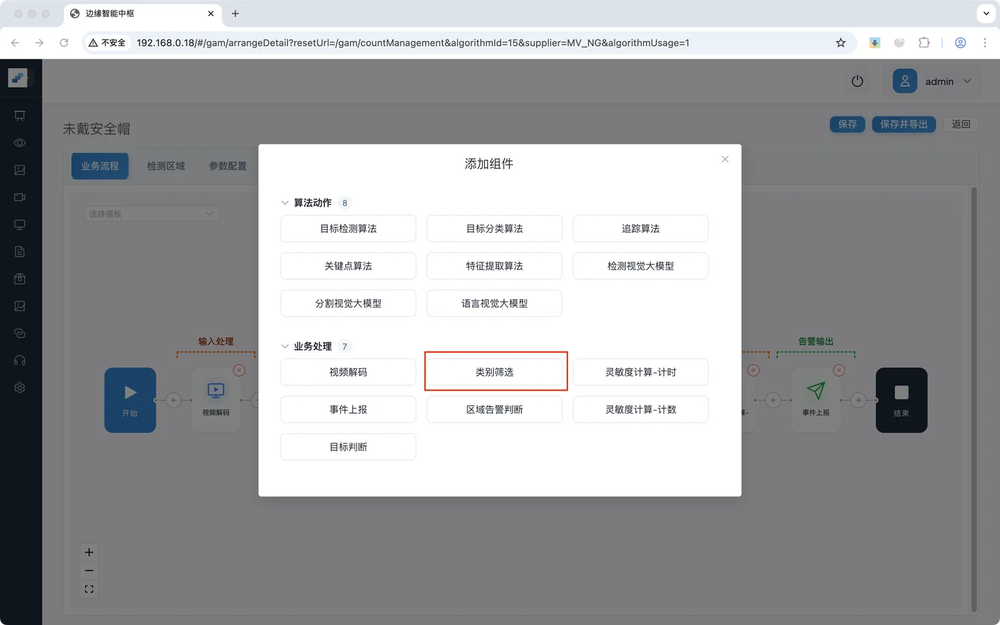


类别筛选组件插入预期位置

<!-- 这是一张图片，ocr 内容为：边缘智能中枢 合 个TQ 日 8 ADMIN 保存 返回 保存并导出 未戴安全帽 检测区域 参数配置 业务流程 园 选择模板 目 电 图 规则判断 告警输出 规则判断 输入处理 模型推理 模型推理 模型推理 规则判断 事件上报 迪蹄算法 目标判断 目标分类算法 目标检测算法 开始 奖别筛选 类别弗选 视频解码 灵敏度计算 计时 +一3 -->
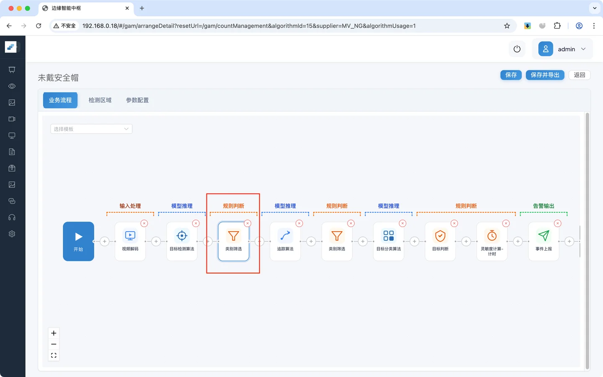


> **为什么放在这里**
>
> 尺寸过滤的目的，是尽量早地去掉无效目标。
如果等进入追踪、分类甚至后续规则之后再过滤，既浪费算力，也会增加误报
>


4. 业务逻辑配置

点击	**类别筛选** 组件，弹出配置项

<!-- 这是一张图片，ocr 内容为：边缘智能中枢 合 个TQ 日 8 ADMIN 保存 返回 保存并导出 未戴安全帽 检测区域 参数配置 业务流程 园 选择模板 目 规测判断 告露输出 规则判断 规划判断 模型推理 输入处理 电 R 开始 事件上报 目标分艾算法 招来 类别筛选 X 标签参数 目标标签 请选择 最小尺寸是否开启: -->
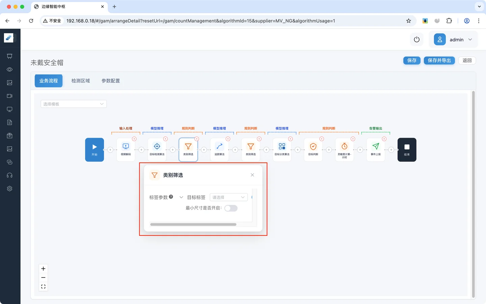

**类别筛选** 组件的配置项包括：

+ 目标标签：筛选出保留的标签
+ 最小尺寸是否开启：开启最小尺寸过滤的开关


配置目标标签为 **行人**，即保留行人这个标签，其他标签丢弃，在后面的流程中只有该标签的预测结果可以使用

<!-- 这是一张图片，ocr 内容为：边缘智能中枢 合 个TQ 日 8 ADMIN 保存 返回 保存并导出 未戴安全帽 检测区域 参数配置 业务流程 园 选择模板 目 规则判断 规则判断 告露输出 模型推理 规则判断 输入处理 电 事件上报 开始 招来 日气经测解法 X 类别筛选 目标标签 语选择 最小尺寸是否 行人检测(1001003) 行人(PEDESTRIAN) 行人安全幅检测(2001036) 头盔(PEDHELMET) 安全帽(PEDSAFEHELMET) 无帽(HATLESS) 不确定(UNSURE) -->
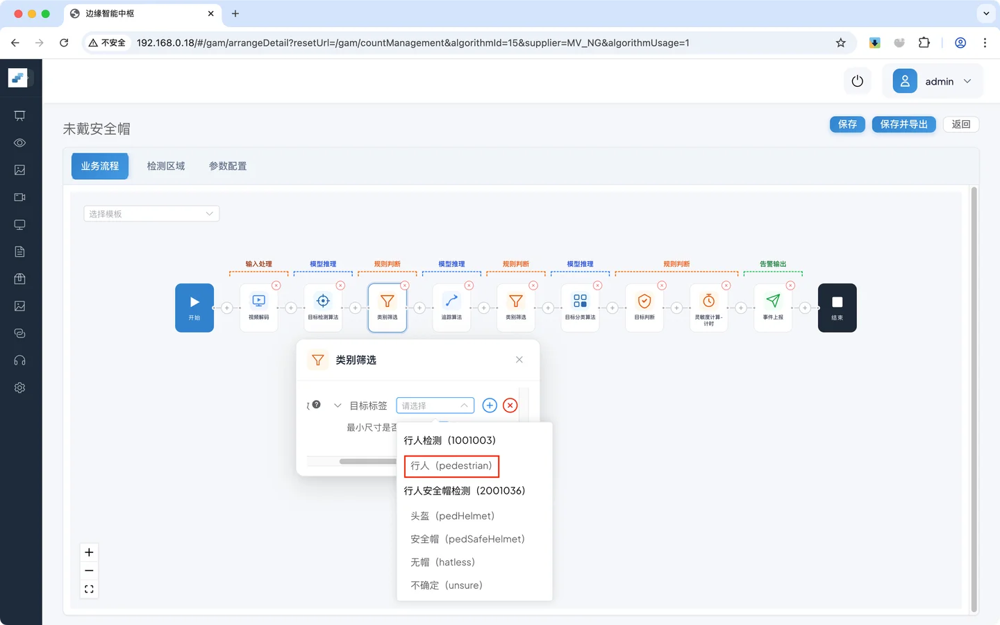


开启 **最小尺寸 **开关，小于该尺寸的预测结果都会被丢弃

<!-- 这是一张图片，ocr 内容为：边缘智能中枢 合 个TQ 日 8 ADMIN 保存 返回 保存并导出 未戴安全帽 检测区域 参数配置 业务流程 园 选择模板 目 规则判断 规则判断 告露输出 模型推理 规则判断 输入处理 电 事件上报 开始 招来 日气粉测牌法 X 类别筛选 X 目标标签 行人(PEDE... 最小尺寸是否开启: -->
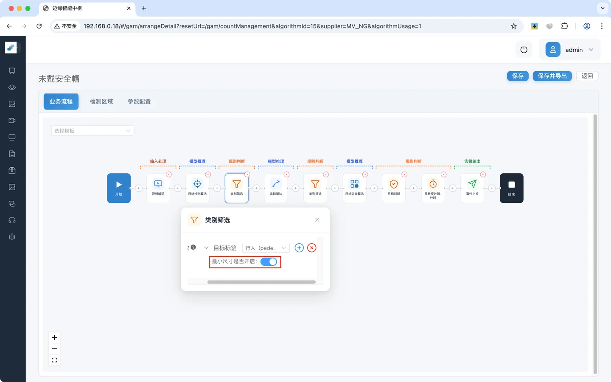

最小尺寸默认值是像素值 **60*60** ，也可以自定义过滤的最小尺寸

### 2.2 配置关键参数
最小尺寸过滤原理：当设置最小尺寸为60时，则当检测目标的面积小于60*60时，会被过滤。


点击 **参数配置，**进入参数配置页面

<!-- 这是一张图片，ocr 内容为：边缘智能中枢 合 个TQ 日 8 ADMIN 保存 返回 保存并导出 未戴安全帽 O 详细模式 检测区域 业务流程 精简模式 参数配置 参数名称 显示级别 默认值 目 安全帽置信度 不隐藏 全隐藏 电 1.0 安全帽置信度偏移 全隐藏 不隐藏 图 告警时间间隔(秒):3 不隐藏 全隐藏 不隐藏 告警次数: 全隐藏 静止目标去重 全隐藏 不隐藏 静止目标重叠率 0.2 不隐藏 全隐藏 静止目标去重时间(小时):6 不隐藏 全隐藏 全景图叠加轨迹 不隐藏 全隐藏 行人晋信度 全隐藏 不隐藏 -->
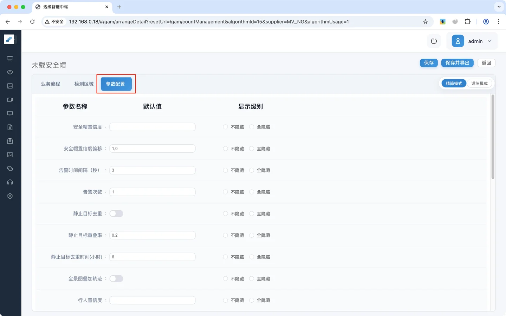


设置 **最小行人尺寸** 为40，即最小尺寸为 40 * 40

<!-- 这是一张图片，ocr 内容为：边缘智能中枢 合 个TQ 日 8 ADMIN 保存 返回 保存并导出 未戴安全帽 R 参数配置 详细模式 检测区域 精简模式 业务流程 园 行人置信度 不隐藏 全隐藏 行人置信度偏移 不隐藏 0.0 全隐藏 目 行人检测方式: 全隐藏 不隐藏 底部 电 图 行人检测追踪半径:2.3 不隐藏 全隐藏 行人检测追踪历史帧数 10 不隐藏 全隐藏 不隐藏 行人检测静止阈值: 全隐藏 80.0 最小行人尺寸:40 全隐藏 不隐藏 头盔置信度 不隐藏 全隐藏 头盔置信度偏移 不隐藏 全隐藏 1,0 无帽置信度 不隐藏 全隐藏 -->
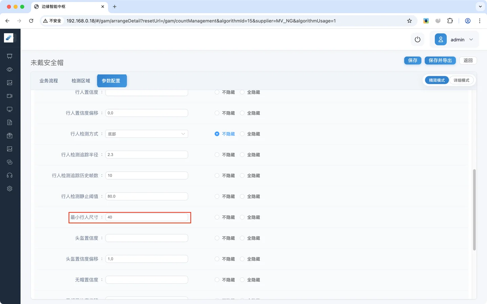


> **调参建议**
>
> 可以先把最小尺寸调到 `100`，观察效果是否过强；
再逐步回落到 `40-60`，找到当前场景下更平衡的阈值。
>

### 2.4 保存并验证
1. 点击 **保存 **按钮保存在配置

<!-- 这是一张图片，ocr 内容为：边缘智能中枢 合 个TQ 日 8 ADMIN 操作成功 返回 保存 保存并导出 未戴安全帽 参数配置 检测区域 业务流程 园 元 规则判断 告警输出 规则判断 规则判断 输入处理 模型推理 模型推理 模型推理 园 事件上报 油临算法 目标检测算法 类别筛选 灵敏座计算 视频解码 目标判断 结束 开始 目标分类算法 计时 -->
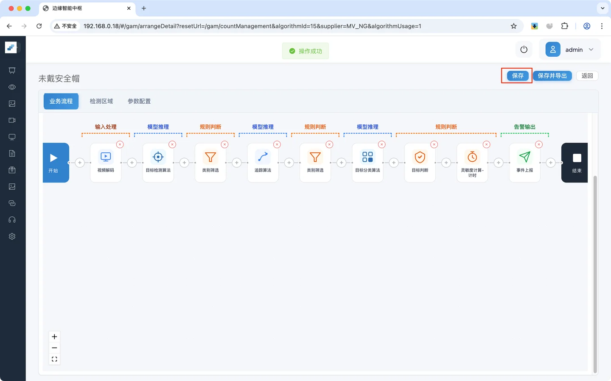

2. 进入 **视频接入** → **服务分配，**找到 **未戴安全帽 **通道

<!-- 这是一张图片，ocr 内容为：边缘智能中枢 小个Q 四 A不安全 192.168.0.18/#/VIDEOACCESS 边缘智能中枢 8 ADMIN 运行总览 视频通道 时间模板 分析展示 实时展示 通道状态: 通道名称: 请输入通道名称 全部 查询 重置 图片分析 添加 批量操作 任务配蛋 视频接入 智能服务 序号 通道编号 通道状态 通道名称 接入类型 操作 分辨率 场景任务 事件中心 详情编辑 服务分配快照 已停止 景区城墙北向 在线 破环城墙行为... 离线视频 LX000000. 资源 下载删除 中 模型仓库 详情编辑 底库管理 LX000000 工地北通道 在线 服务分配快照 已停止 未戴安全帽 离线视频 下载删除 系统 数据对接 详情编辑 人流量统计 教学楼南通道 在线 服务分配快照 已停止 LX000000 离线视频 音频管理 下载删除 系统管理 京 详情编辑 在线 三年级二班教... 已停止 服务分配快照 LX000000 离线视频 表情识别 下载删除 详情编辑 页 前往 10条/页 共9条 -->
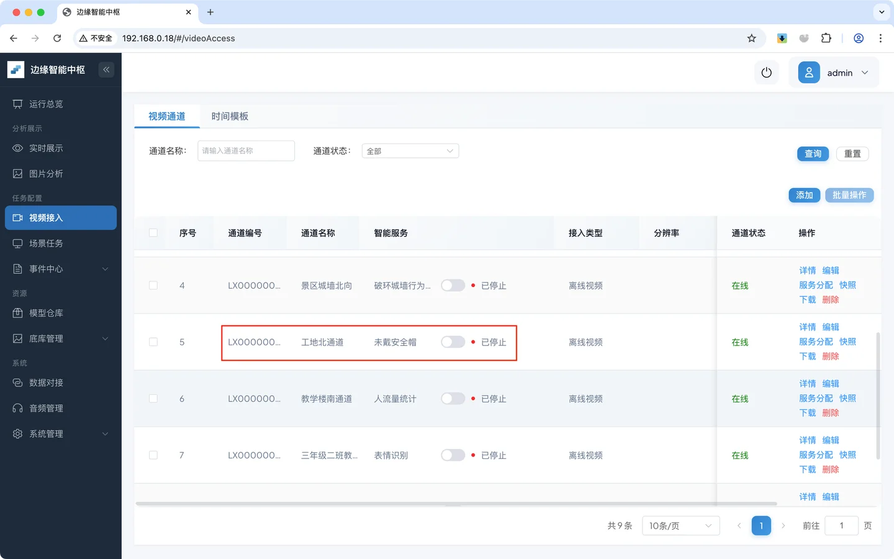

3. 启动 **未戴安全帽** 服务

<!-- 这是一张图片，ocr 内容为：边缘智能中枢 小个Q 四 A不安全 192.168.0.18/#/VIDEOACCESS 边缘智能中枢 8 ADMIN 操作成功 运行总览 视频通道 时间模板 分析展示 实时展示 通道状态: 通道名称: 请输入通道名称 全部 查询 重置 图片分析 添加 批量操作 任务配蛋 视频接入 智能服务 通道状态 序号 通道编号 分辨率 接入类型 通道名称 操作 场景任务 下载删除 事件中心 详情编辑 资源 服务分配快照 LX000000 已停止 景区城墙北向 在线 破环城墙行为.. 离线视频 中 模型仓库 下载删除 底库管理 详情编辑 在线 服务分配快照 工地北通道 LX000000 离线视频 未戴安全帽 进行中 系统 下载删除 数据对接 详情编辑 音频管理 人流量统计 已停止 离线视频 服务分配快照 在线 教学楼南通道 LX000000 下载删除 系统管理 京 详情编辑 在线 已停止 服务分配快照 表情识别 离线视频 LX000000 三年级二班教... 下载删除 前往 共9条 10条/页 -->
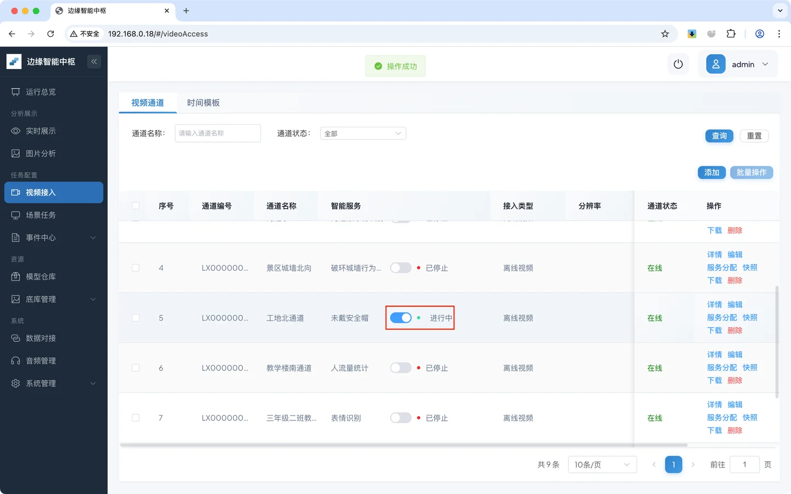

4. 进入 **实时展示** 观察变化

<!-- 这是一张图片，ocr 内容为：边缘智能中枢 四 人不安全 192.168.0.18/#/VIDEOACCESS 边缘智能中枢 8 ADMIN 运行总览 视频通道 时间模板 分析展示 实时展示 通道状态: 通道名称: 请输入通道名称 全部 查询 重置 图片分析 添加 批量操作 任务配置 视频接入 智能服务 通道编号 通道名称 接入类型 通道状态 序号 分辨率 操作 场景任务 详情编辑 事件中心 2 服务分配快照 USB摄像头 人体检测 USO00000.. 离线 已停止 删除 资源 中 模型仓库 详情编辑 服务分配快照 楼道二楼间平... 在线 LX0000000... 已停止 离线视频 楼道垃圾检测 底库管理 下载删除 系统 详情编辑 数据对接 服务分配快照 在线 河道漂浮物识别 LXO00000... 已停止 河道东 离线视频 下载删除 音频管理 详情编辑 系统管理 京 服务分配快照 景区城墙北向 在线 离线视频 已停止 LX000000 破环城增行为... 下载 删除 详情编辑 在线 1920Y1080 工地北通道 东线神频 LX000000 服务分配快昭 进行中 未戴安全帽 页 前往 共9条 10条/页 -->
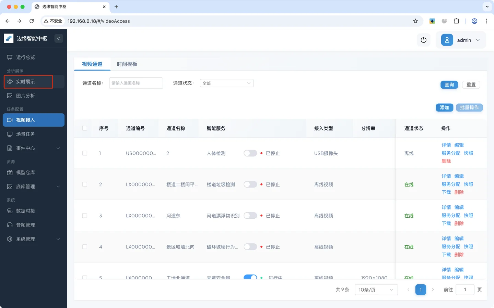


选择 **工地北通道 ，**并进入全屏

<!-- 这是一张图片，ocr 内容为：2026-05-10 12:02:08 AI视频分析 设置 退出全屏 通道列表 一屏 四屏 事件记录 今日告警数:2 输入关键词搜索 请选择 全部 楼道二楼间平台 河道东 景区城墙北向 工地北通道 事件类型:未戴安全帽 无视频信号 教学楼南通道 无视频信号 所属通道:工地北通道 三年级二班教室 告警时间:2026-05-1012:01:44 无人机交通监控 公司东侧走廊 事件类型:未戴安全帽 所属通道:工地北通道 告警时间:2026-05-1012:01:43 无视频信号 无视频信号 -->
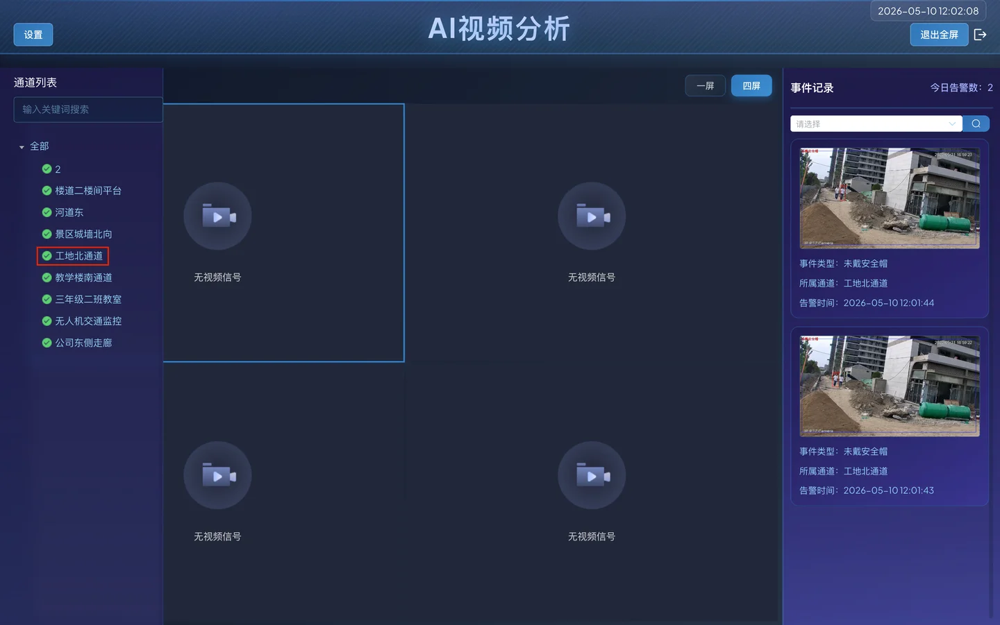


算法叠加可视化展示

<!-- 这是一张图片，ocr 内容为：2026-05-10 12:12:06 AI视频分析 退出全屏 设置 四屏 一屏 今日告警数:8 事件记录 X 当前所选:工地北通道 算法参加: 未戴安全船 请选择 2022-05-31165952 PIPELINEDURATION DECODE:3.47MS DETECT:15.57MS TRACK 0.28M BIZFILTER:0.0LMS PEDESTRIAN:0.89#56 CLASSIFY:1.13MS LOGIC:0.04MS PEDHELMET:0.00 SENSITIVITY:0.03MS PEDSAFEHELMET:1.00 ALARM:120.32MS BIZFILTER:0.02MS NORMALHAT:0.00 事件类型:未戴安全帽 OSD:9.73MS HATLESS:0.00 ENCODE:1.35MS 所属通道:工地北通道 UNSURE:0.00 告警时间:2026-05-1012:11:47 事件类型:未戴安全脂 所属通道:工地北通道 告警时间:2026-05-1012:11:46 IP PTZ CAMERA -->
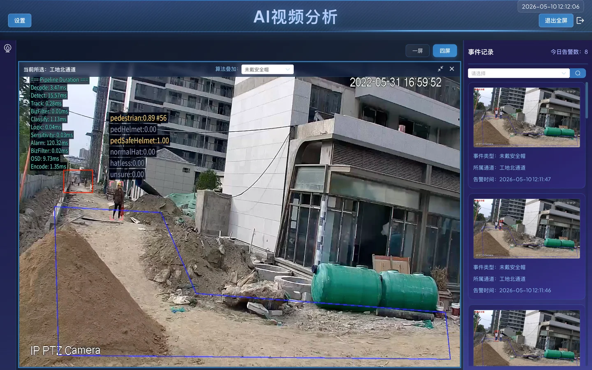


结果分析：

+ 远处过小的人体（红色框标记）目标明显变多
+ 近处清晰目标仍能正常检测和分类
+ 误报数量下降

到这里，您已经完成了第一次 场景任务修改。
这个操作模式以后会反复出现：

```plain
打开现有 场景任务→ 增删节点 → 配置参数 → 保存 → 验证
```

## 第三章：从零创建一个新的场景任务
前两章解决的是“看懂”和“会改”。本章解决的是“自己搭”。

我们仍然不从完全陌生的空白开始，而是沿用“参照现有结构”的方法。

### 场景说明
创建一条新的 **区域入侵检测 **场景任务：

+ 检测画面中的人员
+ 判断人员是否进入指定区域
+ 连续命中后触发告警
+ 在实时展示中看到框和标签

这个例子有两个好处：

+ 只使用系统内置能力，门槛低
+ 同时覆盖“检测 + 区域规则 + 告警 + 可视化”这条完整闭环

### 3.1 创建新算法
1. 进入 **场景任务 **

<!-- 这是一张图片，ocr 内容为：边缘智能中枢 192.168.0.18/#/GAM/COUNTMANAGEMENT 人不安全 边缘智能中枢 ADMIN 运行总览 任务名称: 话输入任务名称 任务类型: 请选择任务类型 重置 查询 分析展示 实时展示 批量删除 新建任务 共64个任务 导出 导入任务 图片分析 任务配置 视频接入 楼道垃圾检测 河道漂浮物识别 破环城墙行为识别 ID:81046视频分析 ID:57614视频分析 ID:6346视频分析 场景任务 检测/分析 检测/分析 检测/分析 事件中心 算法编排 算法编排 绵辑 正常 编辑 编辑 算法编排 正常 正常 资源 中 模型仓库 底库管理 8 系统 检测分类算法 表情识别 VISDRONE 数据对接 ID:11472视频分析 ID:34678图片分析 ID:5812视频分析 检测/分析 人险人体 人脸人体 音频管理 缩辑 算法编排 正常 算法编排 编辑 算法缩排 编辑 正常 正常 系统管理 京 5 3 2 4 共64条 12条/页 前往 -->
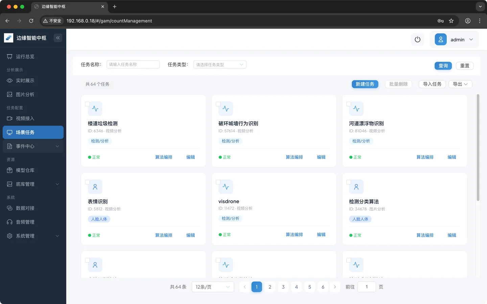

2. 点击 **新建任务 **

<!-- 这是一张图片，ocr 内容为：边缘智能中枢 192.168.0.18/#/GAM/COUNTMANAGEMENT 公不安全 边缘智能中枢 ADMIN 运行总览 任务名称: 话输入任务名称 任务类型: 请选择任务类型 重置 查询 分析展示 实时展示 批量删除 新建任务 共64个任务 导出 导入任务 图片分析 任务配置 视频接入 楼道垃圾检测 破环城墙行为识别 河道漂浮物识别 ID:6346`视频分析 ID:81046视频分析 ID:57614视频分析 场景任务 检测/分析 检测/分析 检测/分析 事件中心 算法编排 算法编排 绵辑 正常 编辑 编辑 算法编排 正常 正常 资源 模型仓库 世 底库管理 8 系统 检测分类算法 表情识别 VISDRONE 数据对接 ID:11472视频分析 ID:34678图片分析 ID:5812视频分析 检测/分析 人险人体 人脸人体 音频管理 缩辑 算法编排 正常 算法编排 编辑 算法缩排 编辑 正常 正常 系统管理 京 5 3 2 4 共64条 12条/页 前往 -->
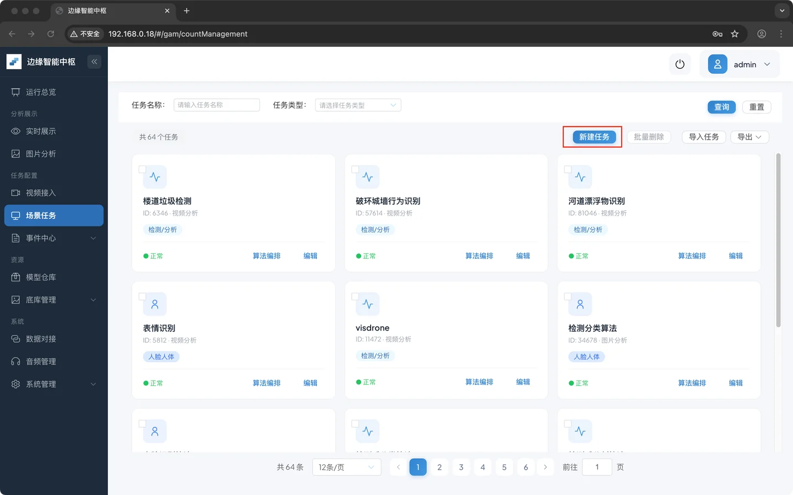

<!-- 这是一张图片，ocr 内容为：边缘智能中枢 192.168.0.18/#/GAM/COUNTMANAGEMENT 不安全 边缘智能中枢 ADMIN 运行总览 话输入任务名称 任务名称: 任务类型: 请选择任务类型 重置 查询 分析展示 新建任务 实时展示 批量删除 新建任务 共64个任务 导入任务 导出 任务名称: 请输入任务名称 图片分析 任务配置 *数据源类型: 请选择数据源类型 视频接入 楼道垃圾检测 河道漂浮物识别 任务类型: 请选择任务类型 ID:81046视频分析 ID:6346视频分析 场景任务 检测/分析 检测/分析 限300个字符 说明: 事件中心 算 编辑 正常 算法编排 正常 资源 母 模型仓库 底库管理 D M 确定 取消 系统 检测分类算法 表情识别 VISDRONE 数据对接 ID:34678图片分析 ID:11472 视频分析 ID:5812视频分析 人验人体 检测/分析 人脸人体 音频管理 算法编排 编辑 正常 算法编排 编辑 算法编排 编辑 正常 正常 系统管理 共64条 12条/页 前往 -->
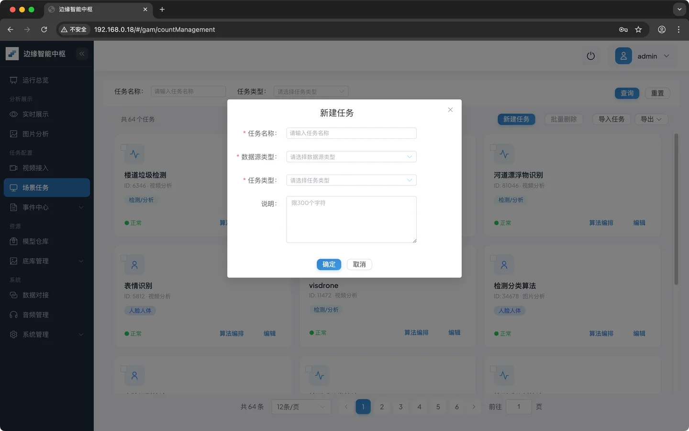

3. 填写基础信息

| 字段 | 填写内容 |
| --- | --- |
| 任务名称 | 区域入侵检测 |
| 数据源类型 | 视频分析 |
| 任务类型 | 检测/分析 |


<!-- 这是一张图片，ocr 内容为：边缘智能中枢 192.168.0.18/#/GAM/COUNTMANAGEMENT 不安全 边缘智能中枢 ADMIN 运行总览 话输入任务名称 任务名称: 任务类型: 请选择任务类型 重置 查询 分析展示 新建任务 实时展示 批量删除 新建任务 共64个任务 导入任务 导出 区域入侵检测 任务名称: 图片分析 2 任务配置 数据源类型: 视频分析 视频接入 楼道垃圾检测 河道漂浮物识别 任务类型: 检测/分析 ID:81046视频分析 ID:6346视频分析 场景任务 检测/分析 检测/分析 限300个字符 说明: 事件中心 算 编辑 正常 算法编排 正常 资源 母 模型仓库 底库管理 D M 确定 取消 系统 检测分类算法 表情识别 VISDRONE 数据对接 ID:34678图片分析 ID:11472视频分析 ID:5812视频分析 检测/分析 人验人体 人脸人体 音频管理 算法编排 编辑 正常 算法编排 编辑 算法编排 编辑 正常 正常 系统管理 共64条 12条/页 前往 -->
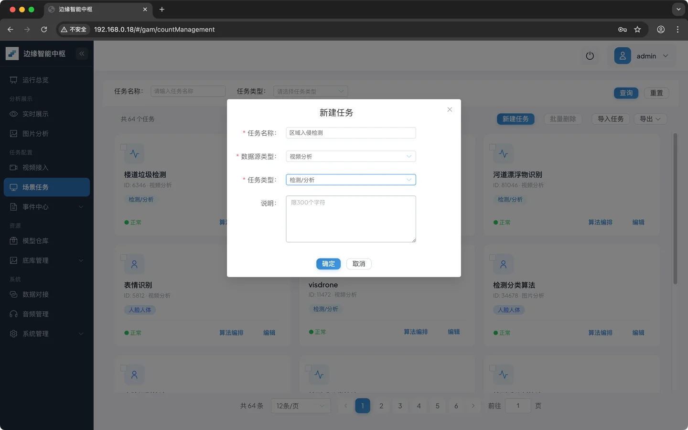

点击 **确定** 保存任务。

<!-- 这是一张图片，ocr 内容为：边缘智能中枢 192.168.0.18/#/GAM/COUNTMANAGEMENT 公不安全 边缘智能中枢 ADMIN 运行总览 任务名称: 话输入任务名称 任务类型: 请选择任务类型 重置 查询 分析展示 实时展示 批量删除 导出 新建任务 导入任务 共65个任务 图片分析 任务配置 视频接入 楼道垃圾检测 区域入侵检测 破环城墙行为识别 ID:6346-视频分析 ID:73782视频分析 ID:57614视频分析 场景任务 检测/分析 检测/分析 检测/分析 事件中心 算法编排 算法编排 绵辑 编辑 算法编排 正常 编辑 正常 正常 资源 模型仓库 中 底库管理 系统 河道漂浮物识别 表情识别 VISDRONE 数据对接 ID:11472视频分析 ID:5812视频分析 ID:81046 视频分析 检测/分析 检测/分析 人脸人体 音频管理 编辑 算法编排 正常 算法编排 丝窝车焊 算法编排 编辑 正常 正常 系统管理 京 8 5 3 4 共65条 前往 12条/页 -->
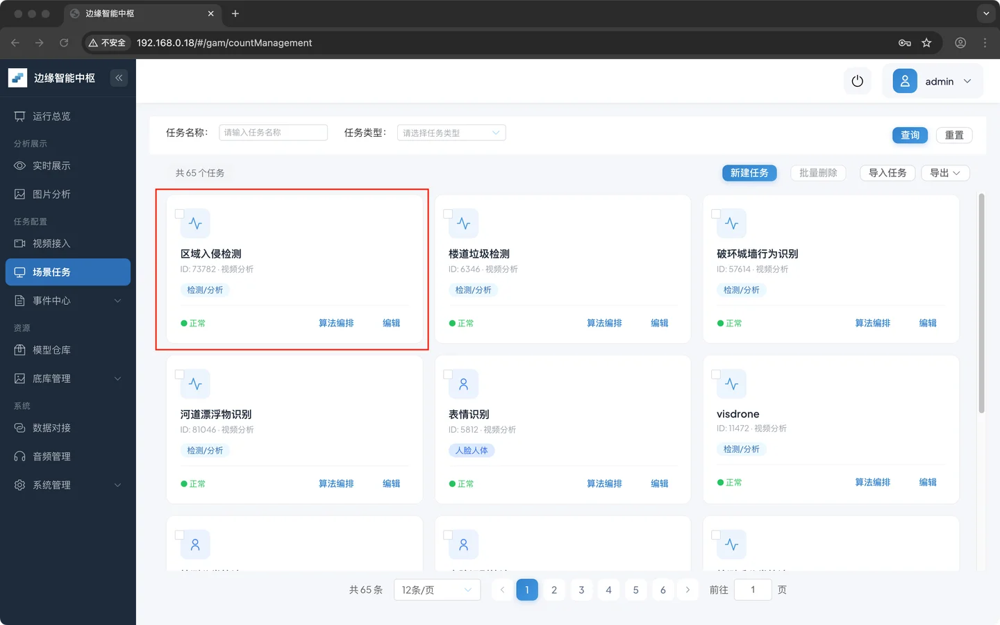

### 3.2 搭建 场景任务的算法编排
#### 准备工作
点击 **算法编排** 进入空白编排页面

<!-- 这是一张图片，ocr 内容为：边缘智能中枢 192.168.0.18/#/GAM/COUNTMANAGEMENT 公不安全 边缘智能中枢 ADMIN 运行总览 任务名称: 话输入任务名称 任务类型: 请选择任务类型 重置 查询 分析展示 实时展示 批量删除 共65个任务 导出 新建任务 导入任务 图片分析 任务配置 视频接入 区域入侵检测 楼道垃圾检测 破环城墙行为识别 ID:73782-视频分析 ID:6346-视频分析 ID:57614视频分析 场景任务 检测/分析 检测/分析 检测/分析 事件中心 算法编排 绵辑 算法编排 编辑 编辑 算法编排 正常 正常 正常 资源 模型仓库 世 底库管理 系统 河道漂浮物识别 表情识别 VISDRONE 数据对接 ID:11472视频分析 ID:5812视频分析 ID:81046 视频分析 检测/分析 检测/分析 人脸人体 音频管理 编辑 算法编排 正常 算法编排 丝窝车焊 算法编排 编辑 正常 正常 系统管理 京 8 5 3 4 共65条 前往 12条/页 -->
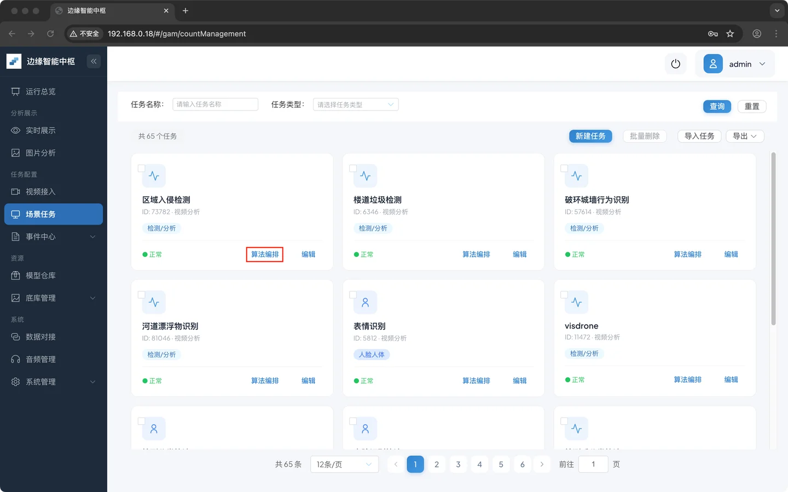

空白的编排链路只包含开始和结束节点

<!-- 这是一张图片，ocr 内容为：边缘智能中枢 192.168.0.18//GAMJARRANGEDETALTRESERJRITHMUSAGE-1 不安全 8 ADMIN 保存 返回 保存并导出 区域入侵检测 业务流程 检测区域 参数配置 园 选择模板 目 图 开始 结束 +IG -->
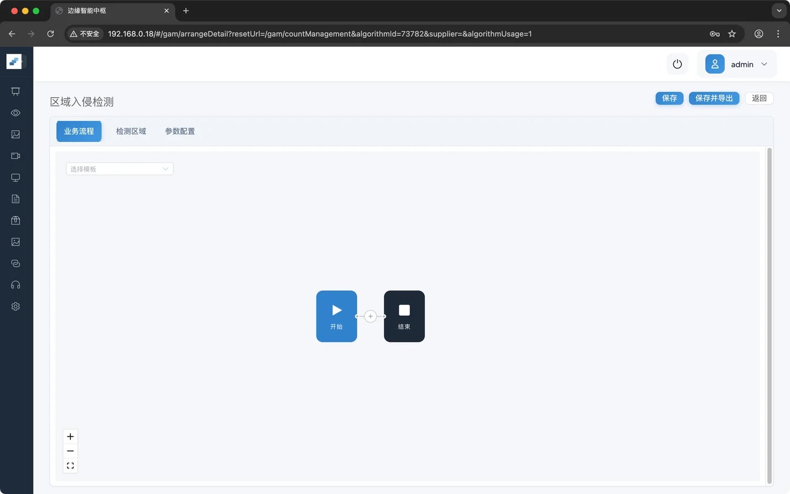


两个节点之间的加号按钮用于添加各种组件

<!-- 这是一张图片，ocr 内容为：边缘智能中枢 192.168.0.18/4/GAMJARRANGEDETAITRESETJJIF/GAM/COUNTMANAGEMENT8ALGORTHMLD-737828SUPPLIER-8ALGORITHMUSA 不安全 8 ADMIN 保存 返回 保存并导出 区域入侵检测 业务流程 检测区域 参数配置 园 日 选择模板 目 电 开始 结束 -->
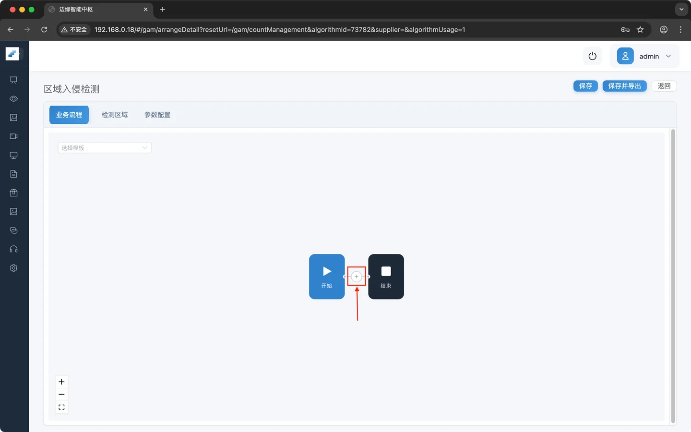


点击 **加号** 之后弹出操作选项，**添加组件 **用于添加各种算法组件

<!-- 这是一张图片，ocr 内容为：边缘智能中枢 192.168.0.18/4/GAMJARRANGEDETAITRESETJJIF/GAM/COUNTMANAGEMENT8ALGORTHMLD-737828SUPPLIER-8ALGORITHMUSA 不安全 8 ADMIN 保存 返回 保存并导出 区域入侵检测 业务流程 检测区域 参数配置 园 日 选择模板 目 电 开始 结束 添加组件 删除以下流程 赤加分支 -->
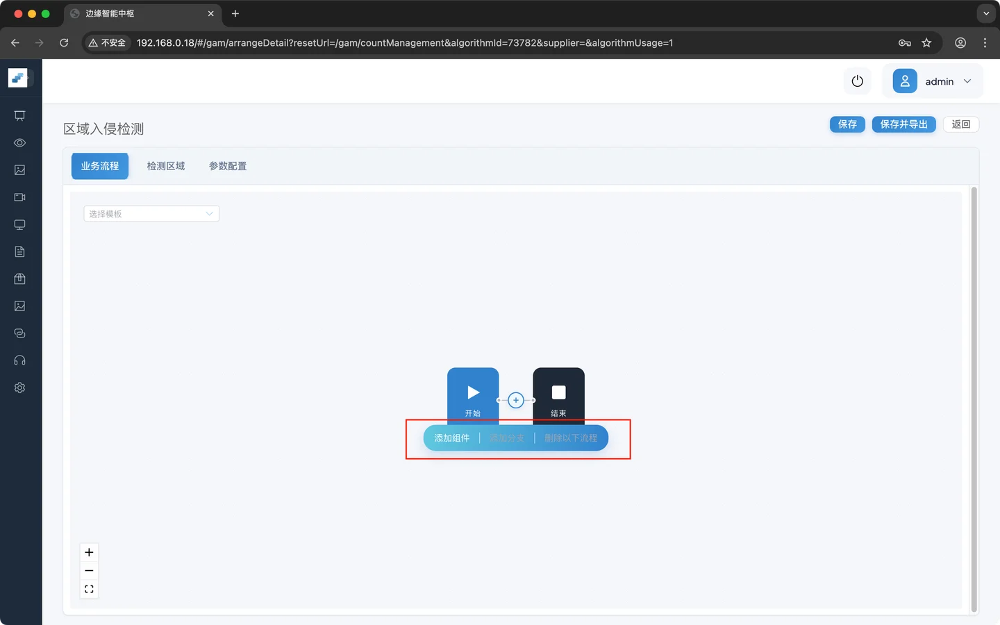


点击 **添加组件** ，弹出面板显示所有的组件。面板中的组件详细信息可参考 **附录A 节点速查表**

<!-- 这是一张图片，ocr 内容为：边缘智能中枢 192.168.0.18/F/GAMJARRANGEDETALYRESEIJRLF/GAM/COUNTMANAGEMENT&ALGORIHMLD:737828SUPPLIER-8ALGORIHMUSAG 不安全 ADMIN 保存 返回 保存并导出 区域入侵检测 添加组件 参数配置 检测区域 业务流程 园 算法动作8 选择模板 目标检测算法 目标分类算法 追踪算法 目 检测视觉大模型 关键点算法 特征提取算法 语言视觉大模型 分割视觉大模型 业务处理 灵敏度计算-计时 视频解码 类别筛选 事件上报 灵敏度计算-计数 区域告警判断 目标判断 +LS -->
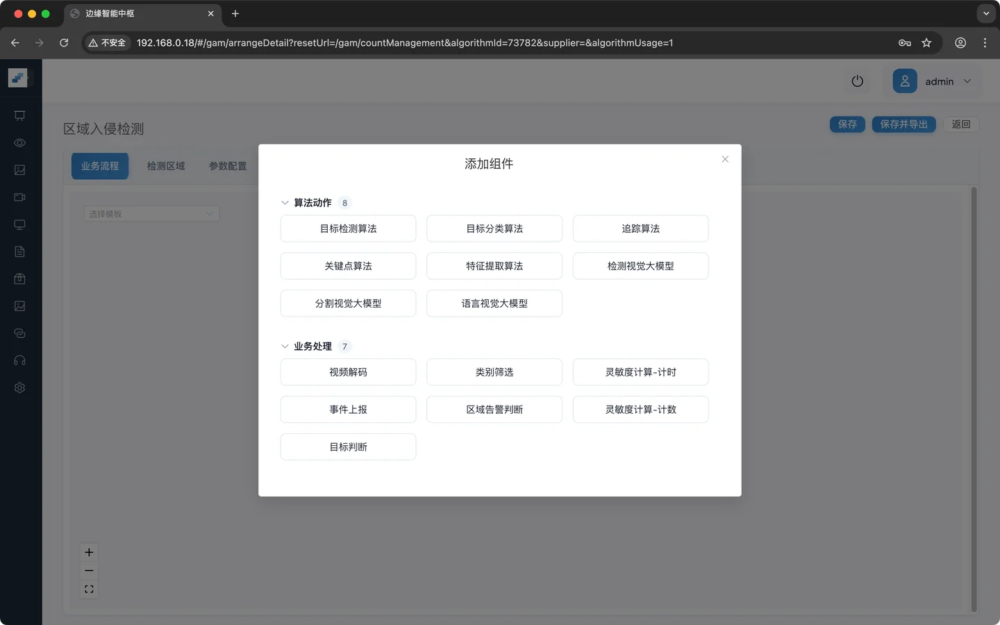


按下面顺序添加节点：

```plain
视频解码 → 目标检测 → 目标追踪 → 区域判定 → 灵敏度计算 → 事件上报
```

#### 第一步：添加视频解码
视频解码节点是所有 场景任务的起点，作用是将视频流解码为逐帧图像，视频流可以是RTSP流也可以是视频文件

<!-- 这是一张图片，ocr 内容为：边缘智能中枢 192.168.0.18/F/GAMJARRANGEDETALYRESEIJRLF/GAM/COUNTMANAGEMENT&ALGORIHMLD:737828SUPPLIER-8ALGORIHMUSAG 不安全 ADMIN 保存 返回 保存并导出 区域入侵检测 添加组件 参数配置 检测区域 业务流程 园 算法动作8 选择模板 目标检测算法 目标分类算法 追踪算法 目 检测视觉大模型 特征提取算法 关键点算法 语言视觉大模型 分割视觉大模型 业务处理 灵敏度计算-计时 类别筛选 视频解码 事件上报 区域告警判断 灵敏度计算-计数 目标判断 +LS -->
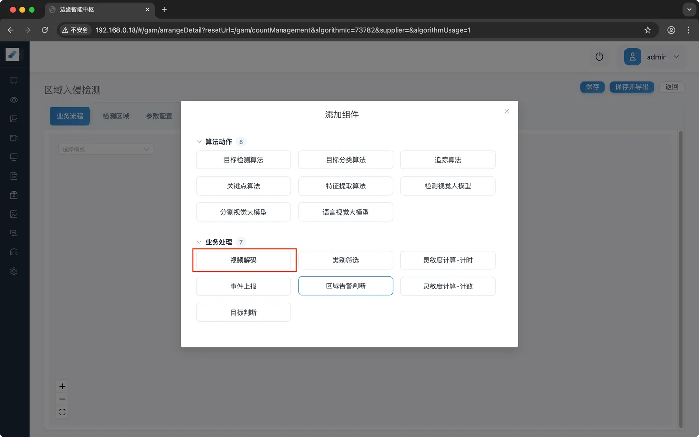

<!-- 这是一张图片，ocr 内容为：边缘智能中枢 192.168.0.18/4/GAMJARRANGEDETAITRESETJJIF/GAM/COUNTMANAGEMENT8ALGORTHMLD-737828SUPPLIER-8ALGORITHMUSA 不安全 ADMIN 保存 返回 保存并导出 区域入侵检测 业务流程 检测区域 参数配置 园 日 选择模板 目 电 输入处理 开始 结束 视频彩码 -->
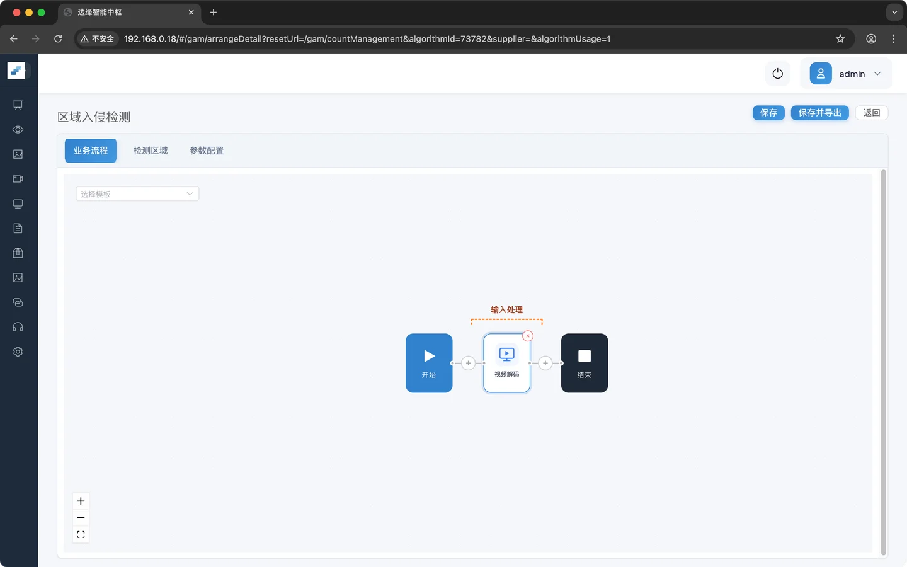


业务逻辑配置

点击 **视频解码** 展示需要配置的参数。由于视频解码没有配置项，所以空白。

<!-- 这是一张图片，ocr 内容为：边缘智能中枢 192.168.0.18//GAMJARRANGEDETALTRESERJRITHMUSAGE-1 不安全 ADMIN 保存 返回 保存并导出 区域入侵检测 业务流程 检测区域 参数配置 园 选择模板 目 输入处理 开始 目标检测算法 视频解码 X -->
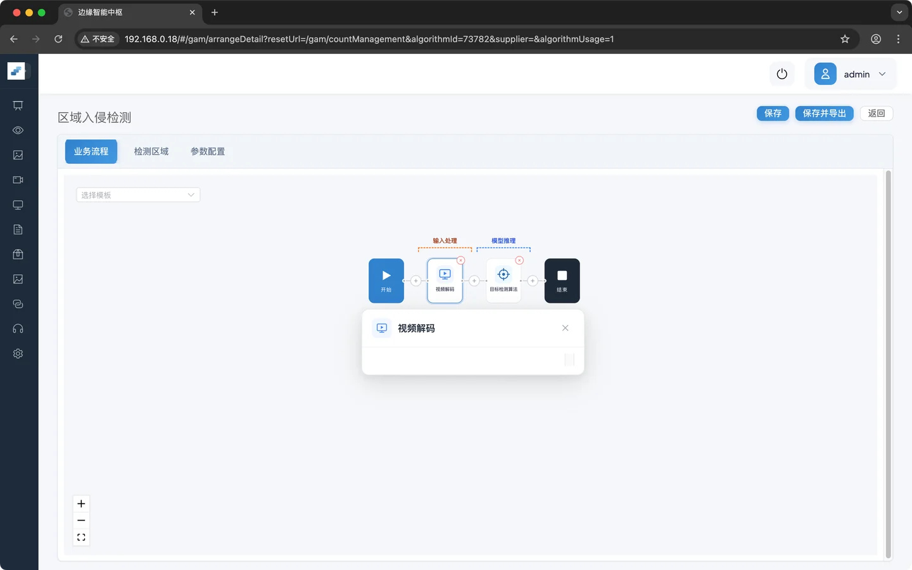

#### 第二步：添加目标检测
解码后的图像输入目标检测模型，输出目标位置信息和类别信息

<!-- 这是一张图片，ocr 内容为：边缘智能中枢 192.168.0.18/F/GAMJARRANGEDETALYRESEIJRLF/GAM/COUNTMANAGEMENT&ALGORIHMLD:737828SUPPLIER-8ALGORIHMUSAG 不安全 ADMIN 保存 返回 保存并导出 区域入侵检测 添加组件 检测区域 业务流程 参数配置 园 西 算法动作 8 选择模板 目标检测算法 目标分类算法 追踪算法 目 检测视觉大模型 特征提取算法 关键点算法 语言视觉大模型 分割视觉大模型 业务处理 灵敏度计算-计时 视频解码 类别筛选 事件上报 灵敏度计算-计数 区域告警判断 目标判断 +LB -->
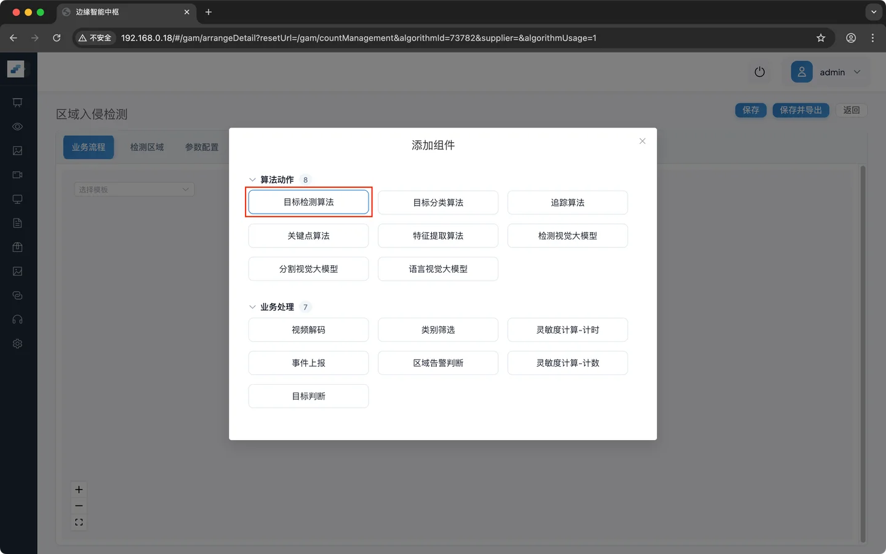

<!-- 这是一张图片，ocr 内容为：边缘智能中枢 192.168.0.18//GAMJARRANGEDETALTRESERJRITHMUSAGE-1 不安全 ADMIN 保存 返回 保存并导出 区域入侵检测 业务流程 参数配置 检测区域 园 日 选择模板 目 电 输入处理 模型推理 结束 目标检测算法 视频解码 开始 +一3 -->
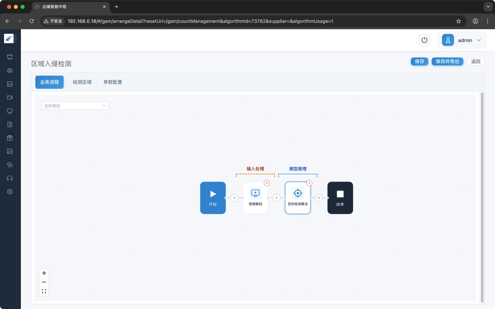


业务逻辑配置

<!-- 这是一张图片，ocr 内容为：边缘智能中枢 192.168.0.18//GAMJARRANGEDETALTRESERJRITHMUSAGE-1 不安全 ADMIN 保存 返回 保存并导出 区域入侵检测 业务流程 参数配置 检测区域 园 日 选择模板 目 (+) 日际轻润脉法 开始 福束 目标检测算法 选择原子模型 PEDESTRIANDETECTION (I001... 选择标签 类别 是否 序号 名称 使用 标识 PEDE PEDE STRIAN STRIAN 自定义取帧频率? A1. -->
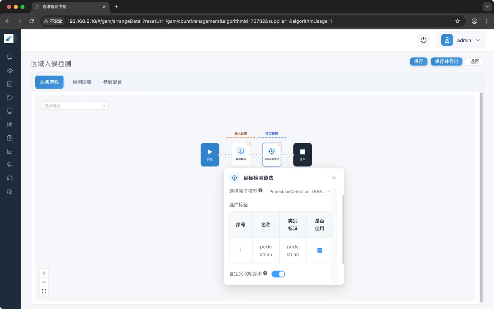

原子模型：PedestrianDetection （行人检测模型）

选择标签：Pedstrian （行人）

自定义取帧频率：开启

#### 第三步：添加目标追踪
对检测到的目标进行追踪，让前后帧的同一个目标能关联起来，为后续业务逻辑提供身份ID

<!-- 这是一张图片，ocr 内容为：边缘智能中枢 192.168.0.18/F/GAMJARRANGEDETALYRESEIJRLF/GAM/COUNTMANAGEMENT&ALGORIHMLD:737828SUPPLIER-8ALGORIHMUSAG 不安全 ADMIN 保存 返回 保存并导出 区域入侵检测 X 添加组件 参数配置 检测区域 业务流程 园 算法动作8 选择模板 目标检测算法 目标分类算法 追踪算法 园 检测视觉大模型 关键点算法 特征提取算法 语言视觉大模型 分割视觉大模型 业务处理 灵敏度计算-计时 视频解码 类别筛选 事件上报 灵敏度计算-计数 区域告警判断 目标判断 +LG -->
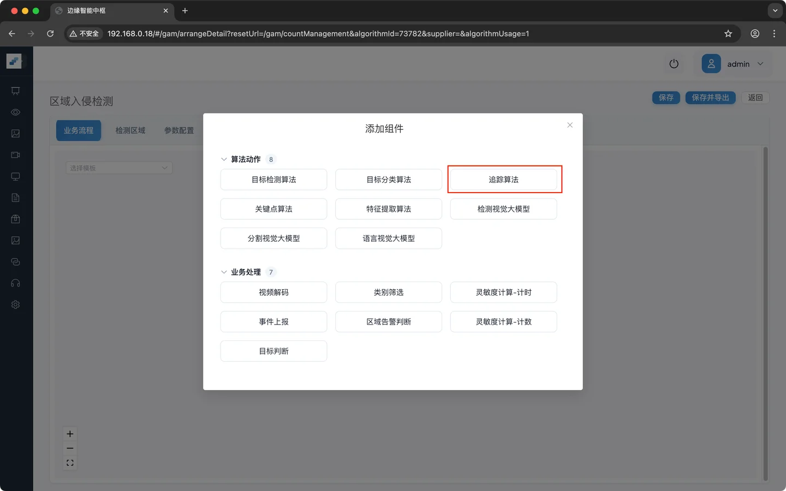


<!-- 这是一张图片，ocr 内容为：边缘智能中枢 192.168.0.18//GAMJARRANGEDETALTRESERJRITHMUSAGE-1 不安全 ADMIN 保存 返回 保存并导出 区域入侵检测 业务流程 参数配置 检测区域 园 日 选择模板 目 输入处理 模型推理 开始 视频解码 追踪算法 目标检测算法 结束 +13 -->
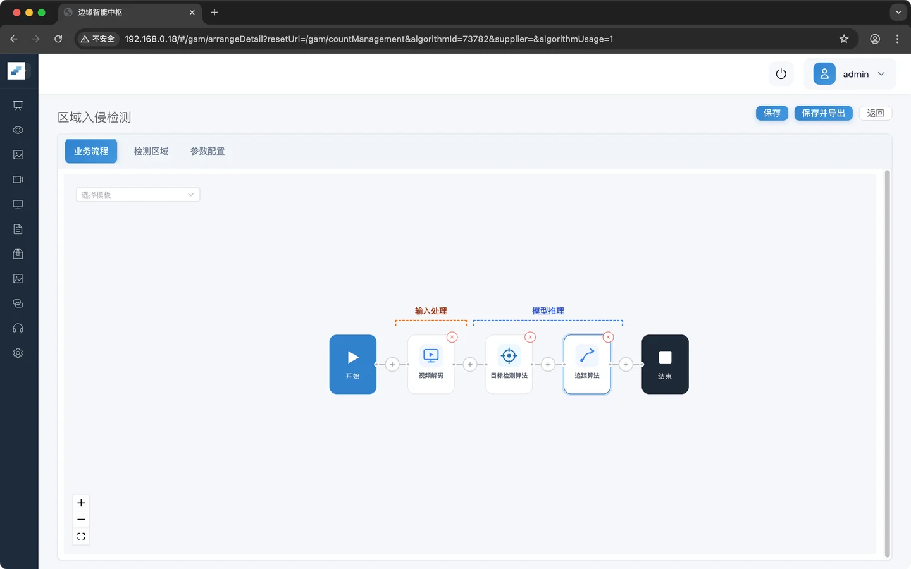


业务逻辑配置

<!-- 这是一张图片，ocr 内容为：边缘智能中枢 192.168.0.18//GAMJARRANGEDETALTRESERJRITHMUSAGE-1 不安全 ADMIN 保存 返回 保存并导出 区域入侵检测 业务流程 参数配置 检测区域 园 选择模板 目 输入处理 特型推理 1X 电话 开始 追踪算法 标签过滤参数 PEDESTRIANDETECTION (1001 状态判断 运动状态 形变状态判断 不需要 +13 -->
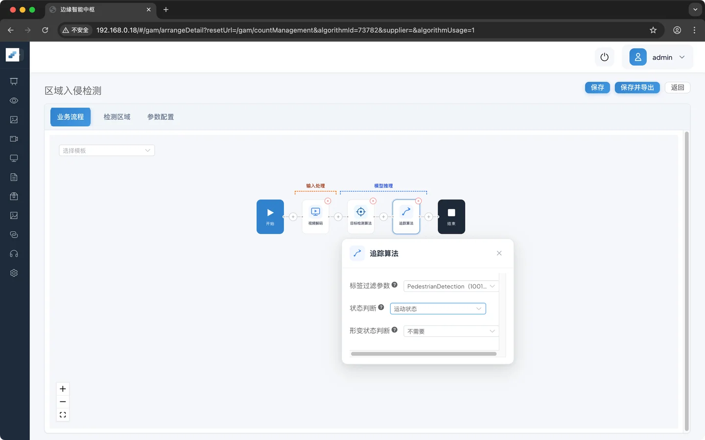

标签过滤参数：PedestrianDetection，追踪该标签

状态判断：运动状态，

形变状态判断：不需要

#### 第四步：添加区域判定
绘制一个区域用于实现业务中的入侵范围，进入该区域中触发告警事件

<!-- 这是一张图片，ocr 内容为：边缘智能中枢 192.168.0.18/F/GAMJARRANGEDETALYRESEIJRLF/GAM/COUNTMANAGEMENT&ALGORIHMLD:737828SUPPLIER-8ALGORIHMUSAG 不安全 ADMIN 保存 返回 保存并导出 区域入侵检测 添加组件 参数配置 检测区域 业务流程 园 西 算法动作8 选择模板 目标检测算法 目标分类算法 追踪算法 园 检测视觉大模型 关键点算法 特征提取算法 语言视觉大模型 分割视觉大模型 业务处理 灵敏度计算-计时 视频解码 类别筛选 灵敏度计算-计数 事件上报 区域告警判断 目标判断 +LB -->
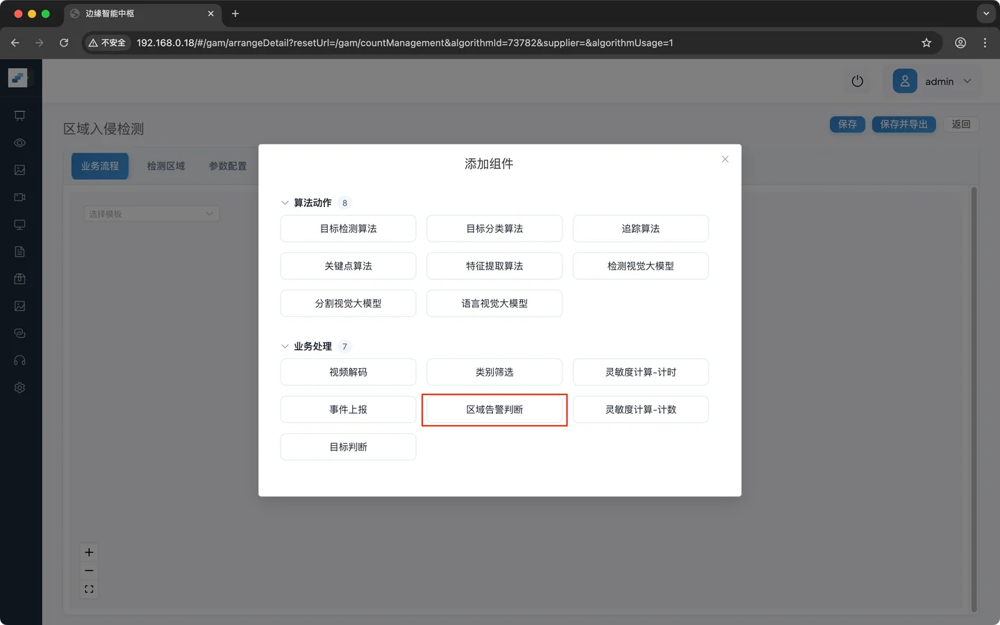

<!-- 这是一张图片，ocr 内容为：边缘智能中枢 192.168.0.18//GAMJARRANGEDETALTRESERJRITHMUSAGE-1 不安全 ADMIN 保存 返回 保存并导出 区域入侵检测 参数配置 业务流程 检测区域 园 日 选择模板 目 规则判断 输入处理 模型推理 开始 目标检测算法 视频解码 追踪算法 区域告警判断 结束 +13 -->
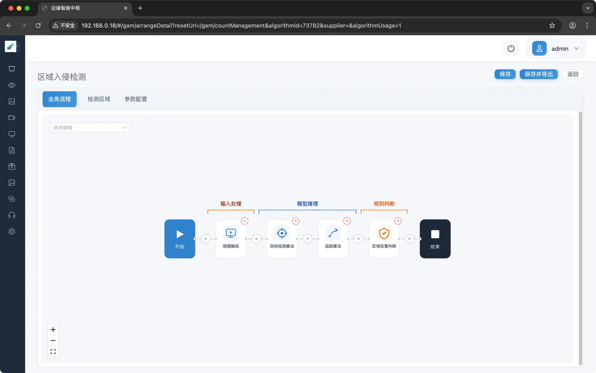


业务逻辑配置

<!-- 这是一张图片，ocr 内容为：边缘智能中枢 众 个小Q 8 ADMIN 保存 返回 保存并导出 区域入侵检测 业务流程 检测区域 参数配置 园 日 选择模板 目 规则判断 输入处理 开始 区项告警兴所 日标验和算法 区域告警判断 区域告警统计方式 数量限制(用于离岗/聚集) 输入区域类型 主区域 -->
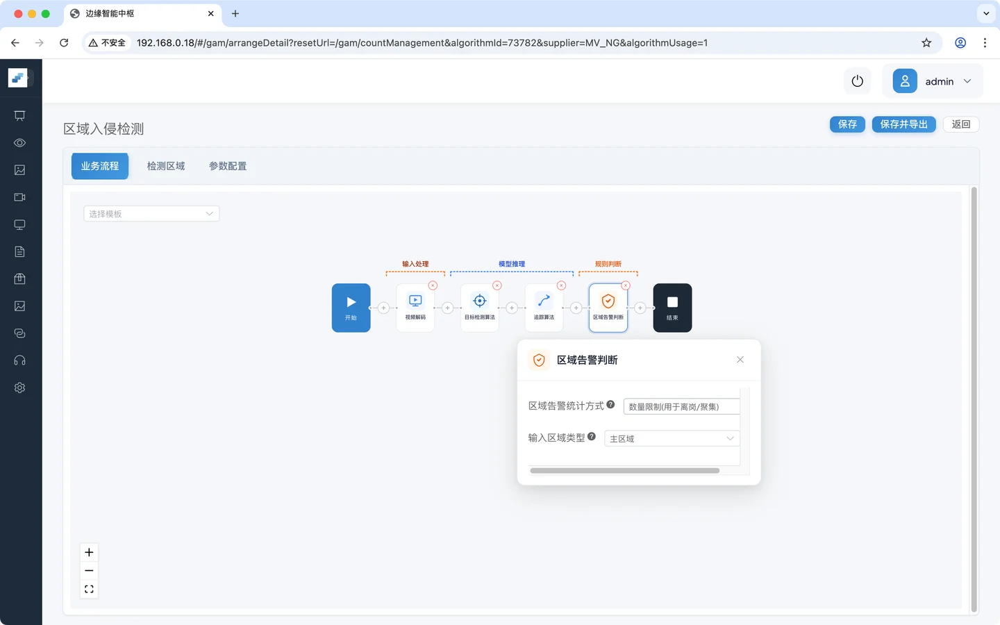

区域告警统计：数量限制(用于离岗/聚集)

输入区域类型：主区域


#### 第五步：添加灵敏度计算
检测单帧就触发告警的误报较高，可以通过灵敏度来检测误报，具体实现就是多帧累积后再触发告警

<!-- 这是一张图片，ocr 内容为：边缘智能中枢 192.168.0.18/F/GAMJARRANGEDETALYRESEIJRLF/GAM/COUNTMANAGEMENT&ALGORIHMLD:737828SUPPLIER-8ALGORIHMUSAG 不安全 ADMIN 保存 返回 保存并导出 区域入侵检测 添加组件 参数配置 检测区域 业务流程 园 西 算法动作8 选择模板 目标检测算法 目标分类算法 追踪算法 园 检测视觉大模型 关键点算法 特征提取算法 语言视觉大模型 分割视觉大模型 业务处理 灵敏度计算-计时 视频解码 类别筛选 事件上报 灵敏度计算-计数 区域告警判断 目标判断 +一3 -->
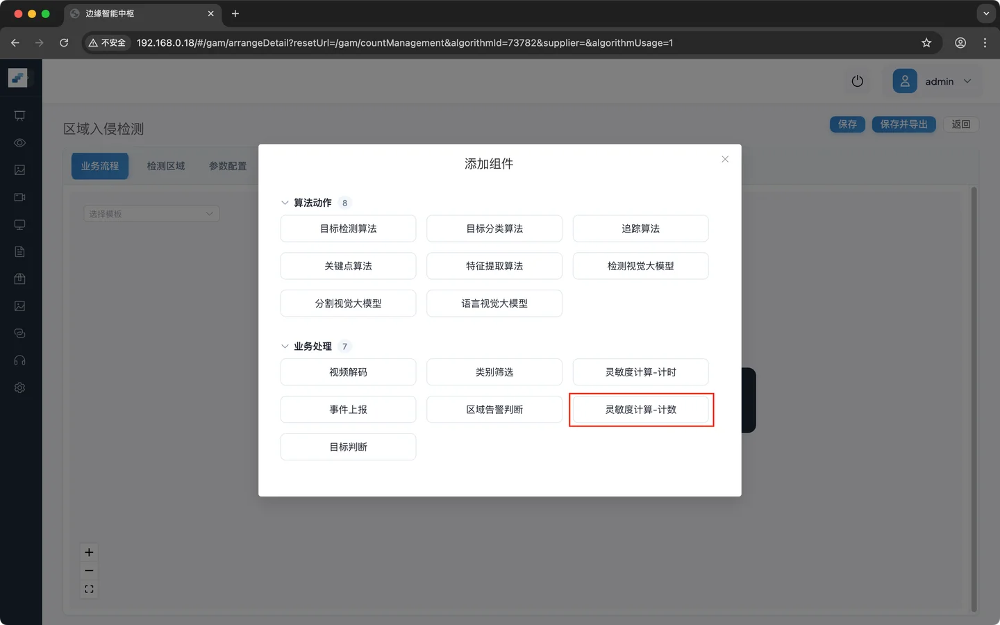

<!-- 这是一张图片，ocr 内容为：边缘智能中枢 192.168.0.18/4/GAMJARRANGEDETAITRESETJJIF/GAM/COUNTMANAGEMENT8ALGORTHMLD-737828SUPPLIER-8ALGORITHMUSA 不安全 ADMIN 保存 返回 保存并导出 区域入侵检测 业务流程 检测区域 参数配置 园 日 选择模板 目 规则判断 输入处理 模型推理 区域告警判断 目标检测算法 灵敏度计算 结束 开始 泊湖算法 +一3 -->
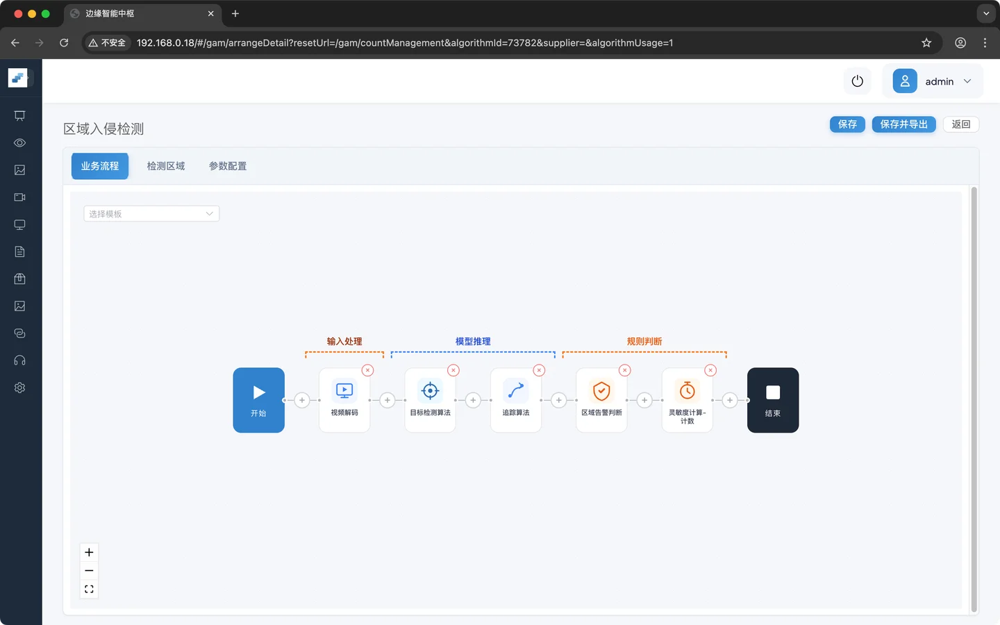

业务逻辑配置

<!-- 这是一张图片，ocr 内容为：边缘智能中枢 192.168.0.18/M/GAMJARRANGEDETAITRESERJIER-8ALGOUNTMANAGEMENT8ALGORITHMLD-737828SUPPLIER-8ALGORITHMUSA 不安全 ADMIN 保存 返回 保存并导出 区域入侵检测 业务流程 参数配置 检测区域 园 选择模板 目 临南 事件上经 目标准有限公 开始 灵敏度计算-计数 X -->
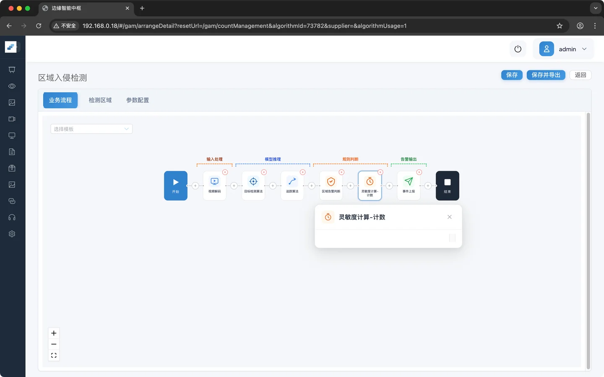

#### 第六步：添加事件上报
产生的告警事件上报给系统用于统计或及时推送终端

<!-- 这是一张图片，ocr 内容为：边缘智能中枢 192.168.0.18/F/GAMJARRANGEDETALYRESEIJRLF/GAM/COUNTMANAGEMENT&ALGORIHMLD:737828SUPPLIER-8ALGORIHMUSAG 不安全 ADMIN 保存 返回 保存并导出 区域入侵检测 添加组件 参数配置 检测区域 业务流程 园 日 算法动作8 选择模板 目标检测算法 目标分类算法 追踪算法 园 检测视觉大模型 关键点算法 特征提取算法 语言视觉大模型 分割视觉大模型 业务处理 灵敏度计算-计时 视频解码 类别筛选 灵敏度计算-计数 区域告警判断 事件上报 结束 目标判断 +LB -->
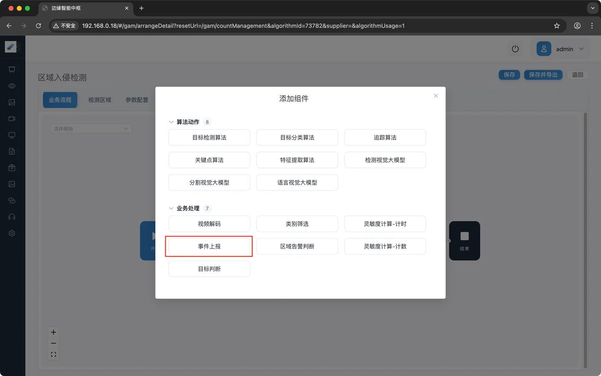

<!-- 这是一张图片，ocr 内容为：边缘智能中枢 192.168.0.18//GAMJARRANGEDETALTRESERJRITHMUSAGE-1 不安全 ADMIN 保存 返回 保存并导出 区域入侵检测 业务流程 参数配置 检测区域 园 日 选择模板 目 告警输出 模型推理 输入处理 规则判断 结束 事件上报 迫蹄算法 开始 区域告警判断 目标检测算法 灵敏魔计算 计数 +一3 -->
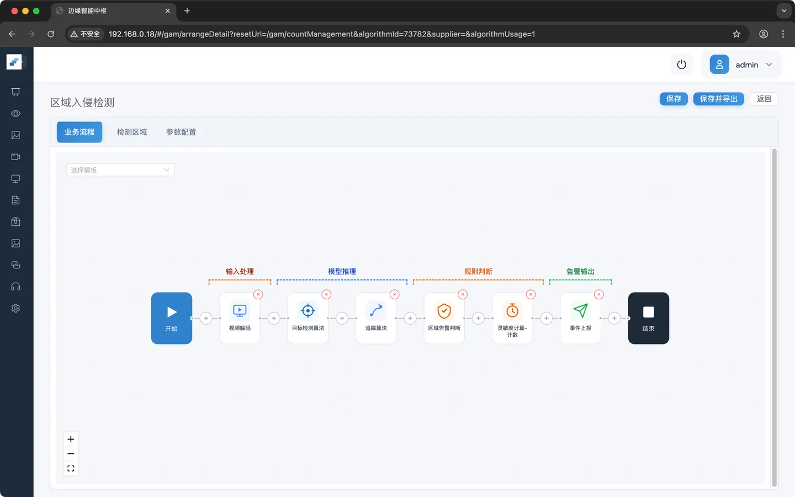

业务逻辑配置

<!-- 这是一张图片，ocr 内容为：边缘智能中枢 192.168.0.18//GAMJARRANGEDETALTRESERJRITHMUSAGE-1 不安全 ADMIN 保存 返回 保存并导出 区域入侵检测 业务流程 参数配置 检测区域 园 选择模板 目 规则判断 模型推理 告警输出 输入处理 ( 区坛告黑利所 目标检测算法 计款 事件上报 目标是否带跟踪 带目标跟踪 触发类上报事件是否需要视频片段 定时上报事件是否需要视频片段 大模型审核 -->
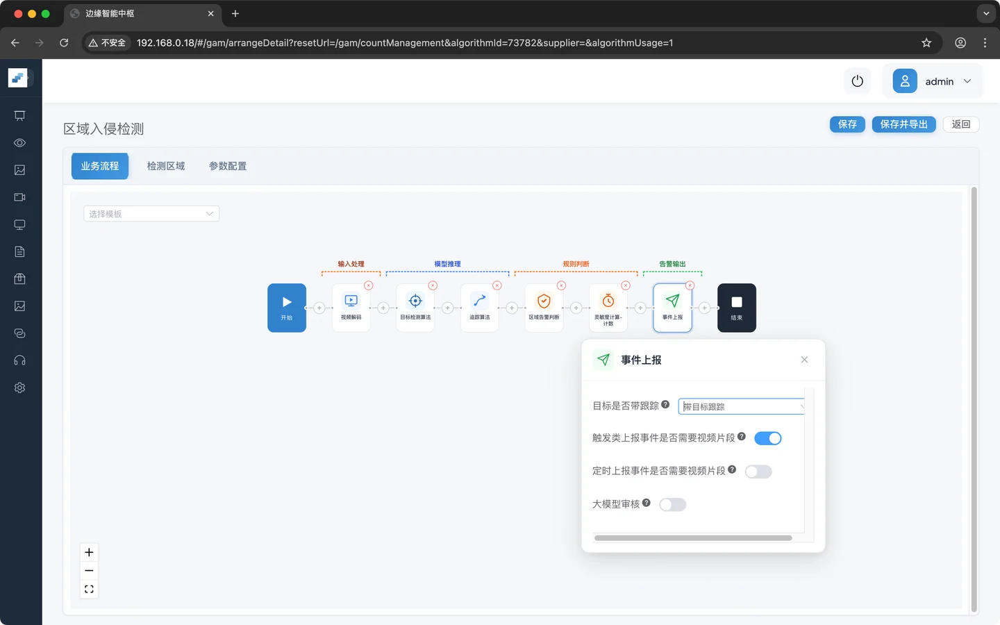

目标知否带跟踪：带目标跟踪

触发类上报时间是否需要视频片段：开启

定时上报事件是否需要视频片段：不开启

大模型审核：不开启


到这里一个完整的入侵检测编排场景任务就已经配置好了，下面对每一个节点配置详细的控制参数

### 3.4 配置关键参数
在上一个小节中实现了业务逻辑的编排，在该流程中用于控制业务逻辑的关键参数都是使用默认值。想要打造一个准确率高、误报率低的检测流程还需要精细化控制关键参数。本小节实现业务逻辑中关键参数的配置


点击 **参数配置** 切换到关键参数页面

<!-- 这是一张图片，ocr 内容为：边缘智能中枢 192.168.0.18/4/GAMJARRANGEDETAITRESETJJIF/GAM/COUNTMANAGEMENT8ALGORTHMLD-737828SUPPLIER-8ALGORITHMUSA 不安全 ADMIN 保存 返回 保存并导出 区域入侵检测 O 详细模式 检测区域 业务流程 精简模式 参数配置 图 参数名称 显示级别 默认值 目 不隐藏 全隐藏 PEDESTRIAN置信度 色 0.0 全隐藏 不隐藏 PEDESTRIAN置信度偏移 图 全隐藏 不隐冠 感部 PEDESTRIAN检测方式 PEDESTRIANDETECTION追踪历史 全隐藏 不隐藏 10 顺数 PEDESTRIANDETECTION静止阈值 不隐藏 全隐藏 80.0 PEDESTRIANDETECTION追踪半径 2.3 全隐藏 不隐藏 区域中的目标数(建议改名) 全隐藏 不隐藏 区域中目标数限制类型(建议客 不隐藏 全隐藏 小于目标数告警 户端隐藏) -->
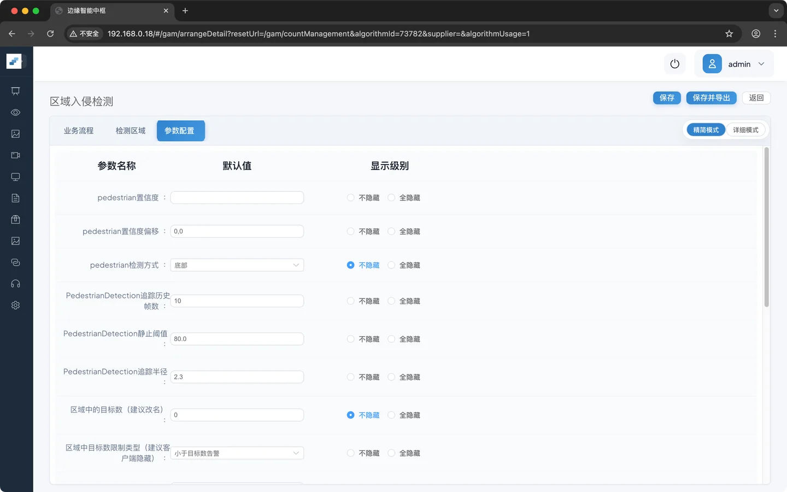

#### 目标检测节点
| 参数 | 建议值 | 备注 |
| --- | --- | --- |
| 置信度阈值 | 0.5 | 置信度可以上下浮动的数值 |
| 置信度偏移 | 0 | 指定检测框的某一点参与区域入侵检测，行人检测通常以脚进入检测框为入侵，所以配置底部。也可以配置中心点，顶部等 |
| 检测方式 | 底部 |  |


<!-- 这是一张图片，ocr 内容为：边缘智能中枢 192.168,0.18/F/GAMJARRANGEDETAI7RESEIUNFCOUNTMANAGE-1 不安全 ADMIN 保存 返回 保存并导出 区域入侵检测 O 详细模式 检测区域 参数配置 精简模式 业务流程 司 参数名称 显示级别 默认值 园 不隐藏 全隐藏 PEDESTRIAN置信度:0.5 母 多:0.0 全隐藏 不隐藏 PEDESTRIAN置信度偏移: 图 全隐藏 底部 不隐藏 PEDESTRIAN检测方式 PEDESTRIANDETECTION追踪历史 全隐藏 不隐藏 10 帧数 PEDESTRIANDETECTION静止阈值 不隐藏 全隐藏 80.0 PEDESTRIANDETECTION追踪半径 2.3 全隐藏 不隐藏 区域中的目标数(建议改名) 全隐藏 不隐藏 区域中目标数限制类型(建议客 不隐藏 全隐藏 小于目标数告警 户端隐藏) -->
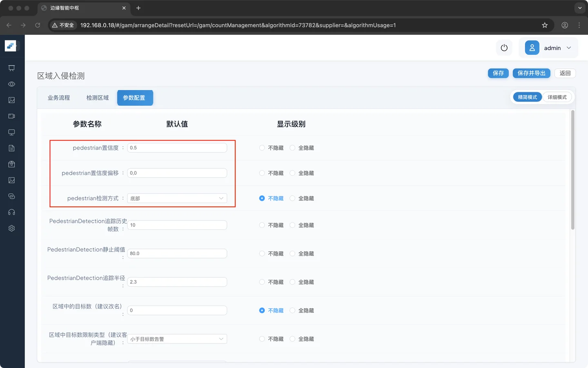

### 追踪算法
| 参数 | 建议值 | 备注 |
| --- | --- | --- |
| 追踪历史帧数 | 10 | 追踪超过N帧才算追踪成功 |
| 静止阈值 | 80 | 追踪器的追踪阈值大于80% ，系统判断目标静止 |
| 追踪半径 | 2.3 | 追踪2.3m以内的目标，上下帧超过2.3则认为目标丢失 |


<!-- 这是一张图片，ocr 内容为：边缘智能中枢 192.168,0.18/F/GAMJARRANGEDETAI7RESEIUL-/GAMJCOUNTMANAGEMENT&ALGORITHMUSAGE-1 不安全 ADMIN 保存 返回 保存并导出 区域入侵检测 O 详细模式 参数配置 精简模式 检测区域 业务流程 司 PEDESTRIAN置信度偏移 全隐藏 0.0 不隐藏 园 底部 PEDESTRIAN检测方式 不隐藏 全隐藏 电 PEDESTRIANDETECTION追踪历史 图 不隐藏 全隐藏 10 硕数 PEDESTRIANDETECTION静止阈值 不隐藏 全隐藏 80.0 PEDESTRIANDETECTION追踪半径 不隐藏 2.3 全隐落 区域中的目标数(建议改名) 全隐藏 不隐藏 区域中目标数限制类型(建议客 小于目标数告警 全隐藏 不隐藏 户端隐藏) 检测时间 0 全隐藏 不隐藏 检测时间单位 全隐藏 不隐藏 -->
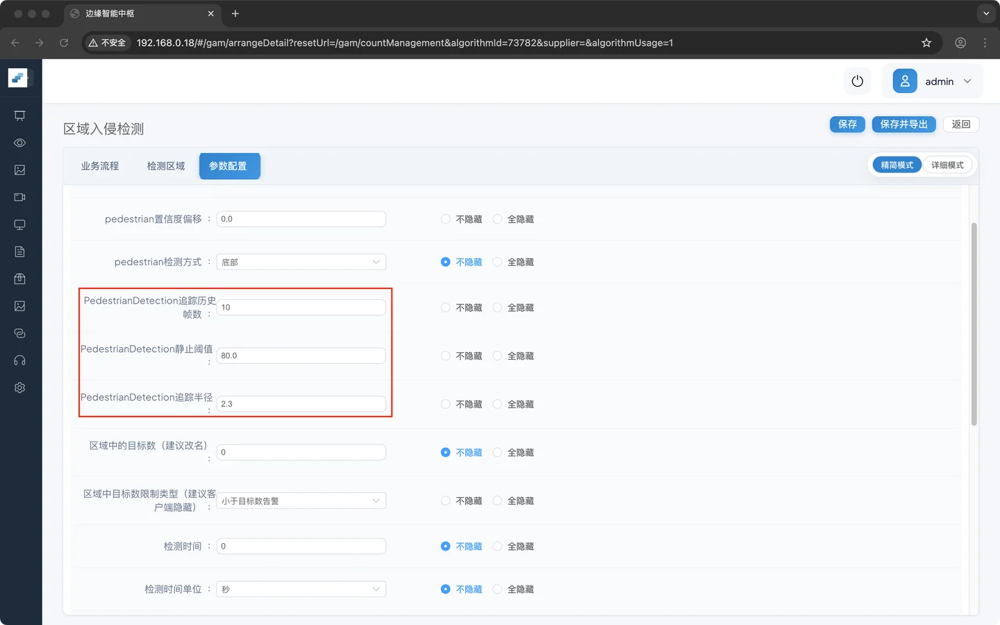

#### 区域告警判断
| 参数 | 建议值 | 备注 |
| --- | --- | --- |
| 区域中的目标数 | 0 | 大于或小于该目标数触发告警事件。（大于或小于根据目标数限制类型的条件决定） |
| 区域中目标数限制类型 | 大于目标数告警 | 告警条件，用于判断目标出现、聚集等 |
| 检测时间 |  |  |
| 检测时间单位 |  |  |


<!-- 这是一张图片，ocr 内容为：边缘智能中枢 众 个个Q A不变金 1921680 1B/ESGANJARRANGETANDETURTESETURENTMENNMANDANDETURENTIREL9ORITHNUSBER-MV.NG&AISORITHMUSA- 8 ADMIN 保存 返回 保存并导出 区域入侵检测 O 详细模式 参数配置 检测区域 精简模式 业务流程 司 全隐藏 不隐藏 底部 PEDESTRIAN检测方式 园 PEDESTRIANDETECTION追踪历史 10 不隐藏 全隐藏 顺数 PEDESTRIANDETECTION静止阈值 图 不隐藏 全隐藏 80.0 PEDESTRIANDETECTION追踪半径 2.3 不隐藏 全隐藏 区域中的目标数(建议改名) 不隐藏 0 全隐藏 区域中目标数限制类型(建议客 不隐藏 全隐藏 大于目标数告警 户端隐藏) 检测时间:0 不隐藏 全隐藏 检测时间单位 秒 全隐藏 不隐藏 *非常规组件默认值输入方式使用文本框 -->
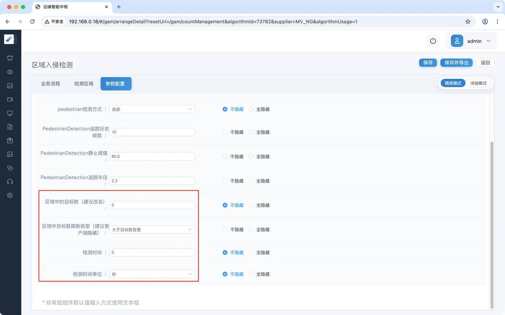

#### 灵敏度计算节点
| 参数 | 建议值 | 备注 |
| --- | --- | --- |
| 灵敏度计算命中数 | 3 | 连续命中 3 帧后触发 |
| 灵敏度计算总数 | 10 | 在 10 帧窗口内累计判断 |


<!-- 这是一张图片，ocr 内容为：边缘智能中枢 192.168,0.18/F/GAMJARRANGEDETAI7RESEIUL-/GAMJCOUNTMANAGEMENT&ALGORITHMUSAGE-1 不安全 ADMIN 保存 返回 保存并导出 区域入侵检测 O 详细模式 参数配置 精简模式 业务流程 检测区域 园 司 区域中目标数限制类型(建议客 不隐藏 小于目标数告警 全隐藏 户端隐藏) 园 检测时间:| 全隐藏 不隐藏 电 图 检测时间单位 秒 全隐藏 不隐藏 灵敏度计算命中数 不隐藏 全隐藏 灵敏度计算总数:10 全隐藏 不隐藏 告警时间间隔 全隐藏 不隐藏 告警次数 全隐藏 不隐藏 静止目标去重: 不隐藏 全隐藏 静止目标重叠率:0.2 全隐藏 不隐藏 -->
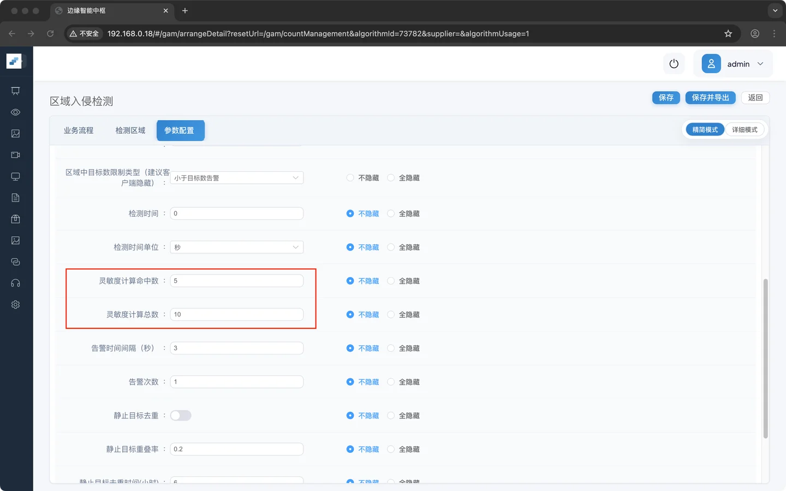

#### 事件上报节点
| 参数 | 建议值 | 备注 |
| --- | --- | --- |
| 告警时间间隔 | 3 | 告警之后再次告警的时间间隔 |
| 告警次数 | 1 | 检测到同一目标的重复告警次数，防止告警记录过多 |
| 静止目标去重 | 开启 | 静止的目标会大量重复告警，开启静止目标去重让静止的目标不会重复告警 |
| 静止目标重叠率 | 0.2 | 静止目标的判断标准，重叠超过阈值判断为静止 |
| 静止目标去重时间 | 6 | 静止目标去重的最大时间限制 |
| 全景图叠加轨迹 | 不开启 | 可视化叠加添加轨迹 |


<!-- 这是一张图片，ocr 内容为：边缘智能中枢 192.168.0.18/4/GAMJARRANGEDETAITRESETJJIF/GAM/COUNTMANAGEMENT8ALGORTHMLD-737828SUPPLIER-8ALGORITHMUSA 不安全 ADMIN 保存 返回 保存并导出 区域入侵检测 参数配置 详细模式 精简模式 业务流程 检测区域 图 司 检测时间单位 不隐藏 全隐藏 灵敏度计算命中数:5 全隐藏 不隐藏 目 电 灵敏度计算总数:10 全隐藏 不隐藏 图 告警时间间隔(秒):3 全隐藏 不隐藏 1 告警次数 全隐藏 不陷藏 静止目标去重 全隐藏 不隐藏 不隐藏 全隐藏 静止目标重叠率: 0.2 静止目标去重时间(小时):6 不隐藏 全隐藏 全隐藏 全景图叠加轨迹: 不隐藏 非常规组件默认值输入方式使用文本框 -->
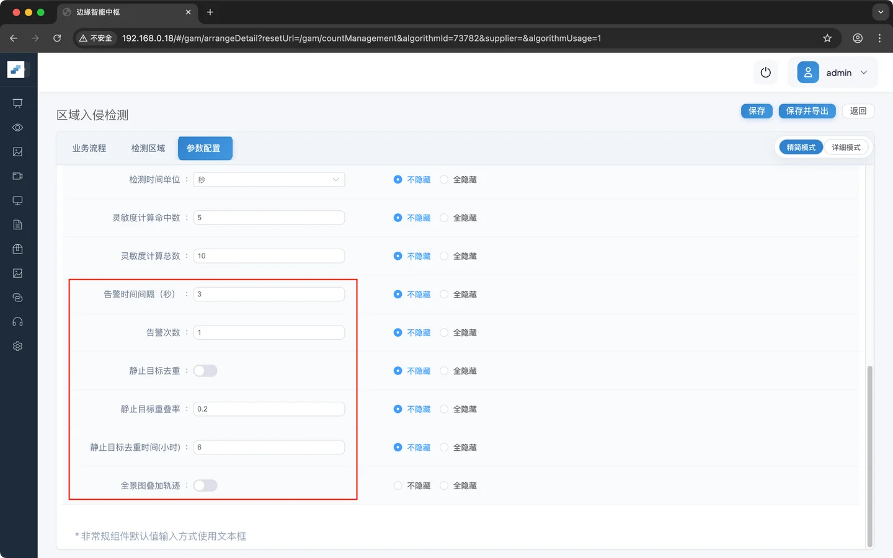

### 3.5 分配到视频通道并测试
1. 创建视频通道

点击 **视频接入** 进入通道页面

<!-- 这是一张图片，ocr 内容为：边缘智能中枢 2 不安全 192.168.0.18/#/VIDEOACCESS 边缘智能中枢 ADMIN 运行总览 视频通道 时间模板 分析展示 实时展示 通道状态: 通道名称: 请输入通道名称 全部 查询 重置 图片分析 添加 批量操作 任务配蛋 视频接入 智能服务 通道编号 通道名称 接入类型 序号 通道状态 分辨率 操作 场景任务 详情编辑 事件中心 2 服务分配快照 USB摄像头 人体检测 USOO0000.. 离线 已停止 删除 资源 中 模型仓库 详情编辑 服务分配快照 楼道二楼间平... 在线 LX0000000... 已停止 离线视频 楼道垃圾检测 底库管理 下载删除 系统 详情编辑 数据对接 服务分配快照 在线 河道漂浮物识别 LXO00000... 已停止 河道东 离线视频 下载删除 音频管理 详情编辑 系统管理 京 服务分配快照 景区城墙北向 在线 离线视频 LX000000 已停止 破环城增行为... 下载删除 洋情编辑 在绳 工地北通道 LX000000 已信山 鹏条分配快昭 页 10条/页 共9条 前往 -->
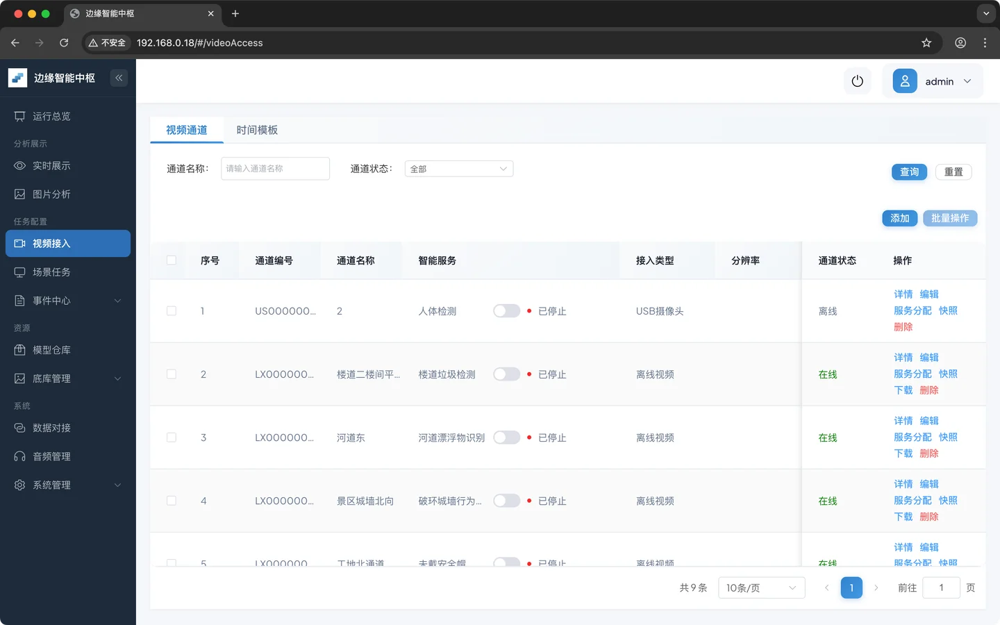


新建通道并上传视频

<!-- 这是一张图片，ocr 内容为：边缘智能中枢 不安全 192.168.0.18/#/VIDEOACCESS 边缘智能中枢 ADMIN 运行总览 视频通道 时间模板 分析展示 添加通道 实时展示 通道名称: 请输入通道名称 查询 重置 接入类型: 离线视频 图片分析 添加 批量操作 任务配置 街角摄像头 通道名称: 视频接入 通道状态 操作 序号 分辨率 通道编号 上传视频: 场景任务 将文件拖到此处,或点击上传(支持分片上 详情编辑 事件中心 服务分配快照 US000000. 传,最大1GB) 离线 删除 资源 母 模型仓库 详情编辑 自入侵检测.MP4 服务分配 快照 LX000000. 在线 底库管理 下载删除 外部通道编号: 系统 详情编辑 数据对接 服务分配 快照 说明:支持视频文件上传,分辨率限720P以上,格 LX000000. 在线 式支持AM,MP4,DAV,单个视频文件大小限 下载删除 音频管理 1GB. 详情编辑 系统管理 取消 保存 服务分配快照 LX000000. 在线 下载删除 详情编辑 在线 丁地北通道 已信   信 I XO0000 未戴安全帽 鹏条分配快图 页 共9条 10条/页 前往 -->
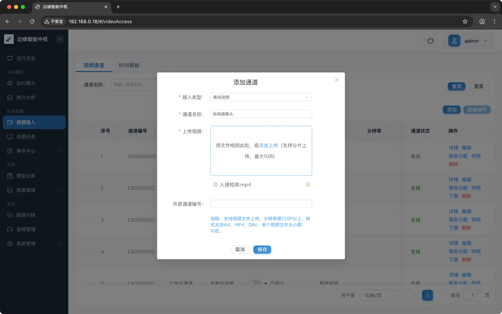


2. 进入 **服务分配**

<!-- 这是一张图片，ocr 内容为：边缘智能中枢 2 不安全 192.168.0.18/#/VIDEOACCESS 边缘智能中枢 ADMIN 运行总览 视频通道 时间模板 分析展示 实时展示 通道状态: 通道名称: 请输入通道名称 全部 查询 重置 图片分析 添加 批量操作 任务配蛋 视频接入 智能服务 通道名称 通道编号 序号 接入类型 通道状态 操作 分辨率 场景任务 详情编辑 事件中心 服务分配 快照 LX000000... 在线 A区街角摄像头 离线视频 下载删除 资源 中 模型仓库 详情编辑 2 人体检测 服务分配快照 已停止 离线 USO00000... USB摄像头 底库管理 删除 系统 详情编辑 数据对接 服务分配快照 楼道垃圾检测 在线 LX000000... 楼道二楼间平.. 已停止 离线视频 下载删除 音频管理 详情编辑 系统管理 京 服务分配快照 河道东 离线视频 在线 LX000000 已停止 河道漂浮物识别 下载删除 洋情编辑 在线 LX000000 已信止 号区城境业向 鹏条分配快昭 破环城请行为 页 10条/页 共10条 前往 -->
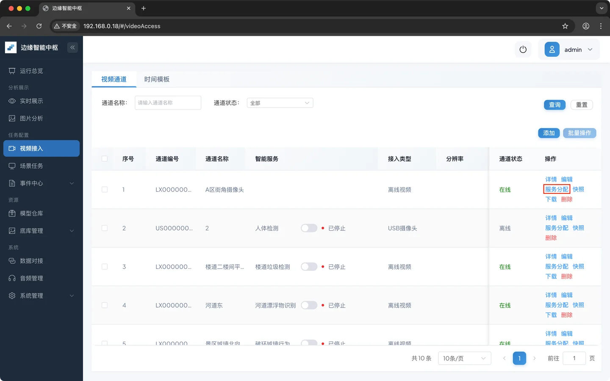

<!-- 这是一张图片，ocr 内容为：边缘智能中枢 L不安全 边缘智能中枢 ADMIN 运行总览 场景任务 启用服务 删除服务 保存 服务配置已停用 区域入侵检测 分析展示 实时展示 输入关健字进行过滤 运行策略 参数设置 检测区域 图片分析 检测/分析 区域入侵检测 任务配置 楼道垃圾检测 检测区域列表 新增区域 重新获取图片 视频接入 破环城墙行为识别 场景任务 河道漂浮物识别 区域名称 操作 VISDRONE 事件中心 视觉语言大模型分析 暂无数据 视觉分割大模型分析 资源 视觉检测大模型分析 中 模型仓库 未戴绝缘手套 底库管理 未穿绝缘靴 未戴口罩 系统 物品缺失检测 数据对接 指示灯异常检测 未设安全标识牌 音频管理 未摆放灭火器 未装防护网 系统管理 京 未装防护栏 未穿工服123 未穿反光衣 未穿救生衣 电动车进电梯 电动车进楼道 -->


3. 选择刚刚创建的 **区域入侵检测 **任务

<!-- 这是一张图片，ocr 内容为：边缘智能中枢 不安全 边缘智能中枢 ADMIN 运行总览 场景任务 启用服务 删除服务 保存 服务配置已停用 区域入侵检测 分析展示 实时展示 输入关键字进行过滤 运行策略 参数设置 检测区域 图片分析 检测/分析 区域入侵检测 任务配置 楼道垃圾检测 检测区域列表 新增区域 重新获取图片 视频接入 破环城墙行为识别 场景任务 河道漂浮物识别 区域名称 操作 VISDRONE 事件中心 视觉语言大模型分析 暂无数据 视觉分割大模型分析 资源 视觉检测大模型分析 中 模型仓库 未戴绝缘手套 底库管理 未穿绝缘靴 未戴口罩 系统 物品缺失检测 数据对接 指示灯异常检测 未设安全标识牌 音频管理 未摆放灭火器 未装防护网 系统管理 京 未装防护栏 未穿工服123 未穿反光衣 未穿救生衣 电动车进电梯 电动车进楼道 -->


4.  绘制检测区域

点击 **新增区域**

<!-- 这是一张图片，ocr 内容为：边缘智能中枢 不安全 边缘智能中枢 ADMIN 运行总览 场景任务 启用服务 删除服务 保存 服务配置已停用 区域入侵检测 分析展示 实时展示 输入关健字进行过滤 运行策略 参数设置 检测区域 图片分析 检测/分析 区域入侵检测 任务配置 楼道垃圾检测 检测区域列表 新增区域 重新获取图片 视频接入 破环城墙行为识别 场景任务 河道漂浮物识别 操作 区域名称 VISDRONE 事件中心 视觉语言大模型分析 暂无数据 视觉分割大模型分析 资源 视觉检测大模型分析 中 模型仓库 未戴绝缘手套 底库管理 未穿绝缘靴 未戴口罩 系统 物品缺失检测 数据对接 指示灯异常检测 未设安全标识牌 音频管理 未摆放灭火器 未装防护网 系统管理 京 未装防护栏 未穿工服123 未穿反光衣 未穿救生衣 电动车进电梯 电动车进楼道 -->
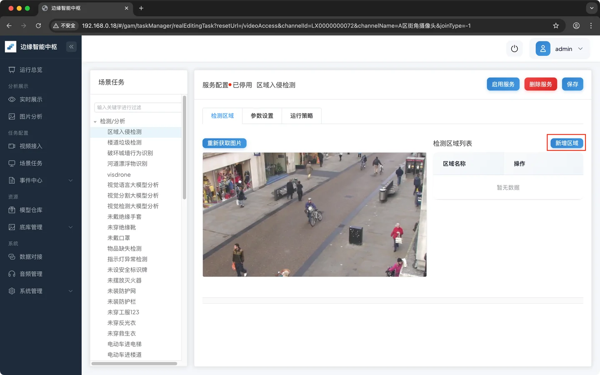

<!-- 这是一张图片，ocr 内容为：边缘智能中枢 不安全 边缘智能中枢 ADMIN 运行总览 场景任务 服条配置已停用 区域入得检测 启用服务 删除服务 保存 分析展示 新增区域 实时展示 输入关键字进行过滤 区域名称 区域一 图片分析 检测/分析 区域入侵检测 任务配置 取消 确定 楼道垃圾检测 检测区域列表 新增区域 口视频接入 破环城墙行为识别 场景任务 河道漂浮物识别 区域名称 操作 VISDRONE 事件中心 视觉语言大模型分析 暂无数据 视觉分割大模型分析 资源 视觉检测大模型分析 母 模型仓库 未戴绝缘手套 底库管理 未穿绝缘靴 未戴口罩 系统 物品缺失检测 数据对接 指示灯异常检测 未设安全标识牌 音频管理 未摆放灭火器 未装防护网 系统管理 未装防护栏 未穿工服123 未穿反光衣 未穿救生衣 电动车进电梯 电动车进楼道 -->
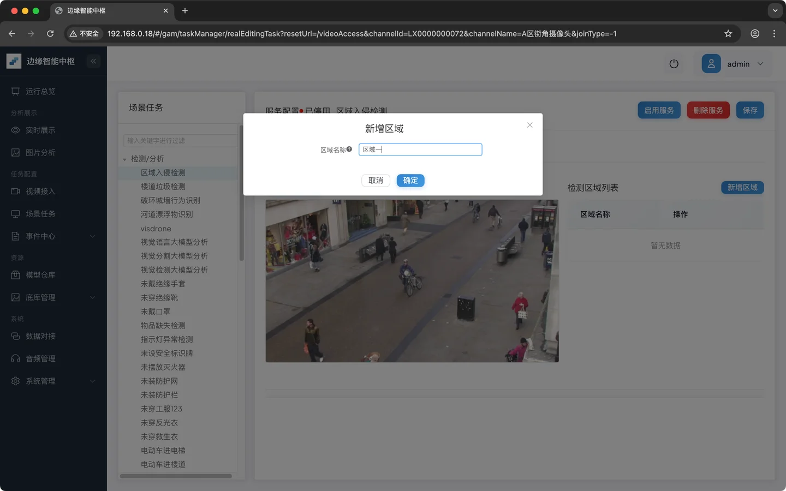


调整区域的位置

<!-- 这是一张图片，ocr 内容为：边缘智能中枢 不安全 边缘智能中枢 ADMIN 运行总览 场景任务 启用服务 删除服务 保存 服务配置已停用 区域入侵检测 分析展示 实时展示 输入关键字进行过滤 运行策略 参数设置 检测区域 图片分析 检测/分析 区域入侵检测 任务配置 楼道垃圾检测 检测区域列表 新增区域 重新获取图片 视频接入 破环城墙行为识别 场景任务 河道漂浮物识别 区域名称 操作 VISDRONE 自事件中心 视觉语言大模型分析 区域 绵辑删除 视觉分割大模型分析 检测/分析 视觉检测大模型分析 人脸人体 未戴绝缘手套 计数统计 未穿绝缘靴 未戴口罩 用 资源 物品缺失检测 模型仓库 指示灯异常检测 未设安全标识牌 底库管理 未摆放灭火器 系统 未装防护网 数据对接 未装防护栏 未穿工服123 音频管理 未穿反光衣 未穿救生衣 京 系统管理 电动车进电梯 电动车进楼道 -->
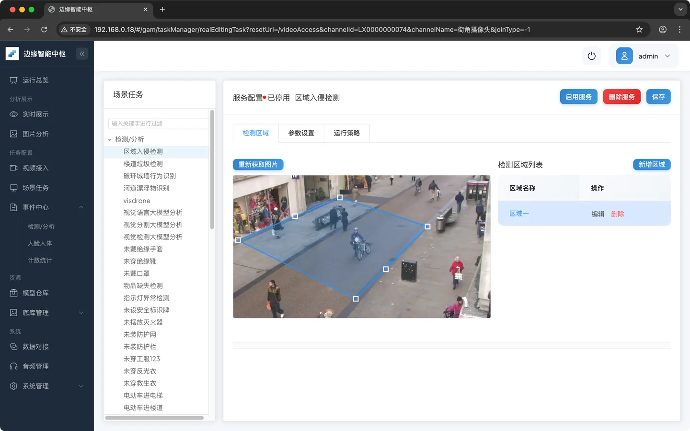


5. 配置运行策略

播放次数修改成0，表示循环播放

<!-- 这是一张图片，ocr 内容为：边缘智能中枢 不安全 边缘智能中枢 ADMIN 运行总览 场景任务 删除服务 启用服务 保存 服务配置已停用 区域入侵检测 分析展示 实时展示 输入关键字进行过滤 参数设置 运行策略 检测区域 图片分析 检测/分析 区域入侵检测 任务配置 楼道垃圾检测 播放次数 视频接入 破环城墙行为识别 场景任务 河道漂浮物识别 VISDRONE 事件中心 视觉语言大模型分析 批量应用 视觉分割大模型分析 资源 视觉检测大模型分析 中 模型仓库 未戴绝缘手套 底库管理 未穿绝缘靴 未戴口罩 系统 物品缺失检测 数据对接 指示灯异常检测 未设安全标识牌 音频管理 未摆放灭火器 未装防护网 系统管理 京 未装防护栏 未穿工服123 未穿反光衣 未穿救生衣 电动车进电梯 电动车进楼道 -->
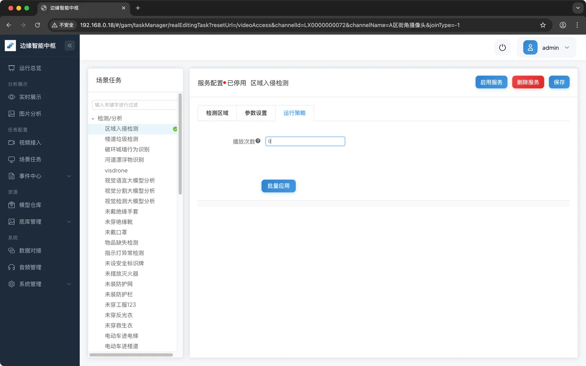


6. 保存并启动服务

<!-- 这是一张图片，ocr 内容为：边缘智能中枢 不安全 边缘智能中枢 ADMIN 保存成功 运行总览 场景任务 删除服务 停用服务 服务配置已启用 保存 区域入侵检测 分析展示 实时展示 输入关键字进行过滤 运行策略 参数设置 检测区域 图片分析 检测/分析 区域入侵检测 任务配置 楼道垃圾检测 检测区域列表 新增区域 重新获取图片 视频接入 破环城墙行为识别 场景任务 河道漂浮物识别 区域名称 操作 VISDRONE 事件中心 视觉语言大模型分析 区域 编辑删除 视觉分割大模型分析 资源 视觉检测大模型分析 中 模型仓库 未戴绝缘手套 底库管理 未穿绝缘靴 未戴口罩 用 系统 物品缺失检测 数据对接 指示灯异常检测 未设安全标识牌 音频管理 未摆放灭火器 未装防护网 系统管理 京 未装防护栏 未穿工服123 未穿反光衣 未穿救生衣 电动车进电梯 电动车进楼道 -->
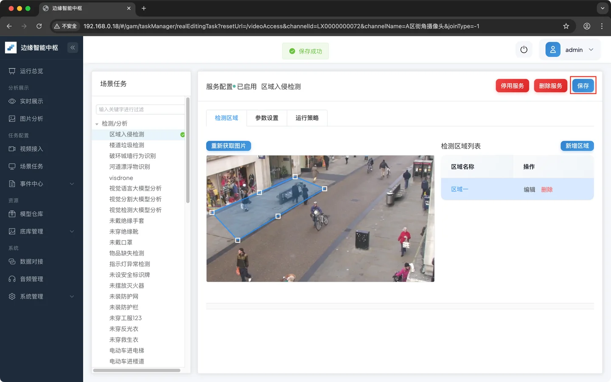

### 3.6 验证效果
进入 **实时展示** 和 **告警记录** 检查结果。

1. 点击 **实时展示**，进入展示页面

<!-- 这是一张图片，ocr 内容为：边缘智能中枢 人不安全 192.168.0.18/#/VIDEOACCESS 边缘智能中枢 ADMIN 运行总览 视频通道 时间模板 分析展示 实时展示 通道状态: 通道名称: 请输入通道名称 全部 查询 重置 图片分析 添加 批量操作 任务配置 视频接入 智能服务 通道名称 通道编号 序号 通道状态 接入类型 分辨率 操作 场景任务 详情编辑 事件中心 区域入侵检测 服务分配快照 A区街角摄像头 1920X 1080 LX0000000... 在线 已停止 离线视频 下载删除 资源 中 模型仓库 详情编辑 服务分配快照 人体检测 已停止 区域人数统计 USO00000... 离线 USB摄像头 底库管理 删除 系统 详情编辑 数据对接 服务分配快照 在线 LXO00000... 楼道二楼间平... 楼道垃圾检测 已停止 离线视频 下载删除 音频管理 详情编辑 系统管理 京 服务分配快照 河道东 离线视频 在线 LX000000 已停止 河道漂浮物识别 下载 删除 洋情编转 在绳 LX000000 已信止 县区城博北向 服条分配快昭 破环城请行为 页 10条/页 共10条 前往 -->


2. 选择 **A区街角摄像头
**

<!-- 这是一张图片，ocr 内容为： -->
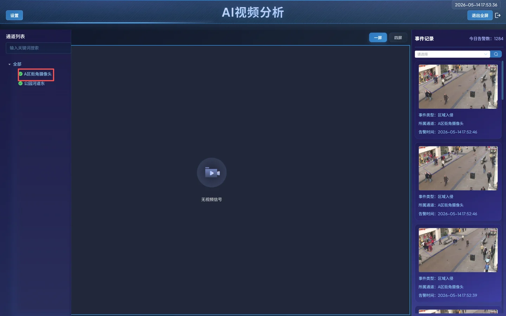

3. 可视化叠加

<!-- 这是一张图片，ocr 内容为： -->
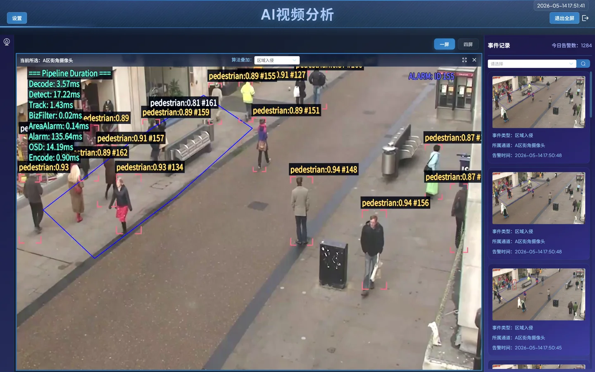

4. 弹出告警记录

<!-- 这是一张图片，ocr 内容为： -->
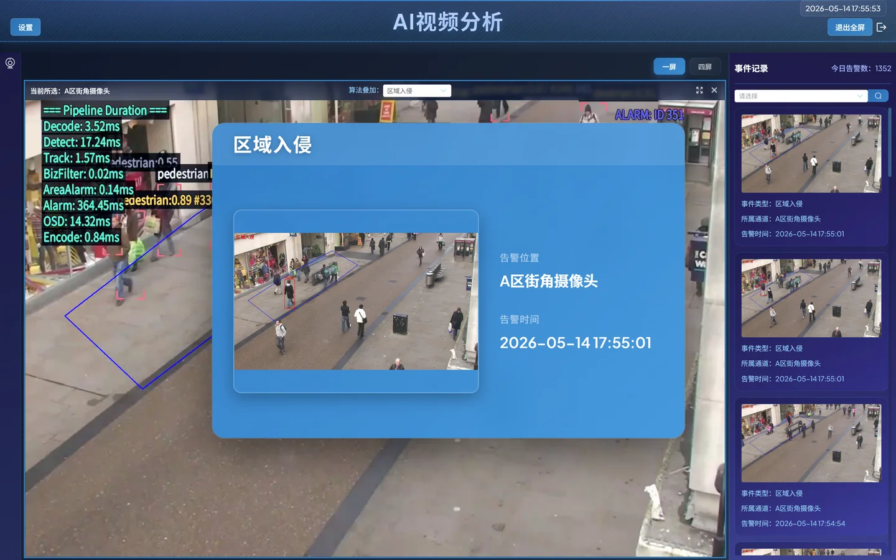

结果分析

+ 人员进入指定区域后，实时画面出现检测框和标签
+ 连续命中后触发告警，而不是单帧即报警
+ 告警记录中能看到对应事件


4. 告警记录

<!-- 这是一张图片，ocr 内容为： -->
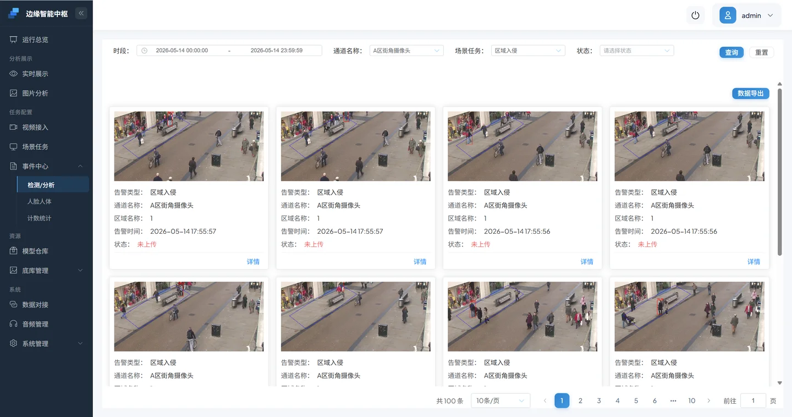


到这里，您已经完成了第一次“从零创建 场景任务”。


## 附录
### A. 节点速查表
::: warning
待补充
:::

### B. 节点参数速查表
| 节点类型 | 常用参数 | 默认/建议值 | 备注 |
| --- | --- | --- | --- |
| 视频解码 | 解码方式 | 硬解码 | 通常无需修改 |
| 目标检测 | 模型 / 置信度阈值 | 0.5 | 低于阈值的结果将被丢弃 |
| 目标追踪 | 最大丢失帧数 | 30 | 丢失多久后释放 ID |
| 目标尺寸过滤 | 最小宽度 / 最小高度 | 0 | 0 表示不过滤 |
| 区域判定 | 判定方式 | 底边中心点 | 判断目标是否在区域内 |
| 灵敏度计算 | 命中阈值 / 窗口大小 | 3/10 | 多帧累计后触发 |
| 事件上报 | 告警类型 / 告警间隔 | 60 秒 | 同一目标重复上报间隔 |


### C. 常见编排错误排障
| 问题 | 可能原因 | 解决方法 |
| --- | --- | --- |
| 保存后服务无法启动 | 节点未正确连线 | 检查节点是否全部连通 |
| 实时画面无检测框 | 缺少 视频可视化 叠加节点 | 在末端添加 视频可视化 叠加 |
| 有框但无告警 | 缺少事件上报或灵敏度未命中 | 检查上报节点和阈值 |
| 告警过多 | 缺少灵敏度计算或阈值太低 | 提高灵敏度门槛 |
| 误报较多 | 未使用尺寸过滤或区域判定过宽 | 收紧过滤和区域范围 |


### D. 常见 场景任务模板
#### 检测型 场景任务
```plain
视频解码 → 目标检测 → 目标追踪 → 事件上报 → 视频可视化叠加
```

适用：纯目标检测、异物检测、车辆检测等

#### 检测 + 规则型 场景任务
```plain
视频解码 → 目标检测 → 目标追踪 → 区域判定/越线判定 → 灵敏度计算 → 事件上报 → 视频可视化叠加
```

适用：区域入侵、周界检测、客流统计等

#### 检测 + 分类型 场景任务
```plain
视频解码 → 目标检测 → 目标追踪 → 类别过滤 → 目标分类 → 灵敏度计算 → 事件上报 → 视频可视化叠加
```

适用：安全帽、工服、吸烟、玩手机等

### 下一步
如果您已经掌握本篇教程内容，下一步建议进入：

+ CosmoEdge 第三方模型移植

该将解决另一个关键问题：
**如何把第三方模型移植到设备，并把它接入您自己创建的 场景任务。**
