# 卷五：模型移植

> **阅读时长**：30-45 分钟
> **目标**：学会将第三方模型转换、上传并接入系统，完成一次“模型移植 + 场景任务 接入 + 效果验证”的完整闭环
> **前提**：已完成 CosmoEdge 场景任务 编排 ，理解基本的 场景任务 编排
> **需要额外环境**：一台安装了 Docker 的电脑，用于模型转换

**CosmoEdge 场景任务 编排** 解决的是“怎么组织已有能力”。本卷解决的是“怎么把新的能力带进来”。也就是说：

+ **CosmoEdge 场景任务 编排 **教您编排
+ **CosmoEdge 第三方模型移植** 教您引入第三方模型

学完本卷后，您将具备以下能力：

+ 将 ONNX 模型转换为设备可运行的 `bmodel`
+ 将模型上传到 CosmoEdge
+ 配置模型元数据并验证模型是否可用
+ 将第三方模型接入新的 场景任务

## 本卷学习路径

```plain
准备模型
  ↓
Docker 中完成转换
  ↓
上传到系统并补全元数据
  ↓
图片验证
  ↓
接入 场景任务 并做端到端测试
```

## 第一章：准备第三方模型

本卷使用一个公开可获取的 **VisDrone 检测模型** 作为示例。

::: warning 模型仓库链接
[VisDrone-YOLOv8-Models-Upgrade](https://github.com/superbabiiX/VisDrone-YOLOv8-Models-Upgrade/tree/main/visdrone%20models)
:::

选择它有三个原因：

1. 公开、可复用，适合教程示例
2. 是标准目标检测任务，容易验证
3. 类别和系统内置场景不同，能证明平台不只支持内置模型

### 1.1 支持的输入格式

| 格式               | 说明                |
| ------------------ | ------------------- |
| ONNX               | 推荐，兼容性最好    |
| PyTorch `.pt`    | 需先自行导出为 ONNX |
| TensorFlow `.pb` | 需先自行导出为 ONNX |

> **建议**
>
> 首次移植优先选 ONNX。
> 这样能把问题集中在“模型转换和接入”本身，而不是框架导出差异。

### 1.2 本卷示例文件

请准备一个 ONNX 模型文件，例如：

```plain
visdrone_yolov8s.onnx
```

并放在本地目录中，例如：

```plain
/home/user/models/
```

> **注意**
>
> 如果后续您替换成自己的模型，下面命令里的文件名、输入尺寸、输出名都要跟着一起改。

## 第二章：Docker 环境准备

模型转换需要使用算能官方提供的 Docker 镜像。

### 2.1 安装 Docker

| 操作系统        | 安装方式                                                           |
| --------------- | ------------------------------------------------------------------ |
| Ubuntu / Debian | `sudo apt-get install docker.io`                                 |
| CentOS          | `sudo yum install docker`                                        |
| Windows         | 安装[Docker Desktop](https://www.docker.com/products/docker-desktop/) |

<!-- 这是一张图片，ocr 内容为： -->

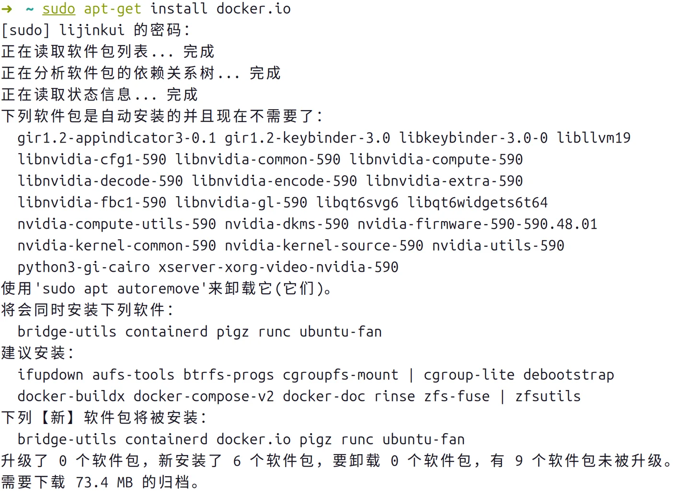

安装后验证：

```bash
docker --version
## 预期输出：Docker version 2x.x.x
```

<!-- 这是一张图片，ocr 内容为： -->

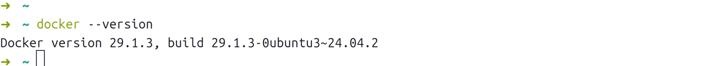

将用户USER添加到docker用户组

```plain
sudo gpasswd -a USER docker
```

替换 USER 为自己的普通用户

更新用户组

```plain
newgrp docker
```

<!-- 这是一张图片，ocr 内容为： -->

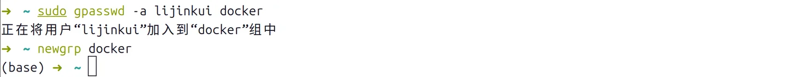

### 2.2 拉取镜像

下载镜像压缩包

```plain
wget https://sophon-file.sophon.cn/sophon-prod-s3/drive/24/06/14/12/sophgo-tpuc_dev-v3.2_191a433358ad.tar.gz
```

<!-- 这是一张图片，ocr 内容为： -->

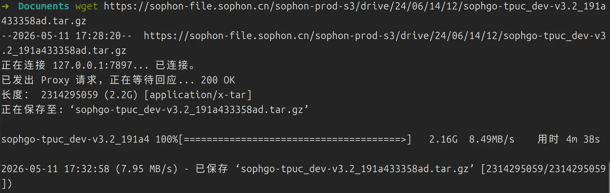

导入镜像站点

```plain
docker load -i sophgo-tpuc_dev-v3.2_191a433358ad.tar.gz
```

<!-- 这是一张图片，ocr 内容为： -->


<!-- 这是一张图片，ocr 内容为： -->


### 2.3 常用 Docker 命令速查

| 命令                                                                  | 作用               |
| --------------------------------------------------------------------- | ------------------ |
| `docker images`                                                     | 查看本地镜像       |
| `docker run -it -v /本地路径:/容器路径 sophgo/tpuc_dev:latest bash` | 启动容器并挂载目录 |
| `exit`                                                              | 退出容器           |

## 第三章：模型转换

将 ONNX 模型转换为设备可运行的 `bmodel`，核心只需要两步：

1. `model_transform`
2. `model_deploy`

### 3.1 启动容器

```bash
docker run -it -v /home/user/models:/workspace sophgo/tpuc_dev:v3.2 bash
```

这条命令的作用是：

+ 启动官方转换环境
+ 把本地模型目录挂载到容器内的 `/workspace`

<!-- 这是一张图片，ocr 内容为： -->


### 3.2 安装转换依赖包

```bash
pip install tpu_mlir -i https://mirrors.ustc.edu.cn/pypi/simple/
```

<!-- 这是一张图片，ocr 内容为： -->


### 3.3 步骤一：转换为 MLIR

```bash
model_transform \
  --model_name visdrone_yolov8s \
  --model_def /workspace/visdrone_yolov8s.onnx \
  --input_shapes [[1,3,640,640]] \
  --pixel_format rgb \
  --output_names output0 \
  --mlir visdrone.mlir
```

<!-- 这是一张图片，ocr 内容为： -->

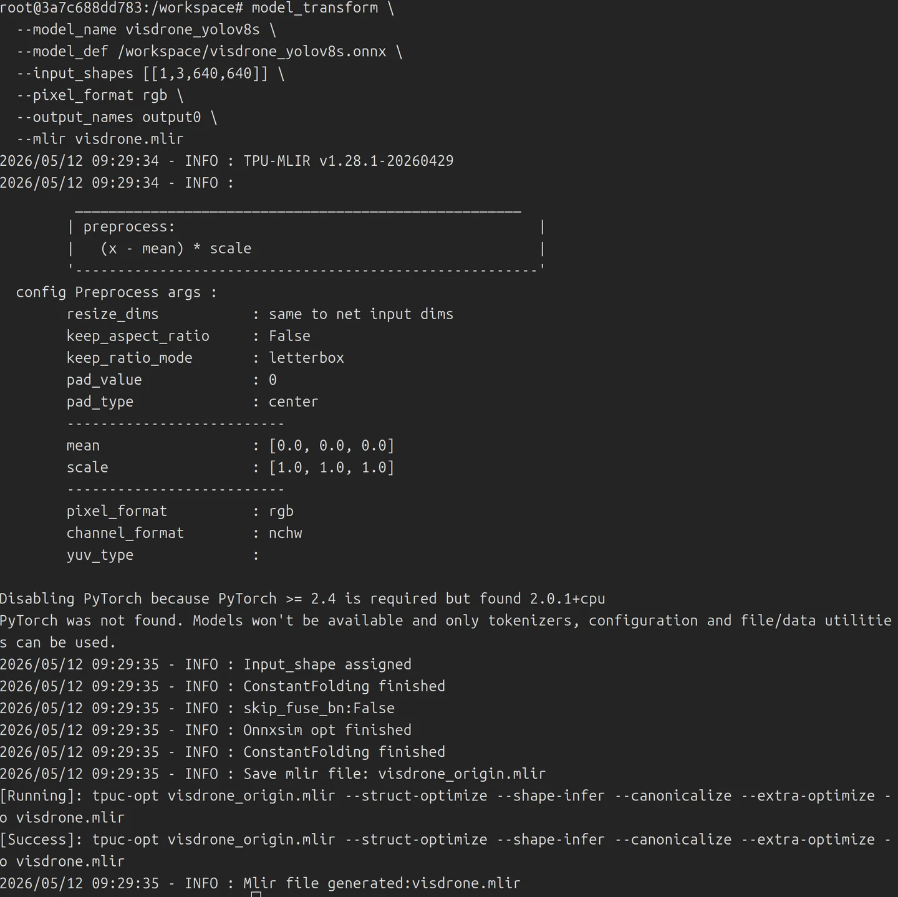

<!-- 这是一张图片，ocr 内容为： -->

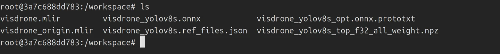

### 3.4 步骤二：转换为 bmodel

```bash
model_deploy \
  --mlir visdrone.mlir \
  --quantize F16 \
  --chip bm1688 \
  --model visdrone_yolov8s_f16.bmodel
```

<!-- 这是一张图片，ocr 内容为： -->

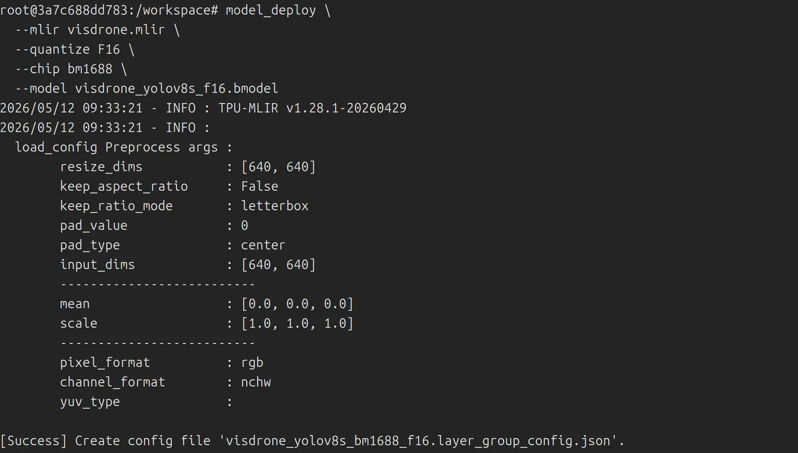

转换完成后，`/workspace` 目录下会生成：

```plain
visdrone_yolov8s_f16.bmodel
```

<!-- 这是一张图片，ocr 内容为： -->

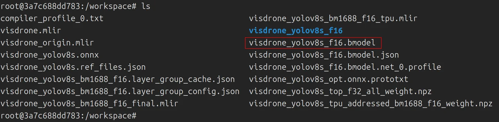

### 3.4 这一步最常见的三个注意点

1. `--input_shapes` 必须和模型训练/导出时一致
2. `--pixel_format` 要和模型训练时预处理一致
3. `--output_names` 要和模型导出的实际输出名一致

## 第四章：上传模型到系统

### 4.1 进入模型仓库

1. 进入 **模型仓库**

<!-- 这是一张图片，ocr 内容为：边缘智能中枢 人不安全 192.168.0.18/#/GAM/ATOMICMODEL 边缘智能中枢 B ADMIN 运行总览 搜素模型名称或ID... +添加模型 尘导入模型 分析展示 实时展示 大模型5 关键点 2 特征提取3 分类20 全部  54 检测24 图片分析 任务配置 视频接入 VISDRONE VISD EMOJI ID:1360248.V1.0.0 ID:8906288  V1.0.0 ID:8256720.V1.0.0 场景任务 YOLOVB_DET YOLOV8_DET CLASSIFY 事件中心 详情配置 配置 配五 详情 详情 关联1个场景任务 关联0个场景任务 关联1个场景任务 资源 母 模型仓库 品 园底库管理 系统 PEDFALLDOWN FALLDOWNFP16 PEDHELEMET 数据对接 ID:2002008-V6.0.1 ID:2001036.V6.0.1 ID:1608568.V1.0.0 CLASSIFY CLASSLFY CLASSIFY 音频管理 详情 关联1个场景任务 关联0个场景任务 配置 配置 详情 关联2个场景任务 配置 详情 系统管理 京 GROUNDDINGDINO QWEN35 YOLOV8TEST ID:9031756.V1.0.0 ID:9853819-V1.0.0 ID:1774989  V1.0.0 GWEN3.5 DINO YOLOV8_DET -->

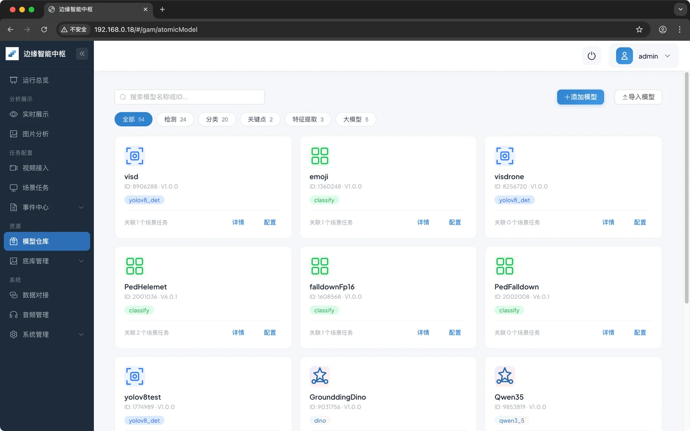

2. 点击 **上传模型**

<!-- 这是一张图片，ocr 内容为：边缘智能中枢 192.168.0.18/#/GAM/ATOMICMODEL A不安全 边缘智能中枢 B ADMIN 运行总览 +添加模型 搜索模型名称或ID... 尘导入模型 分析展示 实时展示 大模型5 关键点 2 特征提取3 分类20 全部  54 检测 24 图片分析 任务配置 视频接入 VISDRONE VISD EMOJI ID:1360248.V1.0.0 ID:8906288  V1.0.0 ID:8256720V1.0.0 场景任务 YOLOVB_DET YOLOV8_DET CLASSIFY 事件中心 详情配置 配置 配五 详情 详情 关联1个场景任务 关联0个场景任务 关联1个场景任务 资源 母 模型仓库 品 园底库管理 系统 PEDFALLDOWN FALLDOWNFP16 PEDHELEMET 数据对接 ID:2002008-V6.0.1 ID:2001036.V6.0.1 ID:1608568.V1.0.0 CLASSIFY CLASSLFY CLASSIFY 音频管理 详情 关联1个场景任务 关联0个场景任务 配置 配置 详情 关联2个场景任务 配置 详情 系统管理 京 GROUNDDINGDINO QWEN35 YOLOV8TEST ID:9031756.V1.0.0 ID:9853819-V1.0.0 ID:1774989  V1.0.0 GWEN3.5 DINO YOLOV8_DET -->

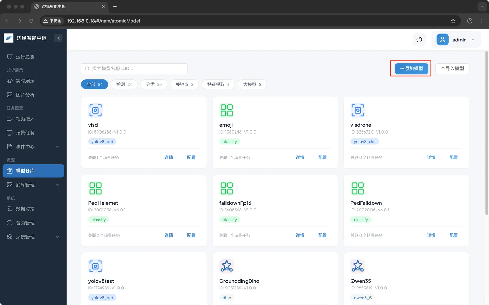

<!-- 这是一张图片，ocr 内容为：边缘智能中枢 192.168.0.18/#/GAM/ATOMICMODEL 人不安全 边缘智能中枢 ADMIN 运行总览 +添加模型 搜索模型名称或ID... 尘导入模型 分析展示 添加模型 实时展示 分类20 全部  55 检测25 主类型 检测算法 图片分析 VOLOV8_DET 子类型 任务配置 口视频接入 VISDRONE无人机检测 模型名称 VISDRONE VISD ID:8256720.01.0.0 ID:8906288.V1.0.0 场景任务 模型描述 请输入模型描述 YOLOVB_DET YOLOV8_DET 事件中心 详情 关联0个场景任务 配置 关联1个场景任务 资源 归一化 0-1 母 模型仓库 颜色通道 RGB 品 底库管理 浏览 模型文件 系统 *请选择.BMODEL格式的模型文件 PEDFALLDOWN PEDHELEMET 数据对接 ID:2002008-V6.01 ID:2001036.0.1.0.1 YOLOV8N_VISDRONE_BML688_F16.B.B... CLASSIFY CLASSIFY 音频管理 确定 取消 关联0个场景任务 关联2个场景任务 详情 配置 系统管理 GROUNDDING DINO QWEN35 YOLOV8TEST ID.9031756.V1.0.0 ID:9853819.V1.0.0 ID:1774989.V1.0.0 GWEN3_5 OUP YOLOV8_DET -->

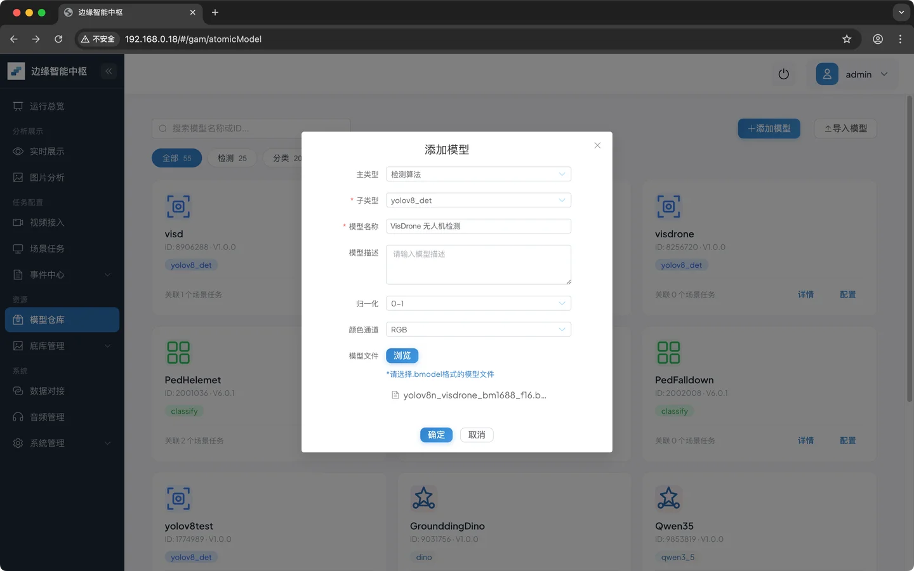

填写模型信息:

| 字段     | 示例值                                                                              | 说明               |
| -------- | ----------------------------------------------------------------------------------- | ------------------ |
| 主类型   | 检测算法                                                                            |                    |
| 子类型   | yolov8_det                                                                          | 上传的模型yolo版本 |
| 模型名称 | VisDrone 无人机检测                                                                 | 便于识别           |
| 上传文件 | `visdrone_yolov8s_f16.bmodel`                                                     | 转换得到的模型文件 |
| 归一化   | 0-1                                                                                 |                    |
| 颜色通道 | RGB                                                                                 |                    |
| 类别标签 | pedestrian, people, bicycle, car, van, truck, tricycle, awning-tricycle, bus, motor | 用于类别显示和映射 |

点击 **确定** 保存该模型

### 4.2 上传完成后的检查点

上传完成后，确认：

+ 模型出现在模型仓库列表中
+ 状态正常
+ 名称、类型、输入尺寸、标签无明显错误

<!-- 这是一张图片，ocr 内容为：边缘智能中枢 人不安全 192.168.0.18/#/GAM/ATOMICMODEL 边缘智能中枢 B ADMIN 运行总览 搜索模型名称或ID... +添加模型 尘导入模型 分析展示 实时展示 特征提取3 关键点 2 大模型5 分类20 全部  55 检测25 图片分析 任务配置 视频接入 VISDRONE无人机检测 EMOJI VISD ID:8906288.0.0 ID:7592425.V1.0 ID:1360248.V1.0.0 场景任务 YOLOVB_DET CLASSIFY YOLOV8_DET 事件中心 详情配置 详情 配置 详情 配置 关联1个场景任务 关联1个场景任务 关联0个场景任务 资源 模型仓库 园底库管理 系统 FALLDOWNFP16 PEDHELEMET VISDRONE 数据对接 ID:1608568.V1.0.0 ID:2001036 .V6.0.1 ID:B256720.VI.O.O CLASSIFY YOLOV8_DET CLASSITY 音频管理 详情 配置 关联1个场景任务 关联2个场景任务 详情 配置 配置 详情 关联0个场景任务 系统管理 京 GROUNDDINGDINO PEDFALLDOWN YOLOV8TEST ID:1774989-V1.0.0 ID:2002008.V6.0.1 ID:9031756 .V1.0.0 YOLOVB,DET -->


修改配置尺寸、置信度阈值等基础参数

<!-- 这是一张图片，ocr 内容为：边缘智能中枢 192.168.0.18/#/GAM/MODELCONFIG?MODELCODE-75924258MODELNAME二VISDRONE+无人机检测 人不安全 边缘智能中枢 ADMIN 运行总览 恢复默认 VISDRONE无人机检测模型ID:7592425 保存 导出 返回 V1.0.0 分析展示 BM1688 YOLOV8_DET 实时展示 常用配置 图片分析 任务配置 模型输入尺寸 [640.640] [高,宽] 视频接入 等比缩放,居中补边 缩放方式 场景任务 自事件中心 检测宽信阈值 0.25 检测/分析 0.7 目标框NMS阈值 + 人脸人体 1000 最大保留数 计数统计 资源 (类别标签) 添加标签 LABELS 阀值[MIN.MAX]/ID/名称 模型仓库 [0.25,0.25] PEDESTRIAN 底库管理 [0.25,0.25] PEOPLE 系统 [0.25.0.25] BICYCLE 数据对接 [0.25,0.25] 3 CAR 音频管理 [0.25,0.25] VAN 京 系统管理 5 [0.25,0.25] TRUCK 6 [0.25,0.25] TRICYCLE -->

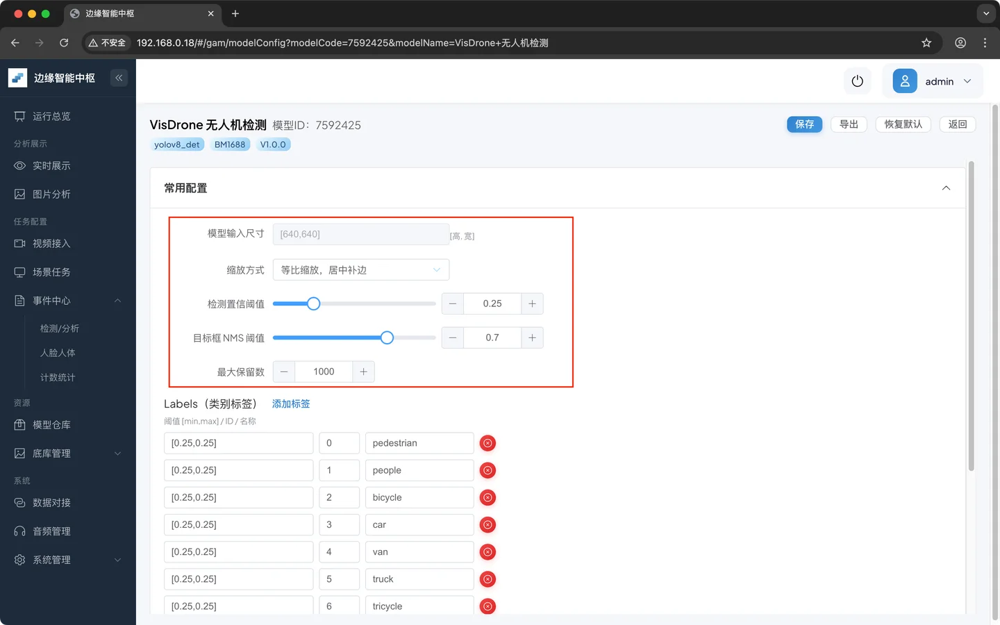

修改配置类别信息

<!-- 这是一张图片，ocr 内容为：边缘智能中枢 192.168.0.18/#/GAM/MODELCONFIG?MODELCODE-75924258MODELNAME二VISDRONE+无人机检测 不安全 边缘智能中枢 ADMIN 运行总览 恢复默认 VISDRONE无人机检测模型ID:7592425 导出 保存 返回 分析展示 BM7688 VL.0.0 YOLOV8_DET 0.7 十 目标框NMS 阈值 实时展示 园图片分析 1000 最大保留数 任务配置 LABELS(类别标签) 添加标签 视频接入 阅值[MIN.MAX]/ID/名称 [0.25.0.25] PEDESTRIAN 场景任务 [0.25,0.25] PEOPLE 事件中心 [O.25,0.25] BICYCLE 资源 R 中 模型仓库 [0.25,0.25] 3 [0.25,0.25] 底库管理 VAN [0.25,0.25] 5 TRUCK 系统 数据对接 6 [0.25.0.25] TRICYCLE 7 音频管理 [0.25,0.25] AWNING-TRICYCLE 系统管理 京 8 [0.25.0.25] SNQ [0.25,0.25] 6 MOTOR 高级配置归一化等参数,通常无需修改 -->

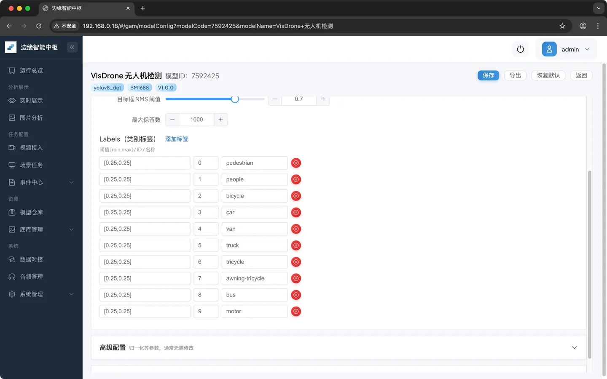

> 模型的基础信息一定要准确无误，否则出问题排查难度大

## 第五章：图片验证模型可用性

在把模型接入 场景任务 之前，先做一次轻量验证。

### 5.1 准备测试图片

准备几张与模型场景接近的图片，例如无人机航拍图。

### 5.2 创建图片验证任务

1. 进入 **场景任务， **新建无人机图片检测任务

<!-- 这是一张图片，ocr 内容为：边缘智能中枢 192.168.0.18/#/GAM/COUNTMANAGEMENT 不安全 边缘智能中枢 ADMIN 操作成功 运行总览 任务名称: 话输入任务名称 任务类型: 请选择任务类型 重告 查询 分析展示 实时展示 批量删除 新建任务 共65个任务 导出 导入任务 图片分析 任务配置 视频接入 区域入侵检测 楼道垃圾检测 破环城墙行为识别 ID:73782-视频分析 ID:6346-视频分析 ID:57614.视频分析 场景任务 检测/分析 检测/分析 检测/分析 事件中心 算法编排 算法编排 绵辑 编辑 正常运行1路 编辑 算法编排 正常 正常 资源 模型仓库 世 底库管理 系统 河道漂浮物识别 表情识别 VISDRONE 数据对接 ID:11472视频分析 ID:5812视频分析 ID:81046 视频分析 检测/分析 检测/分析 人脸人体 音频管理 编辑 算法编排 正常 算法编排 丝窝车焊 算法编排 编辑 正常 正常 系统管理 京 M 5 3 4 共65条 前往 12条/页 -->

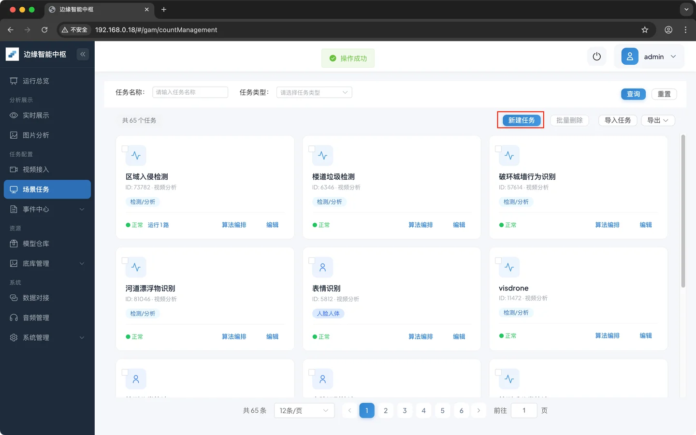

<!-- 这是一张图片，ocr 内容为：边缘智能中枢 192.168.0.18/#/GAM/COUNTMANAGEMENT 不安全 边缘智能中枢 ADMIN 运行总览 话输入任务名称 任务名称: 任务类型: 请选择任务类型 重置 查询 分析展示 新建任务 实时展示 批量删除 共65个任务 新建任务 导入任务 导出 无人机图片检测 任务名称: 图片分析 任务配置 数据源类型: 图片分析 视频接入 区域入侵检测 破环城墙行为识别 任务类型: 检测/分析 ID:73782视频分析 ID:57614视频分析 场景任务 检测/分析 检测/分析 限300个字符 说明: 事件中心 正常运行1路 算 编辑 正常 算法编排 资源 母 模型仓库 底库管理 确定 取消 系统 河道漂浮物识别 VISDRONE 表情识别 ID:11472视频分析 数据对接 ID:5812视频分析 ID:81046视频分析 检测/分析 检测/分析 人脸人体 音频管理 编辑 算法编排 算法编排 算法编排 缩辑 正常 缩辑 正常 正常 系统管理 M 共65条 12条/页 前往 -->

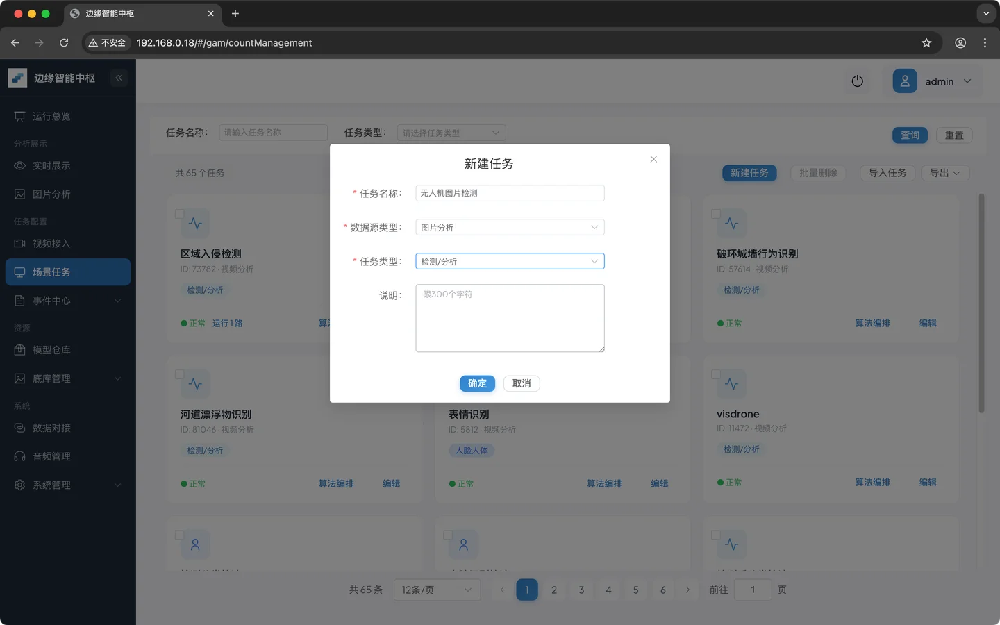

<!-- 这是一张图片，ocr 内容为：边缘智能中枢 192.168.0.18/#/GAM/COUNTMANAGEMENT 不安全 边缘智能中枢 ADMIN 操作成功 运行总览 任务名称: 话输入任务名称 任务类型: 请选择任务类型 重告 查询 分析展示 实时展示 批量删除 新建任务 导出 导入任务 共66个任务 图片分析 任务配置 视频接入 区域入侵检测 楼道垃圾检测 无人机图片检测 ID:73782-视频分析 ID:6346`视频分析 ID:26284图片分析 场景任务 检测/分析 检测/分析 检测/分析 事件中心 算法编排 绵辑 算法编排 编辑 编辑 算法编排 正常 正常运行1路 正常 资源 模型仓库 中 底库管理 系统 破环城墙行为识别 河道漂浮物识别 表情识别 数据对接 ID:57614视频分析 ID:5812 视频分析 ID:81046`视频分析 检测/分析 人险人体 检测/分析 音频管理 算法编排 缩辑 正常 算法编排 编辑 编辑 算法缩排 正常 正常 系统管理 京 8 5 2 3 4 共66条 12条/页 前往 -->

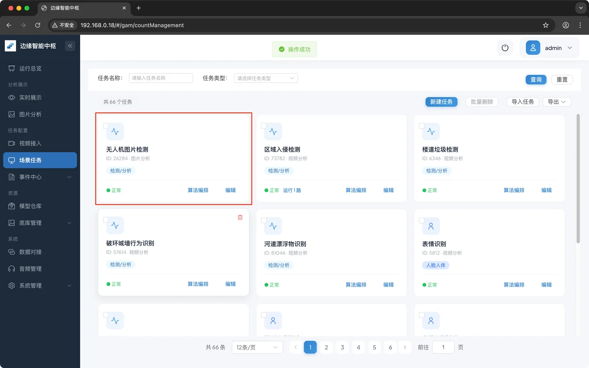

2. 创建 **无人机图片检测 **算法编排链路

点击 **算法编排** 进入编排页面

<!-- 这是一张图片，ocr 内容为：边缘智能中枢 192.168.0.18/#/GAM/COUNTMANAGEMENT L不安全 边缘智能中枢 ADMIN 运行总览 任务名称: 话输入任务名称 任务类型: 请选择任务类型 重告 查询 分析展示 实时展示 批录删除 共66个任务 新建任务 导出 导入任务 图片分析 任务配置 视频接入 无人机图片检测 楼道垃圾检测 区域入侵检测 ID:73782-视频分析 ID:6346`视频分析 ID:26284图片分析 场景任务 检测/分析 检测/分析 检测/分析 事件中心 算法编排 编辑 编辑 编辑 算法编排 算法编排 正常 正常运行1路 正常 资源 模型仓库 世 底库管理 系统 破环城墙行为识别 河道漂浮物识别 表情识别 数据对接 ID:5812 视频分析 ID:81046视频分析 ID:57674.视频分析 人险人体 检测/分析 检测/分析 音频管理 算法编排 算法编排 缩辑 编辑 算法缩排 编辑 正常 正常 正常 系统管理 京 8 5 2 3 4 12条/页 共66条 前往 -->

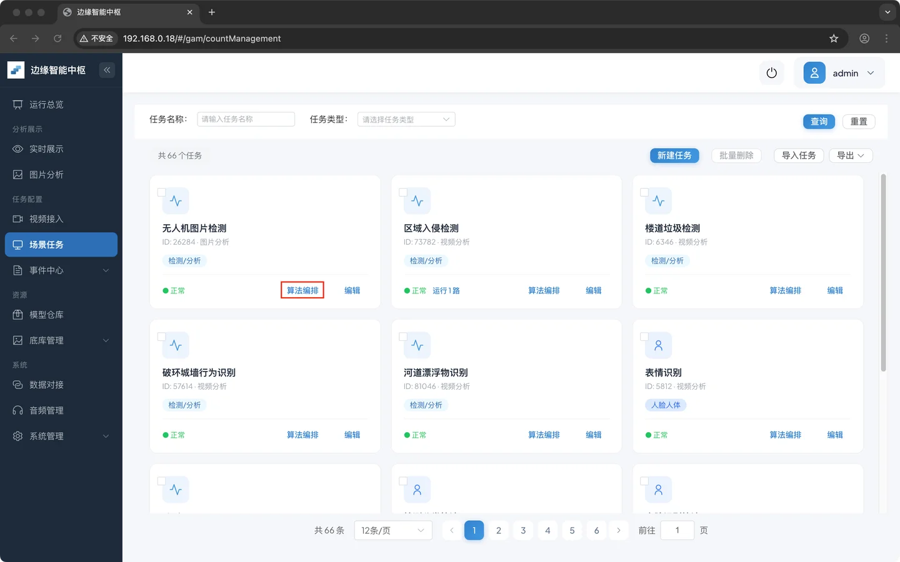

添加 **目标检测算法 **

<!-- 这是一张图片，ocr 内容为：边缘智能中枢 192.168.0.1-/GAMJARRANGEDETALYRESETJAM/CALGOUNTMANAGEMENT&ALGORITHMLD-262848SUPPLIER-8ALGORITHMUSAGE- 不安全 ADMIN 保存 返回 保存并导出 无人机图片检测 参数配置 业务流程 检测区域 园 日 选择模板 目 电 模型推理 结束 开始 目标检测算法 -->

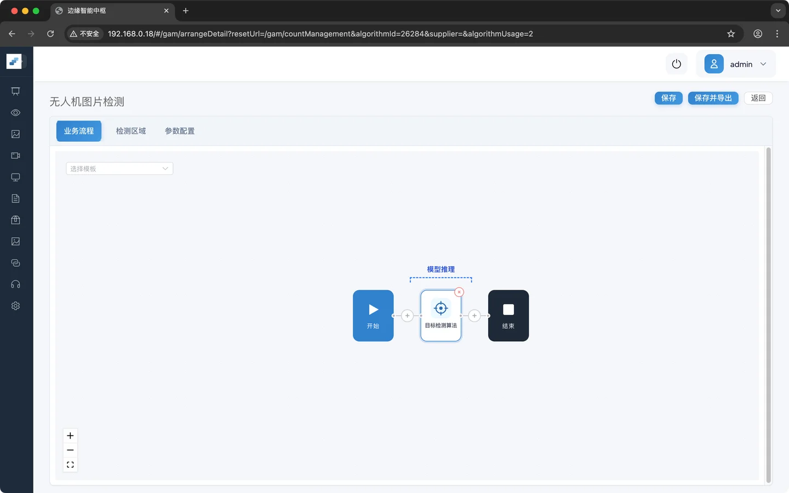

配置 **业务逻辑参数**

<!-- 这是一张图片，ocr 内容为：边缘智能中枢 192.168.0.1-/GAMJARRANGEDETALYRESETJAM/CALGOUNTMANAGEMENT&ALGORITHMLD-262848SUPPLIER-8ALGORITHMUSAGE- 不安全 ADMIN 保存 返回 保存并导出 无人机图片检测 参数配置 业务流程 检测区域 园 选择模板 目 开始 目标检测算法 选择原子模型 VISDRONE无人机检测(7592- 选择标签 是否 类别 名称 序号 标识 使用 PEDE PEDE STRIAN STRIAN 81+ PEOP PEOP -->

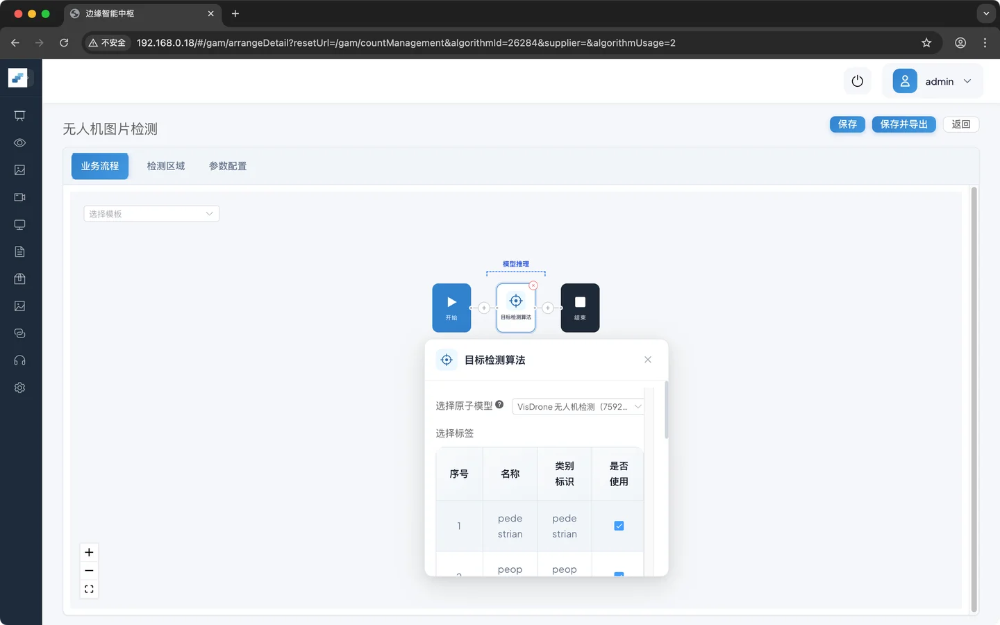

选择原子模型：VisDrone 无人机检测

选择标签：全选

点击 **保存 **将该编排流程保存

### 5.3 图片分析

1. 选择算法 **无人机图片检测**

<!-- 这是一张图片，ocr 内容为：边缘智能中枢 192.168.0.18/#/IMAGEANALYSIS 不安全 边缘智能中枢 ADMIN 运行总览 分析展示 尘上传图片 R开始分析 选择图片分析算法 实时展示 无人机图片检测 图片分析 检测分类算法 任务配置 人脸识别算法 视频接入 检测后分类算法 场景任务 检测后分割算法 检测类算法 事件中心 分割大模型 资源 检测大模型 中 模型仓库 底库管理 系统 数据对接 请选择算法并上传图片进行分析 音频管理 系统管理 京 -->

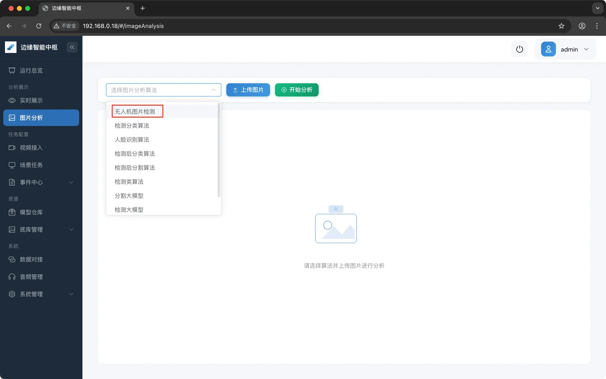

2. 上传图片

<!-- 这是一张图片，ocr 内容为：边缘智能中枢 192.168.0.18/#/IMAGEANALYSIS 不安全 边缘智能中枢 ADMIN 运行总览 分析展示 无人机图片检测 上传图片 开始分析 已选1张图片 世清空 实时展示 图片分析 任务配置 视频接入 场景任务 事件中心 资源 中 模型仓库 无人机测试:PNG 待分析 底库管理 系统 数据对接 音频管理 系统管理 京 -->

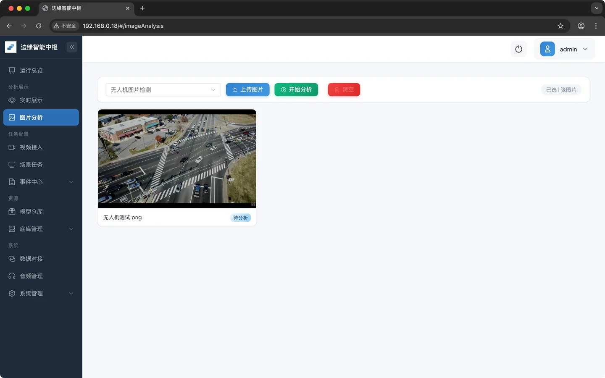

3. 点击** 开始分析 **启动测试

<!-- 这是一张图片，ocr 内容为：边缘智能中枢 192.168.0.18/#/IMAGEANALYSIS 不安全 边缘智能中枢 ADMIN 运行总览 分析展示 开始分析 无人机图片检测 上传图片 已选1张图片 世清空 实时展示 图片分析 任务配置 视频接入 场景任务 事件中心 资源 中 模型仓库 无人机测试.PNG 已完成 底库管理 检测目标 系统 GAR BUS CAR VAN 数据对接 CAR 音频管理 CAR VAN PEDESTNAN 系统管理 京 CAR CAR CAR -->

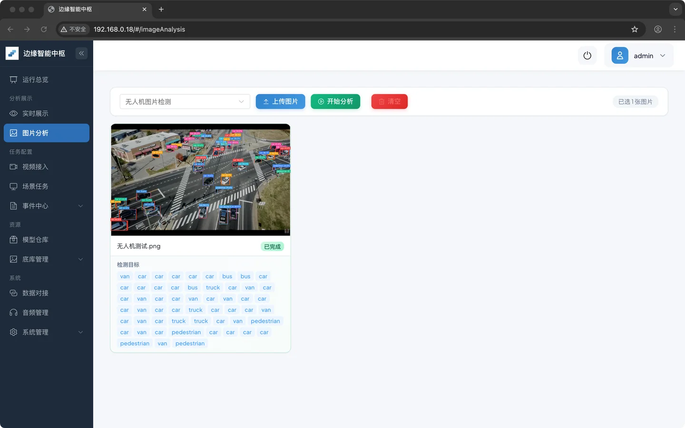

### 5.3 结果分析

<!-- 这是一张图片，ocr 内容为：边缘智能中枢 192.168.0.18/#/IMAGEANALYSIS 不安全 边缘智能中枢 ADMIN CAR 325% 28.2% CAR 35.0% VA7303292935 运行总览 CAR 81956 VAM 59.2% 分析展示 GAR 36.15 59.5% 已选1张图片 VION 26.0% 实时展示 园 图片分析 R  09% 任务配置 STRIEN 25.4% 视频接入 CER 75.8% CAR 27.0NG 场景任务 VAN 54.1% CAR 30.3% 668% 事件中心 REN 35.9% 资源 母模型仓库 底库管理 检测数量 55 算法 26284 系统 检测结果详情 数据对接 逻辑 位置 特征值(前10) 置信度 类别 #. 结果 音频管理 系统管理 82.0% [58.000,612.000,0.000.0.000] 正常 VAN 2 [142.000.155.000.0.000.000] 81.9% CAR 正常 80.8% [295.000.214.000.0.000.0.000] 正常 CAR 79.9% [221.000.556.000.0.000.000] 4 正常 CAR -->

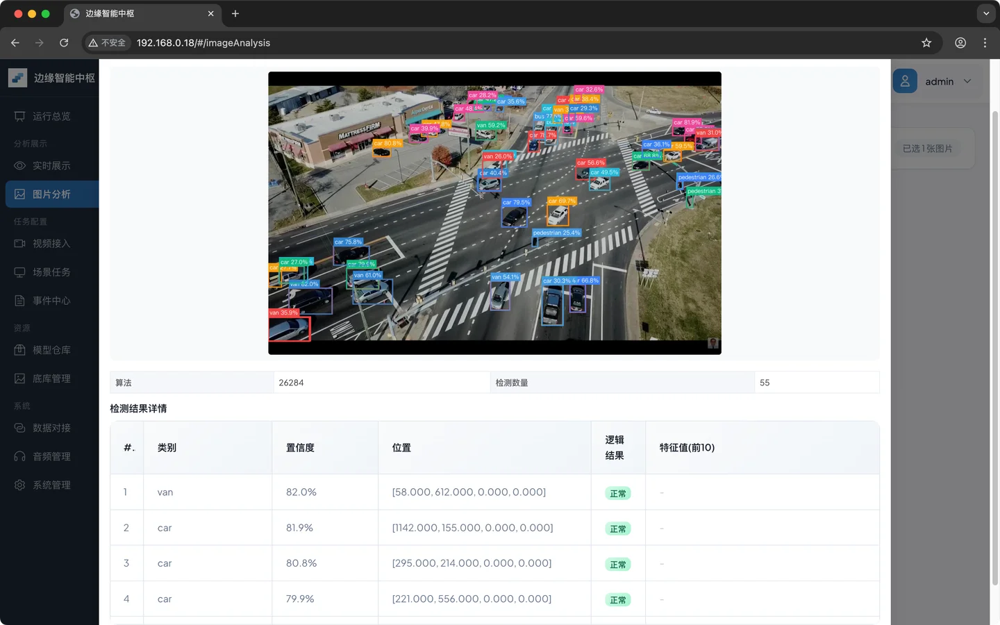

结果分析：

+ 图片中的行人、车辆等目标能被检测出来
+ 检测框位置基本合理
+ 类别名称显示正常，不是数字或空白

> 如果图片验证都不通过，不要急着进入 场景任务 编排。
> 先回头检查：
>
> + 模型文件是否上传正确
> + 输入尺寸是否一致
> + 类别标签是否配置完整

## 第六章：把第三方模型接入场景任务

现在开始把这个模型真正接入业务流程。

### 场景说明

创建一条新的 **无人机目标检测 场景任务**：

+ 检测画面中的行人和车辆
+ 生成事件
+ 在实时画面上看到框和类别

### 6.1 创建新算法

1. 进入 **场景任务，新增任务 **

<!-- 这是一张图片，ocr 内容为：边缘智能中枢 192.168.0.18/#/GAM/COUNTMANAGEMENT 不安全 边缘智能中枢 ADMIN 运行总览 话输入任务名称 任务名称: 任务类型: 请选择任务类型 重置 查询 分析展示 新建任务 实时展示 批录删除 共66个任务 新建任务 导入任务 导出 无人机目标检测 任务名称; 图片分析 N 任务配置 *数据源类型: 视频分析 视频接入 无人机图片检测 楼道垃圾检测 任务类型: 检测/分析 ID:26284图片分析 ID:6346视频分析 场景任务 检测/分析 检测/分析 限300个字符 说明: 事件中心 编辑 算法编排 正常 正常 资源 母 模型仓库 底库管理 8 确定 取消 系统 破环城墙行为识别 表情识别 河道漂浮物识别 数据对接 ID:5812视频分析 ID:57614视频分析 ID:81046视频分析 人益人体 检测/分析 检测/分析 音频管理 算法编排 算法编排 缩辑 编辑 算法编排 编辑 正常 正常 正常 系统管理 8 4 3 共66条 12条/页 前往 -->

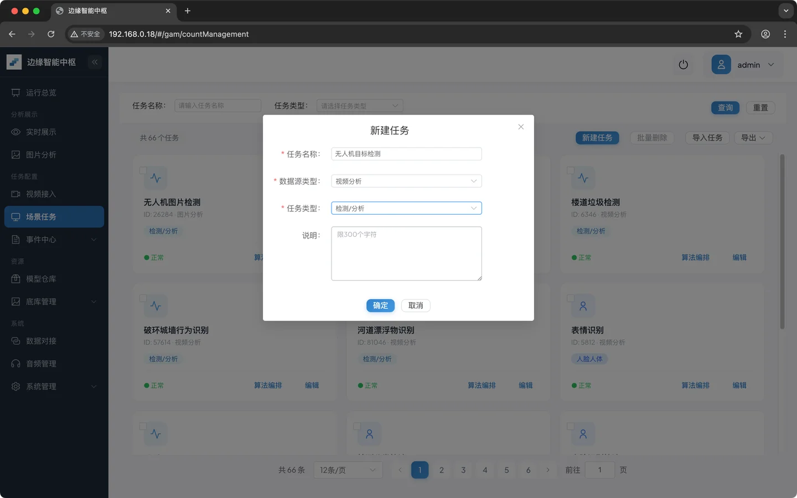

填写基础信息:

+ 任务名称：无人机目标检测
+ 数据源类型：视频分析
+ 任务类型：检测/分析

<!-- 这是一张图片，ocr 内容为：边缘智能中枢 192.168.0.18/#/GAM/COUNTMANAGEMENT 不安全 边缘智能中枢 ADMIN 操作成功 运行总览 任务名称: 话输入任务名称 任务类型: 请选择任务类型 重告 查询 分析展示 实时展示 批量删除 新建任务 导出 导入任务 共67个任务 图片分析 任务配置 视频接入 无人机图片检测 区域入侵检测 无人机目标检测 ID:26284图片分析 ID:73782视频分析 ID:60768-视频分析 场景任务 检测/分析 检测/分析 检测/分析 事件中心 算法编排 算法编排 编辑 缩辑 算法编排 编辑 正常运行1路 正常 正常 资源 模型仓库 中 底库管理 系统 破环城墙行为识别 河道漂浮物识别 楼道垃圾检测 数据对接 ID:57614 视频分析 ID;81046  视频分析 ID:6346`视频分析 检测/分析 检测/分析 检测/分析 音频管理 算法编排 编辑 正常 算法编排 编辑 算法编排 正常 正常 编辑 系统管理 京 3 5 2 4 页 共67条 6 前往 12条/页 -->

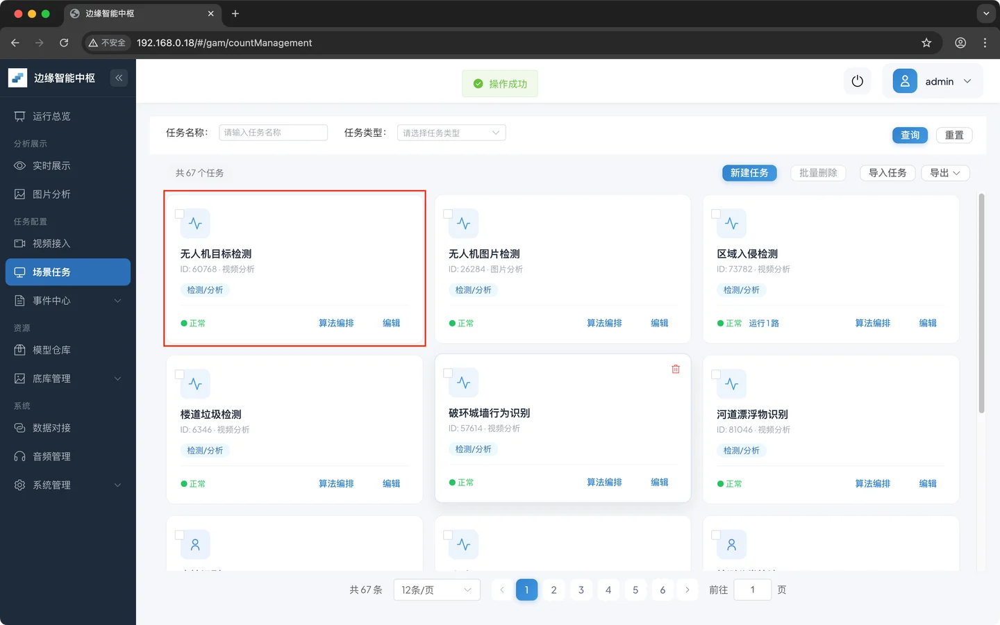

### 6.2 搭建最小可用编排链路

按下面顺序添加节点：

```plain
视频解码 → 目标检测（第三方模型） → 目标追踪 → 区域告警判断 →  事件上报
```

1. 点击 **算法编排 进入编排页面**

<!-- 这是一张图片，ocr 内容为：边缘智能中枢 192.168.0.18/AAMJARRANGEDETAIRRESERUA-/GAMLCOUNTMANAGEMENT&ALGORITHMID-607688SUPPLLER-8ALGORIHMUS8三 ADMIN 保存 返回 保存并导出 无人机目标检测 参数配置 业务流程 检测区域 网 选择模板 目 结束 开始 +一3 -->

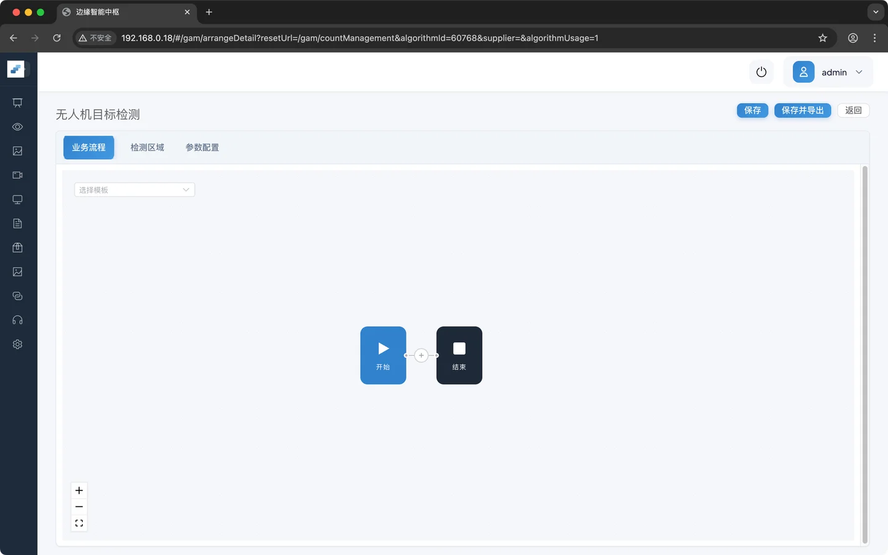

2. 添加编排逻辑

第一步：添加 **视频解码**

第二步：添加** 目标检测算法**

<!-- 这是一张图片，ocr 内容为：边缘智能中枢 192.168.0.18/AAMJARRANGEDETAIRRESERUA-/GAMLCOUNTMANAGEMENT&ALGORITHMID-607688SUPPLLER-8ALGORIHMUS8三 ADMIN 保存 返回 保存并导出 无人机目标检测 业务流程 参数配置 检测区域 园 选择模板 目 模型推理 结束 目标检测算法 LE LE BUS BUS MOTO MOTO 10 自定义取帧频率? 取帧频率 0.5 -->

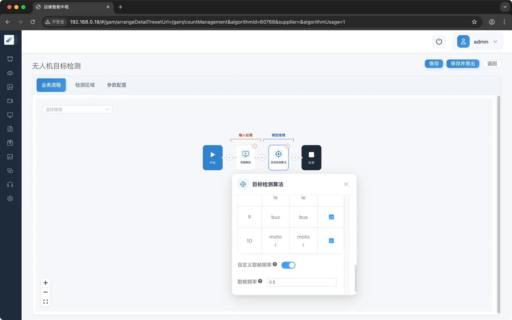

第三步：添加目标追踪

<!-- 这是一张图片，ocr 内容为：边缘智能中枢 192.168.0.18/AAMJARRANGEDETAIRRESERUA-/GAMLCOUNTMANAGEMENT&ALGORITHMID-607688SUPPLLER-8ALGORIHMUSA9B三 ADMIN 保存 返回 保存并导出 无人机目标检测 参数配置 业务流程 检测区域 园 日 选择模板 目 模型推理 开始 目标经济货法 米润 告警输出 追踪算法 标签过滤参数 VISDRONE无人机检测(7592 状态判断? 运动状态 形变状态判断 不需要 +一G -->

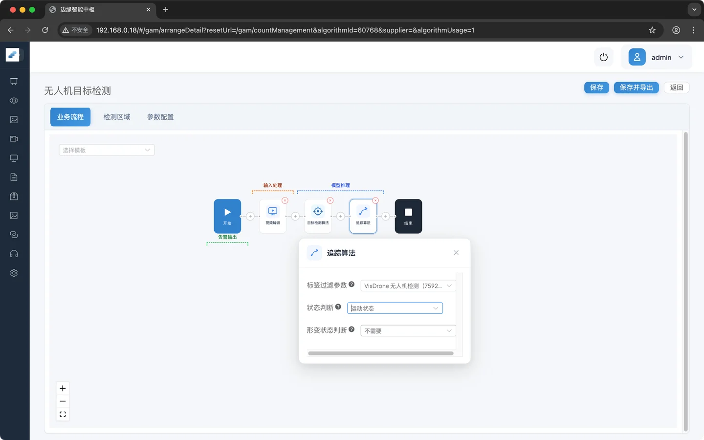

第四步：添加区域告警判断

<!-- 这是一张图片，ocr 内容为：边缘智能中枢 众 个小Q 8 ADMIN 保存 返回 保存并导出 区域入侵检测 业务流程 检测区域 参数配置 园 日 选择模板 目 规则判断 输入处理 开始 区域告警兴所 日标验和算法 区域告警判断 区域告警统计方式 数量限制(用于离岗/素集) 输入区域类型 主区域 -->

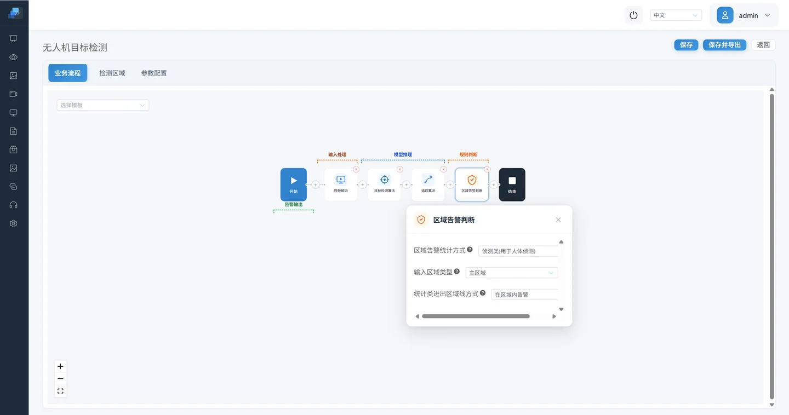


第五步：添加事件上报

<!-- 这是一张图片，ocr 内容为：边缘智能中枢 192.168.0.18/AAMJARRANGEDETAIRRESERUA-/GAMLCOUNTMANAGEMENT&ALGORITHMID-607688SUPPLLER-8ALGORIHMUS8三 ADMIN 保存 返回 保存并导出 无人机目标检测 参数配置 业务流程 检测区域 园 日 选择模板 园 事件上涨 区域选择利近 目标隆测预控 开始 涵南 事件上报 目标是否带跟踪 不带目标跟踪 触发类上报事件是否需要视频片段 定时上报事件是否需要视频片段R 大模型审核? +一G -->

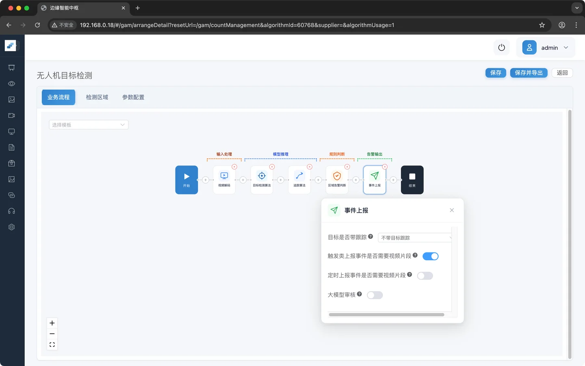

3. 配置参数

<!-- 这是一张图片，ocr 内容为：边缘智能中枢 众 个个Q 8 ADMIN 保存 返回 保存并导出 无人机目标检测 详细模式 参数配置 检测区域 精简模式 业务流程 司 MOTOR检测方式 全隐藏 不隐藏 底部 目 VISDRONE无人机检测追踪历史 不隐藏 10 全隐藏 帧数 VISDRONE无人机检测静止阅值 图 不隐藏 全隐藏 80.0 VISDRONE无人机检测追踪半径 2.3 不隐藏 全隐藏 区域中的目标数(建议改名) 不隐藏 全隐藏 区域中目标数限制类型(建议客 不隐藏 大于目标数告警 全隐藏 户端隐藏) 检测时间:0 不隐藏 全隐藏 检测时间单位 全隐藏 不隐藏 秒 非常规组件默认值输入方式使用文本框 -->

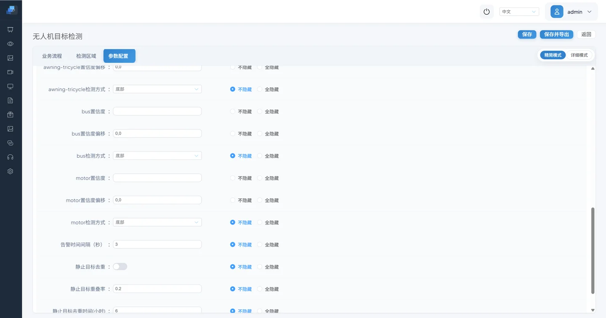

4. 点击 **保存** 保存编排链路

## 第七章：端到端验证

### 7.1 创建视频接入

1. 准备一段无人机视角测试视频
2. 进入 **视频接入 **添加视频通道

<!-- 这是一张图片，ocr 内容为：边缘智能中枢 不安全 192.168.0.18/#/VIDEOACCESS 边缘智能中枢 ADMIN 运行总览 视频通道 时间模板 分析展示 添加通道 实时展示 通道名称: 请输入通道名称 查询 重置 接入类型: 离线视频 图片分析 添加 批量操作 任务配置 无人机摄像头 通道名称: 视频接入 序号 通道状态 操作 分辨率 通道编号 上传视频: 场景任务 将文件拖到此处,或点击上传(支持分片上 详情编辑 事件中心 服务分配快照 传,最大1GB) 1920X 1080 在线 LX000000. 下载删除 资源 母 模型仓库 详情编辑 目无人机.MP4 服务分配快照 离线 USO00000. 底库管理 删除 外部通道编号: 系统 详情编辑 数据对接 说明:支持视频文件上传,分折率限720P以上,格 服务分配快照 LX000000. 在线 式支持AM,MP4,DAV,单个视频文件大小限 下载删除 音频管理 1GB. 详情编辑 系统管理 取消 保存 服务分配快照 LX000000. 在线 下载删除 详情编辑 在线 县区城境北向 已信   信 I X00000 东线视频 服务分配快昭 页 共10条 10条/页 前往 -->

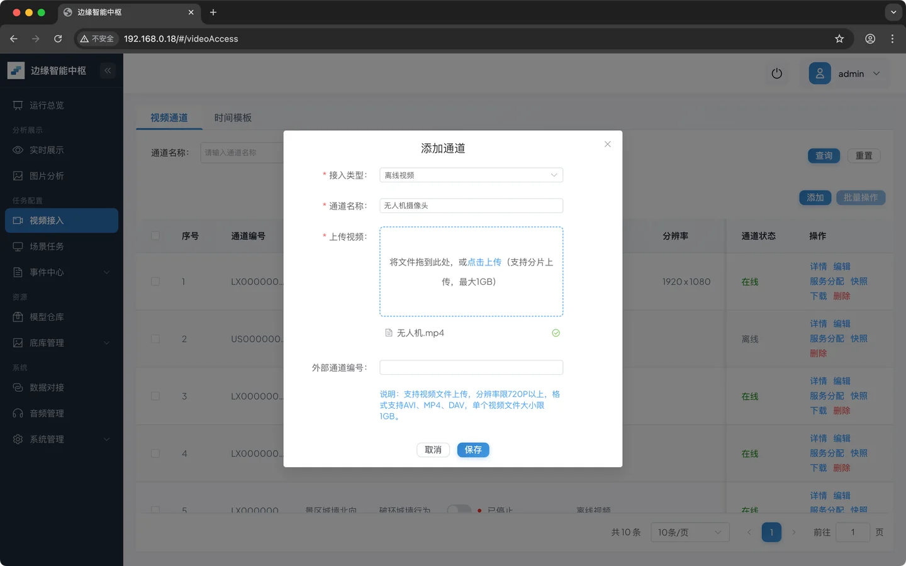

参数填写：

接入类型：离线视频

通道名称：无人机摄像头

上传视频：无人机.mp4

3. 配置** 服务分配**

点击** 服务分配 **进入配置页面

<!-- 这是一张图片，ocr 内容为：边缘智能中枢 不安全 192.168.0.18/#/VIDEOACCESS 边缘智能中枢 ADMIN 操作成功 运行总览 视频通道 时间模板 分析展示 实时展示 通道状态: 通道名称: 请输入通道名称 全部 查询 重置 图片分析 添加 批量操作 任务配蛋 视频接入 智能服务 序号 通道编号 通道名称 接入类型 通道状态 分辨率 操作 场景任务 详情编辑 事件中心 服务分配快照 LX000000... 在线 无人机摄像头 离线视频 下载删除 资源 中 模型仓库 详情编辑 服务分配快照 LX000000 在线 进行中 街角摄像头 1920X1080 离线视频 区域入侵检测 底库管理 下载删除 系统 详情编辑 数据对接 服务分配快照 离线 区域人数统计 USO00000... USB摄像头 已停止 人体检测 删除 音频管理 详情编辑 系统管理 京 服务分配快照 离线视频 在线 LX000000 已停止 楼道垃圾检测 楼道二楼间平... 下载 删除 详情编辑 在线 鹏条分配快昭 河道东 LX000000 已信   信 河道遵理物识别 魔线神频 页 前往 10条/页 共11条 -->

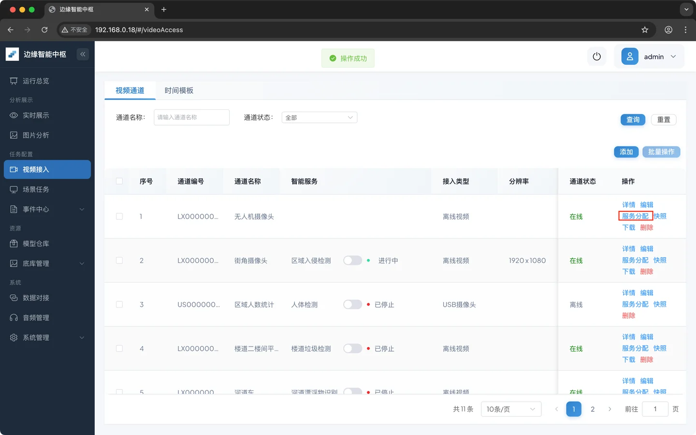

任务场景选择 **无人机目标检测**

<!-- 这是一张图片，ocr 内容为：边缘智能中枢 不安全 边缘智能中枢 ADMIN 运行总览 场景任务 启用服务 删除服务 服务配置已停用 无人机目标检测 保存 分析展示 实时展示 输入关键字进行过滤 运行策略 参数设置 检测区域 图片分析 检测/分析 无人机目标检测 任务配置 区域入侵检测 检测区域列表 新增区域 重新获取图片 视频接入 楼道垃圾检测 场景任务 破环城墙行为识别 区域名称 操作 河道漂浮物识别 事件中心 VISDRONE 暂无数据 视觉语言大模型分析 资源 视觉分割大模型分析 中 模型仓库 视觉检测大模型分析 底库管理 未戴绝缘手套 未穿绝缘靴 系统 未戴口罩 数据对接 物品缺失检测 指示灯异常检测 音频管理 未设安全标识牌 未摆放灭火器 系统管理 京 未装防护网 未装防护栏 未穿工服123 未穿反光衣 未穿救生衣 电动车进电梯 -->

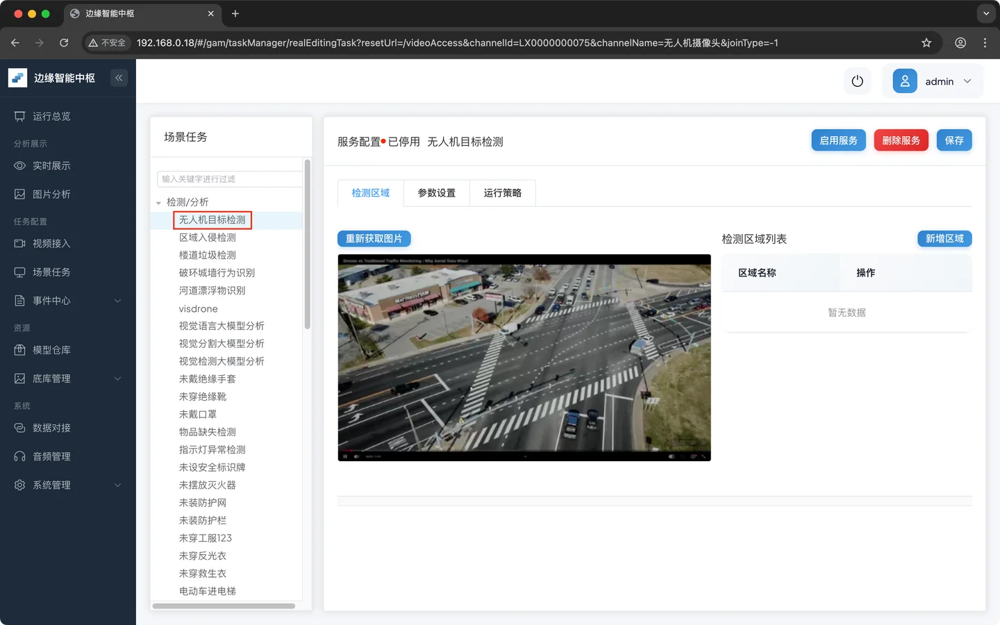

新增检测区域

<!-- 这是一张图片，ocr 内容为：边缘智能中枢 不安全 边缘智能中枢 ADMIN 运行总览 场景任务 启用服务 删除服务 服务配置已停用 无人机目标检测 保存 分析展示 实时展示 输入关键字进行过滤 运行策略 参数设置 检测区域 图片分析 检测/分析 无人机目标检测 任务配置 区域入侵检测 检测区域列表 新增区域 重新获取图片 视频接入 楼道垃圾检测 场景任务 破环城墙行为识别 区域名称 操作 河道漂浮物识别 事件中心 区域 VISDRONE 编辑删除 视觉语言大模型分析 资源 视觉分割大模型分析 中 模型仓库 视觉检测大模型分析 底库管理 未戴绝缘手套 未穿绝缘靴 系统 未戴口罩 数据对接 物品缺失检测 指示灯异常检测 音频管理 未设安全标识牌 未摆放灭火器 系统管理 京 未装防护网 未装防护栏 未穿工服123 未穿反光衣 未穿救生衣 电动车进电梯 -->

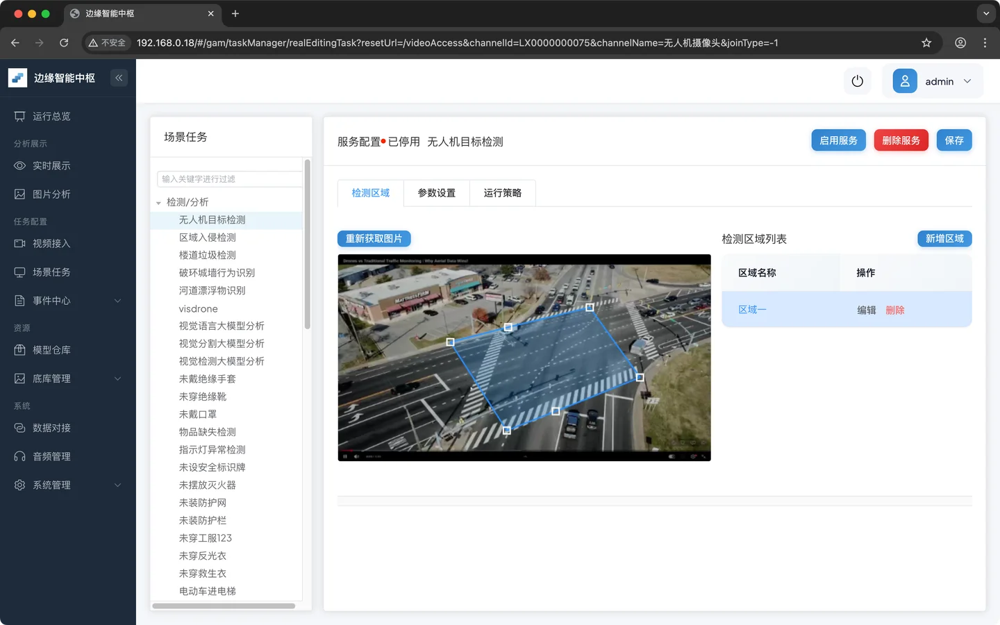

配置 **运行策略** 播放次数为0

<!-- 这是一张图片，ocr 内容为：边缘智能中枢 不安全 边缘智能中枢 ADMIN 运行总览 场景任务 删除服务 启用服务 服务配置已停用无人机目标检测 保存 分析展示 实时展示 输入关键字进行过滤 参数设置 检测区域 运行策略 图片分析 检测/分析 无人机目标检测 任务配置 区域入侵检测 0 播放次数 视频接入 楼道垃圾检测 场景任务 破环城墙行为识别 河道漂浮物识别 事件中心 VISDRONE 批量应用 视觉语言大模型分析 资源 视觉分割大模型分析 中 模型仓库 视觉检测大模型分析 底库管理 未戴绝缘手套 未穿绝缘靴 系统 未戴口罩 数据对接 物品缺失检测 指示灯异常检测 音频管理 未设安全标识牌 未摆放灭火器 系统管理 京 未装防护网 未装防护栏 未穿工服123 未穿反光衣 未穿救生衣 电动车进电梯 -->

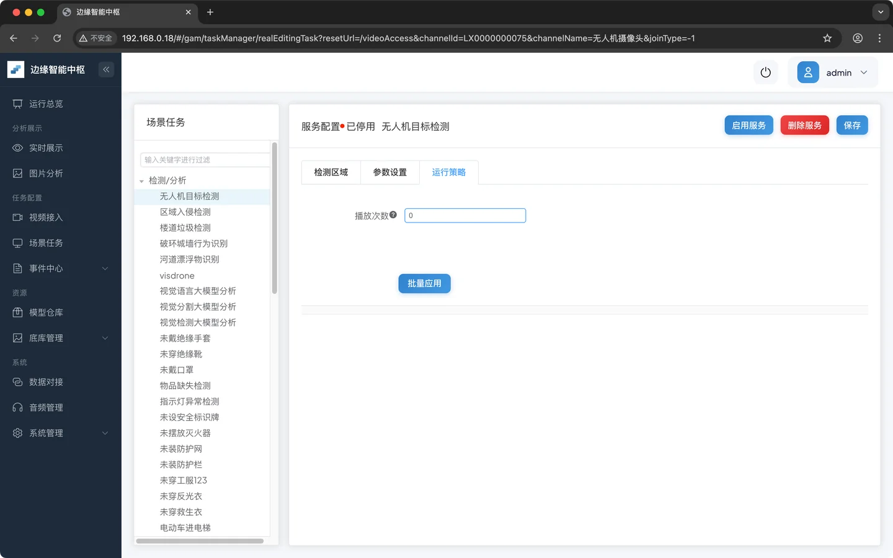

点击 **保存 **保存视频接入配置

### 7.2 观察实时展示

进入 **实时展示**，视频源 选择 无人机摄像头

<!-- 这是一张图片，ocr 内容为：2026-05-1122:12:49 AI视频分析 退出全屏 设置 通道列表 四屏 一些 今日告警数:18 事件记录 输入关键词搜索 算法叠加: X 请选挥 请选择 全部 无人机摄像头 街角摄像头 区域人数统计 TRESSFIRM 楼道二楼间平台 河道东 事件类型:无人机目标检测 景区城培北向 所属通道:无人机摄像头 工地北通道 告警时间:2026-05-1122:12:52 教学楼南通道 三年级二班教室 无人机交通监控 公司东侧走廊 事件类型:无人机目标检测 所属通道:无人机摄像头 告警时间:2026-05-1122:12:49 -->

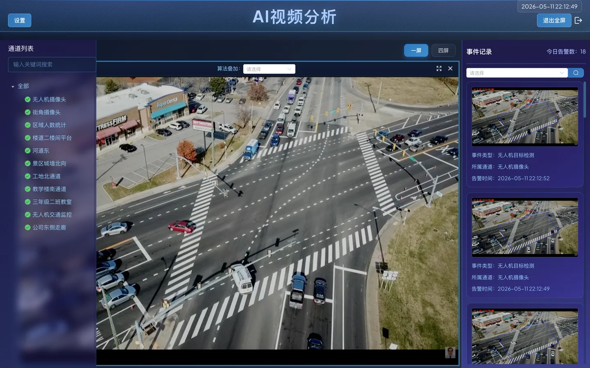

算法叠加设置：无人机目标检测

<!-- 这是一张图片，ocr 内容为： -->

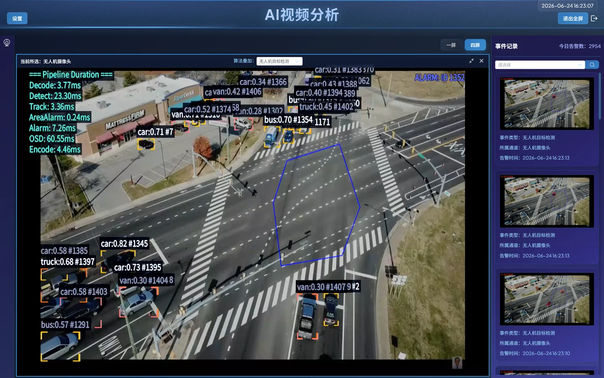

告警弹窗

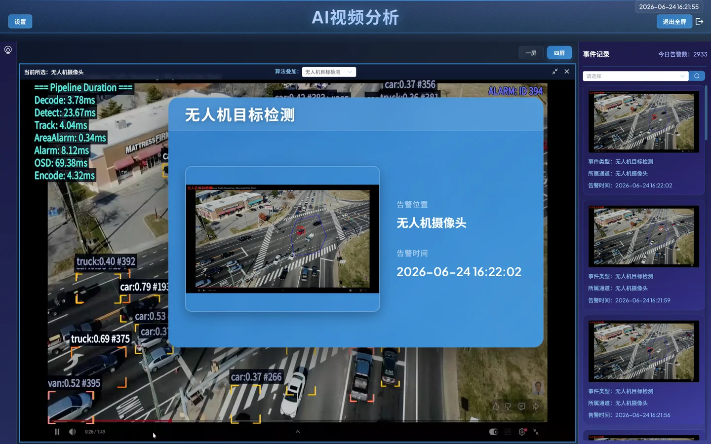

检查：

+ 画面中是否有检测框
+ 类别是否显示正确
+ 不同目标是否能持续跟踪

### 7.3 检查告警记录

进入 **事件中心 **->** 检测/分析** 查看告警事件记录

<!-- 这是一张图片，ocr 内容为：边缘智能中枢 小个Q 众 不安全 192.168.0.18#JEVENTQUERY/ALARMRECORD 边缘智能中枢 ADMIN 运行总览 场景任务: 通道名称: 时段: 请选择通道名称 2026-05-12 00:00:00 请选择场景任务 2026-05-12  23:59 分析展示 重贡 查询 状态: 实时展示 请选择状态 图片分析 数据导出 任务配置 视频接入 场景任务 事件中心 检测/分析 人脸人体 告警类型:无人机目标检测 告警类型:无人机目标检测 告警类型:无人机目标检测 通道名称:无人机摄像头 计数统计 通道名称:无人机摄像头 通道名称:无人机摄像头 区域名称:区域一 区域名称:区域一 区域名称:区域一 资源 告警时间:2026-05-1207:55:34 告警时间:2026-05-1207:55:42 告警时间:2026-05-1207:55:38 模型仓库 状态:未上传 状态:未上传 状态:未上传 底库管理 详情 详情 详情 系统 数据对接 音频管理 京 系统管理 页 前往 10条/页 共8条 -->

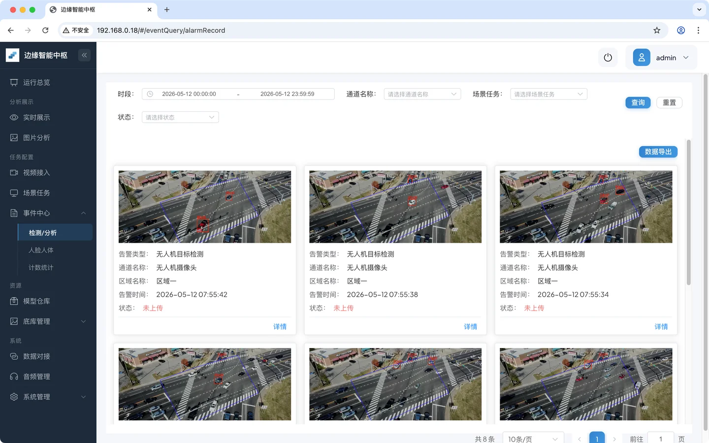

结果分析：告警事件正常记录，说明该编排链路正常运行

### 7.4 成功标准

如果以下三项同时成立，就说明这次第三方模型移植已经跑通：

1. 图片测试能正常出结果
2. 场景任务 能启动
3. 实时展示和告警记录都能看到效果

## 附录

### A. 常见问题排障

| 问题                     | 可能原因                       | 解决方法                         |
| ------------------------ | ------------------------------ | -------------------------------- |
| 模型上传后检测无结果     | 输入尺寸配置错误               | 检查模型元数据与转换参数是否一致 |
| 类别显示成数字           | 未配置类别标签                 | 在模型仓库补全标签映射           |
| 场景任务 能启动但无框    | 缺少 OSD 叠加节点              | 在末端添加 OSD 叠加              |
| 图片测试正常但视频效果差 | 测试视频分布和训练场景差异大   | 先用更接近模型场景的视频验证     |
| 服务启动失败             | 节点未正确连线或模型类型不匹配 | 检查编排结构和模型类型           |

### 下一步

学完前五卷后，您已经具备一条完整能力链：

```plain
设备上手
  ↓
配置内置场景
  ↓
定义大模型规则
  ↓
编排业务流程
  ↓
移植第三方模型
```

这意味着您已经可以：

+ 用内置能力快速搭场景
+ 用 VLM / DINO 补足长尾需求
+ 用编排把能力组织成业务流程
+ 把自己的模型真正接入系统
